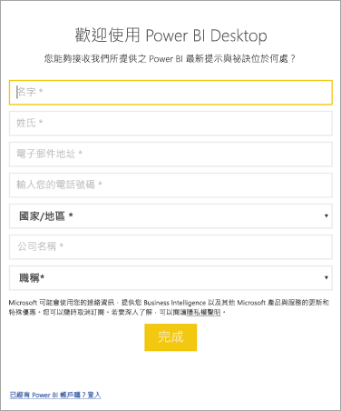

# <a name="administrators-manage-the-power-bi-desktop-sign-in-form"></a>系統管理員：管理 Power BI Desktop 登入表單
Power BI Desktop 第一次啟動時，會顯示登入表單。 您可以填入資訊，或登入 Power BI 以繼續。 系統管理員使用登錄機碼來管理此表單。 



系統管理員使用下列登錄機碼停用登入表單。 這也可以使用全域原則推送到全組織。

```
Key: HKEY_CURRENT_USER\SOFTWARE\Policies\Microsoft\Microsoft Power BI Desktop
valueName: ShowLeadGenDialog
```
您也可以嘗試以下登錄機碼，這些金鑰根據一些客戶的設定已成功：

```
Key: HKEY_CURRENT_USER\SOFTWARE\Microsoft\Microsoft Power BI Desktop
valueName: ShowLeadGenDialog
```

0 值會停用對話方塊。


有其他問題嗎？ [嘗試在 Power BI 社群提問](https://community.powerbi.com/)

