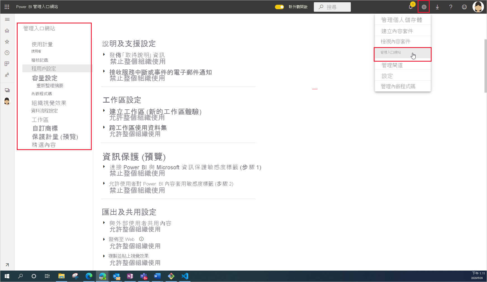

# 什麼是 Power BI 管理

Power BI 管理是在管理用來控制 Power BI 運作方式的全組織設定。 指派給系統管理員角色的使用者可設定、監視及佈建組織資源。 本文提供管理角色、工作及工具的概觀，以協助您開始使用。

## 與 Power BI 相關的系統管理員角色

有數個角色可共同合作，為您的組織管理 Power BI。 大部分的系統管理員角色都是在 Microsoft 365 的系統管理中心或使用 PowerShell 來指派。 建立容量時，會指派 Power BI Premium 容量和 Power BI Embedded 容量系統管理員角色。 若要深入了解每個系統管理員角色，請參閱[關於系統管理員角色](https://docs.microsoft.com/microsoft-365/admin/add-users/about-admin-roles?view=o365-worldwide)。 若要了解如何指派系統管理員角色，請參閱[指派系統管理員角色](https://docs.microsoft.com/microsoft-365/admin/add-users/assign-admin-roles?view=o365-worldwide) (機器翻譯)。

| **系統管理員的類型** | **管理範圍** | **Power BI 工作** |
| --- | --- | --- |
| 全域管理員 | Microsoft 365 | 具有組織所有管理功能的無限制存取權 |
| | | 將角色指派給其他使用者 |
| 帳務管理員 | Microsoft 365 | 管理訂用帳戶 |
| | | 購買授權 |
| 授權管理員 | Microsoft 365 | 指派或移除使用者的授權 |
| 使用者管理員 | Microsoft 365 | 建立及管理使用者和群組 |
| | | 重設使用者密碼 |
| Power BI 系統管理員 | Power BI 服務 | Power BI 管理工作的完整存取權|
| | | 啟用及停用 Power BI 功能 |
| | | 報告使用狀況和效能 |
| | | 檢閱及管理稽核 |
| Power BI Premium 容量系統管理員 | 單一 Premium 容量 | 將工作區指派給容量|
| | | 管理使用者對容量的權限 |
| | | 管理工作負載以設定記憶體使用量 |
| | | 重新啟動容量 |
| Power BI Embedded 容量系統管理員 | 單一 Embedded 容量 | 將工作區指派給容量|
| | | 管理使用者對容量的權限 |
| | | 管理工作負載以設定記憶體使用量 |
| | | 重新啟動容量 |

## 管理工作和工具

Power BI 系統管理員的工作大多在 Power BI 管理入口網站進行。 不過，您應該熟悉相關的工具和系統管理中心。 請查看上表，判斷須具備什麼角色才能使用此處列出的工具來執行工作。

| **工具** | **一般工作** |
| --- | --- |
| [Power BI 管理入口網站](https://app.powerbi.com/admin-portal) | 取得及使用 Premium 容量 |
| | 確保服務品質 |
| | 管理工作區 |
| | 發佈 Power BI 視覺效果 |
| | 驗證用來在其他應用程式中嵌入 Power BI 的程式碼 |
| | 針對資料存取和其他問題進行疑難排解 |
| [Microsoft 365 系統管理中心](https://admin.microsoft.com) | 管理使用者和群組 |
| | 購買及指派授權 |
| | 封鎖使用者對 Power BI 的存取 |
| [Microsoft 365 安全性與合規性中心](https://protection.office.com) | 檢閱及管理稽核 |
| | 資料分類和追蹤 |
| | 資料外洩防護原則 |
| | 資訊控管 |
| [Azure 入口網站中的 Azure Active Directory (AAD)](https://aad.portal.azure.com) | 設定對 Power BI 資源的條件式存取 |
| | 佈建 Power BI Embedded 容量 |
| [PowerShell Cmdlet](https://docs.microsoft.com/powershell/power-bi/overview) | 透過指令碼管理工作區和 Power BI 的其他層面 |
| [系統管理 API 和 SDK](service-admin-reference.md) | 建置自訂管理工具。 例如，Power BI Desktop 可以使用這些 API 來建置以管理相關資料為基礎的報表。 |

## 後續步驟

現在您已經知道 Power BI 管理涉及的基本概念，若要深入了解，請參閱下列文章：

- [使用 Power BI 管理入口網站](service-admin-portal.md)
- [租用戶系統管理設定指導](../guidance/admin-tenant-settings.md)
- [使用 PowerShell Cmdlet](https://docs.microsoft.com/powershell/power-bi/overview)
- [Power BI 管理常見問題集](service-admin-faq.md)
- [為組織中的使用者授權 Power BI 服務](service-admin-licensing-organization.md)
- 有問題嗎？ [嘗試在 Power BI 社群提問](https://community.powerbi.com/)
- 有任何建議嗎？ [貢獻想法來改善 Power BI](https://ideas.powerbi.com/)
