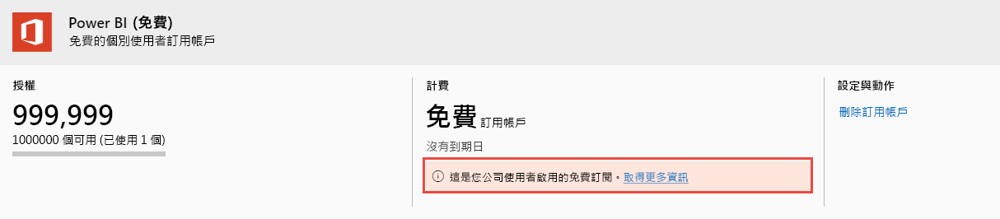

# 檢視及管理 Power BI 使用者授權

本文說明系統管理員可以如何使用 Microsoft 365 系統管理中心或 Azure 入口網站，檢視及管理使用者授權。

> [!NOTE]
>
>使用者可以同時獲得 Power BI (免費) 與 Power BI Pro 的授權指派。 當使用者先註冊了免費授權，然後又獲得 Power BI Pro 授權的指派時，就會發生此狀況。 在此狀況下，將會取用最高層級的授權。
>

## 檢視您的訂用帳戶

若要查看您組織擁有的 Power BI 訂閱，請遵循下列步驟。

1. 登入 [MIcrosoft 365 系統管理中心](https://admin.microsoft.com)。
2. 在導覽功能表中，選取 [計費]   >  [產品與服務]  。

您的有效 Power BI 訂閱，將會與您擁有的其他訂閱一併列出。 顯示的訂閱中，可能也會出現未預期的 Power BI 訂閱 (免費)，如下所示。

  

使用者如有使用自助式註冊，就會為您建立此類型的訂閱。 若要深入了解，請參閱[您組織的 Power BI](https://docs.microsoft.com/microsoft-365/admin/misc/power-bi-in-your-organization?view=o365-worldwide) (機器翻譯)。

## 在 Microsoft 365 中管理使用者授權

若要使用 Microsoft 365 系統管理中心管理使用者授權，請參閱 [商務訂閱與計費文件](https://docs.microsoft.com/microsoft-365/commerce/?view=o365-worldwide)。

## 在 Azure 入口網站中管理使用者授權

請遵循下列步驟，使用 Azure 入口網站檢視與指派 Power BI 授權。

1. 登入 [Azure 入口網站](https://portal.azure.com)。

2. 搜尋並選取 [Azure Active Directory]  。

3. 從 Azure Active Directory 資源功能表的 [管理]  下，選取 [授權]  。

4. 從資源功能表中選取 [所有產品]  ，然後選取 Power BI 授權類型，以顯示授權使用者的清單。

5. 若要指派授權，請從命令列選取 [+ 指派]  。 在 [指派授權]  頁面中選擇使用者，然後選取 [指派選項]  ，以為選取的使用者帳戶啟用 Power BI Pro 授權。

6. 若要移除授權，請選取該使用者名稱旁的核取方塊，然後選取 [移除授權]  。

## 後續步驟

- [購買 Power BI Pro](service-admin-purchasing-power-bi-pro.md)
- [為您的組織獲得授權](service-admin-licensing-organization.md)
