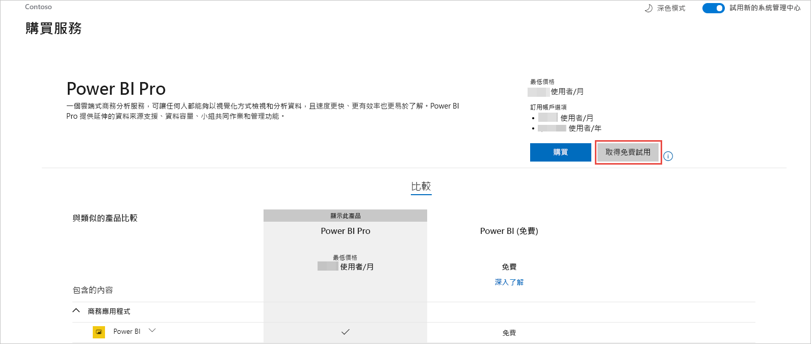
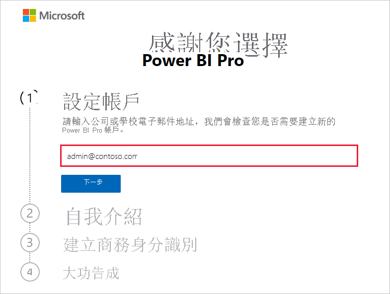
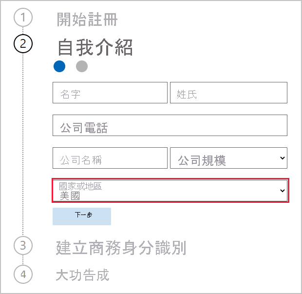
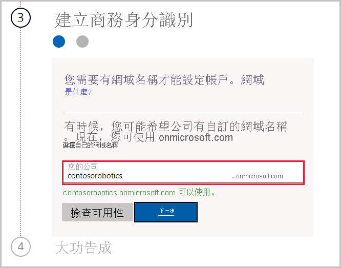

# 為組織取得 Power BI 服務訂用帳戶

系統管理員可透過 Microsoft 365 系統管理中心的 [購買服務] 頁面來註冊 Power BI 服務。 當管理員註冊 Power BI 時，他們可以將授權指派給應該有存取權的使用者。

您組織中的使用者可透過 Power BI 網站來註冊 Power BI。 當組織中的使用者註冊 Power BI 時，便會自動指派 Power BI 授權給使用者。 若您想要關閉自助功能，請遵循[啟用或停用自助式註冊和購買](service-admin-disable-self-service.md)中的步驟。

## 透過 Microsoft 365 註冊

如果您是全域系統管理員或計費系統管理員，則可為組織取得 Power BI 訂用帳戶。 如需詳細資訊，請參閱[誰可以購買及指派授權？](service-admin-licensing-organization.md#who-can-purchase-and-assign-licenses)

> [!NOTE]
>
> Microsoft 365 E5 訂用帳戶已經包含 Power BI Pro 授權。 若要了解如何管理授權，請參閱[檢視和管理使用者授權](service-admin-manage-licenses.md)。
>
>

請遵循下列步驟以在 Microsoft 365 系統管理中心內購買 Power BI Pro 授權：

1. 登入 [MIcrosoft 365 系統管理中心](https://admin.microsoft.com)。

2. 在導覽功能表上，選取 [計費] > [購買服務]。
  
   

3. 搜尋或捲動以找出您想要購買的訂用帳戶。 您會在靠近頁面底部的 [您可能會有興趣的其他類別] 底下看到 [Power BI]。 選取連結以檢視可供您的組織使用的 Power BI 訂用帳戶。

4. 選取一個供應項目，例如 [Power BI Pro]。

5. 在 [購買服務] 頁面上，選取 [購買]。 如果您先前不曾使用過該服務，則可以開始一個 Power BI Pro 免費試用訂用帳戶。 它包含 25 個授權，並且有效期為一個月。

   

6. 根據您希望使用的付款方式，選擇 [按月支付] 或 [支付全年費用]。

7. 在 [您想要多少使用者?] 底下，輸入要購買的授權數目，然後選取 [立即結帳] 以完成交易。

8. 若要確認您的購買，請前往 [計費] > [產品與服務] 並尋找 [Power BI Pro]。

若要深入了解組織如何控制和取得 Power BI 服務，請參閱[您組織中的 Power BI](https://docs.microsoft.com/microsoft-365/admin/misc/power-bi-in-your-organization?view=o365-worldwide) (機器翻譯)。

## 為組織取得 Power BI 的更多方式

若您還不是 Microsoft 365 訂閱者，請使用以下步驟來為組織取得 Power BI Pro 試用版。 或者，您可[註冊新的 Microsoft 365 試用版](service-admin-signing-up-for-power-bi-with-a-new-office-365-trial.md)，然後遵循上一節中的步驟來新增 Power BI。

您將需要一個工作或學校帳戶來註冊 Power BI 訂用帳戶。 我們不支援消費者電子郵件服務或電信提供者所提供的電子郵件地址。 若您沒有公司或學校帳戶，則可在註冊時進行建立。

請依照下列步驟進行註冊：

1. 請前往 [Power BI Pro 註冊](https://signup.microsoft.com/create-account/signup?OfferId=d59682f3-3e3b-4686-9c00-7c7c1c736085&ali=1&products=d59682f3-3e3b-4686-9c00-7c7c1c736085)。 

2. 輸入公司或學校電子郵件地址，然後選取 [下一步]。 若您輸入的電子郵件地址不是公司或學校電子郵件地址也沒關係。 我們會在您建立商務身分識別時為您設定新的帳戶。

   

3. 我們會執行快速檢查，以判斷您是否需要建立新的帳戶。 請選取 [設定帳戶] 來繼續註冊流程。

   > [!NOTE]
   >若電子郵件地址已和另外一個 Microsoft 服務搭配使用，則可 [登入] 或改為 [建立新的帳戶]。 若選擇建立新帳戶，請繼續遵循下列步驟以進行設定。
>
>
 
4. 完成表單以描述身分。 請務必選擇正確的國家或地區。 您所選取國家/地區會決定儲存資料的位置，如同[如何判斷 Power BI 租用戶的位置](service-admin-where-is-my-tenant-located.md#how-to-determine-where-your-power-bi-tenant-is-located)中所述。

   

5. 選取 [下一步]。 我們需要傳送驗證碼來驗證身分識別。 請提供電話號碼，讓我們可傳送簡訊或撥打電話給您。 然後，請選取 [傳送驗證碼]。

6. 輸入驗證碼，然後繼續 [建立商務身分識別]。

   

    輸入公司的簡短名稱，我們即會檢查其是否可供使用。 我們會使用此簡短名稱來在資料中心內建立組織名稱，作為 onmicrosoft.com 的子網域。 您可稍後再新增自己的公司網域。 如果所要的簡短名稱已遭採用，別擔心。 通常具有類似公司名稱的人員會選擇相同簡短名稱，您只需要嘗試不同的變化即可。 選取 [下一步]。
    
7. 建立使用者識別碼和密碼來登入帳戶。 選取 [註冊]，您便已完成設定。

您所建立帳戶現在是新 Power BI Pro 試用版租用戶的全域系統管理員。 您可登入 [Microsoft 365 系統管理中心](https://admin.microsoft.com)來新增更多使用者、設定自訂網域、購買更多服務，以及管理 Power BI 訂用帳戶。

## 後續步驟

- [檢視和管理使用者授權](service-admin-manage-licenses.md)
- [啟用或停用自助式註冊與購買](service-admin-disable-self-service.md)
- [商務訂閱與計費文件](https://docs.microsoft.com/microsoft-365/commerce/?view=o365-worldwide)
