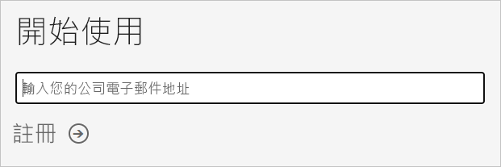
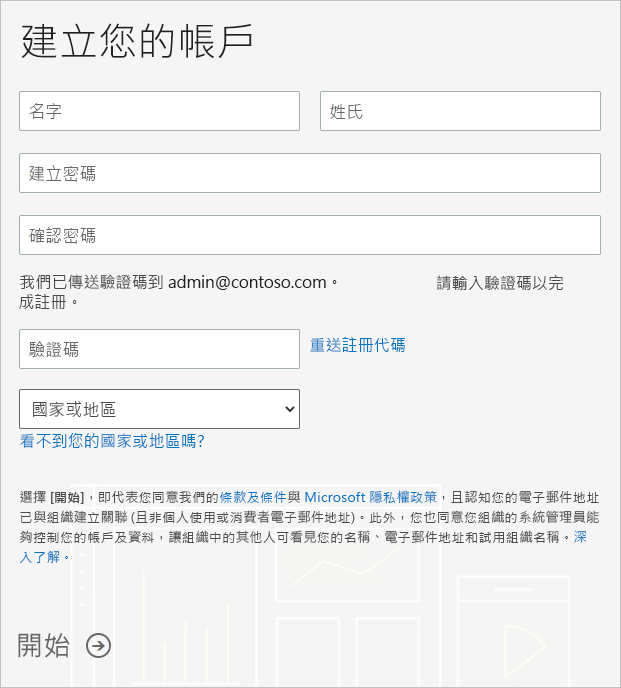

# 為組織取得 Power BI 訂用帳戶

身為管理員，您可以透過 [Power BI 網站](https://powerbi.microsoft.com)註冊 Power BI。 您也可以透過 Microsoft 365 系統管理中心的購買服務頁面註冊。 當管理員註冊 Power BI 時，他們可以將授權指派給應該有存取權的使用者。

此外，您組織中的個別使用者也可以透過 Power BI 網站註冊 Power BI。 當貴組織有使用者註冊 Power BI 時，Power BI 授權就會自動指派給該使用者。 如果您想要關閉此功能，請依照[啟用或停用自助式註冊與購買](service-admin-disable-self-service.md)中的步驟進行操作。

## 透過 Power BI 註冊

您將需要一個工作或學校帳戶來註冊 Power BI 訂用帳戶。 我們不支援消費者電子郵件服務或電信提供者所提供的電子郵件地址。

請依照下列步驟進行註冊：

1. 前往 [Power BI 網站](https://powerbi.microsoft.com)。 選取 [免費試用]  。
2. 輸入您的工作電子郵件地址，然後選取 [註冊]  。

   

3. 驗證您的身分識別。 我們會透過撥打電話或簡訊提供要使用的驗證碼給您。
4. 選取 [是]  以確認您要使用從公司取得的電子郵件地址。
5. 建立您的帳戶。 我們會將驗證碼傳送到您的電子郵件地址以完成註冊。

   

## 透過 Microsoft 365 註冊

如果您是 Microsoft 365 全域管理員或計費管理員，便可為您的組織取得 Power BI 訂用帳戶。 如需詳細資訊，請參閱[誰可以購買及指派授權？](../service-admin-licensing-organization.md#who-can-purchase-and-assign-licenses)

> [!NOTE]
>
> Microsoft 365 E5 訂用帳戶已經包含 Power BI Pro 授權。 若要了解如何管理授權，請參閱[檢視和管理使用者授權](service-admin-manage-licenses.md)。
>
>

請遵循下列步驟以在 Microsoft 365 系統管理中心內購買 Power BI Pro 授權：

1. 登入 [MIcrosoft 365 系統管理中心](https://admin.microsoft.com)。

2. 在導覽功能表上，選取 [計費]   > [購買服務]  。
  
   

3. 搜尋或捲動以找出您想要購買的訂用帳戶。 您會在靠近頁面底部的 [您可能會有興趣的其他類別]  底下看到 [Power BI]  。 選取連結以檢視可供您的組織使用的 Power BI 訂用帳戶。

4. 選取一個供應項目，例如 [Power BI Pro]。

5. 在 [購買服務]  頁面上，選取 [購買]  。 如果您先前不曾使用過該服務，則可以開始一個 Power BI Pro 免費試用訂用帳戶。 它包含 25 個授權，並且有效期為一個月。

   

6. 根據您希望使用的付款方式，選擇 [按月支付]  或 [支付全年費用]  。

7. 在 [您想要多少使用者?]  底下，輸入要購買的授權數目，然後選取 [立即結帳]  以完成交易。

8. 若要確認您的購買，請前往 [計費]   > [產品與服務]  並尋找 [Power BI Pro]  。

若要深入了解您的組織如何取得 Power BI 服務，請參閱[貴組織中的 Power BI](https://docs.microsoft.com/microsoft-365/admin/misc/power-bi-in-your-organization?view=o365-worldwide) \(部分機器翻譯\)。

## 後續步驟

- [檢視和管理使用者授權](service-admin-manage-licenses.md)
- [啟用或停用自助式註冊與購買](service-admin-disable-self-service.md)
- [商務訂閱與計費文件](https://docs.microsoft.com/microsoft-365/commerce/?view=o365-worldwide)
