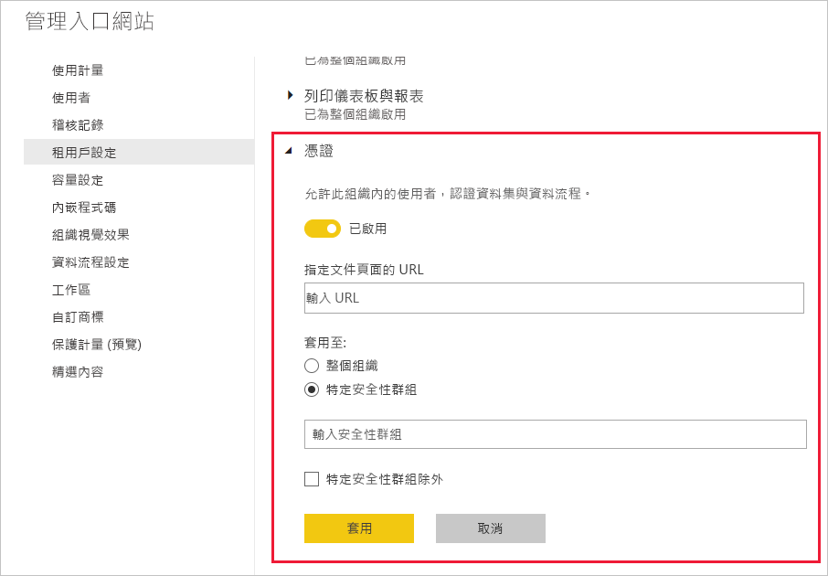

# 設定資料集與資料流程認證 (預覽)

組織可以認證作為重要資訊權威來源的資料集與資料流程。

身為 Power BI 租用戶系統管理員，您必須負責為組織設定認證流程。 這表示：
* 在租用戶上啟用認證。
* 定義已獲授權可認證資料集與資料流程的群組和使用者清單。
* 針對資料集，提供組織資料集認證原則的 URL (如果有的話)。

資料集與資料流程認證屬於資料集與資料流程「背書」  的一部分。 如需詳細資訊，請參閱[資料集背書](../service-datasets-promote.md)和[資料流程背書](../transform-model/service-dataflows-promote-certify.md)。

## 設定認證

1. 在管理入口網站中，選取 [租用戶設定]。
1. 在 [匯出和共用設定] 區段底下，展開 [認證] 區段。

   

1. 切換設定為 [啟用]  。
1. 對於資料集認證，如果組織有已發佈的認證原則，則可在這裡提供其 URL。 在[資料流程簽署設定對話方塊](../service-datasets-promote.md#request-dataset-certification)的 [憑證] 區段中，此處會變為**深入了解**連結 
1. 指定已獲授權可認證資料集與資料流程的使用者或群組。 這些授權的認證者可使用 [[資料集]](../service-datasets-promote.md#request-dataset-certification) 或 [[資料流程]](../transform-model/service-dataflows-promote-certify.md#certify-a-dataflow) 背書設定對話方塊中 [認證] 區段的 [認證] 按鈕。
1. 按一下 [套用]  。

## 後續步驟
* [宣傳資料集](../service-datasets-promote.md)
* [認證資料集](../service-datasets-certify.md)
* [推廣資料集](../transform-model/service-dataflows-promote-certify.md#promote-a-dataflow)
* [認證資料集](../transform-model/service-dataflows-promote-certify.md#certify-a-dataflow)
* 有問題嗎？ [嘗試在 Power BI 社群提問](https://community.powerbi.com/)
