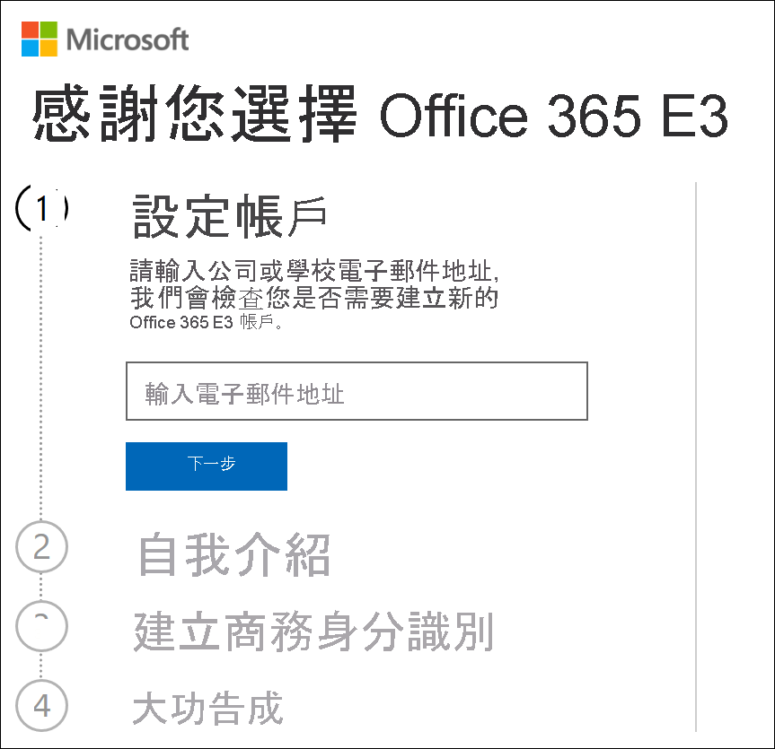
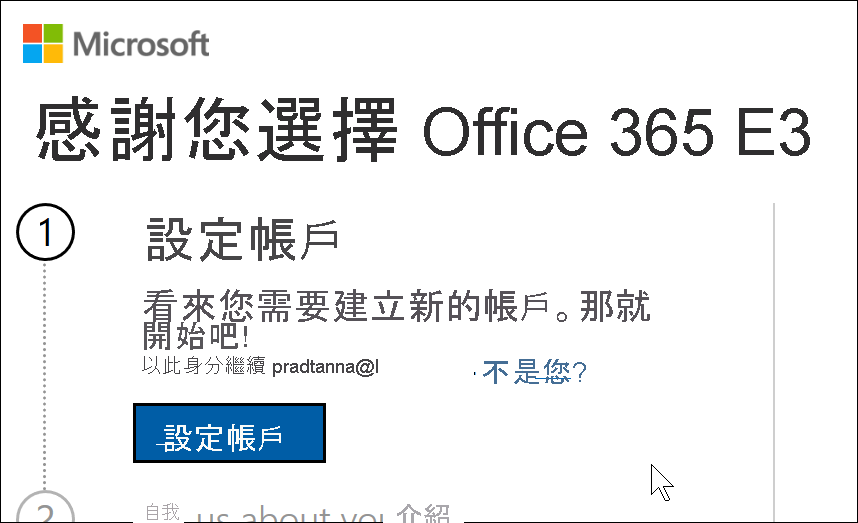
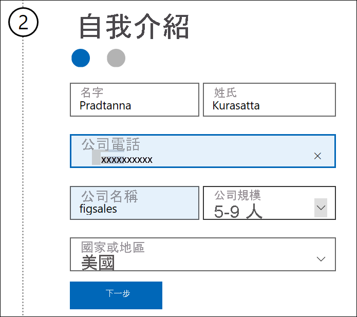
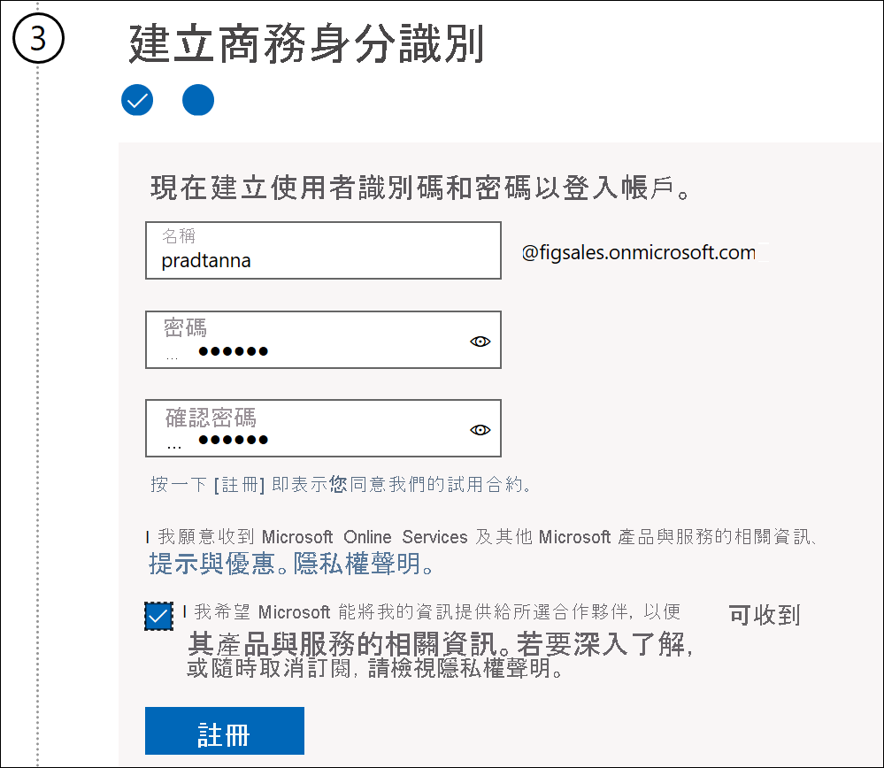
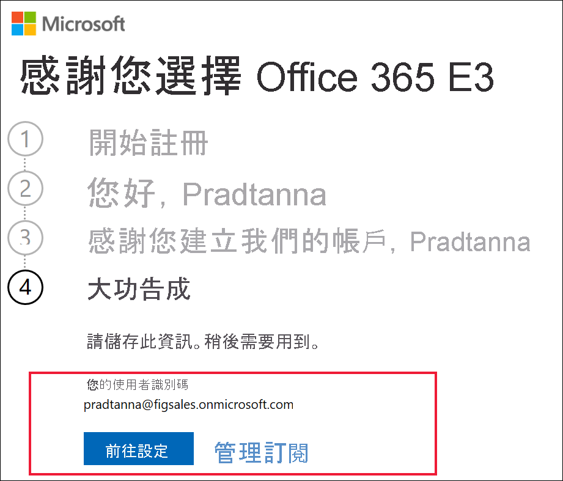

# 使用新的 Microsoft 365 試用版註冊 Power BI

本文描述沒有工作或學校電子郵件帳戶時，註冊 Power BI 的另一種方式。

如果使用電子郵件地址註冊 Power BI 時發生問題，請先確定其為[可用於 Power BI 的電子郵件地址](../fundamentals/service-self-service-signup-for-power-bi.md#supported-email-addresses)。 如果不成功，請註冊 Microsoft 365 試用版，並建立工作帳戶。 然後，使用此新的工作帳戶來註冊 Power BI 服務。 Microsoft 365 試用版到期後，您仍然可以使用 Power BI。

## 註冊 Office 的 Microsoft 365 試用版
請在 [Microsoft 365 網站](https://www.microsoft.com/microsoft-365/business/compare-more-office-365-for-business-plans)上註冊 Microsoft 365 試用版。 若還沒有帳戶，Microsoft 將會帶您逐步進行建立帳戶的步驟。 由於商業電子郵件帳戶 (例如 Hotmail 和 Gmail) 無法搭配 Microsoft 365 運作，因此您將需要建立新的帳戶以搭配 Microsoft 365 運作。  該電子郵件帳戶看起來會像是 *zalan@onmicrosoft.com* 。

![選取 [免費試用]](media/service-admin-signing-up-for-power-bi-with-a-new-office-365-trial/power-bi-try-free.png)

若您選取 [Office 365 E5]，則試用版將包含 Power BI Pro。 Power BI Pro 試用版會與 Office 365 E5 試用版同時到期 (目前為 30 天)。 若改為選取 [Office 365 E3]，您將能夠作為「免費」使用者來註冊 Power BI，然後升級至 **Pro** 以享有 60 天的試用。 

1. 輸入您的電子郵件地址。 Microsoft 會讓您知道電子郵件地址是否可用於 Microsoft 365，或是否需要建立新的電子郵件地址。  

    若需要新的電子郵件地址，Microsoft 將逐步引導您完成這些步驟。 第一個步驟是建立新的帳戶。 選取 [設定帳戶]。

    

2. 輸入新帳戶的詳細資料。

    

3. 建立新的電子郵件地址和密碼。 建立新的登入名稱，例如 you@yourcompany.onmicrosoft.com。 這是您將用於全新公司或學校帳戶和 Power BI 的登入。

    

4. 完成了！  您現在有可用來註冊 Power BI 的電子郵件地址。 請繼續[以個人身分註冊 Power BI 服務](../service-self-service-signup-for-power-bi.md)

     

    您可能需要等候建立新的租用戶。

## 重要考量

如果您有使用新帳戶登入的任何問題，請嘗試使用隱私權瀏覽器工作階段。

使用這個註冊方法會建立新的組織租用戶，而且您將會成為該租用戶的系統管理員。 如需詳細資訊，請參閱[什麼是 Power BI 管理？](service-admin-administering-power-bi-in-your-organization.md)。 您可將新的使用者新增至租用戶，然後與其共用，如 [Microsoft 365 系統管理員文件](https://support.office.com/article/Add-users-individually-to-Office-365---Admin-Help-1970f7d6-03b5-442f-b385-5880b9c256ec)中所述。

## 後續步驟

[什麼是 Power BI 管理？](service-admin-administering-power-bi-in-your-organization.md)  
[組織中的 Power BI 授權](service-admin-licensing-organization.md)  
[以個人身分註冊 Power BI](../fundamentals/service-self-service-signup-for-power-bi.md)

有其他問題嗎？ [嘗試在 Power BI 社群提問](https://community.powerbi.com/)
