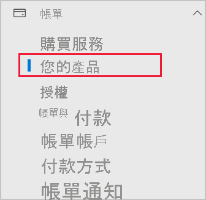

# 將 Power BI 新增至 Microsoft 365 合作夥伴訂閱

Microsoft 365 可讓公司將 Microsoft 365 與其自有的解決方案進行搭配整合並轉售，讓客戶只需透過一個連絡窗口，就能處理購買、帳單和支援等事宜。

如果您想將 Power BI 新增至 Microsoft 365 訂閱，建議您連絡合作夥伴來選購。 如果您的合作夥伴目前不提供 Power BI，您可以採用下述選項。

## 與您的合作夥伴合作以購買 Power BI

如果想要購買 Power BI Pro 或 Power BI Premium 訂閱，請與合作夥伴討論您可購買的選項：

* 合作夥伴若同意將 Power BI 加入商品組合，即可向其購買。

* 合作夥伴可以轉換您的購買模式，變成直接向 Microsoft 或其他提供 Power BI 的合作夥伴購買 Power BI。

## 從 Microsoft 或其他管道購買

根據與您合作夥伴關係，您或許可以直接向 Microsoft 或其他合作夥伴購買 Power BI。 您可以確認您是否能在 Microsoft 365 系統管理中心新增 Power BI 訂閱 (需要全域管理員或計費管理員角色成員資格)。

1. 移至 [MIcrosoft 365 系統管理中心](https://admin.microsoft.com/AdminPortal/Home#/homepage)。

1. 在左側功能表中開啟 [計費]，然後選取 [您的產品]：

   

 1. 尋找 [訂閱]，如下圖所示。 如果您看到 [訂閱]，您可以直接向 Microsoft 取得服務，您也可以連絡提供 Power BI 的其他合作夥伴。

    

    如果您沒有看到 [訂閱]，則您無法直接向 Microsoft 或其他合作夥伴購買。

如果您的合作夥伴不提供 Power BI，且您無法直接向 Microsoft 或其他合作夥伴購買，請考慮註冊免費試用版。

## 註冊免費試用版

您可以註冊 Power BI 的免費試用。 如果您在試用期結束時未購買 Power BI Pro，您仍然擁有提供許多 Power BI 功能的免費授權。 如需詳細資訊，請參閱[以個人身分註冊 Power BI](../fundamentals/service-self-service-signup-for-power-bi.md)。

### 啟用特定訂閱

根據預設，系統會停用個人註冊 (又稱為特定訂閱)。 在此情況下，您會在嘗試註冊時看到下列訊息：「您的 IT 部門已經關閉 Microsoft Power BI 的註冊功能。」

![[很抱歉] 影像](media/service-admin-syndication-partner/sorry.png)

若要啟用特定訂閱，您可以連絡合作夥伴，請他們開啟。 如果您是租用戶系統管理員，而且知道如何使用 Azure Active Directory PowerShell 命令，您可以自行啟用特定訂閱。 如需詳細資訊，請遵循[啟用或停用自助式購買](service-admin-disable-self-service.md)中的步驟。

## 後續步驟

* [組織中的 Power BI 授權](service-admin-licensing-organization.md)
* [購買及指派 Power BI Pro 授權](service-admin-purchasing-power-bi-pro.md)

有其他問題嗎？ [嘗試在 Power BI 社群提問](https://community.powerbi.com/)