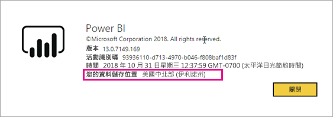
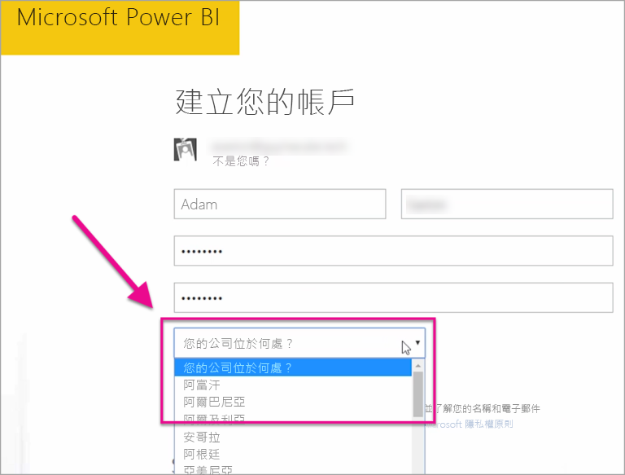

# 我的 Power BI 租用戶位於何處？

<iframe width="560" height="315" src="https://www.youtube.com/embed/0fOxaHJPvdM?showinfo=0" frameborder="0" allowfullscreen></iframe>

了解您的 Power BI 租用戶所在位置，以及選取該位置的方式。 了解所在位置非常重要，因為它可能會影響您與服務的互動。

## 如何判斷您的 Power BI 租用戶所在位置

若要尋找您租用戶的所在區域，請遵循這些步驟。

1. 在 Power BI 服務的頂端功能表中，選取說明 ( **?** )，然後選取 [關於 About Power BI]  。

1. 查看 [您的資料儲存位置]  旁邊的值。 這是您租用戶的所在區域。 此值也是存放資料所在的區域，除非工作區使用不同區域中的專用容量。

    

## 資料區域的選取方式

資料區域是取決於您建立租用戶時所選取的國家/地區。 因為此資訊是共用的，所以此選取項目也適用於註冊 Office 365 和 Power BI。 如果這是新的租用戶，當您註冊時請從清單中選取最適當的國家/地區。

Power BI 會挑選最接近此選取項目的資料區域，以決定租用戶資料的儲存位置。

> [!IMPORTANT]
> 在您建立租用戶之後，就無法變更此選取項目。

有其他問題嗎？ [試試 Power BI 社群](https://community.powerbi.com/)

