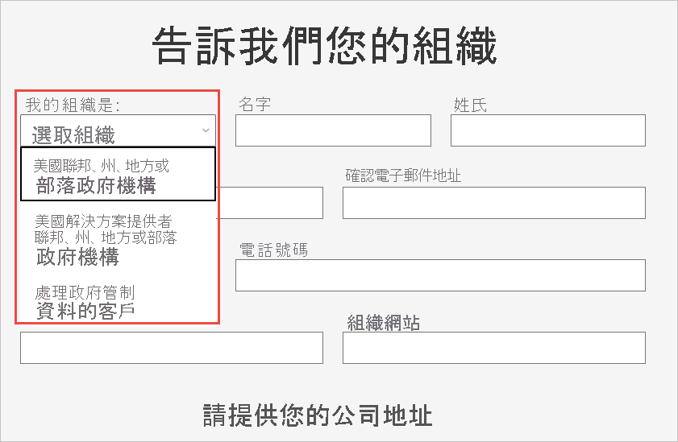

# 在 Power BI 服務中，註冊您的美國政府組織

[Microsoft 365 政府版方案](https://www.microsoft.com/microsoft-365/government/compare-office-365-government-plans?rtc=1)中有一版 Power BI 服務。 本文專為美國政府客戶設計。此處所述的註冊程序，不同於商業版的 Power BI 服務。

如需適用於美國政府之 Power BI 服務的詳細資訊，請參閱[適用於美國政府客戶的 Power BI - 概觀](service-govus-overview.md)。

> [!NOTE]
> 本文的對象是有權為其美國政府組織註冊 Power BI 的系統管理員。 您若是終端使用者，請洽詢您的系統管理員，了解如何訂閱適用於美國政府的 Power BI。
> 
> 

## 為您的美國政府組織選取正確的註冊程序

您的美國政府組織可能是第一次加入美國政府雲端社群，也可能已有訂閱。 下列各節將根據所使用的 Microsoft 365 政府版方案與 Power BI 內容，詳述其註冊步驟。 這些步驟會隨您目前的註冊而不同。

當您註冊 Power BI for US Government 之後，請與您的帳戶小組合作，開始此文章所述的[允許清單程序](#additional-signup-information)。 您必須完成此步驟，您的組織才能在政府社群雲端中執行作業。

## 如何註冊新的 Microsoft 365 政府版方案

若組織第一次使用政府雲端社群，請遵循下列步驟註冊 Microsoft 365 政府版方案：

> [!NOTE]
> 這些步驟應由全域管理員執行。
>

1. 前往 [Microsoft 365 政府版方案](https://products.office.com/government/office-365-web-services-for-government)。
2. 選取 [開始免費試用]。
3. 填寫表單描述您的組織。 使用下拉式清單選取您的組織類型。

   

4. 提交表單，以開始啟用程序。 您的 Microsoft 代表或 Microsoft 合作夥伴可以協助您任何問題。

完成此程序之後，請遵循現有 Microsoft 365 政府版客戶應執行的步驟新增 Power BI 訂閱。

## 將 Power BI 新增至 Microsoft 365 政府版方案

組織若已具有 Microsoft 365 政府版方案，請遵循下列步驟新增 Power BI 訂閱：

> [!NOTE]
> 這些步驟應由全域管理員執行。
> 
> 

1. 使用您的全域管理員或計費系統管理員認證，登入 Microsoft 365 系統管理中心。
2. 選取 [計費] > [購買服務]。
4. 搜尋或捲動頁面，找出 Power BI Pro 政府版供應項目，然後選擇 [試用] 或 [立即購買]。
5. 完成訂單。
6. 將授權指派給使用者帳戶。

## 其他註冊資訊

在您可以使用 Power BI for US Government 服務之前，必須先與您的 Microsoft 帳戶小組合作，將您的組織新增至我們的允許清單。 Power BI 工程小組會使用允許清單程序，將客戶從商務雲端環境移至安全的政府社群雲端。 此步驟可確保美國政府雲端中的功能如預期般運作。 

若要開始允許清單程序，請連絡您的 Microsoft 帳戶小組尋求協助。 只有管理員可以要求加入允許清單。 此程序大約需要三週的時間。 在此期間內，Power BI 工程小組將會進行適當的變更，以確保您的租用戶在美國政府雲端中能夠正常地運作。

## 後續步驟

* [適用於美國政府的 Power BI 概觀](service-govus-overview.md)
- [如何購買 Microsoft 365 政府版？](/office365/servicedescriptions/office-365-platform-service-description/office-365-us-government/microsoft-365-government-how-to-buy#how-do-i-buy-microsoft-365-government)(機器翻譯)