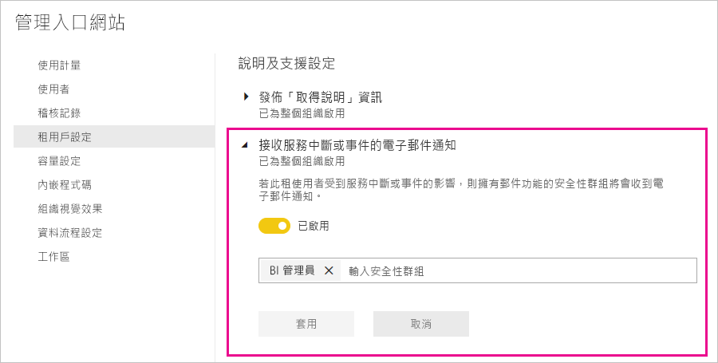

# 服務中斷通知

取得任務關鍵性商務應用程式的可用性見解相當重要。 Power BI 提供事件通知，因此您可以選擇是否要在服務中斷或效能降低時收到電子郵件。 雖然在 Power BI 的 99.9% 服務等級協定 (SLA) 保護下，這類情況很罕見，但我們仍想確保您隨時掌握情況。 下列螢幕擷取畫面顯示當您啟用通知時，可收到的電子郵件類型：

目前，我們會針對下列_可靠性案例_傳送電子郵件：

- 開啟報表可靠性
- 模型重新整理可靠性
- 查詢重新整理可靠性

在開啟報表、資料集重新整理或查詢執行等作業中若遇到「延遲延長」，就會傳送通知。 在解決事件之後，您會收到後續的電子郵件。

> [!NOTE]
> 這項功能目前僅適用於 Power BI Premium 中的專用容量， 其不適用於共用或內嵌容量。

## 容量和可靠性通知

當 Power BI Premium 容量遇到可能會影響可靠性的高資源使用量時段時，會傳送通知電子郵件。 這類影響的範例，包括開啟報表、重新整理資料集和執行查詢等作業遭遇較長的延遲。 

通知電子郵件會針對高資源使用量的原因提供資訊，包括下列詳細資料：

* 負責資料集的資料集識別碼
* 作業類型
* 與高資源使用量建立關聯的 CPU 時間。 以下是維基百科中對 [CPU 時間的定義](https://wikipedia.org/wiki/CPU_time)。

在偵測到 Power BI Premium 容量超載時，Power BI 也會傳送電子郵件通知。 該電子郵件會說明超載的可能原因、在過去 10 分鐘內產生負載的作業，以及每個作業產生的負載量。

若有多個 Premium 容量，則此電子郵件會在超載期間包含這些容量的相關資訊。 這項資訊可協助考慮將包含大量資源項目的工作區移至負載最低的容量。

只有在觸發超載閾值時，才會傳送超載電子郵件通知。 當 Premium 容量的負載回到非超載層級時，您將不會再次收到電子郵件。

下圖顯示範例通知電子郵件：

## 啟用通知

Power BI 管理員可在管理入口網站中啟用通知：

1. 識別或建立應接收通知並已啟用電子郵件功能的安全性群組。

1. 在管理入口網站中，選取 [租用戶設定]。 在 [說明及支援設定] 下方，展開 [Receive email notifications for service outages or incidents] \(接收服務中斷或事件的電子郵件通知\)。

1. 啟用通知，輸入安全性群組，然後選取 [套用]。

    

> [!NOTE]
> Power BI 會透過 no-reply-powerbi@microsoft.com 帳戶傳送通知。 請確定已將此帳戶新增至您的安全寄件者清單，讓通知不會最終出現在垃圾郵件資料夾中。

## Microsoft 365 中的服務健康情況

本文描述如何透過 Power BI 接收服務通知。 您也可以透過 Microsoft 365 監視 Power BI 服務健康情況。 加入 Microsoft 365 以接收其服務健康情況電子郵件通知。 如需深入了解，請參閱[如何檢查 Microsoft 365 服務健康情況](https://docs.microsoft.com/microsoft-365/enterprise/view-service-health) (機器翻譯)。

## 後續步驟

[Power BI Pro 和 Power BI Premium 支援選項](service-support-options.md)

有其他問題嗎？ [試試 Power BI 社群](https://community.powerbi.com/)
