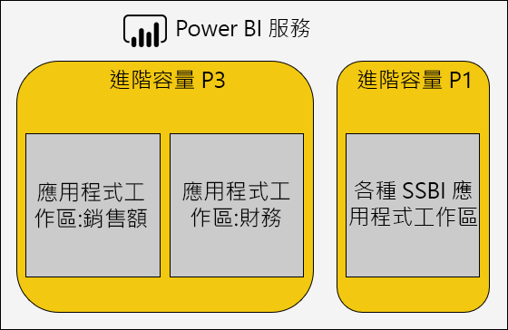

# 最佳化 Premium 容量

發生 Premium 容量效能問題時，常見的第一個解決方法是將解決方案最佳化或進行調整，以恢復成可接受的回應時間。 這樣做的原因是為了避免購買 Premium 額外容量 (除非有充分的理由)。

如果需要額外的 Premium 容量，如本文所述有兩個選擇：

- 相應增加現有的 Premium 容量
- 新增 Premium 容量

最後，本文將以測試方法和 Premium 容量大小調整作為總結。

## 最佳作法

嘗試取得最佳的使用率和效能時，有一些建議的最佳做法，包括：

- 使用工作區，而不是個人工作區。
- 將商務關鍵性和自助 BI (SSBI) 分隔成不同的容量。

  

- 如果只與 Power BI Pro 使用者共用內容，則可能不需要將內容儲存在專用容量中。
- 當您想要達成特定的重新整理時間，或需要特定的功能時，請使用專用容量。 例如，使用大型資料集或編頁報表。

### 解決常見的問題

將 Power BI Premium 部署最佳化是很複雜的主題，需要了解工作負載需求、可用資源及其有效使用方式。

本文解決七個常見的支援問題，其中描述可能的問題和說明，以及如何找出和解決這些問題的相關資訊。

### 為什麼容量速度很慢，我可以做些什麼？

導致 Premium 容量變慢的原因有許多。 此問題需要進一步資訊以了解何謂緩慢。 報表載入速度是否很慢？ 還是無法載入？ 當使用者與報表互動時，報表視覺效果載入或更新速度是否很慢？ 完成重新整理所需的時間是否比預期或先前經驗更長？

了解原因之後，您就可以接著展開調查。 回覆下列六個問題將協助您解決更具體的問題。

### 哪些內容耗盡我的容量？

您可以使用 **Power BI Premium 容量計量**應用程式依容量進行篩選，並檢閱工作區內容的效能計量。 您可以檢閱儲存在 Premium 容量中所有內容在過去七天每小時的效能計量和資源使用狀況。 針對 Premium 容量效能的一般問題進行疑難排解時，第一個步驟通常是監視。

要監視的關鍵計量包括：

- 平均 CPU 和高使用率計數。
- 平均記憶體和高使用率計數，以及特定資料集、資料流程和編頁報表的記憶體使用量。
- 已載入記憶體的使用中資料集。
- 平均和最大查詢持續時間。
- 平均查詢等候時間。
- 平均資料集和資料流程重新整理時間。

在 Power BI Premium 容量計量應用程式中，使用中記憶體顯示指定給報表的記憶體總量，由於其在三分鐘前為使用中，因此無法收回。 重新整理等候時間的高峰值可能與大型和/或使用中資料集相關。

[Top 5 by Average Duration] \(依平均持續時間的前 5 名\)  圖表醒目提示容量資源使用量最高的前五名資料集、編頁報表和資料流程。 前五名清單中的內容是調查和最佳化 (如果可能的話) 的候選對象。

### 為什麼報表速度很慢？

下表顯示可能的問題，以及找出和處理這些問題的方法。

#### 容量資源不足

| 可能的說明 | 如何找出 | 如何解決 |
| --- | --- | --- |
| 使用中記憶體總量很高 (由於其在三分鐘前為使用中，因此無法收回的模型)。   查詢等候時間有多個高峰值。   重新整理等候時間有多個高峰值。 | 監視記憶體計量 \[[1](#endnote-1)\] 和收回計數 \[[2](#endnote-2)\]。 | 減少模型大小，或轉換成 DirectQuery 模式。 請參閱本文的[最佳化模型](#optimizing-models)一節。   相應增加容量。   將內容指派給不同的容量。 |

#### 效率不佳的報表設計

| 可能的說明 | 如何找出 | 如何解決 |
| --- | --- | --- |
| 報表頁面包含太多視覺效果 (互動式篩選針對每個視覺效果可以觸發至少一個查詢)。   視覺效果擷取比所需更多的資料。 | 檢閱報表設計。   與報表使用者面談以了解他們與報表的互動方式。   監視資料集查詢計量 \[[3](#endnote-3)\]。 | 重新設計報表並減少每頁的視覺效果。 |

#### 資料集速度很慢，特別是當報表先前的執行效能良好時

| 可能的說明 | 如何找出 | 如何解決 |
| --- | --- | --- |
| 匯入資料量越來越大。   複雜或效率不佳的計算邏輯，包括 RLS 角色。   模型未完全最佳化。   (DQ/LC) 閘道延遲。   DQ 來源查詢回應時間變慢。 | 檢閱模型設計。   監視閘道效能計數器。 | 請參閱本文的[最佳化模型](#optimizing-models)一節。 |

#### 報表並行使用率很高

| 可能的說明 | 如何找出 | 如何解決 |
| --- | --- | --- |
| 查詢等候時間很長。   CPU 飽和度。   超過 DQ/LC 連線限制。 | 監視 CPU 使用率 \[[4](#endnote-4)\]、查詢等候時間和 DQ/LC 使用率 \[[5](#endnote-5)\] 計量 + 查詢持續時間。 如果變動，可能表示並行問題。 | 相應增加容量，或將內容指派給不同的容量。   重新設計報表並減少每頁的視覺效果。 |

**注意：**    
\[1\] 平均記憶體使用量 (GB)，以及最高的記憶體耗用量 (GB)。   
\[2\] 資料集收回數。   
\[3\] 資料集查詢、資料集平均查詢持續時間 (毫秒)、資料集等候計數和資料集平均等候時間 (毫秒)。   
\[4\] CPU 高使用率計數和最高使用率的 CPU 時間 (過去七天)。   
\[5\] DQ/LC 高使用率計數和最高使用率的 DQ/LC 時間 (過去七天)。   

### 為什麼無法載入報表？

當報表無法載入時，這是容量記憶體不足且過熱的明顯徵兆。 當所有載入的模型正在接受主動查詢而無法收回，且任何重新整理作業都已暫停或延遲時，就可能會發生此情況。 Power BI 服務會嘗試載入資料集 30 秒，且使用者會適當收到失敗通知及稍後再試一次的建議。

目前沒有可監視報表載入失敗的計量。 您可以藉由監視系統記憶體來找出可能的問題，特別是監視最高使用率和最高使用率的時間。 資料集收回數很高，以及資料集重新整理平均等候時間過長，都可能指出此問題正在發生。

如果只是偶爾才會發生此情況，這可能不會被視為高優先順序問題。 報表使用者會收到通知，指出服務忙碌中，稍後應該重試。 如果此情況太過頻繁發生，則可藉由相應增加 Premium 容量，或將內容指派給不同的容量來解決問題。

容量管理員 (和 Power BI 服務管理員) 可以監視**查詢失敗**計量，以判斷何時發生此情況。 他們也可以重新啟動容量，並在系統超載時重設所有作業。

### 為什麼重新整理未按排程開始？

不保證排程的重新整理開始時間。 記得 Power BI 服務一律會優先處理互動式作業，而不是背景作業。 重新整理是符合下列兩個條件時可能會發生的背景作業：

- 有足夠的記憶體
- 未超過 Premium 容量支援的並行重新整理次數

如果不符合條件，則會將重新整理排入佇列，直到符合條件為止。

若要進行完整重新整理，記得至少需要目前資料集記憶體大小的兩倍。 如果沒有足夠的記憶體可用，則會等到模型收回釋出記憶體之後，才會開始重新整理；這表示會延遲直到一或多個資料集變成非使用中並可收回為止。

記得所支援並行重新整理數目上限會設定為後端 V 核心數的 1.5 倍 (無條件進位)。

如果直到下次排程的重新整理時間開始之前都無法開始，則排程重新整理會失敗。 從 UI 手動觸發的隨選重新整理會嘗試執行最多三次，之後會失敗。

容量管理員 (和 Power BI 服務管理員) 可以監視**平均重新整理等候時間 (分鐘)** 計量，以判斷排程時間與作業開始之間的平均延遲。

雖然這通常不是影響資料準時重新整理的管理優先事項，但請確保有足夠的記憶體可用。 這可能需要將資料集隔離到已知有足夠資源的容量。 管理員也可與資料集擁有者協調，協助錯開或減少排程的資料重新整理時間，以將衝突降到最低。 請注意，管理員無法檢視重新整理佇列，也無法擷取資料集排程。

### 為什麼重新整理速度很慢？

重新整理速度可能很慢，或認為很慢 (如先前常見問題所提出)。

當重新整理速度事實上很慢時，可能是由於下列幾個原因所造成：

- CPU 不足 (重新整理可能會耗用大量 CPU)。
- 記憶體不足，而導致重新整理暫停 (當符合重新開始的條件時，需要從頭開始重新整理)。
- 非容量原因，包括資料來源系統回應性、網路延遲、權限無效或閘道輸送量。
- 資料量 - 這是設定累加式重新整理的好理由，如下所述。

容量管理員 (和 Power BI 服務管理員) 可以監視**平均重新整理持續時間 (分鐘)** 計量，以判斷一段時間內的比較基準，以及**平均重新整理等候時間 (分鐘)** 計量，以判斷排程時間與作業開始之間的平均延遲。

累加式重新整理可以大幅減少資料重新整理持續時間，特別是針對大型模型資料表。 累加式重新整理有四個相關優點：

- **重新整理速度更快** - 只需要載入資料表子集，因此減少 CPU 和記憶體使用量，且可提高重新整理多個資料分割時的平行處理原則。
- **只有在必要時才進行重新整理** - 累加式重新整理原則可設定為只有在資料已有所變更時才會載入。
- **重新整理更可靠** - 需要較短的執行連線時間，即可變更資料來源系統所，因此較不容易受到中斷連線的影響。
- **模型會保持精簡** - 累加式重新整理原則可設定為自動移除超過滑動時間範圍的歷程記錄。

若要深入了解，請參閱 [Power BI Premium 中的累加式重新整理](service-premium-incremental-refresh.md)。

### 為什麼資料重新整理未完成？

當資料重新整理開始但無法完成時，可能是由於下列幾個原因所造成：

- 記憶體不足，即使 Premium 容量中只有一個模型 (亦即模型大小非常大) 也一樣。
- 非容量原因，包括資料來源系統中斷連線、權限無效或閘道錯誤。

容量管理員 (和 Power BI 服務管理員) 可以監視**因記憶體不足而造成的重新整理失敗**計量。

## 最佳化模型

最佳模型設計對於提供有效率且可調整的解決方案而言非常重要。 不過，本文不會提供完整討論。 相反地，本節會提供將模型最佳化時的主要考量。

### 最佳化 Power BI 裝載的模型

您可以在資料來源和模型層將裝載於 Premium 容量中的模型最佳化。

請考慮匯入模型的最佳化可能性：

在資料來源層：

- 您可以將關聯式資料來源最佳化，透過預先整合資料、套用適當的索引、定義符合累加式重新整理間隔的資料表資料分割，以及將計算具體化 (用來取代計算模型資料表和資料行) 或將計算邏輯新增至檢視表來確保重新整理速度盡可能最快。
- 非關聯式資料來源可以預先與關聯式存放區整合。
- 確定閘道具有足夠的資源，最好是在專用電腦上，並具有足夠的網路頻寬且接近資料來源。

在模型層：

- Power Query 查詢設計可最小化或移除複雜的轉換，特別是合併不同資料來源的轉換 (資料倉儲可在其「擷取-轉換-載入」階段期間達成此目的)。 此外，請務必設定適當的資料來源隱私權等級，這可避免需要 Power BI 載入完整的結果以產生多個查詢的合併結果。
- 模型結構會決定要載入的資料，並直接影響模型大小。 它可設計成藉由移除資料行、移除資料列 (特別是歷程資料) 或載入摘要資料 (代替載入詳細資料)，來避免載入不必要的資料。 並可藉由移除無法非常有效率地儲存或壓縮的高基數資料行 (特別是文字資料行) 來大幅縮減大小。
- 除非有充分的理由需要允許雙向篩選，否則可藉由設定單向關聯性來改善模型查詢效能。 另請考慮使用 [CROSSFILTER](/dax/crossfilter-function) 函式來取代雙向篩選。
- 彙總資料表可藉由載入預先摘要的資料來達成快速查詢回應，不過這會增加模型的大小，並導致較長的重新整理時間。 一般而言，彙總資料表應該保留給非常大型的模型或複合模型設計。
- 計算資料表和資料行會增加模型大小，並導致較長的重新整理時間。 一般而言，當資料在資料來源中具體化或計算時，不僅可縮減儲存空間大小，也可加快重新整理速度。 如果無法這麼做，使用 Power Query 自訂資料行可改善儲存壓縮。
- 您可能有機會調整量值和 RLS 規則的 DAX 運算式，也許是重寫邏輯以避免高度耗費資源的公式
- 累加式重新整理可大幅減少重新整理時間，並節省記憶體和 CPU。 累加式重新整理也可設定為移除歷程資料，以保持模型大小精簡。
- 當查詢模式不同且衝突時，可將一個模型重新設計成兩個模型。 例如，某些報表顯示所有歷程記錄的概觀彙總，並可容許 24 小時的延遲。 其他報表則與今天的資料相關，且需要對個別交易進行細微存取。 請建立兩個針對各自需求最佳化的模型，而不是設計滿足所有報表的單一模型。

請考慮 DirectQuery 模型的最佳化可能性。 當模型對基礎資料來源發出查詢要求時，資料來源最佳化對於提供具回應性的模型查詢而言非常重要。

 

在資料來源層：

- 您可以將資料來源最佳化，透過預先整合資料 (無法在模型層進行)、套用適當的索引、定義資料表資料分割、將摘要資料具體化 (使用索引檢視表) 及減少計算數量來確保查詢速度盡可能最快。 當傳遞查詢只需要在索引資料表或檢視表之間進行篩選和執行內部聯結時，就會有最佳體驗。
- 確定閘道具有足夠的資源，最好是在專用電腦上，並具有足夠的網路頻寬且接近資料來源。

在模型層：

- Power Query 查詢設計最好不要套用轉換，或盡可能在絕對必要時才進行轉換。
- 除非有充分的理由需要允許雙向篩選，否則可藉由設定單向關聯性來改善模型查詢效能。 此外，模型關聯性應該設定為強制採用參考完整性 (如果適用的話)，這會導致使用更有效率的內部聯結 (而不是外部聯結) 進行資料來源查詢。
- 避免建立 Power Query 查詢自訂資料行或模型計算資料行； 如果可能，請在資料來源中將這些資料行具體化。
- 您可能有機會調整量值和 RLS 規則的 DAX 運算式，也許是重寫邏輯以避免高度耗費資源的公式。

請考慮複合模型的最佳化可能性。 記得複合模型允許混合匯入和 DirectQuery 資料表。

- 一般而言，匯入和 DirectQuery 模型最佳化適用於使用這些儲存模式的複合模型資料表。
- 通常藉由將維度類型資料表 (代表商務實體) 設定為雙重儲存模式，並將事實類型資料表 (通常是代表操作事實的大型資料表) 設定為 DirectQuery 儲存模式，即可達成平衡的設計。 雙重儲存模式是指兼具匯入和 DirectQuery 儲存模式，這可讓 Power BI 服務決定要用於產生原生傳遞查詢的最有效率儲存模式。
- 確定閘道具有足夠的資源，最好是在專用電腦上，並具有足夠的網路頻寬且接近資料來源
- 設定為匯入儲存模式的彙總資料表用於摘要 DirectQuery 儲存模式事實類型資料表時，可提供大幅改善的查詢效能。 在此情況下，彙總資料表會增加模型大小並增加重新整理時間，通常為了加快查詢速度，這是可接受的權衡取捨。

### 最佳化外部裝載的模型

[最佳化 Power BI 裝載的模型](#optimizing-power-bi-hosted-models)一節中所討論的許多最佳化可能性，也適用於使用 Azure Analysis Services 和 SQL Server Analysis Services 所開發的模型。 清除例外狀況是目前不支援的特定功能，包括複合模型和彙總資料表。

外部裝載資料集另一個考量是與 Power BI 服務相關的資料庫裝載。 對於 Azure Analysis Services，這表示在與 Power BI 租用戶相同的區域 (首頁區域) 中建立 Azure 資源。 對於 SQL Server Analysis Services 和 IaaS，這表示將 VM 裝載於相同的區域；對於內部部署，這表示確保有效率的閘道設定。

另外值得注意的是，Azure Analysis Services 資料庫和 SQL Server Analysis Services 表格式資料庫需要將其模型完全載入記憶體，並隨時保留在其中以便支援查詢。 如同 Power BI 服務，如果模型必須在重新整理期間保持連線，則需要有足夠的記憶體來重新整理。 不同於 Power BI 服務，沒有模型根據使用量自動過時及記憶體不足的概念。 因此，Power BI Premium 可提供更有效率的方法，透過降低記憶體使用量來提高模型查詢效能。

## 容量規劃

Premium 容量的大小決定其可用記憶體和處理器資源，以及加諸於容量的限制。 Premium 容量的數目也是一個考量，因為建立多個 Premium 容量可協助工作負載彼此隔離。 請注意，每個容量節點的儲存空間為 100 TB，這對於任何工作負載而言可能都綽綽有餘。

決定 Premium 容量的大小和數目可能是一項挑戰，特別是針對您所建立的初始容量。 容量大小調整的第一個步驟是了解代表每日預期使用量的平均工作負載。 請務必了解並非所有工作負載都相等。 例如，在範圍的一端是 100 個輕鬆就能達成並行存取單一報表頁面 (其中包含單一視覺效果) 的使用者。 但在範圍的另一端是 100 個並行存取 100 個不同報表 (每個報表頁面各有 100 個視覺效果) 的使用者，這會產生非常不同的容量資源需求。

因此，容量管理員必須考慮您環境、內容和預期使用量的許多特定因素。 首要目標是提高容量使用率，同時提供一致的查詢時間、可接受的等候時間和收回率。 考慮因素可能包括：

- **模型大小和資料特性** - 匯入模型必須完全載入記憶體，以允許查詢或重新整理。 LC/DQ 資料集可能需要大量的處理器時間，且可能需要大量的記憶體，才能評估複雜的量值或 RLS 規則。 記憶體和處理器大小以及 LC/DQ 查詢輸送量都會受到容量大小的限制。
- **並行使用中模型** - 不同的匯入模型保留在記憶體時，其並行查詢會提供最佳的回應性和效能。 應該有足夠記憶體可裝載所有高度查詢的模型，並有額外的記憶體允許其重新整理。
- **匯入模型重新整理** - 重新整理類型 (完整或累加式)、Power Query 查詢和計算資料表/資料行邏輯的持續時間和複雜度都可能會影響記憶體，特別是處理器使用狀況。 並行重新整理會受到容量大小的限制 (1.5 x 後端 V 核心數，無條件進位)。
- **並行查詢** - 當處理器或 LC/DQ 連線超過容量限制時，多個並行查詢可能會導致報表沒有回應。 特別是包含許多視覺效果的報表頁面。
- **資料流程和編頁報表** - 容量可設定為支援資料流程和編頁報表，各需要可設定的最大容量記憶體百分比。 記憶體會以動態方式配置給資料流程，但會以靜態方式配置給編頁報表。

除了這些因素以外，容量管理員也可以考慮建立多個容量。 多個容量允許隔離工作負載並可加以設定，以確保優先順序高的工作負載保證有資源。 例如，您可以建立兩個容量來分隔商務關鍵性工作負載與自助 BI (SSBI) 工作負載。 商務關鍵性容量可用來隔離大型公司模型以提供保證的資源，並將撰寫權限只授與 IT 部門。 SSBI 容量可用來裝載數目不斷增加的較小型模型，並將存取權限授與商務分析師。 SSBI 容量有時可能會遇到可容許的查詢或重新整理等候時間。

在一段時間後，容量管理員可藉由在工作區之間移動資料，或在容量之間移動工作區，以及藉由相應增加或減少容量來平衡容量之間的工作區。 一般而言，若要裝載更大型模型，請相應增加；若要提高並行處理能力，請向外延展。

記得購買授權會提供具有 V 核心的租用戶。 購買一個 **P3** 訂用帳戶可用來建立一或最多四個 Premium 容量，也就是 1 x P3 或 2 x P2 或 4 x P1。 此外，將 P2 容量轉換為 P3 容量之前，可考慮分割 V 核心來建立兩個 P1 容量。

## 測試方法

一旦決定容量大小，即可建立受控制的環境來執行測試。 一個實用且經濟實惠的選擇是建立 Azure (A SKU) 容量，請注意，P1 容量的大小與 A4 容量相同，而 P2 和 P3 容量的大小則分別與 A5 和 A6 容量相同。 您可以快速建立 Azure 容量，這些容量會按每小時計費。 因此，測試完成之後，您可以輕鬆地將其刪除來停止產生費用。

測試內容可新增至建立於 Azure 容量上的工作區，然後單一使用者可以執行報表，以產生實際且具代表性的查詢工作負載。 如果有匯入模型，也應該對每個模型執行重新整理。 然後，您可以使用監視工具來檢閱所有計量，以了解資源使用率。

測試必須能夠重複執行。 測試應該執行多次，且每次都應該提供大致相同的結果。 這些結果的平均值可用來推斷和估計實際執行情況下工作負載。

如果您已有想要對其進行負載測試的一個容量和多個報表，請使用 [PowerShell 負載產生工具](https://aka.ms/PowerBILoadTestingTool)來快速產生負載測試。 此工具可讓您估計容量在一小時內可執行的每個報表執行個體數目。 您可以使用此工具來評估容量對於個別報表轉譯或平行轉譯數個不同報表的能力。 如需詳細資訊，請觀看影片 [Microsoft Power BI:Premium capacity](https://www.youtube.com/watch?time_continue=1860&v=C6vk6wk9dcw) (Microsoft Power BI：Premium 容量)。

若要產生更複雜的測試，請考慮開發模擬實際工作負載的負載測試應用程式。 如需詳細資訊，請參閱網路研討會 [Load Testing Power BI Applications with Visual Studio Load Test](https://powerbi.microsoft.com/blog/week-4-11-webinars-load-testing-power-bi-applications-with-visual-studio-load-test-and-getting-started-with-cds-for-apps-based-model-driven-apps/) (使用 Visual Studio 負載測試對 Power BI 應用程式進行負載測試)。

## 致謝

本文是由資料平台 MVP 暨 [Bitwise Solutions](https://www.bitwisesolutions.com.au/) 的獨立 BI 專家 Peter Myers 所撰寫。

## 後續步驟

> [!div class="nextstepaction"]
> [Premium 容量案例](service-premium-capacity-scenarios.md)   
  
有其他問題嗎？ [嘗試在 Power BI 社群提問](https://community.powerbi.com/)