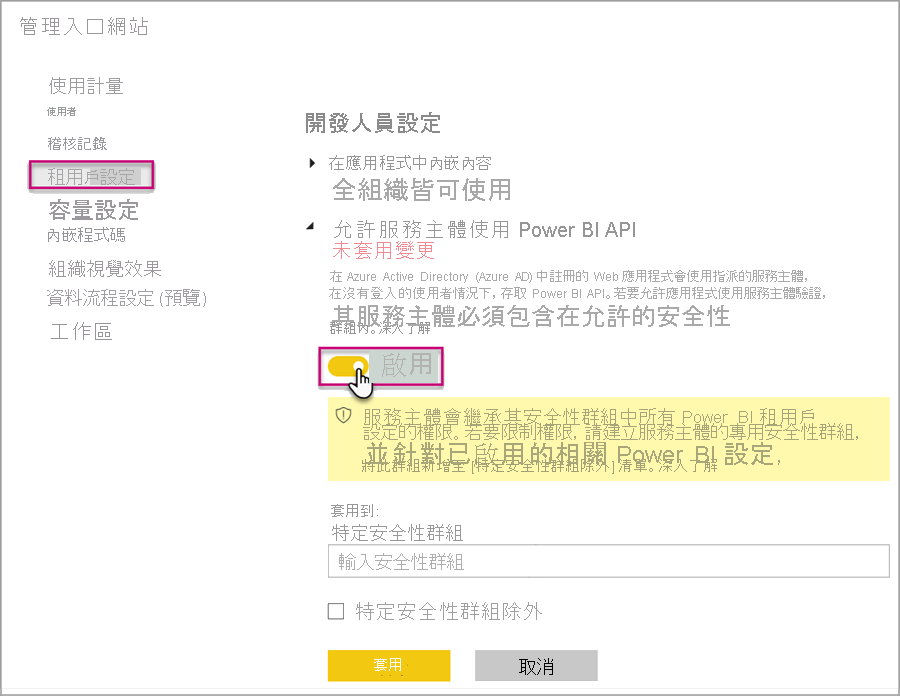
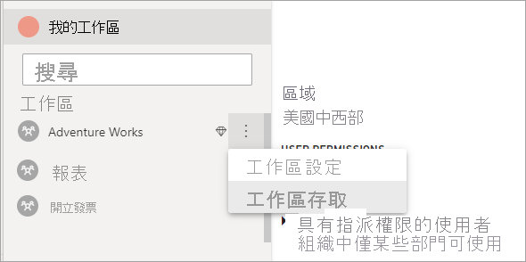

# <a name="automate-premium-workspace-and-dataset-tasks-with-service-principals"></a>使用服務主體將 Premium 工作區與資料集工作自動化

服務主體是在租用戶內建立的 Azure Active Directory「應用程式註冊」，其用於執行自動資源與服務等級作業。 服務主體是一種唯一的使用者身分識別，其具有應用程式名稱、應用程式識別碼、租用戶識別碼，以及密碼的「用戶端祕密」或憑證。

Power BI Premium 使用與 Power BI Embedded 相同的服務主體功能。 若要深入了解，請參閱[搭配服務主體內嵌 Power BI 內容](../developer/embedded/embed-service-principal.md)。

在 **Power BI Premium** 中，服務主體也可以搭配 [XMLA 端點](service-premium-connect-tools.md)使用，以透過下列產品將資料集管理工作 (例如佈建工作區、部署模型，以及重新整理資料集) 自動化：

- PowerShell
- Azure 自動化
- Azure Logic Apps
- 自訂用戶端應用程式

只有[新的工作區](../collaborate-share/service-new-workspaces.md)支援使用服務主體的 XMLA 端點連線。 傳統工作區則不受支援。 服務主體只有在為其指派的工作區中執行工作時，才具有所需的權限。 權限是透過工作區存取權來指派，非常類似於一般的 UPN 帳戶。

若要執行寫入作業，則容量的 [資料集工作負載] 必須[啟用 XMLA 端點以進行讀寫](service-premium-connect-tools.md#enable-xmla-read-write)。 從 Power BI Desktop 發佈的資料集應啟用[增強型中繼資料格式](../connect-data/desktop-enhanced-dataset-metadata.md)功能。

> [!NOTE]
> Power BI Premium 中的 XMLA 端點為**預覽**功能。 預覽中的功能不應使用於生產環境。 某些功能、支援和文件受到限制。  如需詳細資訊，請參閱 [Microsoft Online Services 條款 (OST)](https://www.microsoft.com/licensing/product-licensing/products?rtc=1)。

## <a name="create-a-service-principal"></a>建立服務主體

服務主體可在 Azure 入口網站中作為應用程式註冊建立，或使用 PowerShell 建立。 建立服務主體時，請務必分別複製並儲存應用程式名稱、應用程式 (用戶端) 識別碼、目錄 (租用戶) 識別碼，以及用戶端祕密。 如需如何建立服務主體的步驟，請參閱：

[建立服務主體 - Azure 入口網站](/azure/active-directory/develop/howto-create-service-principal-portal)   
[建立服務主體 - PowerShell](/azure/active-directory/develop/howto-authenticate-service-principal-powershell)

## <a name="create-an-azure-ad-security-group"></a>建立 Azure AD 安全性群組

根據預設，任何啟用了服務主體的租用戶設定都具有服務主體的存取權。 根據系統管理員設定而定，存取權包含特定安全性群組或整個組織。

若要將服務主體的存取權限制為特定的租用戶設定，您可僅允許其存取特定的安全性群組。 或者，您可以為服務主體建立專用的安全性群組，並將其從所需的租用戶設定中排除。 如需如何建立安全性群組並新增服務主體的步驟，請參閱[使用 Azure Active Directory 建立基本群組並新增成員](/azure/active-directory/fundamentals/active-directory-groups-create-azure-portal)。

## <a name="enable-service-principals"></a>啟用服務主體

在於 Power BI 中使用服務主體之前，系統管理員必須先在 Power BI 管理入口網站中啟用服務主體存取權。

在 Power BI [管理入口網站] > [租用戶設定] 中，展開 [允許服務主體使用 Power BI API]，然後按一下 [啟用]。 若要將權限套用至安全性群組，請將群組名稱新增至 [特定的安全性群組]。



## <a name="workspace-access"></a>工作區存取

為了讓服務主體擁有執行 Premium 工作區與資料集作業所需的權限，您必須將該服務主體新增為工作區成員或工作區管理員。此處會針對在 Power BI 服務中使用工作區存取權進行描述，但您也可以使用[新增群組使用者 REST API](/rest/api/power-bi/groups/addgroupuser) (英文)。

1. 在 Power BI 服務中，針對工作區選取 [更多] > [工作區存取權]。

    

2. 依應用程式名稱搜尋，以 [管理員] 或 [成員] 身分將服務主體新增至工作區。

    

## <a name="connection-strings-for-the-xmla-endpoint"></a>XMLA 端點的連接字串

在建立服務主體、為租用戶啟用服務主體，並將該服務主體新增至工作區存取權之後，即可在 XMLA 端點的連接字串中將其作為使用者身分識別。 其差異在於您所指定之應用程式識別碼、租用戶識別碼和應用程式祕密的使用者識別碼和密碼參數。

`Data Source=powerbi://api.powerbi.com/v1.0/myorg/<workspace name>; Initial Catalog=<dataset name>;User ID=app:<appId>@<tenantId>;Password=<app_secret>;`

### <a name="powershell"></a>PowerShell

#### <a name="using-sqlserver-module"></a>使用 SQLServer 模組

在下列範例中，會使用 AppId、TenantId 和 AppSecret 來驗證資料集重新整理作業：

```powershell
Param (
        [Parameter(Mandatory=$true)] [String] $AppId,
        [Parameter(Mandatory=$true)] [String] $TenantId,
        [Parameter(Mandatory=$true)] [String] $AppSecret
       )
$PWord = ConvertTo-SecureString -String $AppSecret -AsPlainText -Force

$Credential = New-Object -TypeName "System.Management.Automation.PSCredential" -ArgumentList $AppId, $PWord

Invoke-ProcessTable -Server "powerbi://api.powerbi.com/v1.0/myorg/myworkspace" -TableName "mytable" -DatabaseName "mydataset" -RefreshType "Full" -ServicePrincipal -ApplicationId $AppId -TenantId $TenantId -Credential $Credential
```

### <a name="amo-and-adomd"></a>AMO 和 ADOMD

與用戶端應用程式與 Web 應用程式連線時，來自 NuGet 的 [AMO 與 ADOMD 用戶端程式庫](/azure/analysis-services/analysis-services-data-providers) 15.1.42.26 版 (2020 年 6 月) 及更新版本的可安裝套件會使用下列語法，在連接字串中支援服務主體：`app:AppID` 及密碼或 `cert:thumbprint`。

在下列範例中，`appID` 和 `password` 可用來執行模型資料庫重新整理作業：

```csharp
string appId = "xxx";
string authKey = "yyy";
string connString = $"Provider=MSOLAP;Data source=powerbi://api.powerbi.com/v1.0/<tenant>/<workspacename>;Initial catalog=<datasetname>;User ID=app:{appId};Password={authKey};";
Server server = new Server();
server.Connect(connString);
Database db = server.Databases.FindByName("adventureworks");
Table tbl = db.Model.Tables.Find("DimDate");
tbl.RequestRefresh(RefreshType.Full);
db.Model.SaveChanges();
```

## <a name="next-steps"></a>後續步驟

[使用 XMLA 端點連線至資料集](service-premium-connect-tools.md)  
[Azure 自動化](/azure/automation)  
[Azure Logic Apps](/azure/logic-apps/)  
[Power BI REST API](/rest/api/power-bi/)