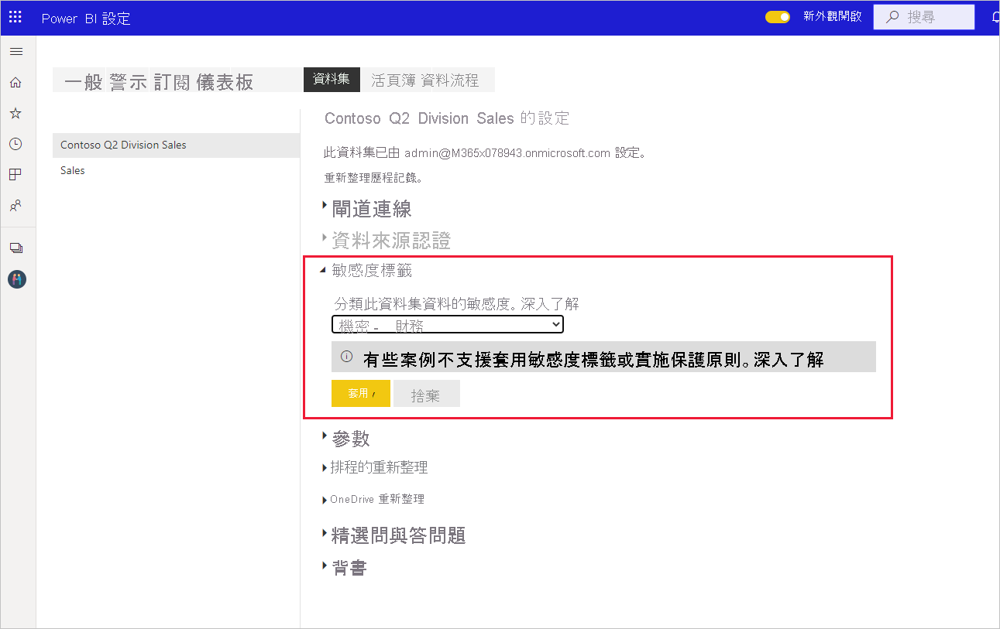

# 如何在 Power BI 中套用敏感度標籤

Microsoft 資訊保護提供報表、儀表板、資料集和資料流程的敏感度標籤，以保護敏感性內容，防止未經授權的資料存取和外洩。 使用敏感度標籤正確標示資料，可確保只有經過授權的人員才能存取資料。 本文說明如何將敏感度標籤套用至您的內容。

若要在 Power BI 中套用敏感度標籤：
* 您必須擁有 Power BI Pro 授權，以及所要標示的內容編輯權限。
* 您必須屬於有權套用敏感度標籤的安全性群組 (如[在 Power BI 中啟用敏感度標籤](./service-security-enable-data-sensitivity-labels.md)一文中所述)。
* 您必須符合所有[授權和其他需求](./service-security-enable-data-sensitivity-labels.md#licensing-and-requirements)。

如需 Power BI 中敏感度標籤的詳細資訊，請參閱 [Power BI 中的敏感度標籤](service-security-sensitivity-label-overview.md)。

## 套用敏感度標籤

當您的租用戶啟用資料保護時，敏感度標籤會出現在儀表板、報表、資料集與資料流程清單檢視的敏感度資料行中。

**套用或變更報表或儀表板中的敏感度標籤**
1. 按一下 [更多選項 (...)]。
1. 選取 [設定]。
1. 在 [設定] 側邊窗格中，選擇適當的敏感度標籤。
1. 儲存設定。

下圖說明對報表執行此作業的步驟

**套用或變更資料集或資料流程中的敏感度標籤**

1. 按一下 [更多選項 (...)]。
1. 選取 [設定]。
1. 在設定側邊窗格中，選擇適當的敏感度標籤。
1. 套用設定。

下面兩張圖說明對資料集執行此作業的步驟。

依序選擇 [其他選項(...)] 和 [設定]。

在 [設定] 頁面上，開啟 [敏感度標籤] 區段，再選擇所需的敏感度標籤，然後按一下 [套用]。

## 移除敏感度標籤
若要從報表、儀表板、資料集或資料流程中移除敏感度標籤，請遵循[套用標籤所使用的相同程序](#applying-sensitivity-labels)，但當系統提示您分類資料的敏感度時，請選擇 [(無)]。 

## 考量與限制

如需 Power BI 中敏感度標籤限制的清單，請參閱 [Power BI 中的敏感度標籤](service-security-sensitivity-label-overview.md#limitations)。

## 後續步驟

本文描述如何在 Power BI 中套用敏感度標籤。 下列文章提供 Power BI 資料保護的詳細資料。 

* [Power BI 中的敏感度標籤概觀](./service-security-sensitivity-label-overview.md)
* [在 Power BI 中啟用敏感度標籤](./service-security-enable-data-sensitivity-labels.md)
* [在 Power BI 中使用 Microsoft Cloud App Security 控制項](./service-security-using-microsoft-cloud-app-security-controls.md)