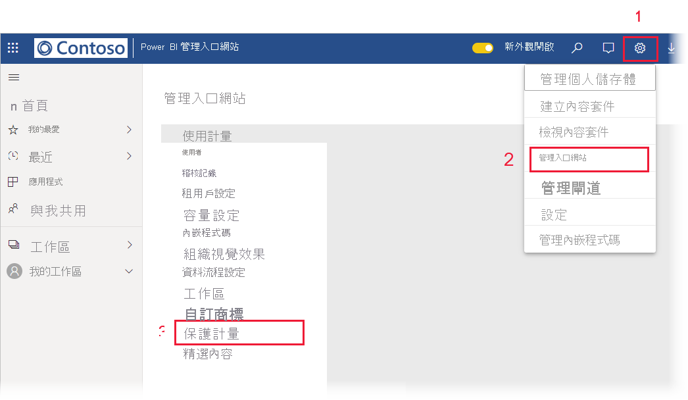

# 資料保護計量報表 (預覽)

## 什麼是資料保護計量報表？
資料保護計量報表，是可讓 [Power BI 系統管理員](../admin/service-admin-role.md)用來監視並追蹤其租用戶中資料敏感度標籤使用量和採用情形的專用報表。

 
報表功能：
* 顯示租用戶中過去 7 天、30 天或 90 天每日敏感度標籤使用量的 100% 堆疊直條圖。 此圖表可讓您輕鬆追蹤不同標籤類型在一段時間內的相對使用量。
* 顯示租用戶中儀表板、報表、資料集和資料流程敏感度標籤使用量目前狀態的環圈圖。
* Cloud App Security 入口網站的連結，提供 Power BI 警示、有風險的使用者、活動記錄和其他資訊。 如需詳細資訊，請參閱[在 Power BI 中使用 Microsoft Cloud App Security 控制項 (預覽)](./service-security-using-microsoft-cloud-app-security-controls.md)。

報表每隔 24 小時重新整理一次。

## 檢視資料保護計量報表

您必須擁有 [Power BI 系統管理員角色](../admin/service-admin-role.md)，才能開啟和檢視報表。
若要檢視報表，請前往 [設定] > [系統管理員入口網站]  ，並選擇 [保護計量 (預覽)]  。

 
 
第一次開啟資料保護計量報表時，可能需要幾秒鐘的時間載入。 系統會在 [我的工作區] 下方的私人環境中，建立名為**資料保護計量 (自動產生)** 的報表和資料集。 我們不建議您在此處檢視，因為這不是具有完整功能的報表。 請改為在系統管理員入口網站中檢視報表，如上所述。

> [!CAUTION]
> 請勿以任何方式變更報表或資料集，因為新版本的報表會隨時推出，您對原始報表所做的任何變更都會在更新至新版本時遭到覆寫。

## 報表更新

改善的資料保護計量報表版本會定期發行。 如果在您開啟報表時有新版本可用，則系統會詢問您是否要開啟新版本。 如果您回答「是」，則會載入新版本的報表並覆寫舊版本。 您對舊報表和/或資料集所做的任何變更都會遺失。 您可以選擇不開啟新版本，但在該情況下，您將無法利用新版本的改善功能。 
## 注意事項與考量
* 為了成功產生資料保護計量報表，您必須在租用戶上啟用[資訊保護](./service-security-enable-data-sensitivity-labels.md)，並[應套用敏感度標籤](../collaborate-share/service-security-apply-data-sensitivity-labels.md)。 
* 為了存取 Cloud App Security 資訊，您組織必須具有適當的 [Cloud App Security 授權](https://docs.microsoft.com/power-bi/admin/service-security-using-microsoft-cloud-app-security-controls#microsoft-cloud-app-security-licensing)。
* 如果您決定與非 Power BI 系統管理員的使用者共用資料保護計量報表資訊，請注意，這份報表包含組織的敏感性資訊。
* 資料保護計量報表是一種特殊的報表，而且不會顯示在 [與我共用]、[最近項目] 與 [我的最愛] 清單中。
* 資料保護計量報表無法供[外部使用者 (Azure Active Directory B2B 來賓使用者)](../admin/service-admin-azure-ad-b2b.md)使用。
## 後續步驟
* [Power BI 的資料保護 (預覽)](./service-security-data-protection-overview.md)
* [在 Power BI 中使用 Microsoft Cloud App Security 控制項 (預覽)](./service-security-using-microsoft-cloud-app-security-controls.md)
* [了解 Power BI 服務管理員角色](../admin/service-admin-role.md)
* [在 Power BI 中啟用資料敏感度標籤](./service-security-enable-data-sensitivity-labels.md)