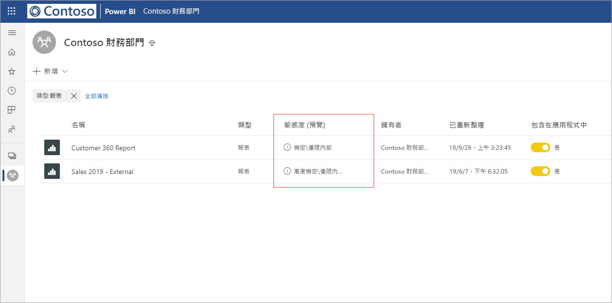
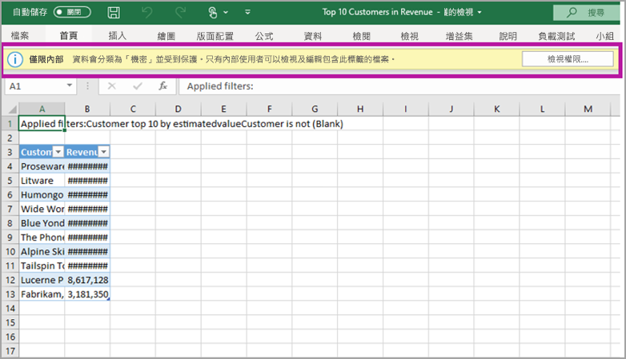

# Power BI 的資料保護 (預覽)

現代化企業對如何處理及保護敏感性資料具有嚴格的商務規範和需求。 Power BI 可與 Microsoft 資訊保護和 Microsoft Cloud App Security 整合，以提供對 Power BI 敏感性資料更強大的控制力和可見度。 

可以使用 Power BI 的資料保護執行下列作業：

* 使用 Microsoft 的敏感度標籤，以利用與分類及保護 Office 365 檔案相同的分類法來分類及標記 Power BI 服務中內容 (儀表板、報表、資料集和資料流程)。 

* 套用內容的敏感度標籤和保護 (Excel、PowerPoint 和 PDF)，以在將 Power BI 服務中的資料匯出至檔案時，強制執行加密或浮水印等保護設定。 

  例如，使用者可將「機密」標籤套用至 Power BI 報表。 然後，當資料匯出至 Excel 檔案時，Power BI 會將「機密」標籤套用至此檔案。 標籤可以加密內容並套用「機密」浮水印。

* 使用 Microsoft Cloud App Security 監視 Power BI 中的活動、調查安全性問題，以及使用 Microsoft Cloud App Security 條件式存取應用程式控制保護 Power BI 中的內容。 

## Power BI 中的敏感度標籤

敏感度標籤是在 [Microsoft 365 安全性中心](https://security.microsoft.com/)或 [Microsoft 365 合規性中心](https://compliance.microsoft.com/)建立及管理。

若要存取任一中心的敏感度標籤，請巡覽至 [分類] > [敏感度標籤]  。 這些敏感度標籤可供多項 Microsoft 服務使用，例如 Azure 資訊保護、Office 應用程式和 Office 365 服務。

> [!IMPORTANT]
> Azure 資訊保護的客戶必須將標籤移轉至前列服務之一，才能在 Power BI 中使用敏感度標籤。 此外，僅公用雲端支援敏感度標籤，主權雲端等雲端租用戶則不支援此功能。
>
> 深入了解[將敏感度標籤移轉至 Microsoft 資訊保護](https://docs.microsoft.com/azure/information-protection/configure-policy-migrate-labels)。

## 敏感度標籤的運作方式

當將敏感度標籤套用至 Power BI 的儀表板、報表、資料集或資料流程時，即類似於將「標記」  套用至該資源，這會帶來下列優點：
* **可自訂** - 您可以在組織中建立不同等級機密內容的類別，例如個人、公用、一般、機密和高度機密。
* **純文字** - 因為標籤是純文字，所以使用者很容易就能根據敏感度標籤的指導方針，了解如何處理內容。
* **持續性** - 將敏感度標籤套用至內容後，會隨著內容一起匯出至下列支援的檔案類型：Excel、PowerPoint 和 PDF。 

  這表示敏感度標籤會跟隨內容，包括其保護設定，成為套用和強制執行原則的基礎。 

## 敏感度標籤範例 

以下是 Power BI 中敏感度標籤如何運作的快速範例。

1. 在 Power BI 服務中，**高度機密 - 僅限內部**的敏感度標籤會套用至報表。

   

2. 當資料從這份報表匯出到 Excel 檔案時，敏感度標籤和保護也隨之套用至匯出的 Excel 檔案。

   

在 Microsoft Office 應用程式中，敏感度標籤在電子郵件或文件上會顯示為標記，與上圖類似。

您也可以指派內容分類 (例如貼紙)，使其得以隨使用及共用的內容保存及漫遊。 您可以使用此分類產生使用量報告，並查看敏感性內容的活動資料。 根據此資訊，您隨時可以選擇稍後套用保護設定。

## 在 Power BI 中使用敏感度標籤

您必須先完成下列必要條件，才能在 Power BI 中啟用敏感度標籤： 

* 請確定已在 [Microsoft 365 安全性中心](https://security.microsoft.com/)或 [Microsoft 365 合規性中心](https://compliance.microsoft.com/)定義敏感度標籤。 
* 在 Power BI 中[啟用敏感度標籤](service-security-enable-data-sensitivity-labels.md) (預覽)。
* 確定使用者擁有合適的授權；
  * 若要在 Power BI 中套用或檢視標籤，使用者必須擁有 Azure 資訊保護進階 P1 或進階 P2 授權。 您可單獨購買 Microsoft Azure 資訊保護，或透過其中一個 Microsoft 授權套件來購買。 如需詳細資訊，請參閱 [Azure 資訊保護價格](https://azure.microsoft.com/pricing/details/information-protection/)。
  * 使用者除上述其中一個 Azure 資訊保護授權外，還必須擁有 Power BI Pro 授權，才能將標籤套用至 Power BI 資源。 

## 使用 Microsoft Cloud App Security 保護內容

您可以使用 Microsoft Cloud App Security 來保護 Power BI 的內容免於遭到非預期外洩或入侵。 設定好 Microsoft Cloud App Security 之後，安全性系統管理員即可監視使用者的存取和活動、執行即時的風險分析，以及設定標籤特定的控制項。

例如，組織可以使用 Microsoft Cloud App Security 設定原則，防止使用者將 Power BI 的敏感性資料從下載到非受控裝置。 此種設定可讓使用者保持生產力、從任何地方連接到 Power BI，同時還能使用 Microsoft Cloud App Security 防止有害的使用者動作，全都能即時執行。 

### 需求

您必須先滿足下列必要條件，敏感度標籤才可以使用 Microsoft Cloud App Security： 

* [必須為租用戶啟用](https://docs.microsoft.com/cloud-app-security/azip-integration) Cloud App Security 和 Azure 資訊保護。
* 應用程式[必須連線到 Microsoft Cloud App Security](https://docs.microsoft.com/cloud-app-security/enable-instant-visibility-protection-and-governance-actions-for-your-apps)。

## 考量與限制

下列清單提供 Power BI 敏感度標籤的一些限制：

* 在 Power BI 中套用及檢視 Microsoft 資訊保護敏感度標籤，需有 Azure 資訊保護進階 P1 或進階 P2 授權。 您可單獨購買 Microsoft Azure 資訊保護，或透過其中一個 Microsoft 授權套件來購買。 如需詳細資訊，請參閱 [Azure 資訊保護定價](https://azure.microsoft.com/pricing/details/information-protection/)。
* 敏感度標籤只能套用到儀表板、報表、資料集與資料流程。
* 只有 Excel、PowerPoint 與 PDF 檔案才支援匯出檔案上所施行的標籤與保護控制。 若將資料匯出至 CSV 檔案、訂閱電子郵件、內嵌視覺效果及列印，將不會施行標籤與保護。
* 從 Power BI 匯出檔案的使用者，有權根據敏感度標籤設定來存取與編輯該檔案。 但匯出資料的使用者不會取得檔案擁有者權限。 
* 敏感度標籤目前不適用於[編頁報表]( https://docs.microsoft.com/power-bi/paginated-reports-report-builder-power-bi)與活頁簿。
* Power BI 資產的敏感度標籤只會顯示在工作區清單與歷程檢視中，目前不會顯示在 [我的最愛]、[與我共用]、[最近項目] 或 [應用程式檢視] 中。 但請注意，即使看不見套用至 Power BI 資產的標籤，其也一律保存在匯出至 Excel、PowerPoint 與 PDF 檔案的資料上。
* [Microsoft 365 安全性中心](https://security.microsoft.com/)或 [Microsoft 365 合規性中心](https://compliance.microsoft.com/)設定的敏感度標籤*檔案加密*設定，只會套用至從 Power BI *匯出*的檔案，而不會在 *Power BI* 中施行。
* Power BI 中套用的標籤不支援 [HYOK 保護](https://docs.microsoft.com/azure/information-protection/configure-adrms-restrictions)。
* 必須滿足[授權需求](https://docs.microsoft.com/microsoft-365/compliance/get-started-with-sensitivity-labels#subscription-and-licensing-requirements-for-sensitivity-labels)，以在 Office 應用程式中檢視與套用標籤。
* 只有全域 (公用) 雲端中的租用戶，才能使用敏感度標籤。 其他雲端中的租用戶無法使用敏感度標籤。
* 範本應用程式不支援資料敏感度標籤。 擷取與安裝應用程式時，會移除範本應用程式建立者設定的敏感度標籤，而當應用程式更新時，由應用程式取用者新增到已經安裝之範本應用程式的成品中的敏感度標籤會遺失 (重設為不加任何標籤)。
* Power BI 不支援**不可轉寄**與**隨選**保護類型的敏感度標籤。

## 後續步驟

本文提供 Power BI 資料保護概觀。 下列文章提供 Power BI 資料保護的詳細資料。 

* [在 Power BI 中啟用資料敏感度標籤](service-security-enable-data-sensitivity-labels.md)
* [在 Power BI 中套用資料敏感度標籤](../designer/service-security-apply-data-sensitivity-labels.md)
* [在 Power BI 中使用 Microsoft Cloud App Security 控制項](service-security-using-microsoft-cloud-app-security-controls.md)
* [資料保護計量報表](service-security-data-protection-metrics-report.md)