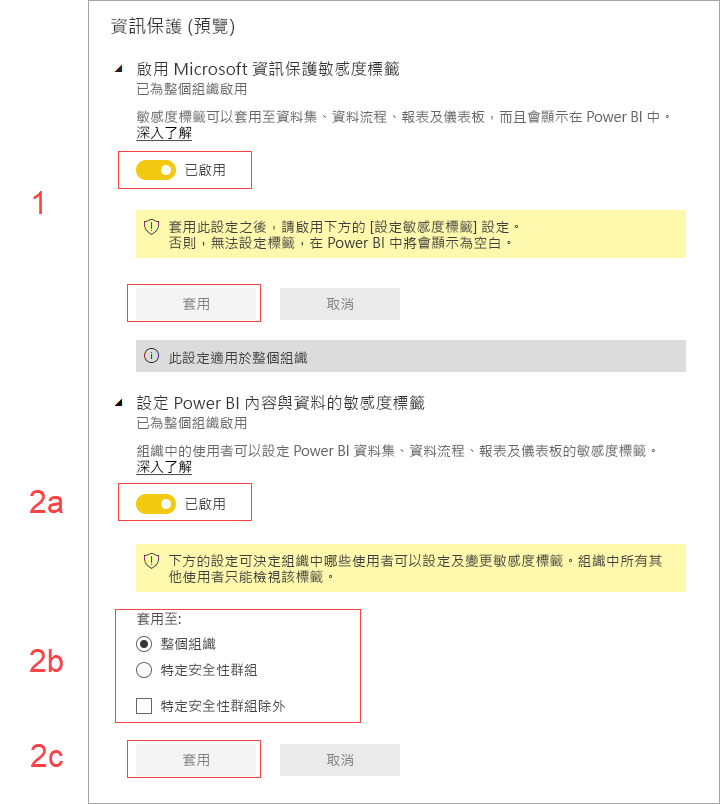

# 在 Power BI 中啟用資料敏感度標籤 (預覽)

下列情況適用於在 Power BI 中啟用 [Microsoft 資訊保護資料敏感度標籤](https://docs.microsoft.com/microsoft-365/compliance/sensitivity-labels) 時：

* 組織中的特定使用者與安全性群組可以分類及[敏感度標籤，並將其套用](../collaborate-share/service-security-apply-data-sensitivity-labels.md)至 Power BI 儀表板、報表、資料集與資料流程 (以下統稱為*資產*)。
* 組織的所有成員都能看到這些標籤。

資料敏感度標籤一方面可讓 Power BI 的作者與取用者了解資料的敏感度，一方面可提供分類代表的意義，以及每種分類資料的處理方式等資訊。

當您將具有資料敏感度標籤的 Power BI 資料匯出至 Excel、PowerPoint 或 PDF 檔案時，會一併匯出其資料敏感度標籤。 亦即，使用者若受限於敏感度原則而無權存取標示該標籤的資料，將無法在 Power BI *外部* (在 Excel、PowerPoint 或 PDF 應用程式中) 開啟這類檔案。

啟用資料敏感度標籤需要 Azure 資訊保護授權。 如需詳細資訊，請參閱[授權](#licensing)。

## 啟用資料敏感度標籤

若要在 Power BI 中啟用 Microsoft 資訊保護資料敏感度標籤，請前往 Power BI 系統管理入口網站，然後開啟 [租用戶設定] 窗格，從中尋找 [資訊保護] 區段。

![尋找 [資訊保護] 區段](media/service-security-enable-data-sensitivity-labels/enable-data-sensitivity-labels-01.png)

在 [資訊保護]  區段中，執行下列步驟：
1.  啟用 [啟用 Microsoft 資訊保護敏感度標籤]  切換按鈕，然後按 [套用]  。 此步驟*只會*對整個組織顯示敏感度標籤，而不會套用任何標籤。 若要定義哪些使用者可以在 Power BI 中套用這些標籤，必須完成步驟 2。
2.  定義可以在 Power BI 資產中套用及變更敏感度標籤的使用者。 此步驟涉及三個動作：
    1.  啟用 [設定 Power BI 內容與資料的敏感度標籤]  切換按鈕。
    2.  選取相關的安全性群組。 根據預設，組織中的每一位使用者都能套用敏感度標籤。 您也可以選擇只允許特定使用者或安全性群組設定敏感度標籤。 選取了整個組織或特定安全性群組之後，就可以排除特定使用者或安全性群組中的某些人員。
    * 若啟用敏感度標籤的對象是整個組織，通常會以安全性群組為例外。
    * 若只為特定使用者或安全性群組啟用敏感度標籤，通常以特定的使用者為例外。  
    此法可以避免屬於有權套用敏感度標籤之群組的特定使用者，無法在 Power BI 中套用敏感度標籤。
    
    3. 按 [套用]  。

> [!IMPORTANT]
> 只有有權*建立*及*編輯*資產的 Power BI Pro 使用者，以及隸屬於您先前在此區段中設定之相關安全性群組的使用者，才能設定及編輯敏感度標籤。 不屬於此群組的使用者無法設定或編輯此標籤。 

## 考量與限制

Power BI 使用 Microsoft 資訊保護敏感度標籤。 因此，當您在嘗試啟用敏感度標籤時若出現錯誤訊息，有可能是下列其中一項原因所致：

* 您不具 Azure 資訊保護[授權](#licensing)。
* 敏感度標籤尚未轉移成 Power BI 支援的 Microsoft 資訊保護版本。 深入了解[轉移敏感度標籤](https://docs.microsoft.com/azure/information-protection/configure-policy-migrate-labels)。
* 您的組織尚未定義 Microsoft 資訊保護敏感度標籤。 此外，若要使用標籤，必須將標籤列入發佈的原則之中。 [深入了解敏感度標籤](https://docs.microsoft.com/Office365/SecurityCompliance/sensitivity-labels)，或流覽 [Microsoft 安全性與合規性中心](https://sip.protection.office.com/sensitivity?flight=EnableMIPLabels)，以了解如何為您的組織定義標籤和發佈原則。

## 授權

* 若要在 Power BI 中檢視或套用 Microsoft 資訊保護標籤，使用者必須具備 Azure 資訊保護 Premium P1 或 Premium P2 授權。 Microsoft Azure 資訊保護可以單獨選購，也可以透過任一種 Microsoft 授權套件購得。 如需詳細資訊，請參閱 [Azure 資訊保護價格](https://azure.microsoft.com/pricing/details/information-protection/)。
* 使用者必須具備 Power BI Pro 授權，才能對 Power BI 資產套用標籤。

## 後續步驟

本文說明如何在 Power BI 中啟用資料敏感度標籤。 下列文章提供如何在 Power BI 中保護資料保護的更多詳細資料。 

* [Power BI 的資料保護概觀](service-security-data-protection-overview.md)
* [在 Power BI 中套用資料敏感度標籤](../collaborate-share/service-security-apply-data-sensitivity-labels.md)
* [在 Power BI 中使用 Microsoft Cloud App Security 控制項](service-security-using-microsoft-cloud-app-security-controls.md)
* [資料保護計量報表](service-security-data-protection-metrics-report.md)