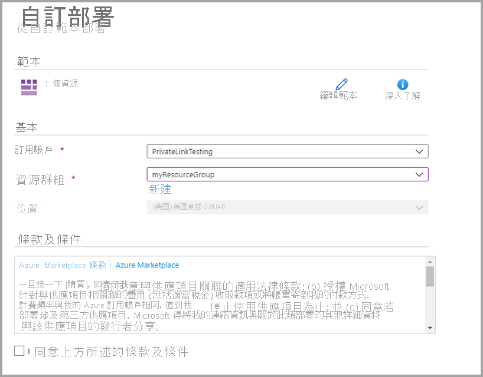
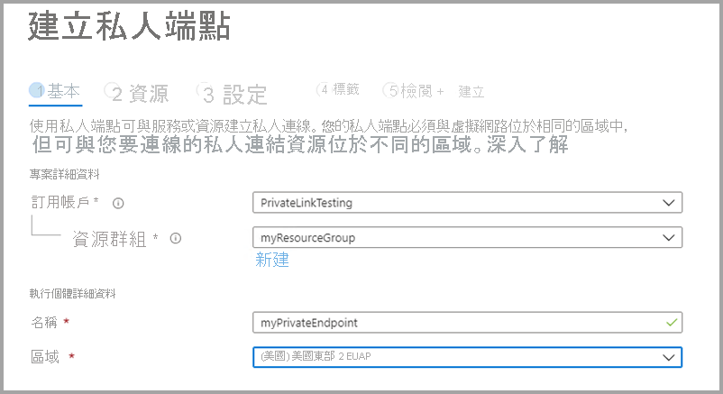
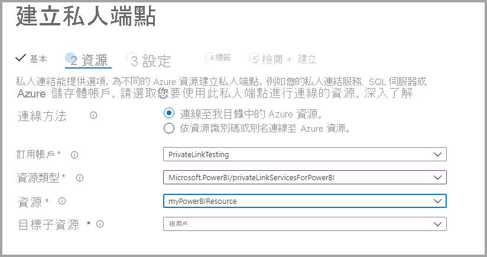
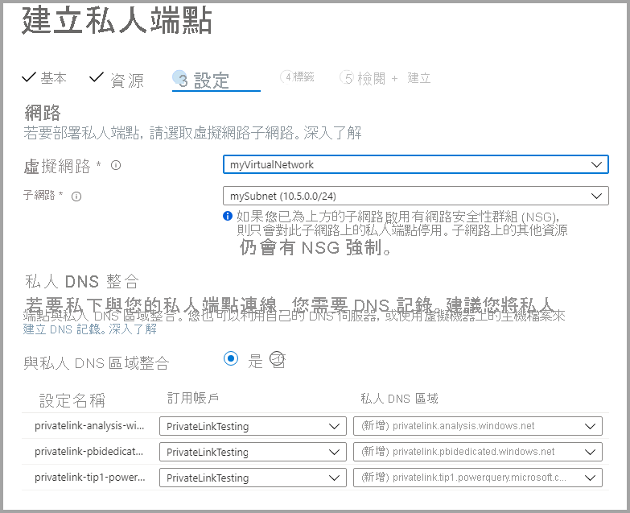

# <a name="private-links-for-accessing-power-bi"></a>使用私人連結存取 Power BI

在 Power BI 中，您可設定並使用端點，讓組織能夠私下存取 Power BI。 若要設定私人連結，您必須是 Power BI 系統管理員，且在 Azure 中具有建立和設定資源 (例如虛擬機器 (VM) 與虛擬網路 (V-Net)) 的權限。 

您可透過下列步驟，安全地從私人連結存取 Power BI：

1. [啟用 Power BI 的私人連結](#enable-private-links-for-power-bi)
2. [在 Azure 入口網站中建立 Power BI 資源](#create-a-power-bi-resource-in-the-azure-portal)
3. [建立虛擬網路](#create-a-virtual-network)
4. [建立虛擬機器 (VM)](#create-a-virtual-machine-vm)
5. [建立私人端點](#create-a-private-endpoint)
6. [使用遠端桌面 (RDP) 連線到 VM](#connect-to-a-vm-using-remote-desktop-rdp)
7. [從虛擬機器私下存取 Power BI](#access-power-bi-privately-from-the-vm)
8. [停用 Power BI 的公用存取](#disable-public-access-for-power-bi)

下列各節提供每個步驟的詳細資訊。

## <a name="enable-private-links-for-power-bi"></a>啟用 Power BI 的私人連結

若要開始設定，請以系統管理員身分登入 app.powerbi.com 中的 Power BI，然後巡覽至管理入口網站。 選取 [租用戶設定] 並捲動至 [進階網路]，然後切換選項按鈕來開啟 [Azure Private Link] ，如下圖所示。 

設定租用戶的私人連結需要大約 15 分鐘時間，包括為租用戶設定個別的 FQDN，以便與 Power BI 服務私下進行通訊。


完成後，即可繼續下一個步驟。

## <a name="create-a-power-bi-resource-in-the-azure-portal"></a>在 Azure 入口網站中建立 Power BI 資源

接下來，登入 [Azure 入口網站](https://portal.azure.com)，並使用 [Azure 範本] 建立 Power BI 資源。 取代 ARM 範本範例中的參數 (如下表所示)，以建立 Power BI 資源。


|**參數**  |**值**  |
|---------|---------|
|```<resource-name>```    | myPowerBIResource         |
|```<tenant-object-id>```     | 52d40f65-ad6d-48c3-906f-1ccf598612d4         |

建立 ARM 範本 

```
{
  "$schema": "http://schema.management.azure.com/schemas/2015-01-01/deploymentTemplate.json#",
  "contentVersion": "1.0.0.0",
  "parameters": {},
  "resources": [
      {
          "type":"Microsoft.PowerBI/privateLinkServicesForPowerBI",
          "apiVersion": "2020-06-01",
          "name" : "<resource-name>",
          "location": "global",
          "properties" : 
          {
               "tenantId": "<tenant-object-id>"
          }
      }
  ]
}
```

在出現的對話方塊中，選取核取方塊以同意條款及條件，然後選取 [購買]。




## <a name="create-a-virtual-network"></a>建立虛擬網路

下一個步驟是建立虛擬網路和子網路。 將下表中範例參數取代為您自己的參數，以建立虛擬網路和子網路。

| 參數 |   值| 
|---------|---------|
| ```<resource-group-name>```   | myResourceGroup |
| ```<virtual-network-name>```  | myVirtualNetwork |
| ```<region-name>```   | 美國中部  |
| ```<IPv4-address-space>```    | 10.1.0.0/16 |
| ```<subnet-name>```   | mySubnet |
| ```<subnet-address-range>```  | 10.1.0.0/24 |

1. 在畫面的左上方，選取 [建立資源] > [網路] > [虛擬網路]  ，或在搜尋方塊中搜尋 [虛擬網路]  。
2. 在 [建立虛擬網路] 的 [基本] 索引標籤中輸入或選取下列資訊：

    |設定 | 值 |
    |-------------------|---------|
    |**專案詳細資料**|
    |訂用帳戶 | 選取您的 Azure 訂用帳戶 |
    |資源群組 |   選取 [建立新物件]，輸入 ```<resource-group-name>```，然後選取 [確定]，或根據參數選取現有的 ```<resource-group-name>```。 |
    |**執行個體詳細資料** |
    | 名稱  | 輸入 ```<virtual-network-name>``` |
    |區域 | 選取 ```<region-name>``` |
    
    下圖顯示 [基本]  索引標籤。
    
    ![建立虛擬網路，[基本] 索引標籤](media/service-security-private-links/service-private-links-03.png)


3. 接下來，選取 [IP 位址] 索引標籤，或選取表單底部的 [下一步: IP 位置] 按鈕。 在 [IP 位址] 索引標籤中，輸入下列資訊：

    |設定 | 值 |
    |-------------------|---------|
    |IPv4 位址空間 |輸入 ```<IPv4-address-space>``` |
    
    ![建立虛擬網路，[IP 位址] 索引標籤](media/service-security-private-links/service-private-links-04.png)
    

4. 在 [子網路名稱] 中，選取 [預設]，然後在 [編輯子網路] 中，輸入下列資訊：

    |設定 | 值 |
    |-------------------|---------|
    | 子網路名稱 |輸入 ```<subnet-name>``` |
    | 子網路位址範圍 | 輸入 ```<subnet-address-range>``` |
    
    
    ![建立虛擬網路，[編輯子網路] 索引標籤](media/service-security-private-links/service-private-links-05.png)

5. 選取 [儲存]，然後選取 [檢閱 + 建立] 索引標籤，或選取 [檢閱 + 建立] 按鈕。 

6. 然後，選取 [Create] \(建立\)。

完成這些步驟之後，即可建立虛擬機器 (VM)，如下一節中所述。

## <a name="create-a-virtual-machine-vm"></a>建立虛擬機器 (VM)


下一個步驟是建立虛擬網路，以及用來裝載該虛擬機器 (VM) 的子網路。

1. 在 Azure 入口網站畫面左上角，選取 [建立資源] > [計算] > [虛擬機器]。

2. 在 [建立虛擬機器 - 基本] 中，輸入或選取下列資訊：

    |設定 | 值 |
    |-------------------|---------|
    |**專案詳細資料**||
    |訂用帳戶 | 選取您的 Azure 訂用帳戶 |
    |資源群組 |   選取在前一節中建立的 **myResourceGroup**。 |
    |**執行個體詳細資料** ||
    |名稱 | 輸入 **myVm** |
    |區域 | 選取 [美國中部] |
    |可用性選項| 保留預設值 [不需要基礎結構備援] |
    |映像 | 選取 [Windows 10 專業版] |
    |大小 | 保留預設值 [標準 DS1 v2] |
    |系統管理員帳戶 ||
    |使用者名稱 |輸入所選的使用者名稱 |
    |密碼 | 輸入您選擇的密碼。 密碼長度至少必須有 12 個字元，且符合[定義的複雜度需求](https://docs.microsoft.com/azure/virtual-machines/windows/faq?toc=/azure/virtual-network/toc.json#what-are-the-password-requirements-when-creating-a-vm) |
    |確認密碼 | 再次輸入密碼 |
    |輸入連接埠規則 ||
    |公用輸入連接埠 | 保留預設值 [無] |
    |節省費用 ||
    |已經有 Windows 授權？ |  保留預設值 [否] |

3. 然後，選取 **[下一步：磁碟]**
4. 在 [建立虛擬機器 - 磁碟]，保留預設值並選取 [下一步：網路功能]。
5. 在 [建立虛擬機器 - 網路] 中，選取下列資訊：

    |設定 | 值 |
    |-------------------|---------|
    |虛擬網路|   保留預設值 [MyVirtualNetwork]|
    |位址空間| 保留預設值 [10.1.0.0/24]|
    |子網路 |保留預設值 [mySubnet (10.1.0.0/24)]|
    |公用 IP| 保留預設值 [(new) myVm-ip]|
    |公用輸入連接埠|  選取 [允許選取的項目]****。|
    |選取輸入連接埠|  選取 [RDP]|

6. 選取 [檢閱 + 建立]。 您會移至 [檢閱 + 建立] 頁面，其中 Azure 會驗證您的設定。
7. 當您看到 [驗證成功] 訊息時，請選取 [建立]。


## <a name="create-a-private-endpoint"></a>建立私人端點

本節中所述的步驟為建立 Power BI 的私人端點。

1. 在 Azure 入口網站的畫面左上角，選取 [建立資源] > [網路] > [Private Link 中心 (預覽)]。
2. 在 [Private Link 中心 - 概觀] 中，選取 [建置與服務的私人連線] 選項上的 [建立私人端點]。
3. 在 [建立私人端點 (預覽) - 基本] 中，輸入或選取下列資訊：

    |設定 | 值 |
    |-------------------|---------|
    |**專案詳細資料** ||
    |訂用帳戶|  選取您的 Azure 訂用帳戶|
    |資源群組|    選取 **myResourceGroup**。 您已在上一區段中建立此項|
    |**執行個體詳細資料** ||
    |名稱|  輸入 myPrivateEndpoint。 如果此名稱已被使用，請建立唯一名稱|
    |區域|    選取 [美國中部]|
    
    下圖顯示 [建立私人端點 - 基本] 視窗。
    
    

4. 完成該資訊後，請選取 [下一步: 資源] 並在 [建立私人端點 - 資源] 頁面中，輸入或選取下列資訊：

    |設定 | 值 |
    |-------------------|---------|
    |連線方法| 選取 [連線到我目錄中的 Azure 資源]|
    |訂用帳戶|  選取您的訂用帳戶|
    |資源類型| 選取 [Microsoft.PowerBI/privateLinkServicesForPowerBI] |
    |資源|  myPowerBIResource|
    |目標子資源|   租用戶|
    
    下圖顯示 [建立私人端點 - 資源] 視窗。
    
    

5. 適當地輸入該資訊後，請選取 [下一步: 設定] 並在 [建立私人端點 (預覽) - 設定] 頁面中，輸入或選取下列資訊：

    |設定 | 值 |
    |-------------------|---------|
    |**網路** ||
    |虛擬網路|   選取 *myVirtualNetwork* |
    |子網路 |選取 [mySubnet] |
    |**私人 DNS 整合** ||
    |與私人 DNS 區域整合|   選取 [是] |
    |私人 DNS 區域   |選取 <br><br>
    *(New)privatelink.analysis.windows.net* <br>
    *(New)privatelink.pbidedicated.windows.net* <br>
    *(New)privatelink.tip1.powerquery.microsoft.com* |
    
    下圖顯示 [建立私人端點 - 設定] 視窗。
    
    
    
    接下來，選取 [檢閱 + 建立]，隨即會顯示 [檢閱 + 建立] 頁面以供 Azure 驗證設定。 當您看到 [驗證成功] 訊息時，請選取 [建立]。

## <a name="connect-to-a-vm-using-remote-desktop-rdp"></a>使用遠端桌面 (RDP) 連線到 VM

當完成建立虛擬機器 (**myVM**) 時，請透過下列步驟從網際網路與其連線：

1. 在入口網站的搜尋列中，輸入 myVm。
2. 選取 [連線]  按鈕。 選取 [連線] 按鈕之後，隨即會開啟 [連線至虛擬機器]。
3. 選取 [下載 RDP 檔案]。 Azure 會建立一個「遠端桌面通訊協定」( .rdp) 檔案，並下載至您的電腦。
4. 開啟下載的 .rdp 檔案。
5. 如果出現提示，請選取 [連接]。
6. 輸入在先前步驟中建立 VM 時所指定的使用者名稱與密碼。
7. 選取 [確定]。
8. 您可能會在登入過程中收到憑證警告。 如果您收到憑證警告，請選取 [是] 或 [繼續]。

## <a name="access-power-bi-privately-from-the-vm"></a>從 VM 私下存取 Power BI

接下來，透過下列步驟，使用在先前步驟中建立的虛擬機器以私下存取 Power BI： 

1. 在 myVm 的遠端桌面中，開啟 PowerShell。
2. 輸入 nslookup 52d40f65ad6d48c3906f1ccf598612d4-api.privatelink.analysis.windows.net。
3. 您將收到如下訊息：

    ```
    Server:  UnKnown
    Address:  168.63.129.16
    
    Non-authoritative answer:
    Name:    52d40f65ad6d48c3906f1ccf598612d4-api.privatelink.analysis.windows.net
    Address:  10.1.0.4
    ```

4. 開啟瀏覽器並前往 app.powerbi.com，即可私下存取 Power BI。

## <a name="disable-public-access-for-power-bi"></a>停用 Power BI 的公用存取

最後，您必須停用 Power BI 的公用存取。 

以系統管理員身分登入 app.powerbi.com，然後巡覽至 **管理入口網站**。 選取 [租用戶設定]，並捲動至 [進階網路] 區段。 啟用 [封鎖公用網際網路存取] 區段中的切換按鈕，如下圖所示。 系統需要大約 15 分鐘時間，才能停用組織從公用網際網路來存取 Power BI。

大功告成，在完成這些步驟之後，您組織的 Power BI 便只能從私人連結存取，而無法從公用網際網路存取。 

## <a name="considerations-and-limitations"></a>考量與限制

使用 Power BI 的私人連結時，有幾件需要牢記的注意事項：

* 使用私人連結環境時，將無法使用任何外部映像或主題，且可能會影響自訂視覺效果
* 使用私人連結環境時，將無法使用匯出服務 (例如 [匯出至 PDF]、[從報表匯出至 Excel] 以及其他匯出服務)
* SQL Server Reporting Services 報表，即 RDL 檔案(*.rdl 格式檔案) 無法在私人連結環境中進行轉譯


## <a name="next-steps"></a>後續步驟

- [管理貴組織中的 Power BI](service-admin-administering-power-bi-in-your-organization.md)  
- [了解 Power BI 系統管理員角色](service-admin-role.md)  
- [稽核貴組織的 Power BI](service-admin-auditing.md)  

有其他問題嗎？ [嘗試在 Power BI 社群提問](https://community.powerbi.com/)
