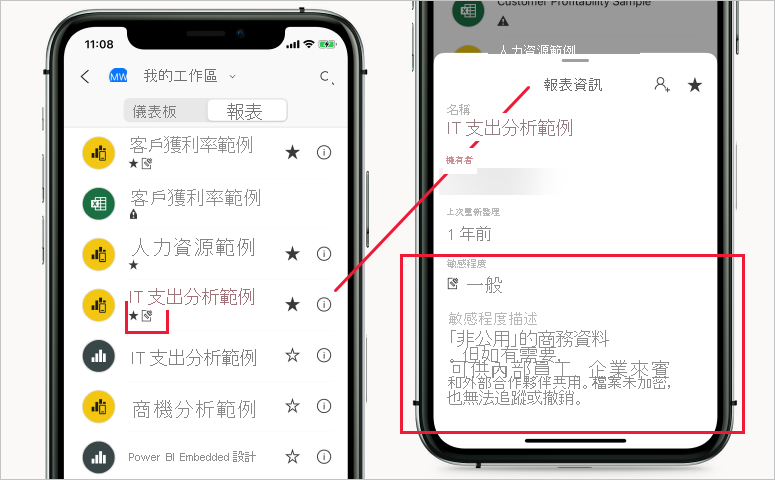

# Power BI 中的敏感度標籤

本文描述 Power BI 中 [Microsoft 資訊保護敏感度標籤](https://docs.microsoft.com/microsoft-365/compliance/sensitivity-labels?view=o365-worldwide)的功能。 如需如何將敏感度標籤套用到 Power BI 報表、儀表板、資料集和資料流程的資訊，請參閱[如何在 Power BI 中套用敏感度標籤](./service-security-apply-data-sensitivity-labels.md)。 如需在租用戶上啟用敏感度標籤的資訊，請參閱[在 Power BI 中啟用資料敏感度標籤](service-security-enable-data-sensitivity-labels.md)。

Microsoft 資訊保護敏感度標籤可為使用者提供一種簡單的方式，讓使用者分類 Power BI 中的重要內容，而不會影響生產力或共同作業的能力。

敏感度標籤可套用在資料集、報表、儀表板和資料流程上。 當資料從 Power BI 匯出到 Excel、PowerPoint 或 PDF 檔案時，Power BI 會自動在匯出的檔案上套用敏感度標籤，並根據標籤的檔案加密設定保護檔案。 透過這種方式，敏感性資料便會維持在受保護的狀態，無論其所在的位置為何。

在 Power BI 報表、儀表板、資料集和資料流程上套用的敏感度標籤可在 Power BI 服務中的許多位置看見。 報表和儀表板上的敏感度標籤也可在 Power BI iOS 和 Android 行動裝置應用程式，以及在內嵌的視覺效果中顯示。

您可在 Power BI 管理入口網站中取得的[保護計量報表](service-security-data-protection-metrics-report.md)可讓 Power BI 系統管理員完整地查看 Power BI 租用戶中的敏感性資料。 此外，Power BI 稽核記錄也包含套用、移除和變更標籤等活動的敏感度標籤資訊，以及像是檢視、報表、儀表板等的活動，可讓 Power BI 和安全性系統管理員查看敏感性資料取用，以進行監視、調查和安全性警示。

## 重要考量

敏感度標籤**不會**影響對 Power BI 內容的存取，存取 Power BI 中的內容僅透過 Power BI 權限進行管理。 顯示標籤時，不會套用任何相關聯的加密設定 (在 [Microsoft 365 安全性中心](https://security.microsoft.com/)或 [Microsoft 365 合規性中心](https://compliance.microsoft.com/)內設定)。 這些設定僅適用於匯出至 Excel、PowerPoint 和 PDF 檔案的資料。

在匯出至 Excel、PowerPoint 和 PDF 以外的任何匯出路徑中，**不會**套用敏感度標籤和檔案加密。 Power BI 租用戶系統管理員可停用任何或所有不支援套用和其相關聯檔案加密設定的匯出路徑。

>[!NOTE]
> 除非[資料列層級安全性 (RLS)](./service-admin-rls.md) 限制其存取，否則獲得授與存取報表的使用者也能夠存取整個基礎資料集。 報表作者可使用敏感度標籤分類和為報表加上標籤。 若敏感度標籤具有保護設定，當將報表資料匯出到 Excel、PowerPoint 或 PDF 檔案時，Power BI 即會套用這些保護設定。 只有授權的使用者可開啟受保護檔案。

## 敏感度標籤在 Power BI 中的運作方式

將敏感度標籤套用至 Power BI 的儀表板、報表、資料集或資料流程時，即類似於將標記套用至該資源，這具有下列優點：
* **可自訂** - 您可以在組織中建立不同等級機密內容的類別，例如個人、公用、一般、機密和高度機密。
* **純文字** - 因為標籤是純文字，所以使用者很容易就能根據敏感度標籤的指導方針，了解如何處理內容。
* **持續性** - 將敏感度標籤套用至內容之後，敏感度標籤會在內容匯出至 Excel、PowerPoint 和 PDF 檔案時伴隨該內容，並成為套用和施行原則的基礎。

以下是 Power BI 中敏感度標籤如何運作的快速範例。 下圖顯示敏感度標籤在 Power BI 服務中報表上套用的方式，以及報表的資料如何匯出到 Excel 檔案，以及最後敏感度標籤及其保護保存在匯出檔案中的方式。

在 Microsoft Office 應用程式中，敏感度標籤在電子郵件或文件上會顯示為標籤，與上圖中顯示的內容類似。

您也可以指派內容分類 (例如貼紙)，使其得以隨使用及共用的內容在整個 Power BI 中保存及漫遊。 您可使用此分類產生使用量報告，並查看敏感性內容的活動資料。 根據此資訊，您隨時可以選擇稍後套用保護設定。

## 敏感度標籤繼承會在建立新內容時發生

在 Power BI 服務中建立新的報表和儀表板時，這些報表和儀表板會自動繼承先前在父系資料集或報表上套用的敏感度標籤。 例如，以具有「高度機密」敏感度標籤資料集為基礎建立的新報表，也會自動接收到「高度機密」標籤。

下圖顯示資料集其敏感度標籤自動套用到以資料集為基礎所建置新報表的方式。

>[!NOTE]
>如果基於任何原因導致無法在新報表或儀表板上套用敏感度標籤，Power BI **將不會**封鎖建立新項目。

## 已匯出資料上的敏感度標籤和保護

當資料從 Power BI 匯出到 Excel、PowerPoint 或 PDF 檔案時，Power BI 會自動在匯出的檔案上套用敏感度標籤，並根據標籤的檔案加密設定保護檔案。 透過這種方式，敏感性資料便會維持在受保護的狀態，無論其所在的位置為何。

從 Power BI 匯出檔案的使用者有權根據敏感度標籤設定來存取與編輯該檔案；這些使用者不會取得檔案的擁有者權限。

將資料匯出至 .csv 或 .pbix 檔案、[使用 Excel 分析] 或任何其他匯出路徑時，不會套用敏感度標籤和保護。

將敏感度標籤和保護套用至匯出的檔案，並不會將內容標記新增至該檔案。 不過，如果標籤已設定成要套用內容標記，那麼當檔案在 Office 傳統型應用程式中開啟時，Azure 資訊保護的統一標籤用戶端就會自動套用標記。 當您針對傳統型、行動裝置或 Web 應用程式使用內建標籤時，不會自動套用內容標示。 如需詳細資料，請參閱 [Office 應用程式何時套用內容標示和加密](https://docs.microsoft.com/microsoft-365/compliance/sensitivity-labels-office-apps?view=o365-worldwide#when-office-apps-apply-content-marking-and-encryption)。

如果將資料匯出至檔案時無法套用標籤，則匯出會失敗。 若要檢查匯出是否因無法套用標籤而失敗，請按一下標題列中央的報表或儀表板名稱，並在開啟的資訊下拉式清單中查看其是否顯示「無法載入敏感度標籤」。 如果套用的標籤已由安全性系統管理員解除發佈或刪除，或發生暫時性的系統問題，就可能發生這種情況。

## 在內嵌報表和儀表板中保存敏感度標籤

您可將 Power BI 報表、儀表板和視覺效果內嵌在商務應用程式中 (例如 Microsoft Teams 和 SharePoint)，或組織的網站內。 當內嵌套用了敏感度標籤的視覺效果、報表或儀表板時，您將可在內嵌檢視中看到敏感度標籤，且標籤及其保護將會在資料匯出到 Excel 時保存。

下列是支援的內嵌案例：
* [為組織內嵌](../developer/embedded/embed-sample-for-your-organization.md)
* Microsoft 365 應用程式 (例如 [Teams](../collaborate-share/service-embed-report-microsoft-teams.md) 和 [SharePoint](../collaborate-share/service-embed-report-spo.md))
* [安全 URL 內嵌](../collaborate-share/service-embed-secure.md) (內嵌自 Power BI 服務) 

## Power BI 行動裝置應用程式中的敏感度標籤

您可在 Power BI 行動裝置應用程式中的報表和儀表板上檢視敏感度標籤。 靠近報表或儀表板名稱的圖示會指出其具備敏感度標籤，且可在報表或儀表板的資訊方塊中找到標籤類型和其描述。

## 支援的雲端
僅全域 (公用) 雲端中的租用戶支援敏感度標籤；國家雲端等雲端中的租用戶不支援這類標籤。

## 在 Power BI 中使用敏感度標籤的需求

您必須先完成下列必要條件，才能在 Power BI 中啟用敏感度標籤：
* 請確定已在 [Microsoft 365 安全性中心](https://security.microsoft.com/)或 [Microsoft 365 合規性中心](https://compliance.microsoft.com/)定義敏感度標籤。
* 在 Power BI 中[啟用敏感度標籤](service-security-enable-data-sensitivity-labels.md)。
* 確定使用者擁有[適當的授權](#licensing)。

## 授權

* 若要在 Power BI 中檢視或套用 Microsoft 資訊保護敏感度標籤，必須具備 Azure 資訊保護進階 P1 或進階 P2 授權。 您可單獨購買 Microsoft Azure 資訊保護，或透過其中一個 Microsoft 授權套件來購買。 如需詳細資訊，請參閱 [Azure 資訊保護定價](https://azure.microsoft.com/pricing/details/information-protection/)。
* 必須滿足[授權需求](https://docs.microsoft.com/microsoft-365/compliance/get-started-with-sensitivity-labels#subscription-and-licensing-requirements-for-sensitivity-labels)，以在 Office 應用程式中檢視與套用標籤。
* 使用者除上述其中一個 Azure 資訊保護授權外，還必須擁有 Power BI Pro 授權，才能將標籤套用至 Power BI 內容。

## 建立和管理敏感度標籤

敏感度標籤是在 [Microsoft 365 安全性中心](https://security.microsoft.com/)或 [Microsoft 365 合規性中心](https://compliance.microsoft.com/)建立及管理。

若要存取任一中心的敏感度標籤，請巡覽至 [分類] > [敏感度標籤]。 這些敏感度標籤可供多項 Microsoft 服務使用，例如 Azure 資訊保護、Office 應用程式和 Office 365 服務。

>[!Important]
> 如果您的組織使用 Azure 資訊保護的敏感度標籤，您必須將其[移轉](https://docs.microsoft.com/azure/information-protection/configure-policy-migrate-labels)至前列服務之一，才能在 Power BI 中使用這些標籤。

## 限制

下列清單提供 Power BI 敏感度標籤的一些限制：

* 敏感度標籤只能套用到儀表板、報表、資料集與資料流程。 目前不適用於[編頁報表](../paginated-reports/report-builder-power-bi.md)與活頁簿。
* Power BI 資產的敏感度標籤會顯示在工作區清單、譜系、我的最愛、最近項目或應用程式檢視中；目前不會顯示在 [與我共用] 檢視中。 但請注意，即使看不見套用至 Power BI 資產的標籤，其也一律保存在匯出至 Excel、PowerPoint 與 PDF 檔案的資料上。
* 範本應用程式不支援資料敏感度標籤。 擷取與安裝應用程式時，會移除範本應用程式建立者設定的敏感度標籤，而當應用程式更新時，由應用程式取用者新增到已經安裝之範本應用程式的成品中的敏感度標籤會遺失 (重設為不加任何標籤)。
* Power BI 不支援[不可轉寄](https://docs.microsoft.com/microsoft-365/compliance/encryption-sensitivity-labels?view=o365-worldwide#let-users-assign-permissions)、[使用者定義](https://docs.microsoft.com/microsoft-365/compliance/encryption-sensitivity-labels?view=o365-worldwide#let-users-assign-permissions)及 [HYOK](https://docs.microsoft.com/azure/information-protection/configure-adrms-restrictions) 保護類型的敏感度標籤。 「不可轉寄」和「使用者定義」保護類型指的是 [Microsoft 365 安全性中心](https://security.microsoft.com/)或 [Microsoft 365 合規性中心](https://compliance.microsoft.com/)內定義的標籤。
* 不建議讓使用者在 Power BI 內套用父標籤。 如果將父標籤套用到內容，將資料從該內容匯出至檔案 (Excel、PowerPoint 和 PDF) 的作業就會失敗。 請參閱[子標籤 (分組標籤)](https://docs.microsoft.com/microsoft-365/compliance/sensitivity-labels?view=o365-worldwide#sublabels-grouping-labels)。

## 後續步驟

本文提供 Power BI 資料保護概觀。 下列文章提供 Power BI 資料保護的詳細資料。 

* [在 Power BI 中啟用敏感度標籤](service-security-enable-data-sensitivity-labels.md)
* [如何在 Power BI 中套用敏感度標籤](service-security-apply-data-sensitivity-labels.md)
* [在 Power BI 中使用 Microsoft Cloud App Security 控制項](service-security-using-microsoft-cloud-app-security-controls.md)
* [保護計量報表](service-security-data-protection-metrics-report.md)