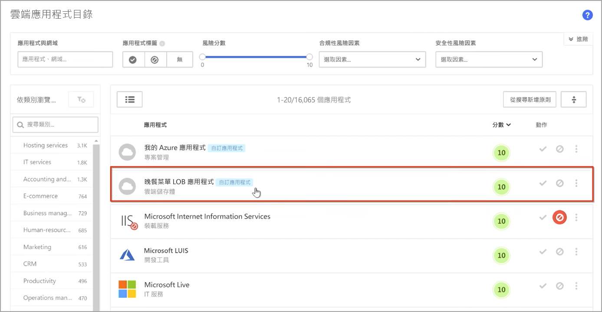
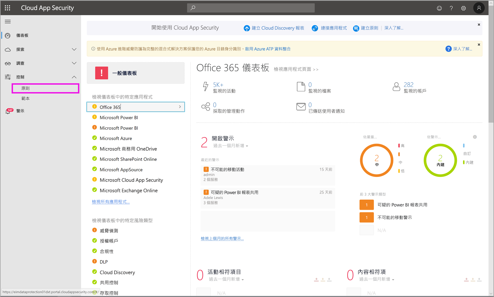
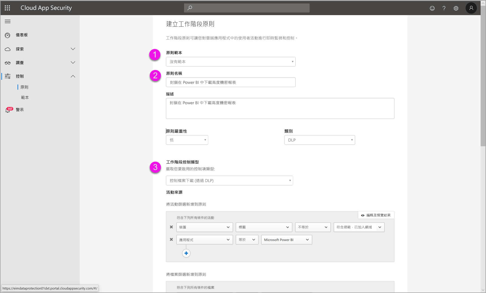

# 在 Power BI 中使用 Microsoft Cloud App Security 控制項 (預覽)

使用 Microsoft Cloud App Security 搭配 Power BI，有利於保護 Power BI 報表、資料和服務免於遭到非預期的外洩或入侵。 利用 Cloud App Security，您可以使用 Azure Active Directory (Azure AD) 的即時工作階段控制項，針對組織的資料建立條件式存取原則，以協助確保 Power BI 分析的安全。 設定好這些原則後，系統管理員就可以監視使用者的存取和活動、執行即時風險分析，以及設定標籤特定控制項。 

您可以針對所有種類的應用程式和服務設定 Microsoft Cloud App Security，不僅只針對 Power BI。 Cloud App Security 是一項保護應用程式和裝置的 Microsoft 服務，且透過其專屬的儀表板管理。 您需要設定 Cloud App Security 搭配 Power BI 工作，以得益於 Cloud App Security 對 Power BI 資料和分析的防護。 如需 Cloud App Security 的詳細資訊 (包括運作方式概觀、儀表板和應用程式風險分數)，請參閱 [Microsoft Cloud App Security](https://docs.microsoft.com/cloud-app-security/) 文件。

## 使用 Microsoft Cloud App Security 搭配 Power BI

若要使用 Microsoft Cloud App Security 搭配 Power BI，您必須使用及設定相關的 Microsoft 安全性服務，部分在 Power BI 外設定。

### Microsoft Cloud App Security 授權

您必須擁有下列其中一項授權，租用戶才能擁有 Microsoft Cloud App Security：
* MCAS：針對所有支援的應用程式提供 OCAS 功能，為 EMS E5 和 M365 E5 套件的一部分。
* CAS-D：僅提供 MCAS 探索。
* OCAS：僅提供適用於 Office 365 的 MCAS 功能，為 Office E5 套件的一部分。
* 選擇性：AAD P1 和 AIP P1，以得益於主要 Microsoft Cloud App Security 功能。

以下各節描述在 Power BI 中使用 Microsoft Cloud App Security 的步驟。

### 在 Azure Active Directory 中設定工作階段原則 (必要)
設定工作階段控制項的必要步驟會在 Azure AD 和 Microsoft Cloud App Security 入口網站中完成。 在 Azure AD 入口網站中，您要建立適用於 Power BI 的條件式存取原則，並透過 Microsoft Cloud App Security 服務路由在 Power BI 中使用的工作階段。 

Microsoft Cloud App Security 使用反向 Proxy 架構運作，且與 Azure AD 條件式存取相整合，以即時監視 Power BI 的使用者活動。 此處提供的下列步驟有助於您了解此程序，且會在下列每個步驟的連結內容中提供詳細逐步指示。 您也可以閱讀描述整個程序的 [Cloud App Security 文章](https://docs.microsoft.com/cloud-app-security/proxy-deployment-aad)。

1.  [建立 Azure AD 條件式存取測試原則](https://docs.microsoft.com/cloud-app-security/proxy-deployment-aad#add-azure-ad)
2.  [使用範圍限定於原則的使用者登入每個應用程式](https://docs.microsoft.com/cloud-app-security/proxy-deployment-aad#sign-in-scoped)
3.  [驗證應用程式是否設定為使用存取和工作階段控制項](https://docs.microsoft.com/cloud-app-security/proxy-deployment-aad#portal)
4.  [測試部署](https://docs.microsoft.com/cloud-app-security/proxy-deployment-aad#step-4-test-the-deployment)

[工作階段原則](https://docs.microsoft.com/cloud-app-security/session-policy-aad)一文會詳細描述設定工作階段原則的程序。 

### 設定異常偵測原則以監視 PBI 活動 (建議)
您可以定義可獨立設定範圍的異常 Power BI 偵測原則，使其僅適用於想要在原則中包含和排除的使用者和群組。 [深入了解](https://docs.microsoft.com/cloud-app-security/anomaly-detection-policy#scope-anomaly-detection-policies)。

Cloud App Security 也有專門針對 Power BI 的兩項內建偵測。 [本文件稍後一節會詳細說明](#built-in-microsoft-cloud-app-security-detections-for-power-bi)。

### 使用 Microsoft 資訊保護敏感度標籤 (建議)

敏感度標籤可讓您分類並協助保護敏感性內容，讓組織中的人員可以與組織外部的夥伴共同作業，但仍請謹慎小心敏感性內容和資料。 

您可以閱讀有關 [Power BI 敏感度標籤](../designer/service-security-apply-data-sensitivity-labels.md)一文，其中詳述使用 Power BI 敏感度標籤的程序。 請參閱下文以取得[以敏感度標籤為基礎的 Power BI 原則範例](#example)。

## Power BI 的內建 Microsoft Cloud App Security 偵測

Microsoft Cloud App Security 偵測可讓系統管理員監視受監視應用程式的特定活動。 在 Power BI 中，目前有兩項專用的內建 Cloud App Security 偵測： 

* **可疑的共用** – 當使用者與不熟悉 (組織外部) 的電子郵件共用敏感性報表時偵測。 敏感性報表是指敏感度標籤設為**僅限內部**或更高等級的報表。 

* **大量共用報表** – 當使用者在單一工作階段中共用許多不同的報表時偵測。

這些偵測的設定是在 Cloud App Security 入口網站中設定。 [深入了解](https://docs.microsoft.com/cloud-app-security/anomaly-detection-policy#unusual-activities-by-user)。 

## Microsoft Cloud App Security 中的 Power BI 管理員角色

使用 Microsoft Cloud App Security 搭配 Power BI 時，會針對 Power BI 系統管理員建立新角色。 當以 Power BI 系統管理員的身分登入 [Cloud App Security 入口網站](https://portal.cloudappsecurity.com/)時，您對 Power BI 相關資料、警示、有風險的使用者、活動記錄和其他資訊的存取權會有所限制。

## 考量與限制 
使用 Cloud App Security 搭配 Power BI 的設計，旨在利用監視使用者工作階段及其活動的偵測，協助保護組織的內容和資料。 使用 Cloud App Security 搭配 Power BI 時，請務必牢記幾項考量和限制：

* Microsoft Cloud App Security 只能在 Excel、PowerPoint 和 PDF 檔案中操作。
* 如果想要在 Power BI 的工作階段原則中使用敏感度標籤功能，您需要擁有 Azure 資訊保護進階 P1 或進階 P2 的授權。 您可單獨購買 Microsoft Azure 資訊保護，或透過其中一個 Microsoft 授權套件來購買。 如需詳細資訊，請參閱 [Azure 資訊保護定價](https://azure.microsoft.com/pricing/details/information-protection/)。 此外，Power BI 資產必須已套用敏感度標籤。
* 工作階段控制適用於任何作業系統上任何主要平台的所有瀏覽器。 我們建議使用 Internet Explorer 11、Microsoft Edge (最新版本)、Google Chrome (最新版本)、Mozilla Firefox (最新版本) 或 Apple Safari (最新版本)。 Microsoft Cloud App Security 工作階段控制中不支援 Power BI 公用 API 呼叫和其他非瀏覽器型工作階段。 [查看更多詳細資料](https://docs.microsoft.com/cloud-app-security/proxy-intro-aad#supported-apps-and-clients)。

> [!CAUTION]
> * 套用 Excel 檔案原則時，Power BI 目前暫不提供 Microsoft Cloud App Security 的 [內容檢查]  原則，因此請勿在 Power BI 設定此原則。
> * 在工作階段原則的「動作」部分，只有當項目沒有任何標籤時，「保護」功能才會運作。 如已有標籤，則不套用「保護」動作；您無法覆寫已套用至 Power BI 項目的現有標籤。

## 範例

下列範例示範如何使用 Microsoft Cloud App Security 搭配 Power BI 建立新的工作階段原則。

首先，建立新的工作階段原則。 從 **Cloud App Security** 入口網站左側的功能表中，選取 [原則]  。

在出現的視窗中，選取 [建立原則]  下拉式功能表。

![選取 [建立原則]](media/service-security-using-microsoft-cloud-app-security-controls/cloud-app-security-controls-03.png)

從選項下拉式清單中，選取 [工作階段原則]  。

![選取 [工作階段原則]](media/service-security-using-microsoft-cloud-app-security-controls/cloud-app-security-controls-04.png)

在出現的視窗中，建立工作階段原則。 已編號步驟會描述下圖的設定。

  1. 在 [原則範本]  下拉式功能表中，選擇 [沒有範本]  。
  2. 在 [原則名稱]  方塊中，提供工作階段原則的相關名稱。
  3. 針對 [工作階段控制類型]  ，選取 [Control file downloaded (with DLP)] \(控制檔案下載 (具 DLP)\)  。

      針對 [活動來源]  區段，選擇相關的封鎖原則。 建議封鎖非受控及不相容的裝置。 當工作階段在 Power BI 中時，選擇封鎖下載。

        

        向下捲動會看到更多選項。 下圖顯示這些選項以及其他範例。 

  4. 選擇「機密性標籤」  為「高機密性」  或任何適合組織的分類。
  5. 將 [檢查方法]  變更為 [無]  。
  6. 選擇適合需求的 [封鎖]  選項。
  7. 請務必建立此等動作的警示。

        ![選取 [工作階段原則] 設定](media/service-security-using-microsoft-cloud-app-security-controls/cloud-app-security-controls-06.png)

        

  8. 最後，請務必選取 [建立]  按鈕以建立工作階段原則。

        

> [!CAUTION]
> 請確定您未對 Power BI Excel 檔案建立 [內容檢查]  原則。 這是本「預覽」  版本的已知限制。

## 後續步驟
本文描述 Microsoft Cloud App Security 如何為 Power BI 提供資料和內容保護。 您可能也對下列描述 Power BI 資料保護，以及啟用 Azure 服務之支援內容的文章感興趣。

* [Power BI 的資料保護概觀](service-security-data-protection-overview.md)
* [在 Power BI 中啟用資料敏感度標籤](service-security-enable-data-sensitivity-labels.md)
* [在 Power BI 中套用資料敏感度標籤](../designer/service-security-apply-data-sensitivity-labels.md)

您可能也對下列 Azure 及安全性文章感興趣：

* [使用 Microsoft Cloud App Security 條件式存取應用程式控制保護應用程式](https://docs.microsoft.com/cloud-app-security/proxy-intro-aad)
* [為精選應用程式部署條件式存取應用程式控制](https://docs.microsoft.com/cloud-app-security/proxy-deployment-aad)
* [工作階段原則](https://docs.microsoft.com/cloud-app-security/session-policy-aad)
* [敏感度標籤概觀](https://docs.microsoft.com/microsoft-365/compliance/sensitivity-labels)
* [資料保護計量報表](service-security-data-protection-metrics-report.md)