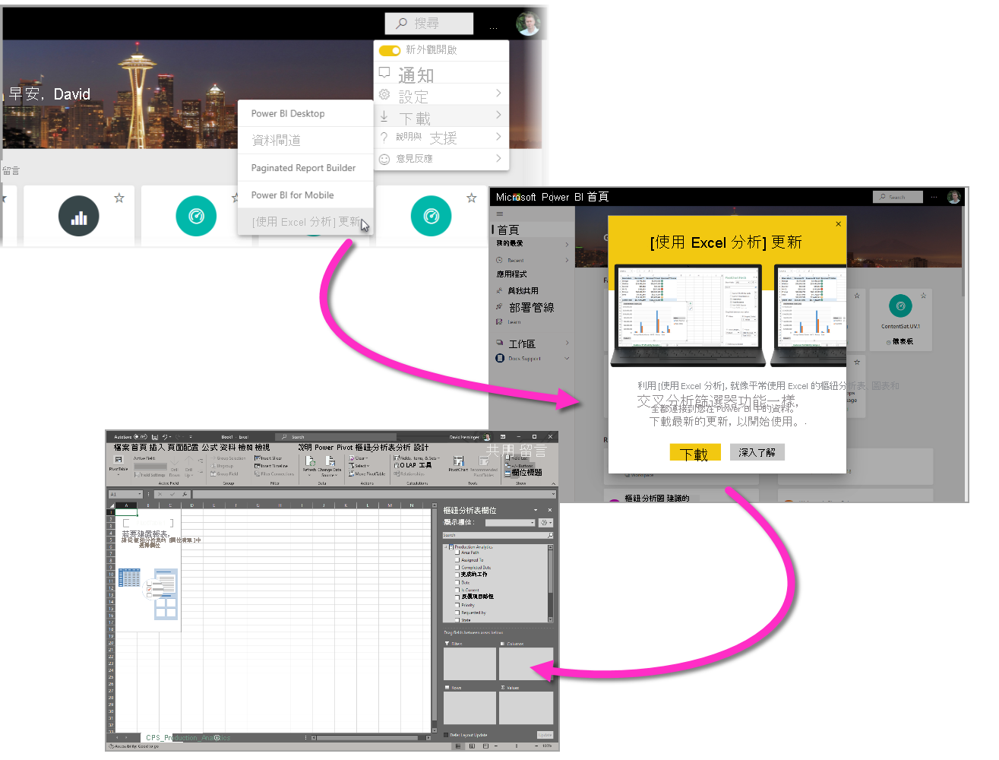
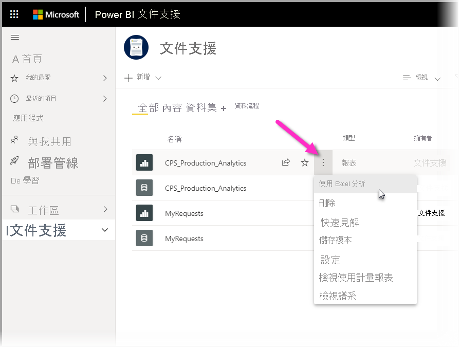
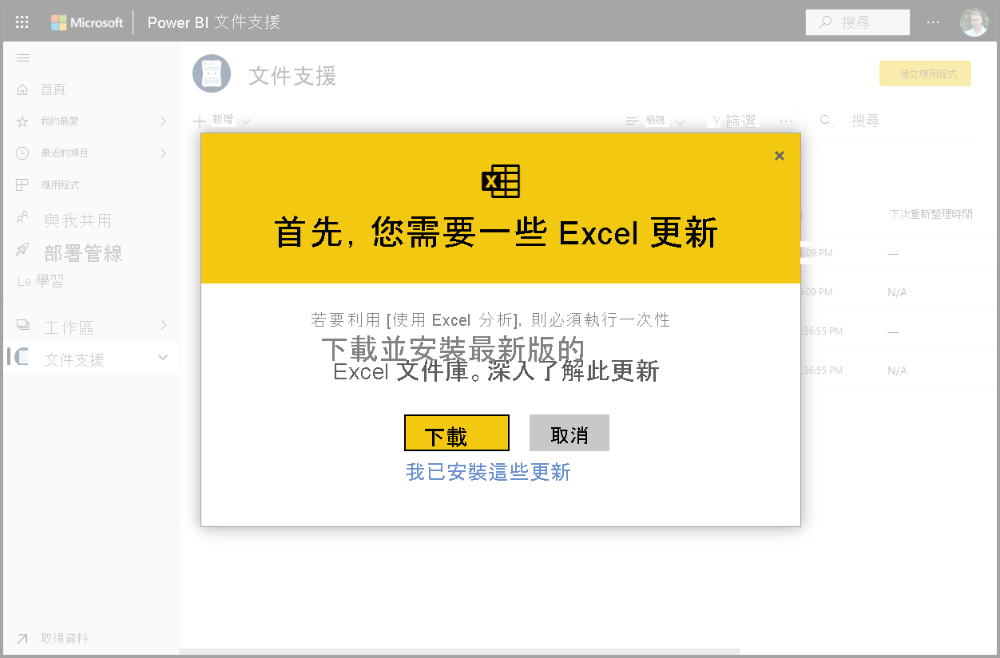
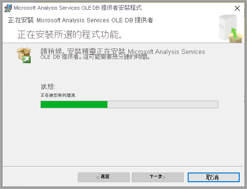
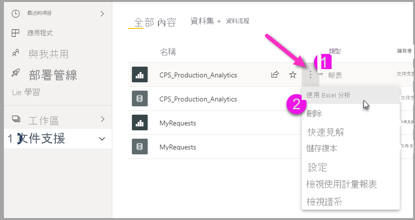

# 在 Excel 中進行分析
透過 [使用 Excel 分析]，即可將 Power BI 資料集帶入 Excel 中，然後使用樞紐分析表、圖表、交叉分析篩選器和其他 Excel 功能加以查看並進行互動。 若要使用 [使用 Excel 分析]，則必須先從 Power BI 下載此功能、加以安裝，然後選取要在 Excel 中使用的一或多個資料集。 

本文示範如何安裝及使用 [使用 Excel 分析]、描述其限制，然後提供一些後續步驟。 以下是您要學習的內容：

* [安裝 [使用 Excel 分析]](#install-analyze-in-excel)
* [連接到 Power BI 資料](#connect-to-power-bi-data)
* [使用 Excel 分析資料](#use-excel-to-analyze-the-data)
* [儲存及共用活頁簿](#saving-and-sharing-your-new-workbook)
* [需求](#requirements)

讓我們快速開始進行安裝程序。

## 安裝 [使用 Excel 分析]

您必須從 Power BI 服務中提供的連結安裝 [使用 Excel 分析]。 Power BI 會偵測您在電腦上擁有的 Excel 版本，並自動下載適當的版本 (32 位元或 64 位元)。 Power BI 服務是在瀏覽器中執行的。 您可使用下列連結登入 Power BI：

* [登入 Power BI](https://app.powerbi.com)

當登入且 Power BI 服務在瀏覽器中執行之後，請選取右上角的 [更多選項] 項目 (...)，然後選取 [下載] > [使用 Excel 分析更新]。 這個功能表項目適用於 [使用 Excel 分析] 更新的新安裝。

![從 Power BI 首頁下載 [使用 Excel 分析]](media/service-analyze-in-excel/analyze-excel-02.png)

或者，您可在 Power BI 服務中巡覽至所要分析的資料集，然後針對資料集、報表或其他 Power BI 項目選取**更多選項**項目。 從出現的功能表中，選取 [使用 Excel 分析] 選項，如下圖所示。

不論是哪一種方式，Power BI 都會偵測是否已安裝 [使用 Excel 分析]，如果未安裝，則會提示進行下載。 

當選取 [下載] 時，Power BI 會偵測已安裝的 Excel 版本，並下載適當版本的 [使用 Excel 分析] 安裝程式。 您會在瀏覽器的底部或瀏覽器顯示下載進度的任何位置看到下載狀態。 

當下載完成時，請執行安裝程式 (.msi) 來安裝 [使用 Excel 分析]。 安裝程序的名稱不同於 [使用 Excel 分析]；名稱將會是 [Microsoft Analysis Services OLE DB Provider] (如下圖所示) 或類似的內容。

完成之後，即可在 Power BI 服務中選取報表 (或其他 Power BI 資料項目，例如資料集)，然後在 Excel 中進行分析。

## 連接到 Power BI 資料

在 Power BI 服務中，巡覽至想要使用 Excel 分析的資料集或報表，然後：

1. 選取 [更多選項] 功能表。

1. 從出現的功能表項目中，選取 [使用 Excel 分析]。

    下圖顯示選取報表。

    
    
    >[!NOTE]
    >請記住，如果從 [報表] 功能表中選取 [使用 Excel 分析]，則其為帶入 Excel 的報表基礎資料集。

    接著，Power BI 服務會建立為供 [使用 Excel 分析] 利用所設計 (且結構化) 資料集的 Excel 檔案，並在瀏覽器中開始下載流程。
    
    

    檔案名稱符合從中衍生檔案名稱的資料集 (或報表或其他資料來源)。 因此，如果報表先前稱為「季報表」，則下載的檔案就會是**季報表.xlsx**。

3. 啟動 Excel 檔案。

    >[!NOTE]
    >第一次開啟檔案時，您可能必須 [啟用編輯]，然後 [啟用內容]，視[受保護的檢視](https://support.microsoft.com/en-gb/office/what-is-protected-view-d6f09ac7-e6b9-4495-8e43-2bbcdbcb6653?ui=en-us&rs=en-gb&ad=gb)和[信任的文件](https://support.microsoft.com/en-us/office/trusted-documents-cf872bd8-47ec-4c02-baa5-1fdba1a11b53)其設定而定。
    >
    >![啟用編輯橫幅其 [受保護的檢視] 的螢幕擷取畫面](media/service-analyze-in-excel/protected-view-enable-editing-banner.png)
    >
    >![啟用內容橫幅其 [信任的文件] 的螢幕擷取畫面](media/service-analyze-in-excel/trusted-document-enable-content-banner.png)

## 使用 Excel-to-analyze-the-data

啟用編輯及內容後，Excel 即會顯示空的**樞紐分析表**和 Power BI 資料集的 [欄位] 清單，並準備開始分析。

Excel 檔案的 MSOLAP 連接字串會連接到您在 Power BI 中資料集。 當您分析或處理資料時，Excel 會查詢 Power BI 中的該資料集，並將結果傳回 Excel。 如果該資料集使用 DirectQuery 連接到即時資料來源，Power BI 會查詢資料來源，並將結果傳回 Excel。

目前在與 Power BI 資料建立連線之後，如同可在 Excel 中使用本機資料集工作一樣，您可建立樞紐分析表、圖表並分析該資料集。

[使用 Excel 分析] 特別適用於連接到下列資料來源的資料集和報表：

* 「Analysis Services 表格式」或「多維度」資料庫
* Power BI Desktop 檔案或 Excel 活頁簿的資料模型具有使用資料分析運算式 (DAX) 建立的模型量值。

> [!IMPORTANT]
> 使用 [使用 Excel 分析] 會將所有詳細等級資料公開給任何具有資料集權限的使用者。

當開始使用 [使用 Excel 分析] 時，必須考慮一些事項，這可能需要額外的一或兩個步驟來進行協調。 這些可能情況將於下列各節中描述。 

### 登入 Power BI
即使您已經在瀏覽器中登入了 Power BI，但第一次在 Excel 中開啟新的 Excel 檔案時，系統可能仍會要求使用 Power BI 帳戶登入 Power BI。 這會驗證從 Excel 到 Power BI 的連線。

### 使用多個 Power BI 帳戶的使用者
有些使用者有多個 Power BI 帳戶。 如果是這樣，您可能會使用其中一個帳戶登入 Power BI，但另一個帳戶可存取 [使用 Excel 分析] 中使用的資料集。 在這種情況下，若嘗試存取用於 [使用 EXCEL 分析] 活頁簿中的資料集，可能會看到**禁止**錯誤或登入失敗。

如果發生這種情況，您將有機會再次登入，屆時即可使用用於 [使用 EXCEL 分析] 所存取資料集的 Power BI 帳戶登入。 您也可以在 Excel 的頂端功能區中選取姓名，以識別目前已登入的帳戶。 請登出並以另一個帳戶重新登入。

## 儲存及共用新的活頁簿

您可 [儲存] 使用 Power BI 資料集所建立的 Excel 活頁簿，如同其他任何活頁簿。 但是，由於只能將活頁簿發佈或匯入至資料表中有資料或有資料模型的 Power BI，因此無法將該活頁簿發佈或匯入至 Power BI。 因為新的活頁簿只要在 Power BI 中有連接至資料集，發佈或匯入至 Power BI 將會陷入循環！

儲存活頁簿之後，您可以與組織中的其他 Power BI 使用者共用。 

當與您共用活頁簿的使用者開啟活頁簿時，其會看到樞紐分析表和活頁簿上次儲存時的資料，而不一定是最新版的資料。 若要取得最新資料，使用者必須先按下 [資料] 功能區中的 [重新整理] 按鈕。 而且因為活頁簿連接到 Power BI 中的資料集，所以嘗試重新整理活頁簿的使用者必須登入 Power BI，並在首次嘗試使用此方法更新時安裝 Excel 更新。

由於使用者必須重新整理資料集，但 Excel Online 不支援對外部連線重新整理，因此建議這些使用者在自己的電腦上用桌面版 Excel 來開啟活頁簿。

> [!NOTE]
> Power BI 租用戶的管理員可以使用 Power BI 管理入口網站，禁止位於 Analysis Services (AS) 資料庫中的內部部署資料集使用 [在 Excel 中進行分析]。 停用該選項時，AS 資料庫即無法使用 [在 Excel 中進行分析]，但其他資料集仍可使用者該功能。

## 從 Excel 存取 Power BI 資料集的其他方式
具有特定 Office SKU 的使用者也可使用 Excel 的 [取得資料] 功能，從 Excel 內連接到 Power BI 資料集。 如果 SKU 不支援這項功能，即不會出現 [取得資料] 功能表選項。

從 [資料] 功能區功能表中，選取 [取得資料] > [從 Power BI 資料集]，如下圖所示。

![使用 [取得資料] 功能表](media/service-analyze-in-excel/analyze-excel-10.png)

隨即會出現一個窗格，您可在其中瀏覽可存取的資料集、查看資料集是否已經過認證或升級，以及判斷資料保護標籤是否已套用至這些資料集。 

如需如何以這種方式將資料放入 Excel 的詳細資訊，請參閱 Excel 文件中的[從 Power BI 資料集建立樞紐分析表](https://support.office.com/article/31444a04-9c38-4dd7-9a45-22848c666884)。

您也可以在 [資料類型] 資源庫中，存取 Excel 的**精選資料表**。 若要深入了解精選資料表及其存取方式，請參閱[在 Excel 中存取 Power BI 的精選資料表 (預覽)](service-excel-featured-tables.md)。

## 需求
使用 [使用 EXCEL 分析] 有幾項要求：

* Microsoft Excel 2010 SP1 和更新版本支援 [使用 EXCEL 分析]。

* Excel 樞紐分析表不支援數值欄位的拖放功能彙總。 您在 Power BI 中的資料集 *必須有預先定義的量值* 。 深人了解[建立量值](../transform-model/desktop-measures.md)。
* 某些組織可能會有防止安裝 [使用 EXCEL 分析] 必要更新的群組原則規則。 如果您無法安裝更新，請洽詢您的系統管理員。
* **使用 Excel 分析**需要資料集位於 Power BI Premium 中，或使用者具有 Power BI Pro 授權。 若要深入了解授權類型之間的功能差異，請參閱 [Power BI 定價](https://powerbi.microsoft.com/pricing/)的「Power BI 功能比較」一節。
* 使用者若有基礎資料集的權限，就能透過 [使用 Excel 分析] 連線到資料集。  使用者有多種方式可取得此權限，例如在包含資料集的工作空間擁有成員角色、與使用資料集的人共用報表或儀表板，或在包含該資料集的工作空間或應用程式中擁有資料集建置權限。 深入了解資料集的[建置權限](../connect-data/service-datasets-build-permissions.md)。
* 來賓使用者無法針對傳送自 (源自) 另一個租用戶的資料集使用 [使用 Excel 分析]。 
* [使用 Excel 分析] 是 Power BI 服務的功能，Power BI 報表伺服器或 Power BI Embedded 不提供此功能。 
* 只有執行 Microsoft Windows 的電腦才支援 [使用 Excel 分析]。

若使用者需要解除安裝 [使用 Excel 分析] 功能，則可使用 Windows 電腦上的 [新增或移除程式] 系統設定來執行這項作業。

## 疑難排解
有時候使用 [使用 EXCEL 分析] 可能會取得非預期的結果，或功能無法如您預期般運作。 [此頁面可提供使用 [使用 Excel 分析] 時的常見問題解決方案](desktop-troubleshooting-analyze-in-excel.md)。

## 後續步驟

您可能也會對下列文章感興趣：

* [在 Power BI Desktop 中使用跨報表鑽研](../create-reports/desktop-cross-report-drill-through.md)
* [使用 Power BI Desktop 交叉分析篩選器](../visuals/power-bi-visualization-slicers.md)
* [對 [使用 Excel 分析] 進行疑難排解](desktop-troubleshooting-analyze-in-excel.md)
* [在 Excel 中存取 Power BI 的精選資料表 (預覽)](service-excel-featured-tables.md)。

