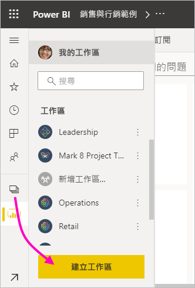
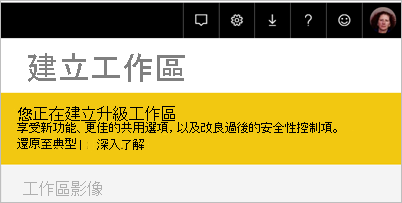
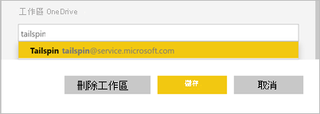
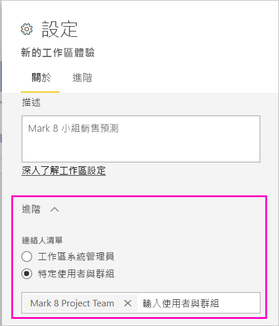
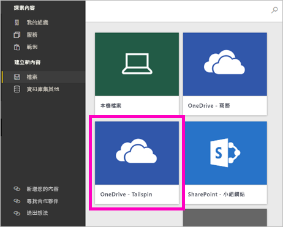
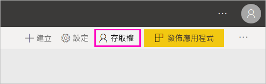

# 在 Power BI 中建立新工作區

Power BI 正在引進新工作區體驗。 「工作區」仍然是要與同事共同合作來建立儀表板、報表和編頁報表集合的地方。 然後，您可以將這些集合組合成「應用程式」，並散發給整個組織或是特定人員或群組。

以下是不同的地方。 在新工作區中，您可以：

- 將工作區角色指派給使用者群組：安全性群組、通訊群組清單、Microsoft 365 群組，以及個人。
- 在 Power BI 中建立工作區無須建立 Microsoft 365 群組。
- 使用更精細的工作區角色，在工作區中進行更有彈性的權限管理。

準備好移轉傳統工作區了嗎？ 如需詳細資訊，請參閱[將傳統工作區升級至 Power BI 中的新工作區](service-upgrade-workspaces.md)。

> [!NOTE]
> 若要強制執行資料列層級安全性 (RLS)，讓 Power BI Pro 使用者瀏覽工作區中的內容，請將「檢視者」角色指派給使用者。

如需詳細背景，請參閱[新工作區](service-new-workspaces.md)一文。

## 建立其中一個新工作區

1. 開始建立工作區。 選取 [工作區] > [建立工作區]。
   
     

2. 您會自動建立已升級的工作區，除非您選擇**還原至典型**。
   
     
     
     如果選取 [還原至傳統]，即會建立[以 Microsoft 365 群組為基礎的工作區](service-create-workspaces.md)。 

2. 提供工作區的名稱。 如果該名稱無法使用，請將它編輯為唯一名稱。
   
     工作區的應用程式將具有與工作區相同的名稱和圖示。
   
1. 以下是您可以為工作區設定的一些選擇性項目：

    上傳**工作區影像**。 檔案可為 .png 或 .jpg 格式。 檔案大小必須小於 45 KB。
    
    [新增**連絡人清單**](#workspace-contact-list)。 根據預設，工作區系統管理員是連絡人。 
    
    只要鍵入現有 Microsoft 365 群組的名稱 (而非 URL)，就能[指定 [工作區 OneDrive]](#workspace-onedrive)。 現在，此工作區可使用該 Microsoft 365 群組的檔案儲存位置。

    

    若要將工作區指定為**專用容量**，請在 [Premium] 索引標籤上，選取 [專用容量]。
     
    

1. 選取 [儲存]。

    Power BI 會建立並開啟工作區。 您會在您所屬的工作區清單中看到它。 

## 工作區連絡人清單

您可以指定哪些使用者會收到工作區中發生問題的通知。 根據預設，指定為工作區系統管理員的任何使用者或群組都會收到通知，但您可以將他們新增到 [連絡人清單] 以自訂該清單。 連絡人清單中的使用者或群組將會顯示在使用者介面 (UI) 中，以協助使用者取得與工作區相關的說明。

1. 使用兩個方法其中之一存取新 [連絡人清單] 設定：

    當您第一次建立工作區時，在 [建立工作區] 窗格中。

    在導覽窗格中，選取 [工作區] 旁邊的箭號，選取工作區名稱旁邊的 [更多選項] (...) > [工作區設定]。 [設定] 窗格隨即開啟。

    

2. 在 [進階] > [連絡人清單] 底下，接受預設值 ([工作區系統管理員])，或新增您自己的 [特定使用者或群組] 清單。 

    

3. 選取 [儲存]。

## 工作區 OneDrive

工作區 OneDrive 功能可供設定 Microsoft 365 群組，其 SharePoint 文件庫的檔案儲存體可供工作區使用者使用。 您先在 Power BI 外建立群組。

Power BI 不會同步處理使用者或群組的權限，而這些使用者或群組會設定為可利用 Microsoft 365 群組成員資格存取工作區。 最佳做法是，將[工作區存取權](#give-access-to-your-workspace)授與在此設定 Microsoft 365 群組所設定檔案儲存體的相同 Microsoft 365 群組。 然後藉由管理 Microsoft 365 群組的成員資格來管理工作區存取權。

1. 使用兩個方法其中之一存取新 [工作區 OneDrive] 設定：

    當您第一次建立工作區時，在 [建立工作區] 窗格中。

    在導覽窗格中，選取 [工作區] 旁邊的箭號，選取工作區名稱旁邊的 [更多選項] (...) > [工作區設定]。 [設定] 窗格隨即開啟。

    

2. 在 [進階] > [工作區 OneDrive] 底下，鍵入稍早所建立 Microsoft 365 群組的名稱。 Power BI 會自動為該群組挑選 OneDrive。

    

3. 選取 [儲存]。

### 存取工作區 OneDrive 位置

建立 OneDrive 位置之後，您能以存取 Power BI 服務中其他資料來源的方式存取它。

1. 在導覽窗格中，選取 [取得資料]，然後在 [檔案] 方塊中選取 [取得]。

    

1.  [OneDrive – 商務用] 項目是您自己的商務用 OneDrive。 第二個 OneDrive 是您新增的。

    

### 在新工作區中連線至協力廠商服務

在新的工作區體驗中，我們將進行變更以專注於「應用程式」。 適用於協力廠商服務的應用程式，可為使用者輕鬆地從他們所使用的服務取得資料，例如 Microsoft Dynamics CRM、Salesforce 或 Google Analytics。

在新工作區體驗中，您無法建立或取用組織內容套件。 相反地，您可以使用提供的應用程式連線到協力廠商服務，或要求您的內部小組為您目前所使用的任何內容套件提供應用程式。 

## 提供您工作區的存取權

1. 在工作區內容清單中，因為您是系統管理員，所以會看到新的 [存取] 動作。

    

1. 在這些工作區中，將安全性群組、通訊群組清單、Microsoft 365 群組或個人新增為檢視者、成員、參與者或管理員。 請參閱[新工作區中的角色](service-new-workspaces.md#roles-in-the-new-workspaces)，以取得不同角色的說明。

    

9. 選取 [新增] > [關閉]。

## 散發應用程式

若您想要將正式內容散發至您組織中較大的群體，您可以從工作區發佈應用程式。  當內容就緒時，您可以選擇想要發佈的儀表板和報表，然後將其發佈為「應用程式」。 您可以從每個工作區建立一個應用程式。

請閱讀[從新工作區發佈應用程式](service-create-distribute-apps.md)

## 後續步驟
* 請閱讀[在 Power BI 的新工作區體驗中組織工作](service-new-workspaces.md)
* [建立傳統工作區](service-create-workspaces.md)
* [在 Power BI 中從新工作區發佈應用程式](service-create-distribute-apps.md)
* 有問題嗎？ [嘗試在 Power BI 社群提問](https://community.powerbi.com/)
