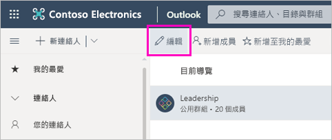
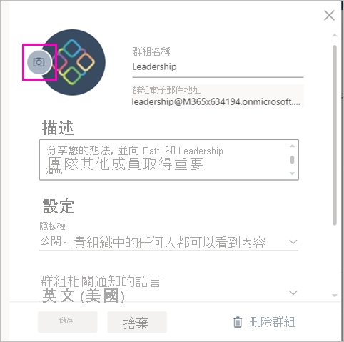

# 在 Power BI 中建立傳統工作區

在 Power BI 中，您可以建立「工作區」，這是要與同事共同作業來建立並精簡儀表板、報表和編頁報表集合的地方。 然後，您可以將集合組合成「應用程式」，將其散發給整個組織或是特定人員或群組。 

**您知道嗎？** Power BI 提供新的工作區體驗，而這種體驗也是目前的預設值。 請參閱[在新的工作區中組織工作](service-new-workspaces.md)來取得新工作區詳細資料。 準備好移轉傳統工作區了嗎？ 如需詳細資訊，請參閱[將傳統工作區升級至 Power BI 中的新工作區](service-upgrade-workspaces.md)。

當建立傳統工作區時，即會建立基礎的相關聯 Microsoft 365 群組。 所有工作區管理都是在 Microsoft 365 中進行管理。 您可以將同事新增至這些工作區，作為成員或系統管理員。 在工作區中，您們全都可以共同處理儀表板、報表和其他文章，以準備發佈給更多對象。 新增至工作區的每個人都必須有 Power BI Pro 授權。

## 影片：應用程式與工作區
<iframe width="640" height="360" src="https://www.youtube.com/embed/Ey5pyrr7Lk8?showinfo=0" frameborder="0" allowfullscreen></iframe>

## 以 Microsoft 365 群組為基礎建立傳統工作區

當建立工作區時，其會建置於 Microsoft 365 群組上。

[!INCLUDE [powerbi-service-create-app-workspace](../includes/powerbi-service-create-app-workspace.md)]

首次建立需要等候一小時左右，工作區才會散佈至 Microsoft 365。

### 將影像新增至 Microsoft 365 工作區 (選擇性)
Power BI 預設會為您的應用程式建立一些彩色圓形，以及應用程式的縮寫。 但是，您可能會想要使用影像來進行自訂。 若要新增影像，您需要有 Exchange Online 的授權。

1. 選取 [工作區]，並選取工作區名稱旁邊的 [更多選項] (...)，然後選取 [成員]。 
   
     
   
    工作區的 Microsoft 365 Outlook 帳戶會在新瀏覽器視窗中開啟。
2. 選取 [編輯] 鉛筆。
   
     
3. 選取相機影像，然後尋找您要使用的影像。
   
     

     影像可以是 .png、.jpg 或 .bmp 檔案。 它們的檔案大小可以相當大，最高可達 3 MB。 

4. 選取 [確定]，然後 [儲存]。
   
    此影像會取代 Microsoft 365 Outlook 視窗中的彩色圓形。
   
     
   
    在幾分鐘的時間內，它也會出現在 Power BI 的應用程式中。

## 將內容新增至工作區

在您建立工作區之後，就可以於其中新增內容。 就像將內容新增至 [我的工作區] 一樣，差異在於工作區中的其他人可以查看並同時處理它。 有一個明顯的差異是當您完成時，您可以將內容發佈為應用程式。 當您在工作區的內容清單中檢視內容時，工作區名稱會列為擁有者。

### 連線到工作區中的協力廠商服務

針對 Power BI 支援之所有協力廠商服務提供的應用程式，可讓您輕鬆地從所使用的服務 (例如 Microsoft Dynamics CRM、Salesforce 或 Google Analytics) 中取得資料。 您可以發佈組織應用程式，為使用者提供其所需的資料。

在目前的工作區中，您也可以使用組織內容套件和協力廠商內容套件 (例如 Microsoft Dynamics CRM、Salesforce 或 Google Analytics) 進行連線。 請考慮將您的組織內容套件移轉到應用程式。

## 散發應用程式

若您想要將正式內容散發至您組織中較大的群體，您可以從工作區發佈應用程式。  當內容就緒時，您可以選擇想要發佈的儀表板和報表，然後將其發佈為「應用程式」。 您可以從每個工作區建立一個應用程式。

導覽窗格中的 [應用程式] 清單會顯示所有您已經安裝的應用程式。 您的同事可透過幾種不同的方式取得應用程式。 
- 他們可以從 Microsoft AppSource 尋找並安裝您的應用程式
- 您可以向他們傳送直接連結。 
- 如果 Power BI 系統管理員賦予您權限，您可以在您同事的 Power BI 帳戶中自動安裝應用程式。 

使用者會在您從工作區發佈更新後自動看到更新後的應用程式內容。 您可以在您工作區的應用程式內容所使用資料集中設定重新整理排程，來控制重新整理資料的頻率。 請參閱[在 Power BI 中從新的工作區發佈應用程式](service-create-distribute-apps.md)以取得詳細資料。

## Power BI 傳統型應用程式常見問題集

### 應用程式與組織內容套件的差異為何？
應用程式是組織內容套件的演進。 如果您已經有組織內容套件，則它們會繼續與應用程式並存運作。 應用程式和內容套件有一些主要差異。 

* 商務使用者在安裝內容組件之後失去其群組身分識別︰它只是與其他儀表板和報表穿插的儀表板和報表清單。 相反地，應用程式會維護其群組和身分識別，即使在安裝之後也是一樣。 這種分組可讓商務使用者在經過一段時間之後仍可輕鬆地繼續進行導覽。
* 您可以從任何工作區建立多個內容套件，但應用程式與其工作區具有 1:1 關聯性。 
* 經過一段時間之後，我們計劃要淘汰組織內容套件，因此建議您從現在開始建立應用程式。  
* 使用新的工作區體驗，我們對淘汰組織內容套件邁出第一步。 您無法在新工作區中取用或建立它們。

請參閱[新工作區和傳統工作區的差異](service-new-workspaces.md#new-and-classic-workspace-differences)以比較這兩者。 

## 後續步驟
* [在 Power BI 中安裝和使用應用程式](service-create-distribute-apps.md)
- [建立新的工作區](service-create-the-new-workspaces.md)
* 有問題嗎？ [嘗試在 Power BI 社群提問](https://community.powerbi.com/)
