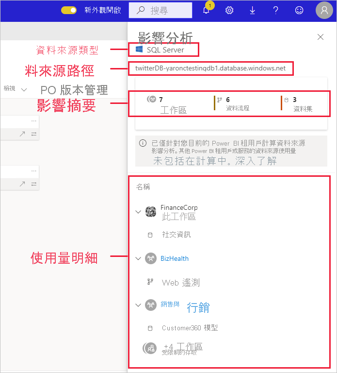
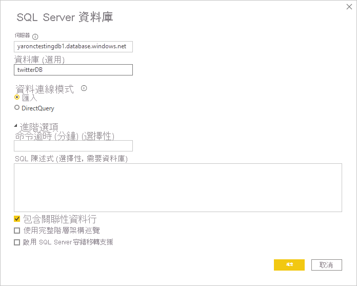

# 資料來源影響分析

資料來源影響分析可協助查看整個組織中，何處正在使用資料來源。 當資料來源暫時或永久離線，且您希望知道誰受到影響時，則這會很有幫助。 此分析會顯示有多少工作區、資料流程和資料集使用資料來源，並可供輕鬆巡覽至受影響資料流程和資料集所在的工作區，以便進一步調查。

資料來源影響分析也可協助找到租用戶中的重複資料，例如當多位不同使用者以相同的資料來源為基礎來建立相似模型時。 資料來源影響分析藉由協助探索這類冗餘的資料集和資料流程，以支援達成「單一事實來源」的目標。

## 執行資料來源影響分析

執行資料來源影響分析：

1. 請移至包含您感興趣資料來源的工作區，然後開啟[譜系檢視](service-data-lineage.md)。
1. 尋找資料來源卡，然後按一下影響分析圖示。

    ![資料來源卡的螢幕擷取畫面，其中顯示 [影響分析] 按鈕。](media/service-data-source-impact-analysis/data-source-impact-analysis-button.png)
 
[影響分析] 側邊面板隨即開啟。

 
* **資料來源類型**：指定資料來源類型
* **資料來源路徑**：如 Power BI Desktop 中所定義資料來源的路徑。 例如，在上圖中，SQL 伺服器資料庫的資料來源路徑是連接字串 "twitterDB-yaronctestingdb1.database.windows.net"，如 Power BI Desktop 中所定義 (如下所示)。 由資料庫名稱 "twitterDB" 和伺服器名稱 "yaronctestingdb1.database.windows.net" 組成。

    
 
* **影響摘要**：顯示可能受影響的工作區、資料流程和資料集數目。 此計數包含您沒有存取權的工作區。
* **使用量明細**：顯示每個工作區中受影響的資料流程和資料集名稱。 若要進一步探索對特定工作區的影響，請按一下工作區名稱以開啟工作區。 若在受影響的工作區中，請使用[資料集影響分析](service-dataset-impact-analysis.md)以查看已連線報表和儀表板的使用量詳細資料。

## 隱私權

在影響分析側邊窗格中，您只會看到可存取的工作區、資料集和資料流程其真正名稱。 您無權存取的項目則會列為限制存取。 這是因為有些項目名稱可能包含個人資訊。
影響摘要計數會包括所有受影響的資料流程和資料集，即使其位於您無權存取的工作區中。

## 限制

編頁報表尚不支援資料來源影響分析，所以您看不到資料來源對租用戶中的這類報表是否有任何直接影響。

## 後續步驟

* [資料集影響分析](service-dataset-impact-analysis.md)
* [資料譜系](service-data-lineage.md)