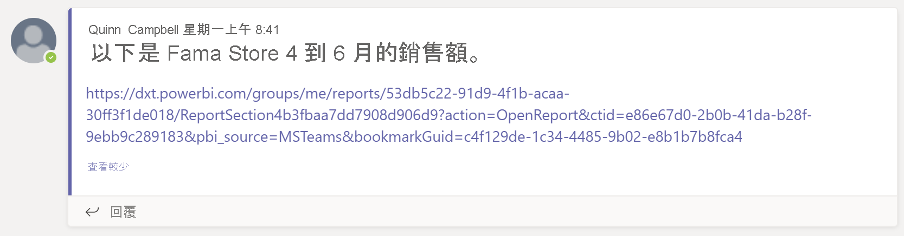

# 在 Microsoft Teams 中使用 Power BI 共同作業

使用 Microsoft Teams 的 [Power BI] 索引標籤，您可以輕鬆地在 Microsoft Teams 頻道和聊天中內嵌互動式報表。 使用 Microsoft Teams 的 [Power BI] 索引標籤，以協助同事尋找您小組使用的資料，以及在小組頻道中討論資料。 將報表、儀表板和應用程式的連結貼至 Microsoft Teams 訊息方塊時，連結預覽會顯示該連結的相關資訊。 當您在 Power BI 中檢視報表和儀表板時，可使用 [共用到 Teams] 按鈕來快速開始交談。

## 需求

為了讓 Microsoft Teams 的 [Power BI] 索引標籤能夠正常運作，請確定：

- 您擁有 Power BI Pro 授權，或報表包含於具備 Power BI 授權的 [Power BI Premium 容量 (EM 或 P SKU)](../admin/service-premium-what-is.md) 中。
- Microsoft Teams 具有 [Power BI] 索引標籤。
- 使用者必須登入 Power BI 服務，才能啟用 Power BI 授權並取用報表。
- 若要在具備 [Power BI] 索引標籤的 Microsoft Teams 中新增報表，您在裝載報表的工作區中至少必須具備「檢視人員」角色。 如需不同角色的相關資訊，請參閱[新工作區中的角色](service-new-workspaces.md#roles-in-the-new-workspaces)。
- 若要在 Microsoft Teams 的 [Power BI] 索引標籤中查看報表，使用者必須具備檢視報表的權限。
- 使用者必須是有權存取頻道和聊天的 Microsoft Teams 使用者。

若要讓連結預覽能夠正常運作，請確定：

- 使用者符合使用 Microsoft Teams [Power BI] 索引標籤的需求。
- 使用者已登入 Power BI。

若要讓 [共用到 Teams] 按鈕能夠正常運作，請確定：

- 使用者符合使用 Microsoft Teams [Power BI] 索引標籤的需求。
- 使用者已登入 Power BI。
- Power BI 管理員尚未停用 [共用到 Teams] 租用戶設定。

## 內嵌報表

遵循下列方式將報表內嵌到 Microsoft Teams 頻道或聊天中。

1. 在 Microsoft Teams 中開啟頻道或聊天，然後選取 **+** 圖示。

    

1. 選取 [Power BI] 索引標籤。

    

1. 使用提供的選項，從工作區或 Power BI 應用程式中選取報表。

    

1. 索引標籤名稱會自動更新以符合報表名稱的名稱，但您可以變更該名稱。

1. 選取 [儲存]。

## 支援內嵌 Power BI 索引標籤的報表

您可以在 [Power BI] 索引標籤中，內嵌下列類型的報表：

- 互動式報表與編頁報表。
- [我的工作區] (全新的工作區體驗) 及傳統工作區中的報表。
- Power BI 應用程式中的報表。

## 取得連結預覽

請遵循下列步驟來取得 Power BI 服務中的內容連結預覽。

1. 將連結複製到 Power BI 服務中的報表、儀表板或應用程式。 例如，從瀏覽器網址列複製連結。

1. 在 Microsoft Teams 訊息方塊中貼上連結。 若出現提示，請登入連結預覽服務。 您可能必須等候幾秒鐘，才會載入連結預覽。

    

1. 成功登入之後，即會出現基本的連結預覽。

    

1. 選取**展開**圖示，以顯示豐富的預覽卡片。

    

1. 豐富的連結預覽卡片會顯示連結和相關動作按鈕。

    

1. 傳送訊息。

## Power BI 服務中的 [共用到 Teams] 按鈕

當您在 Power BI 服務中檢視報表或儀表板時，請遵循這些步驟來共用 Microsoft Teams 頻道和聊天的連結。

1. 在動作列中，或在特定視覺效果的關聯式功能表中，使用 [共用到 Teams] 按鈕。

   * 動作列中的 [共用到 Teams] 按鈕：

       ![動作列中的 [共用到 Teams] 按鈕](media/service-embed-report-microsoft-teams/service-teams-share-to-teams-action-bar-button.png)
    
   * 視覺效果關聯式功能表中的 [共用到 Teams] 按鈕：
    
      ![視覺效果關聯式功能表中的 [共用到 Teams] 按鈕](media/service-embed-report-microsoft-teams/service-teams-share-to-teams-visual-context-menu.png)

1. 在 [分享到 Microsoft Teams] 對話方塊中，選取您想要傳送連結的頻道或人員。 您可以視需要輸入訊息。 系統可能要求您先登入 Microsoft Teams。

    ![包含資訊和訊息的 [分享到 Microsoft Teams] 對話方塊](media/service-embed-report-microsoft-teams/service-teams-share-to-teams-dialog.png)

1. 選取 [共用] 以傳送連結。
    
1. 此連結會新增至現有的交談，或啟動新的交談。

    

1. 選取該連結，即會在 Power BI 服務中開啟該項目。

1. 如果您使用適用於特定視覺效果的關聯式功能表，則當報表開啟時，就會將視覺效果反白顯示。

    
    

## 授與報告存取權

在 Microsoft Teams 中內嵌報表，或傳送項目的連結，不會自動為使用者授與檢視報表的權限。 您需要[允許使用者檢視 Power BI 中的報表](service-share-dashboards.md)。 您可以為小組使用 Microsoft 365 群組，讓此過程變得更簡單。

> [!IMPORTANT]
> 請務必檢閱可以看到 Power BI 服務內報表的成員，並將存取權授與未列出的成員。

確保小組中每位成員都有權存取報表的方式之一是將報表放在單一工作區中，並為小組授與 Microsoft 365 群組的存取權。

## 連結預覽

Power BI 中的下列項目可擁有連結預覽：
- 報表
- 儀表板
- 應用程式

連結預覽服務會要求使用者登入。 若要登出，請選取訊息方塊底部的 [Power BI] 圖示。 然後，選取 [登出]。

## 開始交談

當您將 Power BI 報表索引標籤新增至 Microsoft Teams 時，Teams 會自動為報表建立索引標籤交談。

- 選取右上角的 [顯示索引標籤交談] 圖示。

    

    第一個註解是報表的連結。 該 Microsoft Teams 頻道中的每個人都可以在交談中查看及討論報表。

    
    
## [共用到 Teams] 租用戶設定

在 Power BI 管理入口網站中，[共用到 Teams] 租用戶設定可讓組織隱藏 [共用到 Teams] 按鈕。 設定為停用時，當使用者在 Power BI 服務中檢視報表和儀表板時，將不會在動作列或關聯式功能表中看見 [共用到 Teams] 按鈕。

![Power BI 管理入口網站中的 [共用到 Teams] 租用戶設定](media/service-embed-report-microsoft-teams/service-teams-share-to-teams-tenant-setting.png)

## 已知的問題及限制

- Power BI 不支援 Microsoft Teams 所支援的相同當地語系化語言。 因此，您可能不會在內嵌報表中看到適當的當地語系化。
- Power BI 儀表板無法內嵌於 Microsoft Teams 的 [Power BI] 索引標籤中。
- 沒有 Power BI 授權或存取報表權限的使用者會看到「內容無法使用」訊息。
- 如果您使用 Internet Explorer 10，可能就會遇到問題。 <!--You can look at the [browsers support for Power BI](../consumer/end-user-browsers.md) and for [Microsoft 365](https://products.office.com/office-system-requirements#Browsers-section). -->
- Microsoft Teams 的 [Power BI] 索引標籤不支援 [URL 篩選](service-url-filters.md)。
- 在國家雲端中，無法使用新的 [Power BI] 索引標籤。 較舊的版本可能無法在 Power BI 應用程式中支援全新的工作區體驗或報表。
- 儲存索引標籤之後，即無法透過索引標籤設定來變更索引標籤名稱。 請使用 [重新命名] 選項加以變更。
- 連結預覽服務不支援單一登入。
- 連結預覽在會議聊天或私人頻道中無法使用。
- 如果瀏覽器使用嚴格的隱私權設定，[共用到 Teams] 按鈕可能就無法正常運作。 如果對話方塊未正確開啟，請使用 [遇到問題了嗎?嘗試在新視窗中開啟] 選項。
- [共用到 Teams] 未包含連結預覽。
- 連結預覽和 [共用到 Teams] 不會為使用者授與檢視項目的權限。 權限必須個別管理。
- 當報表作者針對視覺效果將 [更多] 選項設定為 [關閉] 時，就無法使用視覺效果關聯式功能表中的 [共用到 Teams] 按鈕。

## 後續步驟

- [Share a dashboard with colleagues and others](service-share-dashboards.md) (與同事和其他人共用儀表板)
- [在 Power BI 中建立和散發應用程式](service-create-distribute-apps.md)
- [什麼是 Power BI Premium？](../admin/service-premium-what-is.md)

有其他問題嗎？ [嘗試在 Power BI 社群提問](https://community.powerbi.com/)。
