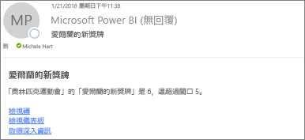
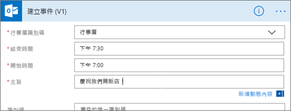

# 將 Power BI 資料警示與 Power Automate 整合

[Power Automate](/power-automate/getting-started) 是一款 SaaS 供應項目，在越來越多種應用程式與 SaaS 服務之間，將工作流程自動化。 您可整合最愛的應用程式與服務 (包括 Power BI) 來將工作自動化，以取得通知、同步檔案、收集資料等。 在本文中，您會實作自動從 Power BI 資料警示產生電子郵件。

[開始使用 Power Automate](/power-automate/getting-started)。

## 必要條件
本文將示範如何建立兩個不同流程；一個從範本建立，另一個則是從頭開始建立。 若要跟著做，請[在 Power BI 中建立資料警示](../create-reports/service-set-data-alerts.md)，並[註冊 Power Automate](https://flow.microsoft.com/#home-signup)。 完全免費！

## 從範本建立流程
在此工作中，我們會使用範本來建立由 Power BI 資料警示 (通知) 觸發的簡單流程。

1. 登入 Power Automate (flow.microsoft.com)。
2. 選取 [範本]，搜尋 **Power BI** > [觸發 Power BI 資料警示時，將電子郵件傳送至任何受眾]。
   
    :::image type="content" source="media/service-flow-integration/power-automate-templates.png" alt-text="Power Automate [觸發 Power BI 資料警示時，將電子郵件傳送至任何受眾] 範本的螢幕擷取畫面":::。

### 組建應用程式
此範本包含觸發程序、Power BI 資料警示，以及動作來傳送電子郵件。 在您選取欄位時，Power Automate 會顯示可以包含的動態內容。  在此範例中，我們在訊息本文中包含了圖格值與圖格 URL。

1. 選取 [繼續]。

    :::image type="content" source="media/service-flow-integration/power-automate-power-bi-mail.png" alt-text="Power Automate [觸發 Power BI 資料警示時，將電子郵件傳送至任何受眾] 範本的螢幕擷取畫面":::

1. 在 [警示識別碼] 方塊中，選取 Power BI 資料警示。 若要了解如何建立警示，請參閱 [Power BI 中的資料警示](../create-reports/service-set-data-alerts.md)。
   
    :::image type="content" source="media/service-flow-integration/power-automate-select-alert-id.png" alt-text="Power Automate [觸發 Power BI 資料警示時，將電子郵件傳送至任何受眾] 範本的螢幕擷取畫面":::
2. 輸入一或多個有效的電子郵件地址。

3. Power Automate 會自動產生 [主旨] 與 [本文]您可保留或加以修改。 本文文字使用 HTML 格式。

    :::image type="content" source="media/service-flow-integration/power-automate-autogenerated-email.png" alt-text="Power Automate [觸發 Power BI 資料警示時，將電子郵件傳送至任何受眾] 範本的螢幕擷取畫面":::

1. 當完成編寫訊息時，請選取 [下一步] 或 [儲存]。  流程隨即建立並進行評估。  Power Automate 可讓您知道是否發生錯誤。
2. 如果發現錯誤，請選取 [編輯流程]**** 加以修正，否則選取 [完成]**** 即可執行新流程。
   
   
5. 觸發資料警示時，Power Automate 會將電子郵件傳送至所指定的地址。  
   
   

## 從頭建立流程
在此工作中，我們將從頭建立由 Power BI 資料警示 (通知) 觸發的簡單流程。

1. 登入 Power Automate (flow.microsoft.com)。
2. 選取 [建立] > [自動化流程]。

    :::image type="content" source="media/service-flow-integration/power-automate-create-automated-flow.png" alt-text="Power Automate [觸發 Power BI 資料警示時，將電子郵件傳送至任何受眾] 範本的螢幕擷取畫面":::   
3. 在 [建置自動化流程] 中，為流程命名。
1. 在 [選擇流程觸發程序] 中，搜尋 **Power BI**。
1. 選取 [Power BI - 觸發資料驅動警示時] > [建立]。

    :::image type="content" source="media/service-flow-integration/power-automate-build-automated-flow.png" alt-text="Power Automate [觸發 Power BI 資料警示時，將電子郵件傳送至任何受眾] 範本的螢幕擷取畫面":::

### 建置您的流程
1. 從 [警示識別碼] 方塊中，選取警示名稱。 若要了解如何建立警示，請參閱 [Power BI 中的資料警示](../create-reports/service-set-data-alerts.md)。

    :::image type="content" source="media/service-flow-integration/power-automate-select-alert-id-scratch.png" alt-text="Power Automate [觸發 Power BI 資料警示時，將電子郵件傳送至任何受眾] 範本的螢幕擷取畫面":::   

2. 選取 [新增步驟]。
   
3. 在 [選擇動作] 中，搜尋 **Outlook** > [建立事件]。

    :::image type="content" source="media/service-flow-integration/power-automate-choose-action-create-event.png" alt-text="Power Automate [觸發 Power BI 資料警示時，將電子郵件傳送至任何受眾] 範本的螢幕擷取畫面":::   
4. 填入事件欄位。 在您選取欄位時，Power Automate 會顯示可以包含的動態內容。
   
   
5. 完成時請選取 [建立流程]****。  Power Automate 會儲存並評估流程。 如果沒有錯誤，請選取 [完成]**** 執行此流程。  新流程會新增到 [我的流程]**** 頁面中。
   
   
6. 當 Power BI 資料警示觸發流程時，您會收到類似這樣的 Outlook 事件通知。
   
    

## 後續步驟
* [開始使用 Power Automate](/power-automate/getting-started/)
* [在 Power BI 服務中設定資料警示](../create-reports/service-set-data-alerts.md)
* [在 iPhone 上設定資料警示](../consumer/mobile/mobile-set-data-alerts-in-the-mobile-apps.md)
* 有其他問題嗎？ [試試 Power BI 社群](https://community.powerbi.com/)