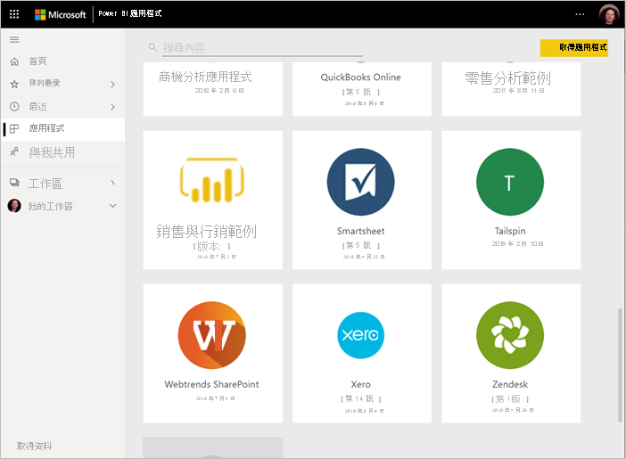
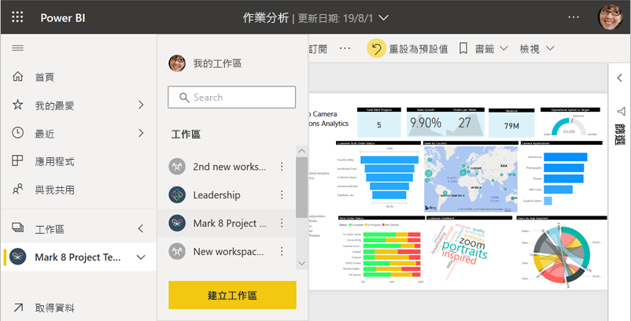
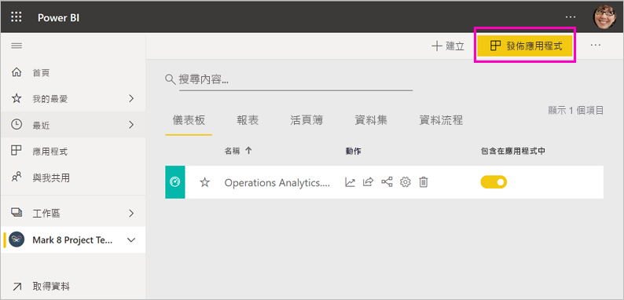

# 在 Power BI 中共同作業和共用的方式

您已建立儀表板和報表。 或許您想要與同事對這兩者進行共同作業。 或者，也許您已準備好要更廣泛地散發這兩者。 對這兩者進行共同作業和共用的最佳方式為何？ 在此文章中，我們會比較您的選項。

*Power BI 服務中的應用程式*

**共同作業**

- 在「工作區」中與同事共同作業，以建立有意義的報表和儀表板。
- 在 *Microsoft Teams* 中共同作業。

**散發或共用儀表板和報表**

- 您可以從 [我的工作區] 或其他工作區「共用儀表板或報表」。
- 從 Power BI「行動應用程式」標註並共用。
- 將工作區中的儀表板和報表組合為「應用程式」，並散發給更大型群組或您的整個組織。
- 在「安全的入口網站」或「公用網站」中內嵌報表。
- 列印報表。
- 建立可讓您透過 Microsoft AppSource 散發給外部 Power BI 使用者的「範本應用程式」。
 
**共用資料**

- 建立「共用資料集」，可讓同事在自己的工作區中用來作為自己報表的基礎。
- 建立「資料流程」作為共用一般資料來源的方式。

無論您選擇哪個選項，都必須具有 [Power BI Pro 授權](../fundamentals/service-features-license-type.md)，或內容必須位於[進階容量](../admin/service-premium-what-is.md)中，才能共用您的內容。 根據您選擇的選項，檢視您內容的同事會有不同授權需求。 下列各節組說明詳細資料。 

## 在工作區中共同作業

當小組一起工作時，其需要存取相同文件，以方便共同作業。 在 Power BI 工作區中，小組可以針對其儀表板、報表、資料集和活頁簿共用擁有權和管理。 有時，Power BI 使用者會根據組織結構來組織工作區，或針對特定專案建立工作區。 還是有其他組織使用數個工作區，來儲存他們所使用之不同版本的報表或儀表板。 

工作區提供可決定您同事具有哪些權限的角色。 使用那些角色來判斷可以管理工作區、編輯或發佈內容，或只能檢視內容的人員。 深入了解[新的工作區中的角色](service-new-workspaces.md#roles-in-the-new-workspaces)。

工作區比 [我的工作區] 更適合共同作業，原因在於其允許內容的共同擁有權。 您和您的整個小組可以輕鬆地進行更新或授與其他人存取權。 [我的工作區] 最適合個人用於一次性或個人內容。

現在，假設您需要與同事共用已完成的儀表板。 授與他們儀表板存取權的最佳方式為何？ 答案需視許多因素而定。 

- 如果同事需要將儀表板保持在最新狀態，或需要存取工作區中的所有內容，請考慮以「成員」或「參與者」身分將其新增至工作區。 
- 如果同事只需檢視工作區中的內容，則可將其新增為「檢視人員」。
- 如果同事只需查看該儀表板而非工作區中的所有內容，您可以直接與其共用儀表板。
- 如果儀表板是您必須散發給許多同事之儀表板和報表組合的一部分，則發佈「應用程式」可能是最佳選擇。

了解如何[建立新的工作區](service-create-the-new-workspaces.md)。 

## 在 Microsoft Teams 中共同作業

藉由在 Microsoft Teams 中內嵌 Power BI 報表和 Power BI 編頁報表，即可增加組織中以資料導向的共同作業。 Power BI 服務會針對報表提供 [在 Teams 中共用] 按鈕。 您可為每個個別報表新增不同的 Power BI 索引標籤，並為每個索引標籤提供報表的名稱或任何其他名稱。 

當您將 Power BI 報表索引標籤新增至 Microsoft Teams 時，Teams 會自動為報表建立索引標籤交談。 該 Microsoft Teams 頻道中的每個人都可以在交談中查看及討論報表。 

:::image type="content" source="media/service-how-to-collaborate-distribute-dashboards-reports/power-bi-teams-conversation-tab.png" alt-text="Microsoft Teams 交談索引標籤":::

深入了解如何[在 Microsoft Teams 中使用 Power BI 共同作業](service-embed-report-microsoft-teams.md)。

## 共用儀表板和報表

假設您已經在 Power BI Desktop 中完成報表，而且希望其他人能夠存取該報表。 有一個存取方式是在 Power BI 服務中「共用」該報表。 您可以將報表發佈到自己的 [我的工作區] 或其他工作區。 也許您可以建立儀表板來使用報表，而您已準備就緒。

您需要 Power BI Pro 授權，才能共用內容。 您共用內容的人員也必須具有此授權，或者內容必須位於 [Premium 容量](../admin/service-premium-what-is.md)的工作區中。 當您共用儀表板或報表時，收件者即可進行檢視並與之互動。 如果您為收件者授與權限，收件者就能對其進行編輯、製作其複本，然後與他們的同事共用。 收件者所看到的資料，與您在儀表板或報表中看到的相同。 除非已套用[資料列層級安全性 (RLS)](../admin/service-admin-rls.md)，否則，收件者有權存取底層料集內的所有資料。

您也可以與組織外部人員共用。 他們也可以檢視儀表板或報表並其互動，但不能共用儀表板或報表。 

了解如何從 Power BI 服務[共用儀表板和報表](service-share-dashboards.md)。 或者，了解如何將篩選新增至連結，並[共用已篩選的報表檢視](service-share-reports.md)。

## 從 Power BI 行動裝置應用程式標註並共用

在 iOS 和 Android 裝置的 Power BI 行動裝置應用程式中，您可以標註磚、報表或視覺效果，然後透過電子郵件與任何人共用它。

您正在共用圖格、報表或視覺效果的快照集。 收件者看到的外觀與您送出郵件時完全相同。 該郵件還包含儀表板或報告的連結。 如果收件者具有 Power BI Pro 授權，或內容位於 [Premium 容量](../admin/service-premium-what-is.md)中，而且您已經與收件者共用內容，則收件者能夠開啟該郵件。 您可以將圖格的快照集傳送給任何人，而不只是相同電子郵件網域中的同事。

深入了解如何從 iOS 和 Android 的行動應用程式[標註並共用圖格、報表和視覺效果](../consumer/mobile/mobile-annotate-and-share-a-tile-from-the-mobile-apps.md)。

您也可以從 Windows 10 裝置的 Power BI 應用程式[共用圖格的快照集](../consumer/mobile/mobile-windows-10-phone-app-get-started.md)，但不能標註圖格。

## 在應用程式中散發見解

假設您想要將自己的儀表板散發給組織內廣大群眾。 您和同事已建立「工作區」，接著在工作區中建立並調整了儀表板、報表和資料集。 現在，您可以選取儀表板和報表，並將其發佈為「應用程式」，以供群組或整個組織使用。

在 Power BI 服務 ([https://app.powerbi.com](https://app.powerbi.com)) 中可輕鬆地找到及安裝應用程式。 您可以將應用程式的直接連結傳送給商務使用者，或者他們可以在 AppSource 中進行搜尋。 如果您的 Power BI 系統管理員賦予您權限，您可以在您同事的 Power BI 帳戶中自動安裝應用程式。 了解如何[發佈應用程式](service-create-distribute-apps.md)。

當其安裝應用程式之後，就可以在瀏覽器或行動裝置中檢視此應用程式。

若要讓使用者檢視您的應用程式，使用者也必須具備 Power BI Pro 授權，或者，應用程式必須儲存於 Power BI Premium 容量中。 如需詳細資訊，請參閱[什麼是 Power BI Premium？](../admin/service-premium-what-is.md)。

您也可以將應用程式發佈給組織外部的人員。 他們可以檢視應用程式內容並與其互動，但不能與其他人共用應用程式內容。 現在您可以建立「範本應用程式」，並將其部署至任何 Power BI 客戶。

## 在安全的入口網站或公用網站中內嵌報表

### 在安全的入口網站中內嵌

您可在使用者想要看到 Power BI 報表的入口網站或網站中，予以內嵌。  
使用 Power BI 服務中的 [內嵌在 SharePoint Online 中] 和 [內嵌] 選項，您就能安全地為內部使用者內嵌報表。 無論您選擇哪種選項，Power BI 都會在使用者查看內容之前強制執行所有權限和資料安全性。 檢視報表的人必須有適當授權。  

- [在 SharePoint Online 內嵌] 可與 SharePoint Online 的 Power BI Web 組件搭配使用。 可提供單一登入體驗，掌控如何內嵌報表。 深入了解[內嵌在 SharePoint Online 中](service-embed-report-spo.md)。
- 只要是支援使用 URL 或 iFrame 內嵌內容的入口網站或網站，則皆可使用 [內嵌] 選項。 深入了解[內嵌](service-embed-secure.md)選項。

### 發佈到公用網站

透過 [發行至 Web]，您可以藉由將視覺效果內嵌到部落格文章、網站、社交媒體和其他線上通訊，來將 Power BI 報表發佈到整個網際網路。 網際網路上的任何人都可以檢視您的報表，而且您無法控制誰可以查看您的發行內容。 他們不需要 Power BI 授權。 您只能在可編輯的報表中使用發行至網站。 如果報表是與您共用，或報表是在應用程式中，則您無法將報表發行至網站。 了解如何[發行至 Web](service-publish-to-web.md)。

>[!Warning]
>僅使用 [發佈至網路](service-publish-to-web.md) 來公開共用內容，而不是內部共用。

## 列印或儲存為 PDF 或其他靜態檔案

從 Power BI 服務，您可以列印、另存為 PDF，或另存為其他靜態檔案格式 (這些項目中的任一個)：

- 整個儀表板
- 儀表板圖格
- 報表頁面
- 編頁報表
- 來自 Power BI 服務的視覺效果。 

您一次只能列印一頁 Power BI 報表。 您無法一次列印整份報表。 了解如何[列印報表或儀表板或儲存為靜態檔案](../consumer/end-user-print.md)。

另一方面，編頁報表是設計來進行列印。 如需詳細資訊，請參閱 [Power BI 報表和編頁報表的比較](../paginated-reports/paginated-reports-report-builder-power-bi.md#compare-power-bi-reports-and-paginated-reports)。 

## 建立及部署範本應用程式

「範本應用程式」設計用於公開散發，通常是在 Microsoft AppSource 中。 當您建置應用程式，甚至不必撰寫程式碼，就可以將其部署至任何 Power BI 客戶。 您的客戶連線到他們自有資料，並將他們自己的帳戶具現化。 深入閱讀 [Power BI 範本應用程式](../connect-data/service-template-apps-overview.md)。

## 共用資料集

讓我們面對現實吧，有些人比別人更擅長在報表中建立設計完善的高品質資料模型。 或許就是您。 您整個組織都可以受益於這些設計完善的資料模型。 「共用資料集」適合擔任該角色。 當您以每個人都應使用的資料模型建立報表時，可以將該報表儲存至 Power BI 服務，並將其使用權限提供給合適的人員。 然後他們就可以在您的資料集上建立報表。 如此一來，每個人的報告都會基於相同資料，並可看到相同的「真實版本」。

深入了解[建立和使用共用資料集](../connect-data/service-datasets-across-workspaces.md)。

## 建立資料流程

「資料流程」是一種自助方式，可整合來自不同來源的資料，並為模型化做好準備。 分析師會建立資料流程，以內嵌、轉換、整合和擴充巨量資料。 分析師會在 Power BI 服務的工作區中建立及管理資料流程。 了解[使用資料流程的自助資料準備](../transform-model/service-dataflows-overview.md)。

## 考量與限制

- 您無法從 Power BI 報表伺服器共用報表。 您可以改為建立[適用於自己或其他人的訂閱](/sql/reporting-services/working-with-subscriptions-web-portal)。

## 後續步驟

- [與同事和其他人共用儀表板](service-share-dashboards.md)
- [在 Power BI 中建立和發佈應用程式](service-create-distribute-apps.md)
- [在安全入口網站或網站中內嵌報告](service-embed-secure.md)

有任何意見嗎？ 請移駕 [Power BI 社群網站](https://community.powerbi.com/)提供您的建議。

有其他問題嗎？ [試試 Power BI 社群](https://community.powerbi.com/)
