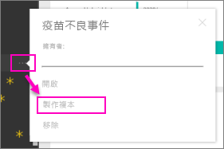

# 整理有序的內容套件：複製、重新整理及取得存取權

發行組織內容套件時，所有收件者都能看到相同的儀表板、報表、Excel 活頁簿、資料集和資料 (除非它是 SQL Server Analysis Services (SSAS) 資料來源)。  [只有內容套件建立者可以編輯和重新發佈](service-organizational-content-pack-manage-update-delete.md)內容套件。  不過，所有收件者都可以儲存隨原始內容套件存留的複本。

建立內容套件與共用儀表板或對群組中的儀表板共同作業不同。 閱讀[應該如何共同作業和共用儀表板和報表？](service-how-to-collaborate-distribute-dashboards-reports.md)，來為您的情況決定最佳選項。

> [!NOTE]
> 您無法在新的工作區體驗中建立或安裝組織內容套件。 如果您尚未開始，現在是將您的內容套件升級為應用程式的好時機。 深入了解[新的工作區體驗](service-create-the-new-workspaces.md)。
>

## 建立組織內容套件的複本
建立專屬的內容套件複本，其他人都無法看到。

1. 選取內容套件儀表板旁的 [更多選項] (...) > [製作複本]。

    
2. 選取 [儲存]。  

您現在已經有可以變更的複本。 沒有其他人會看到您所做的變更。

> [!NOTE]
> 以前，每次當您安裝內容套件或建立複本時，新的資料集就會出現在工作區內容清單中。 最近更新簡化了使用新參考資料集圖示只顯示一個項目的體驗：
>
> 
>

## 請幫我！  我不再能夠存取內容套件了
這種情形可能由幾種原因所造成：

* **成員資格變更**：內容套件會發佈至電子郵件通訊群組、安全性群組和[以 Microsoft 365 為基礎的 Power BI 群組](https://support.office.com/article/Create-a-group-in-Office-365-7124dc4c-1de9-40d4-b096-e8add19209e9)。  如果群組已將您移除，您就不再有內容套件的存取權。
* **通訊群組變更**：內容套件建立者變更通訊群組。 例如，內容套件最初發佈至整個組織，但建立者重新將它發佈給較少的對象，而您可能不再隸屬此對象。
* **安全性設定變更**：如果儀表板和報表連接至內部部署 SSAS 資料來源，且變更了安全性設定，您對該伺服器的權限可能會遭撤銷。

## 組織內容套件如何重新整理？
建立內容套件時，會繼承重新整理設定與資料集。  建立內容套件的複本時，新版本會保留原始資料集與其重新整理排程的連結。

請參閱[管理、更新和刪除組織內容套件](service-organizational-content-pack-manage-update-delete.md).

## 後續步驟
* [組織內容套件簡介](service-organizational-content-pack-introduction.md)
* [在 Power BI 中建立群組](service-create-distribute-apps.md)
* 有其他問題嗎？ [試試 Power BI 社群](https://community.powerbi.com/)
