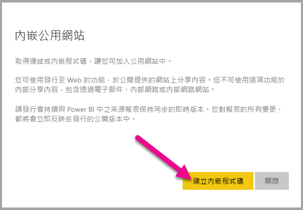
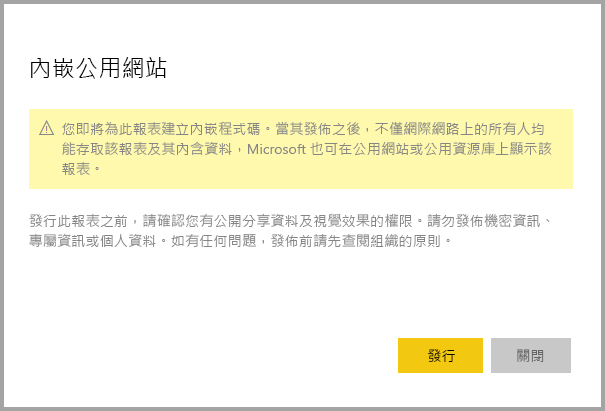
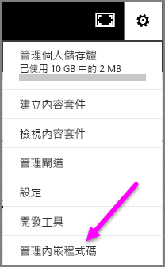
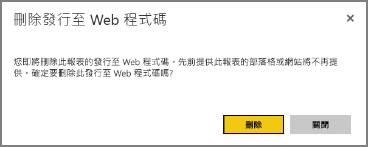

# Power BI 的 [發行至 Web]

透過 Power BI 的 [發行至 Web] 選項，您可以輕鬆將互動式 Power BI 內容內嵌至部落格文章、網站、電子郵件或社交媒體。 您也可以輕鬆編輯、更新、重新整理或停止共用已發佈的視覺效果。

> [!WARNING]
> 使用 [發佈至 Web] 時，網際網路上的任何人都可以檢視您發佈的報表或視覺效果。 檢視不需要驗證。 包括檢視報表彙總的詳細等級資料。 發佈報表之前，請確定您可與公眾共用資料及視覺效果。 請勿發佈機密或專屬資訊。 如有疑問，請先核查貴組織的原則再發行。

>[!Note]
>您可將內容安全內嵌在內部入口網站或網站中。 使用 [[內嵌]](service-embed-secure.md) 或 [[內嵌在 SharePoint Online 中]](service-embed-report-spo.md) 選項。 當使用者檢視您的內部資料時，這些選項可確保強制執行所有權限與資料安全性。

## 使用 [發行至 Web] 建立內嵌程式碼

您可以在個人和群組工作區中可編輯的報表使用 [發佈至 Web] 功能。  此功能不適用於與您共用的報表，也不適用於依賴資料列層級安全性保護資料的報表。 請參閱下面的[**限制**](#limitations)一節以取得不支援 [發佈至 Web] 的完整案例清單。 使用 [發佈至 Wb] 之前，請先檢閱本文中稍早的＜警告＞。

下列步驟說明如何使用 [ **發佈至網路**]。

1. 在工作區中開啟您可以編輯的報表，依序選取 [更多選項 (...)]  > [內嵌] > [發佈到 Web (公開)]。

   ![[更多選項] 中的 [發行至 Web]](media/service-publish-to-web/power-bi-more-options-publish-web.png)
   
2. 如果 Power BI 系統管理員尚未允許您建立內嵌程式碼，請與之連絡。

   
   
   如需尋找可在組織中啟用 [發行至 Web] 之人員的說明，請參閱本文稍後提及的[如何尋找您的 Power BI 系統管理員](#find-your-power-bi-administrator)。

3. 檢閱對話方塊內容，並選取 [建立內嵌程式碼]。

   

4. 檢閱以下所顯示的警告，並確認資料是否可以內嵌在公開網站上。 如果可以，請選取 [發佈]。

   

5. 隨即顯示內含連結的對話方塊。 選取要以電子郵件傳送的連結，或複製 HTML。 您可以將其內嵌在 iFrame 等程式碼中，也可以直接貼到網頁或部落格。

   

6. 如果您之前建立了報表的內嵌程式碼，並選取 [發佈至 Web]，則不會看到步驟 2-4 中的對話方塊。 而是隨即顯示 [內嵌程式碼] 對話方塊：

   

   每個報表只能建立一個內嵌程式碼。

### 檢視模式的祕訣

在部落格文章中內嵌內容時，通常需要符合特定畫面大小。  您可以視需要調整 iFrame 標籤中的高度和寬度。 不過，您必須確保報表符合指定的 iFrame 區域大小，因此您也需要在編輯報表時設定適當的檢視模式。

下表提供檢視模式的相關指南，以及內嵌後的顯示方式。

| 檢視模式 | 內嵌時的外觀 |
| --- | --- |
|  |[符合一頁大小] 會遵循報表頁面的高度與寬度。 如果頁面設定為 16:9 或 4:3 之類的「動態」外觀比例，您的內容就會調整成適合 iFrame 大小。 當內嵌在 iFrame 中時，使用 [符合一頁大小] 會造成「上下黑邊」，當內容調整成符合 iFrame 大小後，iFrame 區域會出現灰色背景。 若要將上下黑邊縮到最小，請適當地設定 iFrame 的高度與寬度。 |
|  |[實際大小] 可確保報表維持您在報表頁面上設定的大小。 這會導致 iFrame 中出現捲軸。 設定 iFrame 的高度和寬度以避免出現捲軸。 |
|  |[符合寬度] 可確保內容能填滿 iFrame 的水平區域。 框線仍會顯示，但是內容會調整為使用所有的可用水平空間。 |

### iFrame 高度與寬度的祕訣

[發佈至 Web] 內嵌程式碼看起來如下列範例所示：

 
您可以手動編輯寬度與高度，以確保其大小適合您在其中內嵌它的頁面。

若要達到更理想的符合狀態，您可以嘗試為 iFrame 的高度新增 56 個像素，以容納底部列的目前大小。 如果報表頁面使用動態大小，下表提供一些您可以使用而不會出現上下黑邊的大小。

| 外觀比例 | 大小 | 維度 (寬度 x 高度) |
| --- | --- | --- |
| 16:9 |小 |640 x 416 像素 |
| 16:9 |中 |800 x 506 像素 |
| 16:9 |大 |960 x 596 像素 |
| 4:3 |小 |640 x 536 像素 |
| 4:3 |中 |800 x 656 像素 |
| 4:3 |大 |960 x 776 像素 |

## 管理內嵌程式碼

建立 [發佈至 Web] 內嵌程式碼後，您可以從 Power BI 的 [設定] 功能表管理您的程式碼。 管理內嵌程式碼時，可以移除目標視覺效果、回報程式碼 (會導致內嵌程式碼無法使用) 或取得內嵌程式碼。

1. 若要管理您的 [發行到 Web]  內嵌程式碼，請開啟 [設定]  齒輪，然後選取 [管理內嵌程式碼] 。

   

2. 您的內嵌程式碼隨即出現。

   

3. 您可以擷取或刪除內嵌程式碼。 刪除它會停用該報表或視覺效果的任何連結。

   

4. 如果選取 [刪除]，系統會要求進行確認。

   

## 報表更新和資料重新整理

建立 [發佈至 Web] 內嵌程式碼並加以共用後，報表將依據您進行的任何變更更新，而內嵌程式碼連結則會立即啟用。 開啟連結的任何人都可以進行檢視。 初始建立之後，對報表或視覺效果的更新最多可能需要兩小時，您的使用者才能看到。 資料會自擷取時起算快取一小時。 對於需要經常重新整理的資料，我們不建議使用 [發行至 Web]。 若要深入了解，請參閱本文稍後的[**運作方式**](#howitworks)一節。 

### 資料重新整理

資料重新整理會自動反映在您的內嵌報表或視覺效果中。 最多需要兩小時，重新整理的資料才會顯示在內嵌程式碼中。 若要停用自動重新整理，請在報表使用的資料集排程上選取 [不重新整理]。  

## Power BI 視覺效果

[發佈至網路] 支援 Power BI 視覺效果。 使用 [發行至 Web] 時，共用您所發佈視覺效果的使用者不必啟用 Power BI 視覺效果，即可檢視報表。

## 了解內嵌程式碼狀態欄

>[!Note]
>檢閱您經常發佈的內嵌程式碼。 移除不再需要公開提供的所有內容。

[管理內嵌程式碼] 頁面包含狀態資料行。 根據預設，內嵌程式碼都是 [使用中]，但也可以是下列其中一種狀態。

| 狀態 | 描述 |
| --- | --- |
| **使用中** |網際網路使用者可以檢視報表並與其互動。 |
| **封鎖** |報表內容違反 [Power BI 服務條款](https://powerbi.microsoft.com/terms-of-service)。 Microsoft 已予以封鎖。 如果您認為內容遭到不當封鎖，請連絡支援人員。 |
| **不支援** |報表資料集使用的是資料列層級安全性，或其他不受支援的設定。 如需完整清單，請參閱[**限制**](#limitations)一節。 |
| [侵害] |內嵌程式碼不屬於定義的租用戶原則。 通常在建立內嵌程式碼，且 [發行至 Web] 租用戶設定變更為排除擁有內嵌程式碼的使用者時，就會發生這個狀況。 如果已停用租用戶設定，或不再允許使用者建立內嵌程式碼，現有的內嵌程式碼就會顯示 [侵害] 狀態。 如需詳細資訊，請參閱本文[尋找您的 Power BI 系統管理員](#find-your-power-bi-administrator)一節。 |

## 回報 [發行至 Web] 內容的相關問題

若要回報內嵌在網站或部落格之 [發行至 Web] 內容的相關問題，請選取 [發行至 Web] 報表底部的**旗標**圖示。

系統要求您傳送電子郵件給 Microsoft 說明問題。 Microsoft 會根據 [Power BI 服務條款](https://powerbi.microsoft.com/terms-of-service)評估內容，並採取適當的行動。

## 授權

您必須是 Microsoft Power BI 使用者才能使用 [ **發佈至網路**]。 您的報表檢視者不需要是 Power BI 使用者。

## 運作方式 (技術性詳細資料)

使用 [發佈至 Web] 建立內嵌程式碼後，任何網際網路使用者都可以檢視報表。 報表可以公開取得，因此，您可以預期檢視人員日後透過社交媒體輕鬆共用報表。 使用者直接開啟公用 URL 或在內嵌的網頁或部落格中檢視報表時，Power BI 會快取報表定義和檢視報表所需的查詢結果。 此快取可確保同時能讓數千名使用者檢視報表，卻不會影響效能。

資料會自擷取時起算快取一小時。 如果您更新報表定義 (例如，變更其檢視模式)，或重新整理報表資料，則最多需要兩小時，變更才會反映到使用者檢視的報表版本中。 由於每個元素和資料值都是獨立快取的，因此，當資料更新發生時，即會向使用者混合顯示目前和先前的值。 因此，建議您預先準備要進行的工作，且只在對設定滿意後，才建立 [發行至 Web] 內嵌程式碼。 如果您的資料將會重新整理，請將重新整理的次數降到最低，並於下班時間執行重新整理。 對於需要經常重新整理的資料，我們不建議使用 [發行至 Web]。

## 尋找您的 Power BI 系統管理員

Power BI 系統管理員入口網站有控制誰可發行至 Web 的設定。 與您組織的 [Power BI 系統管理員](../admin/service-admin-role.md)合作，變更系統管理員入口網站中的[發行至 Web 租用戶設定](../admin/service-admin-portal.md#publish-to-web)。

針對註冊 Power BI 的小型組織或個人，您可能還沒有 Power BI 管理員。 請遵循[系統管理員接管程序](/azure/active-directory/users-groups-roles/domains-admin-takeover)。 在您有 Power BI 管理員之後，他們便能為您啟用建立內嵌程式碼的能力。

已建立的組織通常已經有 Power BI 管理員。 擔任下列任一角色的人員都可以作為 Power BI 管理員：

- 全域管理員
- 在 Azure Active Directory 中具有 Power BI 服務管理員角色的使用者

您要在組織中[找到這群人的其中一員](/office365/admin/admin-overview/admin-overview#who-has-admin-permissions-in-my-business)，要求其在系統管理員入口網站中更新 [發行至 Web 租用戶設定](../admin/service-admin-portal.md#publish-to-web)。

## 限制

Power BI 服務大部分的資料來源及報表都支援 [發行至 Web]。 不過，下列類型的報表目前不支援也不提供 [發行至 Web]：

- 使用資料列層級安全性的報表。
- 使用任何即時連線資料來源的報表，包括裝載於內部部署 的 Analysis Services 表格式、Analysis Service 多維度和 Azure Analysis Services。
- 使用與報表儲存在不同工作區之[共用資料集](../connect-data/service-datasets-across-workspaces.md)的報表。
- [共用和認證的資料集](../connect-data/service-datasets-share.md)。
- 直接或透過組織內容套件與您共用的報表。
- 位在您非屬編輯成員之工作區中的報表。
- [發佈至 Web] 報表目前不支援 "R" 與 Python 視覺效果。
- 從已發行至 Web 的報表中匯出視覺效果的資料。
- ArcGIS Maps for Power BI 視覺效果。
- Power BI 視覺效果問與答。
- 包含報表層級 DAX 量值的報表。
- 單一登入資料查詢模型。
- 安全的機密或專屬資訊。
- 隨著 [內嵌] 選項提供的自動驗證功能無法搭配 Power BI JavaScript API 使用。 針對 Power BI JavaScript API，請使用[使用者擁有資料](../developer/embedded/embed-sample-for-your-organization.md)方式來內嵌。

## 後續步驟

- [SharePoint Online 報告 Web 組件](service-embed-report-spo.md) 

- [在安全入口網站或網站中內嵌報告](service-embed-secure.md)

有其他問題嗎？ [試試 Power BI 社群](https://community.powerbi.com/)