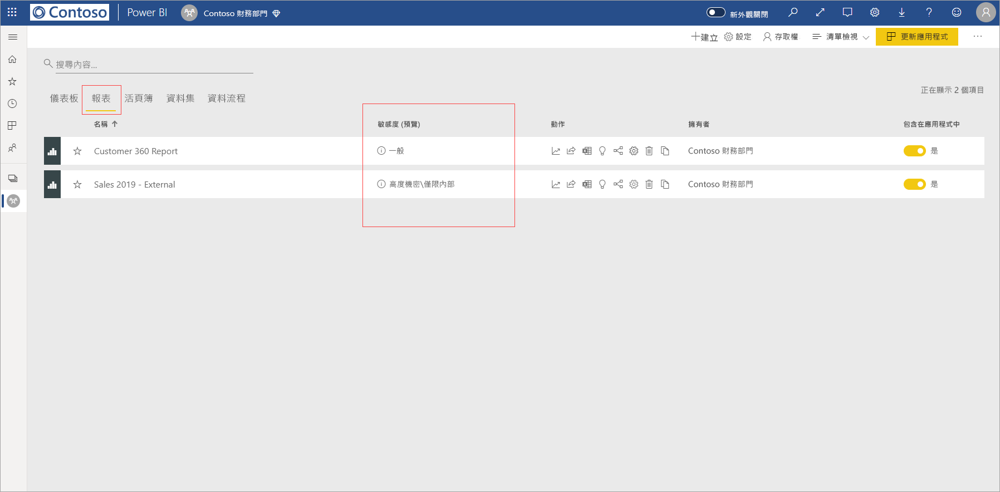
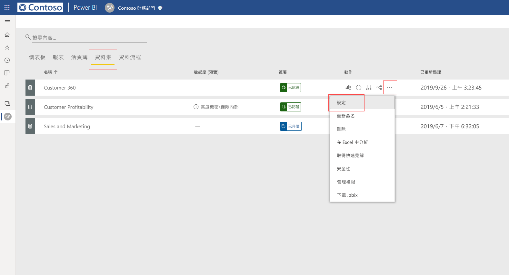
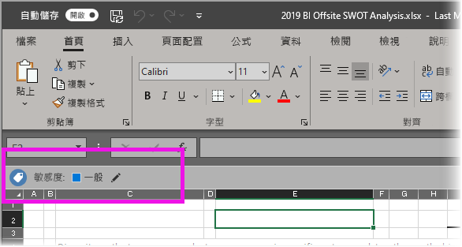

# 在 Power BI 中套用資料敏感度標籤

Microsoft 資訊保護提供報表、儀表板、資料集和資料流程的敏感度標籤，以保護您的敏感性內容，防止未經授權的資料存取和外洩。 使用資料敏感度標籤正確標示您的資料，可以確保只有經過授權的人員，才能存取您的資料。 本文說明如何將敏感度標籤套用至您的內容。

若要在 Power BI 中套用敏感度標籤：
* 您必須擁有 Power BI Pro 授權，以及所要標示的內容編輯權限。
* 您必須屬於有權套用資料敏感度標籤的安全性群組 (如[在 Power BI 中啟用資料敏感度標籤](../admin/service-security-enable-data-sensitivity-labels.md#enable-data-sensitivity-labels)一文所述)。
* 您必須符合所有[必要條件](../admin/service-security-data-protection-overview.md#requirements-for-using-sensitivity-labels-in-power-bi)和[授權需求](../admin/service-security-data-protection-overview.md#licensing)。

如需 Power BI 的資料敏感度標籤詳細資訊，請參閱 [Power BI 資料保護概觀](../admin/service-security-data-protection-overview.md)。

## 套用敏感度標籤

當您的租用戶啟用資料保護時，敏感度標籤會出現在儀表板、報表、資料集與資料流程清單檢視的敏感度資料行中。

**套用或變更報表或儀表板中的敏感度標籤**
1. 按一下 [更多選項 (...)]。
1. 選取 [設定]。
1. 在 [設定] 側邊窗格中，選擇適當的敏感度標籤。
1. 儲存設定。

下圖說明對報表執行此作業的步驟

**套用或變更資料集或資料流程中的敏感度標籤**

1. 按一下 [更多選項 (...)]。
1. 選取 [設定]。
1. 在設定側邊窗格中，選擇適當的敏感度標籤。
1. 套用設定。

下面兩張圖說明對資料集執行此作業的步驟。

依序選擇 [其他選項(...)] 和 [設定]。

在 [設定] 頁面上，開啟 [敏感度標籤] 區段，再選擇所需的敏感度標籤，然後按一下 [套用]。

## 移除敏感度標籤
若要從報表、儀表板、資料集或資料流程中移除敏感度標籤，請遵循[套用標籤所使用的相同程序](#applying-sensitivity-labels)，但當系統提示您分類資料的敏感度時，請選擇 [(無)]。 

## 匯出檔案的資料保護

這項與敏感度標籤相關聯的資料保護功能僅適用於匯出的 Excel、PowerPoint 和 PDF 檔案資料。 此功能不支援 [使用 Excel 分析]、[匯出至 .csv]、資料集下載 (.pbix)、Power BI 服務 Live Connect 或任何其他匯出格式。 資料匯出選項是由 Power BI 租用戶系統管理員的[匯出設定](../service-admin-portal.md#export-and-sharing-settings)所控制。

當您從設有敏感度標籤的[報表匯出資料](https://docs.microsoft.com/power-bi/consumer/end-user-export)至 Excel、PowerPoint 或 PDF 檔案時，所產生的檔案會繼承該敏感度標籤。 敏感度標籤會顯示在檔案中，但只有具備足夠權限的使用者，才能存取該檔案。

## 考量與限制

下列清單提供 Power BI 敏感度標籤的一些限制：

**一般**
* 敏感度標籤只能套用到儀表板、報表、資料集與資料流程。 目前不適用於[編頁報表](../paginated-reports/report-builder-power-bi.md)與活頁簿。
* 工作區清單、歷程、我的最愛、最近項目或應用程式檢視中都會顯示 Power BI 資產的敏感度標籤，但目前不會顯示在 [與我共用] 檢視中。 但請注意，即使看不見套用至 Power BI 資產的標籤，其也一律保存在匯出至 Excel、PowerPoint 與 PDF 檔案的資料上。
* 只有全域 (公用) 雲端中的租用戶，才能使用敏感度標籤。 其他雲端中的租用戶無法使用敏感度標籤。
* 範本應用程式不支援資料敏感度標籤。 擷取與安裝應用程式時，會移除範本應用程式建立者設定的敏感度標籤，而當應用程式更新時，由應用程式取用者新增到已經安裝之範本應用程式的成品中的敏感度標籤會遺失 (重設為不加任何標籤)。
* Power BI 不支援[不可轉寄](https://docs.microsoft.com/microsoft-365/compliance/encryption-sensitivity-labels?view=o365-worldwide#let-users-assign-permissions)、[使用者定義](https://docs.microsoft.com/microsoft-365/compliance/encryption-sensitivity-labels?view=o365-worldwide#let-users-assign-permissions)及 [HYOK](https://docs.microsoft.com/azure/information-protection/configure-adrms-restrictions) 保護類型的敏感度標籤。 「不可轉寄」和「使用者定義」保護類型指的是 [Microsoft 365 安全性中心](https://security.microsoft.com/)或 [Microsoft 365 合規性中心](https://compliance.microsoft.com/)內定義的標籤。

**匯出**
* 只有在資料匯出至 Excel、PowerPoint 和 PDF 檔案時，才會施行標籤和保護控制項。 將資料匯出至 .csv 或 .pbix 檔案、[使用 Excel 分析] 或任何其他匯出路徑時，不會施行標籤和保護。
* 將敏感度標籤和保護套用至匯出的檔案，並不會將內容標記新增至該檔案。 不過，如果標籤設定為套用內容標記，當您在 Office 傳統型應用程式中開啟檔案時，Azure 資訊保護的統一標籤用戶端會自動套用內容標記。 使用傳統型應用程式、行動裝置應用程式或 Web 應用程式的內建標籤時，則不會自動套用內容標記。 如需詳細資料，請參閱 [Office 應用程式何時套用內容標記和加密](https://docs.microsoft.com/microsoft-365/compliance/sensitivity-labels-office-apps?view=o365-worldwide#when-office-apps-apply-content-marking-and-encryption)。
* 從 Power BI 匯出檔案的使用者，有權根據敏感度標籤設定來存取與編輯該檔案。 但匯出資料的使用者不會取得檔案擁有者權限。
* 如果將資料匯出至檔案時無法套用標籤，則匯出會失敗。 若要檢查匯出是否因無法套用標籤而失敗，請按一下標題列中央的報表或儀表板名稱，並在開啟的資訊下拉式清單中查看其是否顯示「無法載入敏感度標籤」。 如果套用的標籤已由安全性管理員解除發佈或刪除，或是因暫時性系統問題而解除發佈或刪除，就可能會發生這種情況。

## 後續步驟

本文說明如何在 Power BI 中啟用資料敏感度標籤。 下列文章提供如何在 Power BI 中保護資料保護的更多詳細資料。 

* [Power BI 資料保護概觀](../admin/service-security-data-protection-overview.md)
* [在 Power BI 中啟用資料敏感度標籤](../admin/service-security-enable-data-sensitivity-labels.md)
* [在 Power BI 中使用 Microsoft Cloud App Security 控制項](../admin/service-security-using-microsoft-cloud-app-security-controls.md)