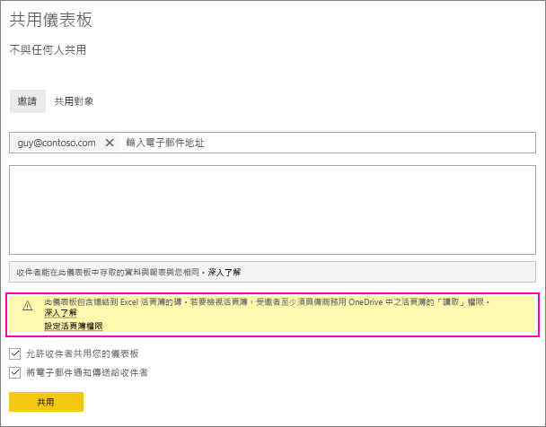
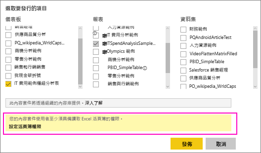

# 在 OneDrive 中共用連結到 Excel 檔案的 Power BI 儀表板
在 Power BI 中，您可以[連接到商務用 OneDrive 的 Excel 活頁簿](../connect-data/service-excel-workbook-files.md)，並從該活頁簿將磚釘選至儀表板。 當您共用儀表板，或建立包含該儀表板的內容組件時：

* 您的同事不需要活頁簿本身的權限，即可檢視磚。 因此，您可以建立內容組件，並了解您的同事可以看到從 OneDrive 的 Excel 活頁簿所建立的磚。
* 按一下磚，便會在 Power BI 中開啟活頁簿。 只有在您的同事對於商務用 OneDrive 的活頁簿至少擁有[讀取權限](https://support.office.com/article/Share-documents-or-folders-in-Office-365-1fe37332-0f9a-4719-970e-d2578da4941c)時，此活頁簿才會開啟。

## 共用包含活頁簿磚的儀表板
若要共用連回商務用 OneDrive 上 Excel 活頁簿的儀表板，請參閱[共用儀表板](service-share-dashboards.md)。 差別在於，您可以在共用前選擇修改連結 Excel 活頁簿的權限。

  

1. 輸入您同事的電子郵件地址。
2. 若要讓您的同事能檢視 Power BI 的 Excel 活頁簿，請選取 [前往商務用 OneDrive 設定活頁簿權限] 。
3. 在 OneDrive 上，視需要[修改權限](https://support.office.com/article/Share-files-and-folders-and-change-permissions-9fcc2f7d-de0c-4cec-93b0-a82024800c07)。
4. 選取 [共用] 。

>[!NOTE]
>您的同事無法從該活頁簿釘選其他磚，也無法從 Power BI 變更該 Excel 活頁簿。
> 
> 

## 建立包含內有活頁簿磚之儀表板的組織內容套件
當您[發佈內容套件](service-organizational-content-pack-create-and-publish.md)時，即為個別的同事或群組提供了存取權。 發行包含活頁簿連結的內容套件時，可以選擇在發行之前修改所連結 Excel 活頁簿的權限。

1. 在 [建立內容組件]  畫面上，輸入電子郵件地址、為內容套件提供標題與描述，並上傳映像。
2. 選取儀表板及 (或) 連結至商務用 OneDrive 的 Excel 活頁簿之報表。
   
    
3. 選取 [前往商務用 OneDrive 設定活頁簿權限] 。
4. 在 OneDrive 上，視需要[修改權限](https://support.office.com/article/Share-files-and-folders-and-change-permissions-9fcc2f7d-de0c-4cec-93b0-a82024800c07)。
5. 選取 [發行] 。

## 從 Power BI 工作區共用儀表板
從 Power BI 工作區共用儀表板，類似於從自己的工作區共用儀表板，不同之處在於這些檔案位於 Microsoft 365 工作區網站中，而不是私人商務用 OneDrive。 與工作區以外的人共用儀表板前，請修改 Excel 活頁簿的權限。

## 後續步驟
* [從 Excel 將磚釘選到 Power BI 儀表板](../create-reports/service-dashboard-pin-tile-from-excel.md)
* [Power BI 服務中的設計工具基本概念](../fundamentals/service-basic-concepts.md)
* 有其他問題嗎？ [試試 Power BI 社群](https://community.powerbi.com/)
