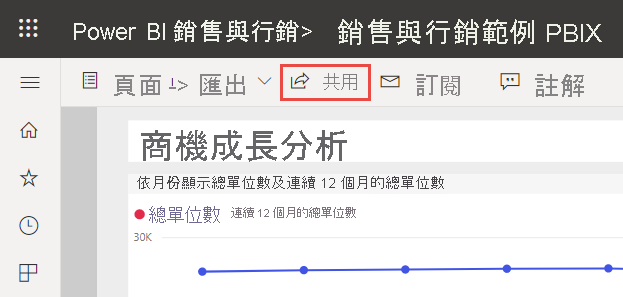
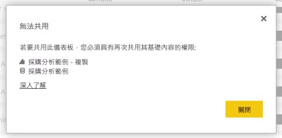

# 與同事和其他人共用 Power BI 儀表板和報表
「共用」是讓一些人存取您儀表板和報表的一種好方法。 Power BI 還提供[數種其他方式可進行共同作業及散發您的儀表板和報表](service-how-to-collaborate-distribute-dashboards-reports.md)。

不論是與組織內部或外部共用內容，您都會需要 [Power BI Pro 授權](../fundamentals/service-features-license-type.md)。 您的收件者也必須具有 Power BI Pro 授權，除非內容位於 [Premium 容量](../admin/service-premium-what-is.md)中。 

您可以從 Power BI 服務中的大部分位置共用儀表板和報表：我的最愛、最近項目、我的工作區、與我共用 (如果擁有者允許的話)。 如果擁有工作區中的[系統管理員、成員或參與者角色](service-new-workspaces.md#roles-in-the-new-workspaces)，您也可以從其他工作區共用。 

當您與他人共用儀表板或報表時，其可檢視該儀表板或報表並與之互動，但無法編輯它們。 除非您為基礎資料集套用資料列層級安全性 (RLS)，否則他們可以看到您儀表板和報表中的相同資料，並可以存取整個基礎資料集。  如果您允許的話，您與其共用儀表板或報表的同事，也可以與他們的同事共用。 組織外部人員可以檢視儀表板或報表並與其互動，但不能共用。 

您無法直接從 Power BI Desktop 「共用」。 您必須[將 Power BI Desktop 的報表發佈至](../create-reports/desktop-upload-desktop-files.md) Power BI 服務。 不過，您可以[從 Power BI 行動裝置應用程式共用儀表板](../consumer/mobile/mobile-share-dashboard-from-the-mobile-apps.md)。  

## 影片：共用儀表板
觀看 Amanda 與 Amanda 公司內外的同事共用儀表板。 然後遵循影片下方的逐步指示親自試試看。

<iframe width="560" height="315" src="https://www.youtube.com/embed/0tUwn8DHo3s?list=PL1N57mwBHtN0JFoKSR0n-tBkUJHeMP2cP" frameborder="0" allowfullscreen></iframe>

## 共用儀表板或報表

1. 在儀表板或報表清單中，或是在開啟的儀表板或報表中，選取 [共用] 。

2. 在頂端的方塊中，輸入個人、通訊群組或安全性群組的完整電子郵件地址。 您無法共用動態通訊清單。 
   
   您可以與其位址在您組織外的人員共用，但是您會看到一則警告。 請參閱本文中的[在組織外共用](#share-a-dashboard-or-report-outside-your-organization)以深入了解。
   
    
 
   >[!NOTE]
   >輸入方塊最多支援 100 個不同的使用者或群組。 如需與更多人共用的方式，請參閱本文中的[與超過 100 個使用者共用](#share-with-more-than-100-separate-users)。

3. 您可以視需要新增訊息。 這是選擇性的。
4. 若要讓同事將您的內容與他人共用，請核取 [允許收件者共用您的儀表板 (或報表)]。
   
   允許其他人共用稱為「再次共用」。 如果您允許的話，他們就可以從 Power BI 服務和行動裝置應用程式再次共用，或將電子郵件邀請轉寄給組織中的其他人。 邀請有效期一個月。 組織外部人員無法再次共用。 身為內容擁有者，您可以關閉再次共用，或是個別撤銷再次共用的權限。 請參閱本文中的[停止或變更共用](#stop-or-change-sharing)。

5. 如果您選取 [允許使用者使用基礎資料集建置新的內容]，他們可以根據此儀表板的資料集在其他工作區中建立自有報表。 深入了解[以不同工作區的資料集為基礎建立報表](../connect-data/service-datasets-discover-across-workspaces.md)。

1. 選取 [共用]。
   
   ![選取 [共用] 按鈕](media/service-share-dashboards/power-bi-share-dialog-share.png)  
   
   Power BI 會將電子郵件邀請傳送給個人而非群組，其中會有此共用內容的連結。 您會看到「成功」通知。 
   
   當組織內的收件者按一下連結時，Power BI 會將儀表板或報表新增至其 [與我共用] 清單頁面。 他們可以選取您的名稱，就能查看您已與他們共用的所有內容。 
   
   ![[與我共用] 清單頁面](media/service-share-dashboards/power-bi-shared-with-me-new-look.png)
   
   當組織外的收件者按一下連結時，他們會看到儀表板或報表，但不是在平常的 Power BI 入口網站中。 請參閱本文中的[與組織外的人員共用](#share-a-dashboard-or-report-outside-your-organization)以深入了解。

## 查看誰可以存取儀表板或報表
有時您需要查看您已共用內容的人員，以及這些人已共用內容的其他人員。

1. 在儀表板或報表清單中，或在儀表板或報表本身中，選取 [共用] 。 
2. 在 [共用儀表板] 或 [共用報表] 對話方塊中，選取 [存取]。
   
    ![[共用儀表板] 對話方塊的 [存取] 索引標籤](media/service-share-dashboards/power-bi-share-dialog-access.png)

    組織外部人員列為 [Guest]。

    在此檢視中，您可以在本文中[停止或變更共用權限](#stop-or-change-sharing)。 

## 在組織外部共用儀表板或報表
與組織外部人員共用時，其會收到具有共用儀表板或報表連結的電子郵件。 組織外部人員必須登入 Power BI 才能查看您共用的內容。 如果沒有 Power BI Pro 授權，其可以按一下連結來註冊以取得授權。

登入後，組織外部人員將不會在平常的 Power BI 入口網站中，而是在其瀏覽器視窗中看到共用儀表板或報表。 若要稍後存取此儀表板或報表，則其必須將連結設為書籤。

他們無法編輯這個儀表板或報表中的任何內容。 組織外部人員可以與圖表互動，並變更篩選條件或交叉分析篩選器，但無法儲存變更。 

只有您的直接收件者能看到共用儀表板或報表。 例如，如果您傳送電子郵件給 Vicki@contoso.com，則只有 Vicki 看得到儀表板。 沒有人可以看到儀表板，即使 Vicki 轉寄連結給組織外部人員也一樣。 Vicki 必須使用相同的電子郵件地址才能存取儀表板；如果 Vicki 以任何其他電子郵件地址登入，則 Vicki 將無法存取儀表板。

如果內部部署的 Analysis Services 表格式模型實作角色或資料列層級安全性，則組織外部人員就完全看不到任何資料。

使用安全性群組與包含具有外部電子郵件地址人員的群組共用，不要使用通訊群組。 在通訊群組中具有外部電子郵件的人員，除非是 Azure Active Directory (Azure AD) B2B 的來賓使用者，否則看不到您共用的內容。 深入了解 [Azure AD B2B 來賓使用者](../admin/service-admin-azure-ad-b2b.md)。

如果您從 Power BI 行動裝置應用程式傳送連結給組織外部的人員，按一下連結便會在瀏覽器中開啟儀表板，而不是在 Power BI 行動裝置應用程式中開啟。

### 允許外部使用者編輯內容

Power BI 系統管理員可以允許外部來賓使用者編輯和管理組織中的內容。 若是如此，您的外部使用者就不僅限於取用。 組織外部人員可以編輯和管理您組織內的內容。 深入了解[使用 Azure AD B2B 將 Power BI 內容散發給外部來賓使用者](../admin/service-admin-azure-ad-b2b.md)。

## 停止或變更共用
只有儀表板或報表擁有者可以開啟和關閉再次共用。

### 如果您尚未傳送共用邀請
* 在傳送邀請之前，清除邀請底部的 [允許收件者共用您的儀表板 (或報表)] 核取方塊。

### 如果您已共用儀表板或報表
1. 在儀表板或報表清單中，或在儀表板或報表本身中，選取 [共用] 。 
2. 在 [共用儀表板] 或 [共用報表] 對話方塊中，選取 [存取]。
   
    ![[共用儀表板] 對話方塊的 [存取] 索引標籤](media/service-share-dashboards/power-bi-share-dialog-access.png)
3. 選取 [讀取並再次共用] 旁的省略符號 ( **...** )，然後選取：
   
   ![[讀取並再次共用] 的省略符號](media/service-share-dashboards/power-bi-change-access.png)
   
   * [讀取]，阻止該員與其他人共用。
   * [移除存取權]，使該人員完全看不到共用的內容。

4. 在 [移除存取權] 對話方塊中，決定是否要一併移除報表和資料集等相關內容的存取權。 如果在移除項目時出現警告圖示 ，建議您也移除相關的內容。 否則，這些內容將無法正確顯示。

    

## 限制與考量
共用儀表板和報表時的重要事項︰

* 當您與同事共用儀表板時，也會與其共用基礎資料集。 除非您利用[資料列層級安全性 (RLS)](../admin/service-admin-rls.md) 來限制同事的存取權，不然他們可以存取整個資料集。 報表作者可以使用相關功能，來自訂使用者的報表檢視或報表互動體驗，例如隱藏資料行、限制對視覺效果的動作等。 這些自訂的使用者體驗，不會限制使用者在資料集中可以存取哪些資料。 您可以在資料集內使用[資料列層級安全性 (RLS)](../admin/service-admin-rls.md)，根據每個人的認證來判斷其可存取哪些資料。
* 共用您儀表板的每個人都可以看到此儀表板，並在[閱讀檢視](../consumer/end-user-reading-view.md#reading-view)中與相關的報表互動。 一般來說，組織外部人員無法建立報表，或在現有的報表中儲存變更。 不過，如果您選取 [允許使用者使用基礎資料集建置新的內容]，則組織外部人員可以根據此儀表板或報表的資料集在其他工作區中建立自有報表。
* 雖然沒有人可以看到或下載資料集，但他們可以使用 [在 Excel 中進行分析] 功能直接存取資料集。 系統管理員可以限制群組中的每個人能否使用 [在 Excel 中進行分析]。 不過，此限制適用於該群組中的每個人，以及群組所屬的每個工作區。
* 每個人都可以手動[重新整理資料](../connect-data/refresh-data.md)。
* 如果電子郵件使用 Microsoft 365，則可輸入與通訊群組建立關聯的電子郵件地址來與通訊群組成員共用。
* 與您共用電子郵件網域的同事，以及與不同網域但在相同租用戶中註冊的同事，可以與其他人共用儀表板。 例如，假設網域 contoso.com 和 contoso2.com 都註冊在相同的租用戶中，而您的電子郵件地址為 konrads@contoso.com。 ravali@contoso.com 和 gustav@contoso2.com 都可以共用您的儀表板，只要您將共用的權限授與這兩個電子郵件地址即可。
* 如果您的同事已能存取特定儀表板或報表，則當你在儀表板或報表上時，您只要複製 URL 即可將其傳送為直接連結。 例如：`https://powerbi.com/dashboards/g12466b5-a452-4e55-8634-xxxxxxxxxxxx`。
* 同樣地，如果您的同事已能存取特定儀表板，您可以[傳送基礎報表的直接連結](service-share-reports.md)。 

### 與超過 100 個不同的使用者共用

在單一的共用動作中，您最多可以與 100 個使用者或群組共用。 不過，您可以讓超過 500 個使用者存取某個項目。 以下為一些建議：

- 個別指定使用者來多次共用。
- 與包含所有使用者的使用者群組共用。 
- 在工作區中建立報表或儀表板，然後從工作區建立應用程式。 您可以與其他更多人共用應用程式。 深入了解如何[在 Power BI 中發佈應用程式](service-create-distribute-apps.md)。

## 針對共用問題進行疑難排解

### 我的儀表板收件者看到磚中出現鎖定圖示或「需要權限」的訊息

與您共用的人員在嘗試檢視報告時，可以看到儀表板中鎖定的圖格或「需要權限」訊息。

若是如此，您需要授與他們基礎資料集的權限。

1. 前往內容清單中的 [資料集] 索引標籤。

1. 選取資料集旁的省略符號 ( **...** )，然後選取 [管理權限]。

    

1. 選取 [新增使用者]。

    ![選取 [新增使用者]](media/service-share-dashboards/power-bi-share-dataset-add-user.png)

1. 輸入個人、通訊群組或安全性群組的完整電子郵件地址。 您無法共用動態通訊清單。

    

1. 選取 [新增]。

### 我無法共用儀表板或報表

若要共用儀表板或報表，您必須具備再次共用基礎內容 (亦即，任何相關報表和資料集) 的權限。 如果您看到無法共用的訊息，可請報表作者提供再次共用這些報表和資料集的權限。

## 後續步驟

* [應該如何共同作業和共用儀表板和報表？](service-how-to-collaborate-distribute-dashboards-reports.md)
* [共用已篩選的 Power BI 報表](service-share-reports.md)
* 有問題嗎？ [試試 Power BI 社群](https://community.powerbi.com/)
