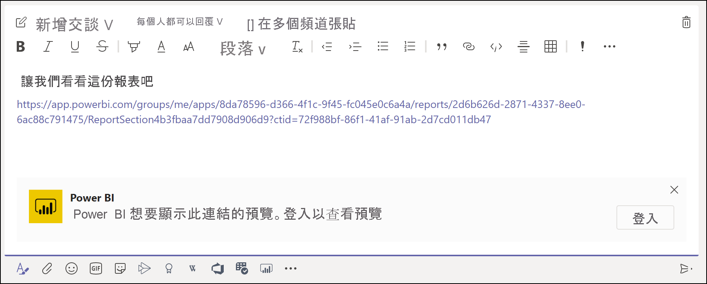
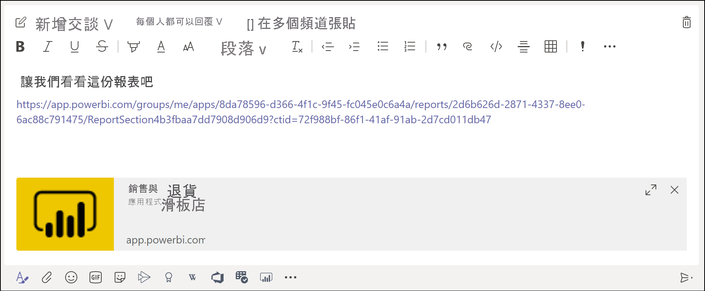

# 在 Microsoft Teams 中取得 Power BI 連結預覽

將報表、儀表板和應用程式的連結貼至 Microsoft Teams 訊息方塊時，連結預覽會顯示該連結的相關資訊。 Power BI 中的下列項目可擁有連結預覽：

- 報表
- 儀表板
- 應用程式

連結預覽服務會要求使用者登入。 若要登出，請選取訊息方塊底部的 [Power BI] 圖示。 然後，選取 [登出]。

如需 Power BI 和 Teams 如何共同合作的背景資訊，包括所需符合的要求，請參閱[在 Microsoft Teams 中使用 Power BI 共同作業](service-collaborate-microsoft-teams.md)。

## 取得連結預覽

請遵循下列步驟來取得 Power BI 服務中的內容連結預覽。

1. 將連結複製到 Power BI 服務中的報表、儀表板或應用程式。 例如，從瀏覽器網址列複製連結。

1. 在 Microsoft Teams 訊息方塊中貼上連結。 若出現提示，請登入連結預覽服務。 您可能必須等候幾秒鐘，才會載入連結預覽。

    

1. 成功登入之後，即會出現基本的連結預覽。

    

1. 選取**展開**圖示，以顯示豐富的預覽卡片。

    

1. 豐富的連結預覽卡片會顯示連結和相關動作按鈕。

    ![[豐富連結] 預覽卡片的螢幕擷取畫面。](media/service-teams-link-preview/service-teams-link-preview-nice-card.png)

1. 傳送訊息。

## 已知的問題及限制

- 連結預覽服務不支援單一登入。
- 連結預覽在會議聊天或私人頻道中無法使用。
- 如有其他問題，請參閱＜在 Microsoft Teams 中共同作業＞一文中的[＜已知問題和限制＞](service-collaborate-microsoft-teams.md#known-issues-and-limitations)一節。

## 後續步驟

- [在 Microsoft Teams 中使用 Power BI 共同作業](service-collaborate-microsoft-teams.md)

有其他問題嗎？ [嘗試在 Power BI 社群提問](https://community.powerbi.com/)。
