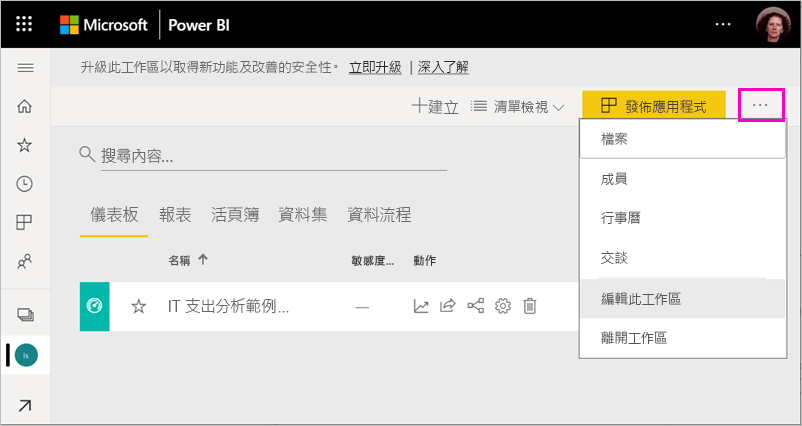
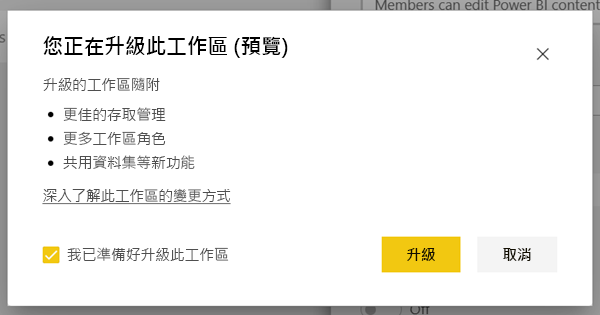
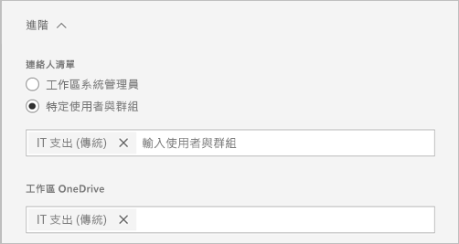
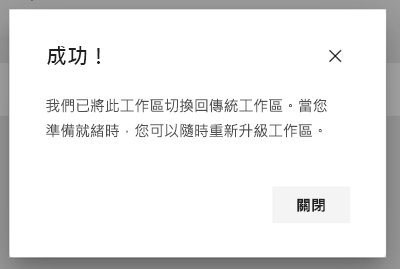

# 將傳統工作區升級至 Power BI 中的新工作區

此文章說明如何將傳統工作區升級或「移轉」至新的工作區體驗。 您可以升級任何傳統工作區。 新的工作區具有更細微的工作區角色，因此您可以更有效地管理內容的存取權。 由於已升級的工作區與原始 Office 365 群組的連線更加鬆散，因此，您也會有更大的彈性來管理這些工作區。 了解[新的工作區體驗](service-new-workspaces.md)。 

>[!NOTE]
>工作區升級是以公開預覽的形式提供。 

不過，您的工作區可能會有所變更，您必須注意並進行規劃。 例如，新的工作區體驗中不支援內容套件。 請參閱此文章稍後的[升級考量與限制](#upgrade-considerations-and-limitations)一節。

## 升級後要做的事

升級之後，您應該進行幾件事。 升級之前，最好先進行規劃：
- 請檢閱存取清單，並了解[升級後的權限](#permissions-after-upgrade)。
- 請檢閱[連絡人清單](#modify-the-contact-list)，並確定已依照您的需求設定。
- 如果還沒有，請了解[新的工作區體驗](service-new-workspaces.md)。

## 升級傳統工作區

任何工作區系統管理員都可以升級工作區。 針對傳統工作區，若要成為工作區管理員，您必須是基礎 Office 365 群組的擁有者。 若要升級工作區，請遵循下列步驟。

1. 在工作區內容清單中，選取 [更多選項 (...)]  > [編輯此工作區]。

    

1. 展開 [進階]，然後選取 [立即升級]。

    

1. 檢閱對話方塊資訊。 如果您已在工作區中發佈或安裝內容套件，您會看到警告。 當您準備好時，請核取 [我已準備好升級此工作區]，然後選取 [升級]。

    

2. 升級期間，您會看到 [正在升級] 訊息。 升級您的工作區通常需要不到一分鐘的時間。

1. 升級完成後，您會看到 [成功] 對話方塊。 我們建議您閱讀[在 Power BI 的新工作區中組織工作](service-new-workspaces.md)，讓您熟悉新的工作區與傳統工作區有何不同。

### 對其他工作區使用者的影響

我們建議您在離峰時段，當很少有使用者主動查看或編輯工作區中的項目時進行升級。

主動使用工作區的使用者會被要求重新整理其瀏覽器。 編輯報表的使用者可以選擇在重新整理之前儲存。

## 升級考量與限制

- 您工作區的 URL 和識別碼、它所包含的內容，以及從工作區發佈的應用程式不會變更。 安裝在工作區中的內容套件內容會分開處理。 如需詳細資訊，請參閱此文章中的[升級期間的內容套件](#content-packs-during-upgrade)。
- 新的工作區體驗中不支援內容套件。 請閱讀[已發佈的內容套件](#published-content-packs)或[已安裝的內容套件](#installed-content-packs)的相關章節，以了解如何在升級期間處理它們。 我們建議您先刪除工作區中已安裝或已發佈的內容套件，然後再進行升級。
- 您傳統工作區的 Office 365 群組不會受到 Power BI 中的工作區升級影響。 任何小組、SharePoint 網站、信箱或由 Office 365 管理的其他資源都不會變更。 升級 Power BI 工作區之後，它們會保持不變。 Office 365 群組會繼續以先前的方式存在。
- 在升級之後，您的工作區受到保護的方式有所變更。 如需詳細資訊，請參閱[升級後的工作區權限](#permissions-after-upgrade)一節。
- 如果需要，可以選擇**返回傳統工作區**。 但是，它在升級之前無法完全還原工作區的某些層面。 如果您開始使用僅在新的工作區體驗中可用的功能，則將無法返回。 升級之後，返回選項會提供 30 天的時間。

## 升級後的權限

在工作區內容清單頂端的功能表列中選取 [存取]，以檢閱升級後的權限。

每個 Office 365 群組擁有者都會個別新增到已升級工作區的系統管理員角色。 Office 365 群組本身會新增至工作區角色。 其新增的角色取決於傳統工作區是「唯讀」或「讀寫」：

- 當工作區設定為 [成員可以編輯 Power BI 內容] 時，在升級之後，會將 Office 365 群組新增至具有**成員**角色的工作區存取清單。
- 當工作區設定為 [成員只能讀取 Power BI 內容] 時，在升級之後，在升級之後，會將 Office 365 群組新增至具有**檢視人員**角色的工作區存取清單。

因為 Office 365 群組已在工作區中獲得角色，所以升級之後加入 Office 365 群組的任何使用者在工作區中都有該角色。 不過，如果您在升級後將新的擁有者新增至 Office 365 群組，他們就不會擁有工作區的系統管理員角色。

### 升級前後的角色差異

傳統和新的工作區中的工作區角色是不同的。 新的工作區體驗可讓您將工作區角色提供給 Office 365 群組、安全性群組或通訊群組清單。

- **成員**可以共用個別的項目，並透過「成員」、「參與者」或「檢視人員」角色，提供整個工作區的存取權
- **檢視人員**只能查看內容，不能匯出基礎資料或在 Excel 中分析任何工作區資料集，除非他們擁有建置權限。

任何可透過共用或應用程式權限存取工作區中項目的使用者，都會繼續擁有這些項目的存取權。 具有工作區存取權的任何人也都可以存取從工作區發佈的應用程式。 這些使用者不會列在應用程式存取清單中。

我們建議您評估是否要使用新的「參與者」角色。 升級之後，您可以將 Office 365 群組變更為具有 [存取] 窗格中的「參與者」角色。

升級之後，您可以考慮為工作區系統管理員建立安全性或 Office 365 群組或通訊群組清單，而不是透過對個別使用者的角色指派來管理存取權。

深入了解[新的工作區中的角色](service-new-workspaces.md#roles-in-the-new-workspaces)。

## 升級後的授權

「系統管理員」、「成員」或「參與者」工作區角色中的使用者需要 Power BI Pro 授權才能存取工作區。

如果工作區在共用的容量中，則「檢視人員」工作區角色中的使用者也需要 Power BI Pro 授權才能存取工作區。 不過，如果工作區是在 Premium 容量中，則「檢視人員」工作區角色中的使用者不需要 Pro 授權即可存取工作區。

## 其他新的工作區功能

新的工作區體驗具有傳統工作區所沒有的功能。 其中一個差異是設定連絡人清單的能力，與工作區系統管理員或擁有者不同。 其中一個相似之處，在於它仍然連線到 Office 365 群組 SharePoint 文件庫。 

### 修改連絡人清單

1. 在工作區內容清單頂端的功能表列中，選取 [設定] 以存取工作區設定。

    

2. 在 [進階] 下，工作區 [連絡人清單] 已設定為從其中升級工作區的 Office 365 群組。 您可以將更多使用者或群組新增至連絡人清單，或將其切換至工作區系統管理員。

    

### 工作區 OneDrive 

升級之後，工作區 **OneDrive** 會連線到 Office 365 群組 SharePoint 文件庫。 此文件庫會在 [取得資料] > [檔案] 體驗中顯示為 [OneDrive] 選項。 請注意，並非所有工作區使用者都可以擁有該文件庫的權限 (如果他們不在 Office 365 群組中)。

## 升級期間的內容套件

新的工作區體驗不支援內容套件。 相反地，請使用應用程式和共用資料集，在工作區中發佈內容。 建議您在升級之前，先從工作區移除已發佈或已安裝的內容套件。 不過，如果您升級時有已發佈或已安裝的內容套件，升級程序會嘗試保留內容，如下所述。  升級之後，就無法還原內容套件或將內容的關聯還原至內容套件。

### 已發佈的內容套件

升級期間會移除從工作區發佈的內容套件。 您將無法在升級之後發佈或更新它們，即使還原回傳統工作區也一樣。 如果其他人已在自己的工作區中安裝您的內容套件，則在升級之後，他們會在其工作區中看到內容套件內容的複本。 如需詳細資訊，請參閱＜已安裝的內容套件＞一節。

### 已安裝的內容套件

當您升級工作區，或升級內容套件時所發行的工作區時，已安裝的內容套件會發生重要的變更。 升級之後，您的工作區會包含內容套件內容的複本。 它會連線到原始工作區中的原始資料集。

不過，有重要的變更：

- 如果內容套件已更新，內容就不會再更新。
- URL 和項目識別碼會變更，並且需要更新您與他人共用的任何書籤或連結。
- 從您的工作區對原始內容套件進行的任何使用者自訂都會遺失。 自訂包括訂用帳戶、警示、個人書籤、常設篩選和我的最愛。
- 新使用者可能無法存取內容套件中的資料集。 您需要與資料集擁有者合作，以確保工作區使用者可以存取資料。

## 返回傳統工作區

在升級體驗的過程中，您可以選擇在升級後的 30 天內返回傳統工作區。 這項功能會還原工作區內容與原始 Office 365 群組的關聯。 如果您的組織在使用新的工作區體驗時遇到重大問題，就可以使用它。 不過，有一些限制。 請先閱讀此文章中的[切換回傳統的考量](#considerations-for-switching-back-to-classic)。

若要返回，您必須是工作區升級前所關聯之 Office 365 群組的擁有者。 請遵循下列步驟。

1. 在工作區內容清單中，選取 [更多選項 (…)]  > [工作區設定]。

    

1. 展開 [進階]，然後選取 [切換回傳統]。 如果您無法使用此選項，請參閱此文章中的[切換回傳統的考慮](#considerations-for-switching-back-to-classic)。

    

1. 當您準備好時，請核取 [我已準備好切換回傳統] 方塊，然後選取 [切換回傳統]。  在此對話方塊中，您可能會看到警告或封鎖器。 如果您遇到這些問題，請參閱此文章中[切換回傳統的考量](#considerations-for-switching-back-to-classic)。

    

1. 完成切換後，您會看到確認對話方塊。

    

### 切換回傳統的考量

如果您的工作區符合下列任何一項陳述，就無法切換：

- Office 365 群組已刪除。
- 升級後已超過 30 天。
- 工作區中的資料集是由其他工作區中的報表或儀表板所使用。 這是怎麼發生的？ 假設您在升級之前從工作區發佈了內容套件，而有人在另一個工作區中安裝了內容套件。 升級之後，這些資料集會由該內容套件中的報表和儀表板使用。
- 工作區是應用程式生命週期管理管線的一部分。
- 此工作區會用於範本應用程式。
- 工作區會使用大型模型功能。
- 工作區會使用新的使用計量功能。

當您切換回傳統工作區時，並沒有還原原始工作區的精確複本。 會發生下列變更：

- 工作區的權限是由已升級工作區原先連線的 Office 365 群組所設定。
  - Office 365 群組的任何系統管理員都會成為傳統工作區的系統管理員。
  - Office 365 群組的任何成員都會成為傳統工作區的成員。 如果傳統工作區設定為 [成員只能讀取 Power BI 內容]，則會還原此設定。
  - 升級完成後新增至工作區的任何使用者或使用者群組 (在 Office 365 群組外部) 都會失去工作區的存取權。 將他們加入 Office 365 群組，以授與他們存取權。 請注意，Office 365 群組不允許在成員資格中巢狀化安全性或通訊群組。
  - 有權存取該工作區之應用程式的使用者，將可以繼續存取該應用程式。
  - 透過共用取得工作區中項目存取權的使用者，將可以繼續存取這些項目。
- 升級之前從傳統工作區發佈的內容套件不會還原。
- 升級之前安裝在傳統工作區中的內容套件不會還原。
- 升級之後，使用者在工作區中所建立的訂用帳戶將被刪除。 升級之前已存在的訂用帳戶會繼續如預期般運作。
- 不會保留資料警示。 它們會被移除。
- 如果您在升級之後重新命名工作區，則會還原工作區的名稱以符合 Office 365 群組的名稱。
- 進行中的作業 (如重新整理) 不會受到工作區升級的影響。

## 管理租用戶到新工作區的移轉 

有些組織想要將許多或所有工作區移至新的工作區體驗。 工作區升級工具著重於讓工作區系統管理員能夠進行升級。 對於想要管理此類程序的組織，他們可以採取下列步驟。

1. Power BI 系統管理員入口網站中的工作區清單和對應的 API 會提供 Power BI 中所有工作區的清單。 傳統工作區在清單中會顯示為「群組」類型。
2. 與個別的 Office 365 群組擁有者或 Office 365 系統管理員一起使用，讓他們升級工作區。 如果您想要升級工作區，您必須成為群組的「擁有者」。

工作區升級功能不提供大量或以程式設計方式升級的工具。 此外，在您的組織中建立的新 Office 365 群組仍會繼續在 Power BI 中顯示。 
   
   
## 已知問題

您可能會遇到幾個已知問題：
- 升級之後，使用者可能會看到 [無法載入模型] 警告對話方塊。 這則訊息為錯誤地顯示且可以忽略。 
- 升級之後，部分工作區名稱與升級前不同。 發生這種情況時，工作區名稱會還原為先前的工作區名稱，或工作區名稱會變成空白。 若要解決此問題，請將工作區重新命名為想要的名稱。
- 升級已安裝內容套件的工作區之後，您可能會在工作區中看到在升級前看不到的其他儀表板。 在某些情況下，如果內容套件最近未更新，就會發生這種情況。 您可以安全地移除這些儀表板。

## 後續步驟

* [在新的工作區體驗中組織工作](service-new-workspaces.md)
* [建立新的工作區](service-create-the-new-workspaces.md)
* [建立傳統工作區](service-create-workspaces.md)
* 有問題嗎？ [嘗試在 Power BI 社群提問](https://community.powerbi.com/)
