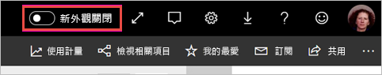
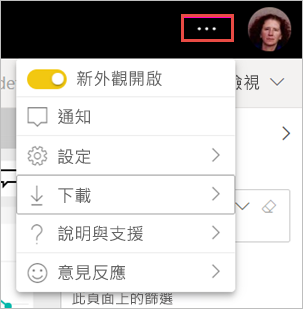

# 加入工作區「新外觀」(預覽)

工作區有與 Power BI 服務[新外觀](../service-new-look.md)一致的新外觀。 任何使用 Power BI 服務 (app.powerbi.com) 的人都可以加入。 當您開啟黑色標題列中的 [新外觀]  時，即會加入報表和工作區的新外觀。 所有工作區 (傳統工作區與新工作區) 都能因新外觀受益。

要尋找 **Power BI Desktop** 中新外觀的相關資訊嗎？ 請參閱[使用 Power BI Desktop 中已更新的功能區](../desktop-ribbon.md)。

## 新外觀的功能

:::image type="content" source="media/service-workspaces-new-look/power-bi-workspace-new-look-numbered.png" alt-text="工作區的新外觀，其中含有用於說明的註標編號":::

|數字  |運作方式 |
|---------|---------|
|    | **取得資料**：較容易將內容新增至工作區。 選取 [+ 新增]  按鈕，即可連線到資料、開啟檔案，以及建立報表、儀表板等等。  |
|   | **檢視切換器**：若要查看資料流程、資料集、報表及儀表板之間的關聯，以及它們與其他資料來源的關聯，請在 [清單]  檢視與 [譜系]  檢視之間做切換。 |
|  | **在工作區內搜尋**：在新搜尋方塊中搜尋工作區中的所有內容。  |
|   | **清單與索引標籤**：就像 SharePoint 一樣，工作區中的所有內容都在儀表板、報表、資料集等等的簡單列表中。 您已不再會將工作區開啟至可能空白的 [儀表板]  索引標籤，而納悶內容在哪裡。 以下是新的索引標籤順序：  **全部**：顯示工作區中的所有內容 (儀表板、報表、活頁簿、編頁報表、資料集及資料流程)。  **內容**：收集工作區內所有建立以供取用的內容 (儀表板、報表、活頁簿及編頁報表)。  **資料集 + 資料流程**：收集工作區中的所有資料集與資料流程，以方便管理資料。 |
|  | **篩選**：針對有數百個成品的工作區，您可以在 [篩選] 窗格中篩選內容。 套用篩選條件之後，您就會在內容清單頂端看到該篩選條件。 |

**快速動作**：將滑鼠游標暫留在清單中的內容上時，您會看到該項目的最常見動作，再加上 [更多選項 (...)]  功能表上可用的其他動作。

:::image type="content" source="media/service-workspaces-new-look/power-bi-workspace-new-look-quick-actions.png" alt-text="新工作區中的快速動作":::

## 選擇使用新外觀

任何 Power BI 服務使用者都可以選擇使用新外觀。 只要將 [新外觀關閉]  滑動到 [新外觀開啟]  即可。

如果您需要回復舊外觀，只要將其滑動回到 [關閉]   即可。 如果您沒有看到此項目，請選取右上角的省略符號功能表。

## 後續步驟

- [使用 Power BI Desktop 中已更新的功能區](../desktop-ribbon.md)
- [Power BI 服務的「新外觀」](../service-new-look.md)
- 有問題嗎？ [試試 Power BI 社群](https://community.powerbi.com/)

