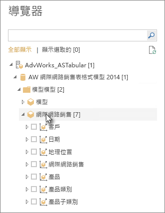

# 在 Power BI Desktop 中連線至 Analysis Services 表格式資料
使用 Power BI Desktop 時，有兩種方式可以連線到 SQL Server Analysis Services 表格式模型並從中取得資料：使用即時連線瀏覽，或選取項目並將其匯入至 Power BI Desktop。

以下將進一步說明。

**使用即時連線瀏覽**：使用即時連線時，表格式模型或檢視方塊中的資料表、資料行和量值等項目，都會出現在 Power BI Desktop 的 [欄位]  窗格清單中。 您可以使用 Power BI Desktop 的進階視覺效果和報表工具，以全新且高度互動的方式來瀏覽表格式模型。

即時連線時，不會從表格式模型匯入任何資料到 Power BI Desktop。 每當您與某個視覺效果互動時，Power BI Desktop 會查詢表格式模型並計算您所看到的結果。 您在表格式模型中所看到一律為可用的最新資料，該資料可能來自上次處理階段，或來自表格式模型中可用的 Direct Query 資料表。 

請記住，表格式模型非常安全。 您對於所連線表格式模型的權限會決定出現在 Power BI Desktop 中的項目。

當您在 Power BI Desktop 中建立動態報表時，您可以將其發佈到 Power BI 網站以與他人共用。 當您透過表格式模型的即時連線將 Power BI Desktop 檔案發佈到 Power BI 網站時，必須由系統管理員安裝及設定內部部署資料閘道。 若要深入了解，請參閱[內部部署資料閘道](service-gateway-onprem.md)。

**選取項目並匯入至 Power BI Desktop**：當您使用這個選項連線時，您可以選取表格式模型或檢視方塊中的資料表、資料行和量值等項目，將其載入 Power BI Desktop 模型。 使用 Power BI Desktop 的 Power Query 編輯器，可進一步塑造您想要的內容及其模型化功能，以進一步建立資料模型。 因為 Power BI Desktop 與表格式模型之間沒有維持即時連線，所以您可以接著離線瀏覽 Power BI Desktop 模型，或將其發佈至 Power BI 網站。

## 連線到表格式模型
1. 在 Power BI Desktop 的 [首頁]  索引標籤上，選取 [取得資料]   > [更多]   > [資料庫]  。
   
1. 依序選取 [SQL Server Analysis Services 資料庫]  和 [連線]  。
   
   ![選取 [SQL Server Analysis Services 資料庫]](media/desktop-analysis-services-tabular-data/pbid_sqlas_getdata_as.png)
3. 在 [SQL Server Analysis Services 資料庫]  視窗中，輸入**伺服器**名稱並選擇連線模式，然後選取 [確定]  。
   
   ![[SQL Server Analysis Services 資料庫] 視窗](media/desktop-analysis-services-tabular-data/pbid_sqlas_getdata_as_server.png)
4. 在 [導覽器]  視窗中，這個步驟取決於您選取的連線模式：

   - 若要即時連線，請選取表格式模型或檢視方塊。
  
      
   - 如要選擇選取項目並取得資料，請選取表格式模型或檢視方塊，然後選取要載入的特定資料表或資料行。 若要在載入前先塑造您的資料，請選取 [編輯查詢]  開啟 Power Query 編輯器。 當您完成時，選取 [載入]  將資料匯入至 Power BI Desktop。

      

## 常見問題集
**問：** 我需要有內部部署資料閘道嗎？

**答：** 不一定。 如果您使用 Power BI Desktop 即時連線到表格式模型，但不想發佈到 Power BI 網站，則不需要閘道。 相反地，若您想要發佈到 Power BI 網站，就需要資料閘道，以確保 Power BI 服務與您內部部署 Analysis Services 伺服器之間的通訊安全。 安裝資料閘道之前，請先諮詢您的 Analysis Services 伺服器管理員。

若選擇選取項目並取得資料，因為您會將表格式模型資料直接匯入至 Power BI Desktop 檔案，所以不需要任何閘道。

**問：** 從 Power BI 服務即時連線到表格式模型，與從 Power BI Desktop 即時連線有何不同？

**答：** 當您從 Power BI 服務中的網站即時連線到表格式模型，然後連線到組織內部部署的 Analysis Services 資料庫時，需要有內部部署資料閘道確保兩者之間的通訊安全。 當您從 Power BI Desktop 即時連線到表格式模型時，因為要連線的 Power BI Desktop 和 Analysis Services 伺服器都是在組織內部部署執行，所以不需要閘道。 但您若要將 Power BI Desktop 檔案發佈到您的 Power BI 網站，就需要閘道。

**問：** 如果我建立即時連線，是否可以連線到同一個 Power BI Desktop 檔案中的另一個資料來源？

**答：** 不會。 您無法瀏覽即時資料並連線到同檔案中的另一種資料來源類型。 如果您已經匯入資料或連線到 Power BI Desktop 檔案中的不同資料來源，則必須建立新檔案才能即時瀏覽。

**問：** 如果我建立即時連線，是否可以在 Power BI Desktop 中編輯模型或查詢？

**答：** 您可以在 Power BI Desktop 中建立報表層級量值，但在瀏覽即時資料時，系統將會停用所有其他查詢和模型化功能。

**問：** 如果我建立即時連線，它是否安全？

**答：** 是。 您目前的 Windows 認證會用來連接到 Analysis Services 伺服器。 當即時瀏覽時，您無法使用 Power BI 服務或 Power BI Desktop 中的基本認證或預存認證。

**問：** 我在 [導覽器] 中看到模型和檢視方塊。 有何不同？

**答：** 檢視方塊是表格式模型的特定檢視。 根據獨特資料分析需求，它可能只會包含特定資料表、資料行或量值。 表格式模型至少一定會包含一個檢視方塊，該檢視方塊可能包含模型中的所有項目。 如果不確定該選取哪個檢視方塊，請洽詢您的系統管理員。

**問：** 是否有任何 Analysis Services 功能會變更 Power BI 的運作方式？

**答：** 是。 依據表格式模型所使用的功能，使用 Power BI Desktop 的體驗可能會隨之改變。 部分範例包括：
* 您在模型中看到的量值，可能會聚集在 [欄位]  窗格清單上方，而不是資料表中排列整齊的資料行。 不要擔心，您仍然可以像平常一樣使用這些模型量值，只不過這樣更容易找到這些量值罷了。

* 如果表格式模型已定義計算群組，您就只能搭配模型量值使用，而不能搭配透過將數值欄位新增至視覺效果所建立的隱含量值。 模型可能還會以手動方式設定 **DiscourageImplicitMeasures** 旗標，這具有相同的效果。 若要深入了解，請參閱 [Analysis Services 中的計算群組](https://docs.microsoft.com/analysis-services/tabular-models/calculation-groups#benefits)。

## 在初始連接之後變更伺服器名稱
在建立具有即時連線瀏覽的 Power BI Desktop 檔案之後，有時候您可能想將連線切換至其他伺服器。 例如，如果您在連接到開發伺服器時，以及在發佈到 Power BI 服務之前建立 Power BI Desktop 檔案，您會想要將連接切換至實際執行伺服器。

變更伺服器名稱：

1. 從 [常用]  索引標籤選取 [編輯查詢]  。

2. 在 [SQL Server Analysis Services 資料庫]  視窗中，輸入新的**伺服器**名稱，然後選取 [確定]  。

   
## 疑難排解 
下列清單描述連線至 SQL Server Analysis Services (SSAS) 或 Azure Analysis Services 時的所有已知問題： 

* **錯誤：無法載入模型結構描述**：此錯誤通常會在無權存取資料庫/模型的使用者連線至 Analysis Services 時發生。

