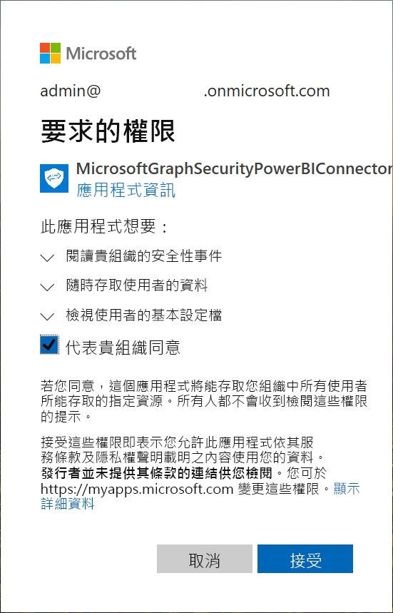
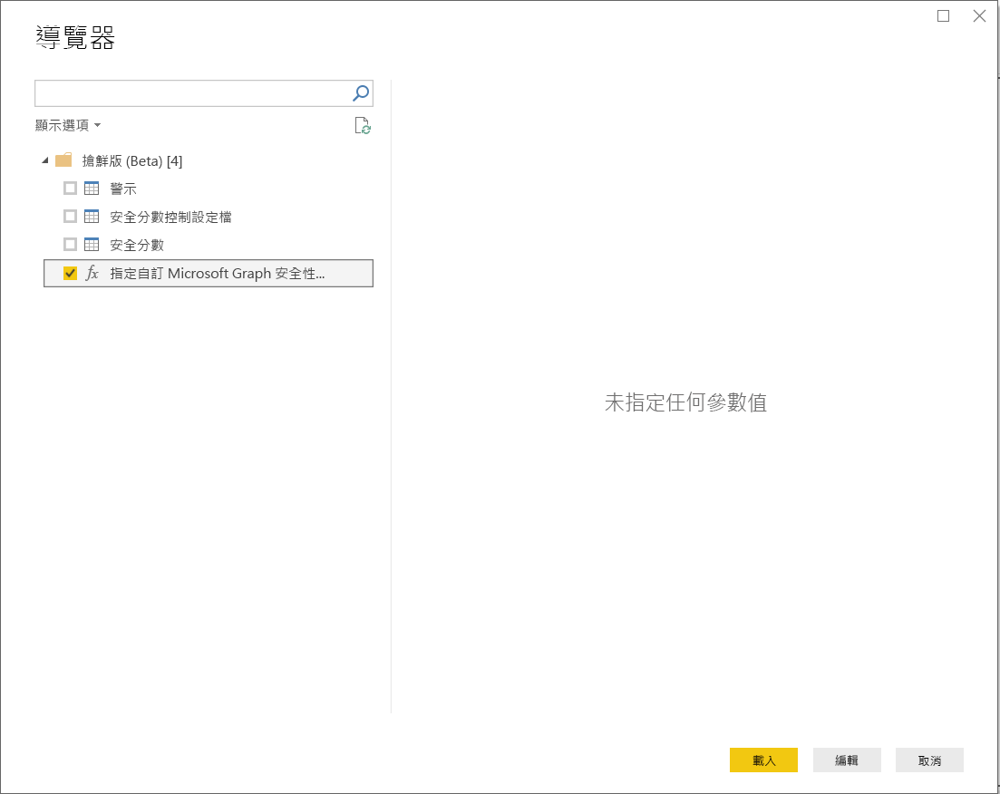
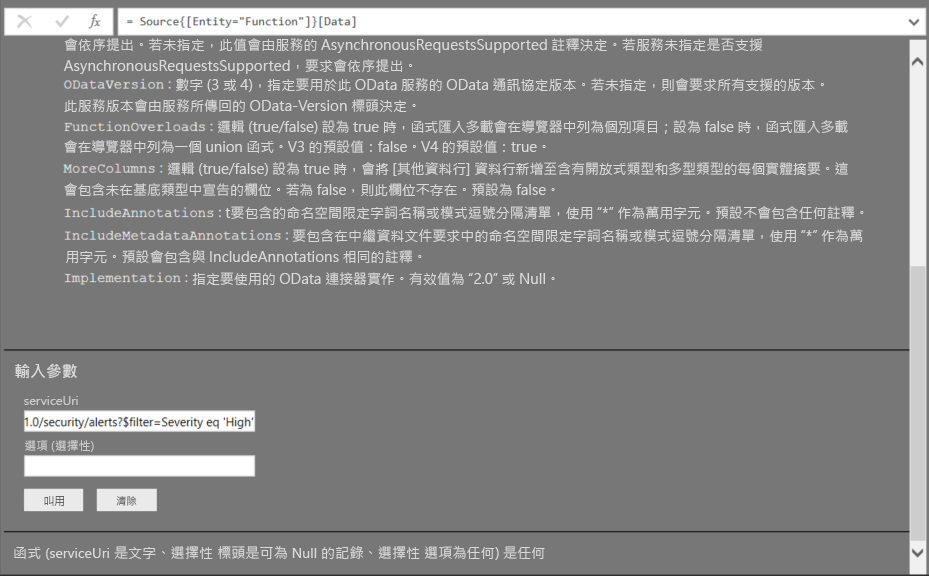
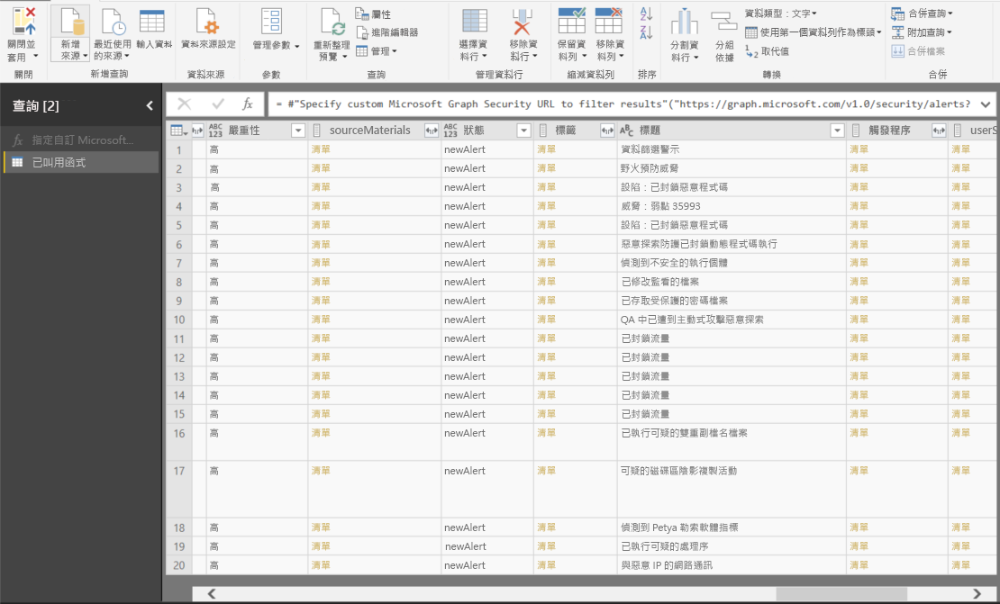

# 在 Power BI Desktop 中連線至 Microsoft Graph 安全性 API

使用 Power BI Desktop 的 Microsoft Graph 安全性連接器連線至 [Microsoft Graph 安全性 API](https://aka.ms/graphsecuritydocs)。 然後建置儀表板和報表，以取得與安全性相關之[警示](https://docs.microsoft.com/graph/api/resources/alert?view=graph-rest-1.0)和[安全分數](https://docs.microsoft.com/graph/api/resources/securescores?view=graph-rest-beta)的見解。

Microsoft Graph 安全性 API 連線 Microsoft [多個安全性解決方案](https://aka.ms/graphsecurityalerts)及其生態系統合作夥伴，以便更容易建立警示的相互關聯。 這項組合能讓您存取豐富的內容資訊並簡化自動化。 它能讓組織快速深入了解，因應多種安全性產品問題，同時降低成本和複雜度。

## 使用 Microsoft Graph 安全性連接器的必要條件

若要使用 Microsoft Graph 安全性連接器，您必須「明確」  取得 Azure Active Directory (Azure AD) 租用戶管理員的同意。 請參閱 [Microsoft Graph 安全性驗證需求](https://aka.ms/graphsecurityauth)。
同意需要有連接器的應用程式識別碼和名稱，此處已引用，也可於 [Azure 入口網站](https://portal.azure.com)取得：

| 屬性 | 值 |
|----------|-------|
| **應用程式名稱** | `MicrosoftGraphSecurityPowerBIConnector` |
| **應用程式識別碼** | `cab163b7-247d-4cb9-be32-39b6056d4189` |
| **重新導向 URI** | `https://oauth.powerbi.com/views/oauthredirect.html` |
|||

若要授與連接器同意，Azure AD 租用戶管理員可以採用下列兩種方法的其中之一：

* [授與 Azure AD 應用程式同意](https://docs.microsoft.com/azure/active-directory/develop/v2-permissions-and-consent)

* 透過[應用程式同意體驗](https://docs.microsoft.com/azure/active-directory/develop/application-consent-experience)回應邏輯應用程式在第一次執行期間所提交的要求
   
登入 Microsoft Graph 安全性連接器的使用者帳戶，**如果**不是「安全性系統管理員」角色的成員，就必須已獲指派「Azure AD 安全性讀取者」角色。 請參閱 [Assign Azure AD roles to users](https://docs.microsoft.com/graph/security-authorization#assign-azure-ad-roles-to-users) (將 Azure AD 角色指派給使用者)。

## 使用 Microsoft Graph 安全性連接器

請遵循下列步驟使用連接器：

1. 從 Power BI Desktop 的 [常用] 功能區選取 [取得資料] > [更多]。
2. 在視窗左側的類別清單中選取 [線上服務]。
3. 選取 [Microsoft Graph 安全性搶鮮版 (Beta)]。

    ![[取得資料] 對話方塊](media/desktop-connect-graph-security/GetData.PNG)
    
4. 在 [Microsoft Graph 安全性] 視窗中選取要查詢的 Microsoft Graph API 版本：**v1.0** 或**搶鮮版 (Beta)** 。

    
    
5. 出現提示時，登入您的 Azure Active Directory 帳戶。 此帳戶必須擁有「安全性讀取者」或「安全性系統管理員」角色，如前一節所述。

     
    
6. 如果您是租用戶管理員，「且」尚未同意 Microsoft Graph 安全性 Power BI 連接器 (應用程式)，您會看到下列對話方塊。 選取 [代表貴組織同意]。

    
    
7. 登入後就會看到下列對話方塊，指出您已通過驗證。 選取 [連接]。

    ![[您目前已登入] 對話方塊](media/desktop-connect-graph-security/SignedIn.PNG)
    
8. 連線之後，[導覽器] 視窗會顯示警示、安全分數，以及可供您在步驟 4 中選取之 [Microsoft Graph 安全性 API](https://aka.ms/graphsecuritydocs) 版本使用的其他實體。 在 Power BI Desktop 中選取要匯入並使用的一或多個實體。 然後，選取 [載入] 取得步驟 9 後顯示的結果檢視。

    
    
9. 如果您希望對 Microsoft Graph 安全性 API 進行進階查詢，請選取 [Specify custom Microsoft Graph Security URL to filter results] \(指定自訂 Microsoft Graph 安全性 URL 以篩選結果\)。 以必要權限使用此函式對 Microsoft Graph 安全性 API 發出 [OData.Feed](https://docs.microsoft.com/power-bi/desktop-connect-odata) 查詢。

   下列範例使用 `https://graph.microsoft.com/v1.0/security/alerts?$filter=Severity eq 'High'` *serviceUri*。 若要了解如何建置查詢以篩選、排序或擷取最新的結果，請參閱 [OData 系統查詢選項](https://docs.microsoft.com/graph/query-parameters)。

   
    
   當您選取 [叫用] 時，**OData.Feed** 函式會呼叫 API，其會開啟查詢編輯器。 您可以篩選並精簡您想要使用的資料集。 然後，將資料載入 Power BI Desktop。

以下是查詢後的 Microsoft Graph 安全性實體結果視窗：

   
    

現在您已準備好在 Power BI Desktop 中使用從 Microsoft Graph 安全性連接器匯入的資料。 您可以建立圖表或報表。 或者，您可與從 Excel 活頁簿、資料庫或其他資料來源匯入的其他資料互動。

## 後續步驟
* 在 [Microsoft Graph 安全性 GitHub Power BI 範例](https://aka.ms/graphsecuritypowerbiconnectorsamples)中查看使用此連接器的 Power BI 範例和範本。

* 如需使用者案例和其他資訊，請參閱此 [Microsoft Graph 安全性 Power BI 連接器部落格文章](https://aka.ms/graphsecuritypowerbiconnectorblogpost)。

* 您可以使用 Power BI Desktop 連線至各類資料。 如需詳細資訊，請檢閱下列來源：

    * [Power BI Desktop 是什麼？](../fundamentals/desktop-what-is-desktop.md)
    * [Power BI Desktop 中的資料來源](desktop-data-sources.md)
    * [使用 Power BI Desktop 合併資料並使其成形](desktop-shape-and-combine-data.md)
    * [在 Power BI Desktop 中連接至 Excel 活頁簿](desktop-connect-excel.md)
    * [直接將資料輸入 Power BI Desktop 中](desktop-enter-data-directly-into-desktop.md)
