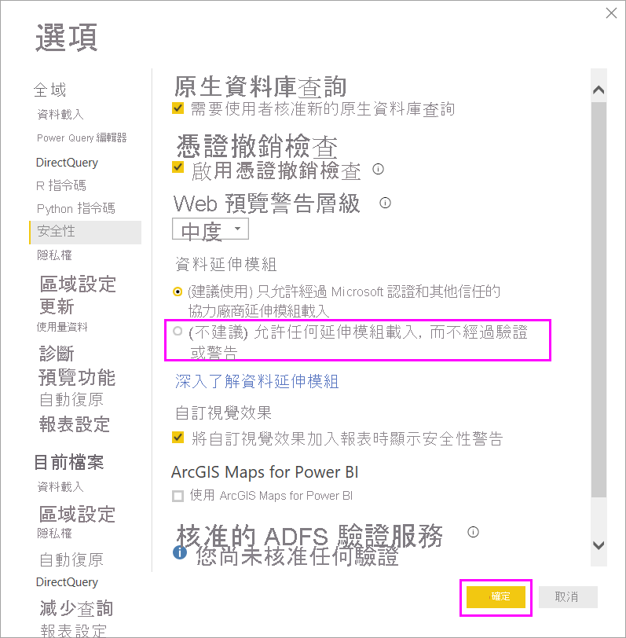

# Power BI 中的連接器擴充性

Power BI 可使用現有的連接器和一般資料來源 (例如 ODBC、OData、OLE DB、Web、CSV、XML 和 JSON) 連線至資料。 或者，開發人員可使用名為*自訂連接器*的自訂資料延伸模組來啟用新的資料來源。 某些自訂連接器已通過 Microsoft 的認證並以*經認證的連接器*的形式散發。

若要使用由您或第三方開發、但未經認證的自訂連接器，您必須調整 Power BI Desktop 安全性設定，以允許在沒有驗證或警告的情況下載入延伸模組。 由於此程式碼可處理認證 (包括透過 HTTP 加以傳送)，且會忽略隱私權層級，因此，只有在您絕對信任自訂連接器時，才應使用此安全性設定。

另一個選項是讓開發人員以憑證簽署連接器，並提供讓您直接加以使用而無須變更安全性設定時所需的資訊。 如需詳細資訊，請參閱[關於受信任的第三方連接器](desktop-trusted-third-party-connectors.md)。

## 自訂連接器

未經認證的自訂連接器種類繁多，從小型商務關鍵性 API，到 Microsoft 尚未發行連接器的大型產業特定服務，都包含在內。 廠商也會散發許多連接器。 如果您需要特定的資料連線器，請洽詢廠商。 

若要使用未經認證的自訂連接器，請將連接器的 *.pq*、 *.pqx*、 *.m* 或 *.mez* 檔案放置在 *\[Documents]\\Power BI Desktop\\Custom Connectors* 資料夾中。 如果該資料夾不存在，請予以建立。

請依照下列方式調整資料延伸模組安全性設定：

在 Power BI Desktop 中，選取 [檔案]   > [選項及設定]   > [選項]   > [安全性]  。

在 [資料延伸模組]  底下，選取 [(不建議) 允許任何延伸模組載入，而不經過驗證或警告]  。 選取 [確定]  ，然後重新啟動 Power BI Desktop。 

預設 Power BI Desktop 資料延伸模組安全性設定為 [(建議使用) 只允許經過 Microsoft 認證和其他信任的第三方延伸模組載入]  。 使用此設定時，如果您的系統上有未經認證的自訂連接器，在 Power BI Desktop 啟動時就會出現 [未經認證的連接器]  對話方塊，並列出無法安全載入的連接器。

若要解決此錯誤，您可以變更 [資料延伸模組]  安全性設定，或從 *Custom Connectors* 資料夾中移除未經認證的連接器。

## 認證的連接器

有少部分的資料延伸模組會被視為*經過認證*的延伸模組。 雖然 Microsoft 會散發這些連接器，但 Microsoft 不會負責其效能或功能的持續性。 建立連接器的第三方開發人員需負責其維護和支援。 

在 Power BI Desktop 中，經過認證的第三方連接器會出現在 [取得資料]  對話方塊中的清單上，與一般和通用連接器一併顯示。 您無須調整安全性設定即可使用經過認證的連接器。

如果您想要認證自訂連接器，請要求您的廠商連絡 dataconnectors@microsoft.com。
