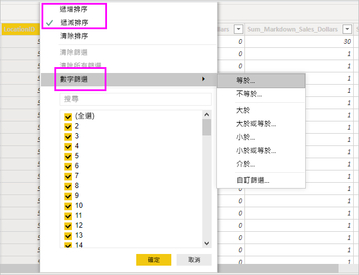

# 在 Power BI Desktop 中使用資料檢視

「資料檢視」  可協助您檢查、探索及了解 *Power BI Desktop* 模型中的資料。 這與您在「Power Query 編輯器」  中檢視資料表、資料行和資料的方式不同。 透過資料檢視，您看到的是載入模型「之後」  的資料。

> [!NOTE]
> 因為資料檢視會在資料載入模型後顯示資料，所以若所有資料來源的基礎都是 DirectQuery，就看不到資料檢視圖示。 

當您建立資料模型時，有時會想要在報表畫布上沒有建立視覺效果的情況下查看資料表或資料行中實際內容。 您可能想要向下查看資料列層級。 此功能特別適用於當您要建立量值和計算結果欄，或需要識別資料類型或資料類別時。

讓我們探討資料檢視中找到的某些項目。

1. **資料檢視圖示**。 選取此圖示以進入資料檢視。

2. **資料格**。 這個區域顯示選取的資料表，以及其中的所有資料行和資料列。 「報表」  檢視中隱藏的資料行會呈現灰色。以滑鼠右鍵按一下資料行，顯示選項。

3. **模型化功能區**。 您可以在此處管理關聯性；建立計算；變更資料行的資料類型、格式、資料類別。

4. **公式列**。 輸入量值和計算結果欄的資料分析運算式 (DAX) 公式。

5. **搜尋**。 在模型中搜尋資料表或資料行。

6. **欄位清單**。 選取要在資料格中檢視的資料表或資料行。

## 資料檢視中的篩選

您也可以在資料檢視中篩選和排序資料。 每個資料行顯示的圖示會識別排序方向 (若已套用)。

您可以篩選個別值，或依據資料行中的資料使用進階篩選。

> [!NOTE]
> 當 Power BI 模型在與您目前使用者介面不同的文化特性 (Culture) 中建立時，除了文字欄位以外，資料檢視使用者介面中不會出現搜尋方塊。 例如，這適用於以美式英文建立並以西班牙文檢視的模型。

## 後續步驟

您可以使用 Power BI Desktop 執行各種作業。 如需有關其功能的詳細資訊，請參閱下列資源：

* [Power BI Desktop 是什麼？](../fundamentals/desktop-what-is-desktop.md)
* [Power BI Desktop 的查詢概觀](../transform-model/desktop-query-overview.md)
* [Power BI Desktop 中的資料類型](desktop-data-types.md)
* [使用 Power BI Desktop 合併資料並使其成形](desktop-shape-and-combine-data.md)
* [Power BI Desktop 中的常見查詢工作](../transform-model/desktop-common-query-tasks.md)
