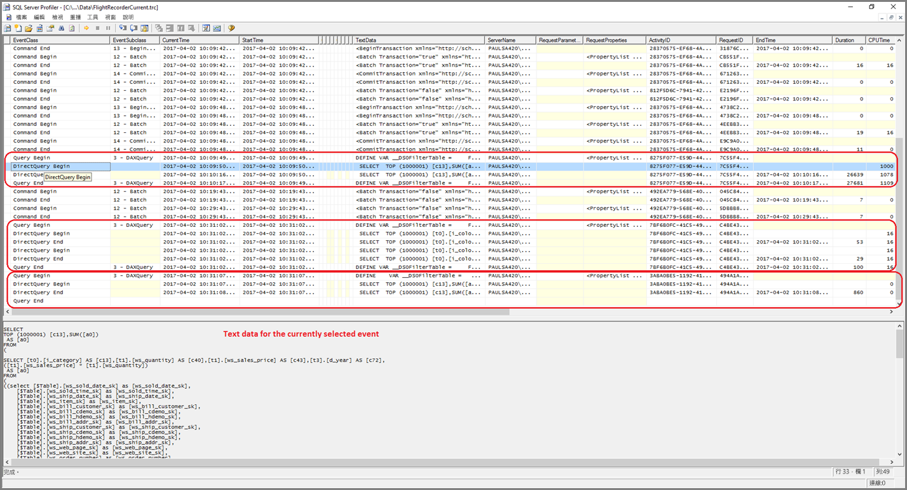

# <a name="troubleshoot-developing-directquery-models-in-power-bi-desktop"></a>針對 Power BI Desktop 中的 DirectQuery 模型開發問題進行疑難排解

本文針對使用 Power BI Desktop 或 Power BI 服務所開發 Power BI DirectQuery 模型來加以開發的資料製造模型者。 本文描述如何診斷效能問題，以及如何取得更詳細的資訊，以改進報表。

## <a name="performance-analyzer"></a>效能分析器

極力建議所有效能問題診斷作業都在 Power BI Desktop 中進行，而不要在 Power BI (Power BI 服務本身或 Power BI 報表伺服器) 中進行。 效能問題通常出在基礎資料來源的效能等級，因為 Power BI Desktop 環境的獨立程度較高，並能在一開始時，就將特定元件 (例如 Power BI 閘道) 排除在外，所以在確認及診斷問題上相對容易。 僅當您確認效能問題不在 Power BI Desktop 上時，才將調查重點放在 Power BI 報表上的特定項目上。 [效能分析器](../create-reports/desktop-performance-analyzer.md)是一個實用的工具，可以從整個流程之中找出問題。

同樣地，建議先嘗試將任何問題隔離到個別視覺效果，而不是頁面上的許多視覺效果。

假設您已執行過這些步驟 (本主題中的前幾個段落)，但在 Power BI Desktop 中的頁面上，仍有一個報表的效能表現不佳。 若要判斷 Power BI Desktop 傳送了哪些查詢至基礎來源，您可以使用效能分析器。 也可以檢視可能由基礎資料來源發出的追蹤/診斷資訊。 這類追蹤也可能包含像是查詢執行方式，以及如何改進查詢等實用的詳細資料。

此外，即使來源中沒有這類追蹤，您也可以檢視 Power BI 所傳送的查詢及其執行時間，如下所述。

## <a name="review-trace-files"></a>檢閱追蹤檔案

根據預設，Power BI Desktop 會在指定的工作階段期間，將事件記錄到名為 **FlightRecorderCurrent.trc** 的追蹤檔案。

對於某些 DirectQuery 來源，此記錄包含所有傳送至基礎資料來源的查詢 (未來可能會增加對其餘 DirectQuery 來源的支援)。 會將查詢寫入記錄的來源如下：

- SQL Server
- Azure SQL Database
- Azure SQL 資料倉儲
- Oracle
- Teradata
- SAP HANA

您可以在目前使用者的 **AppData** 資料夾中找到追蹤檔案： _\\\<User>\AppData\Local\Microsoft\Power BI Desktop\AnalysisServicesWorkspaces_

以下是移至此資料夾的簡單方法：在 Power BI Desktop 中，選取 [檔案] > [選項及設定] > [選項]，然後選取 [診斷] 頁面。 下列對話方塊視窗隨即出現：

![[Power BI Desktop] 視窗會隨即開啟，並選取 [全域診斷] 頁面。 [診斷選項] 區段包含兩個屬性：[啟用追蹤] 及 [略過地理編碼快]，。 並會啟用 [啟用追蹤] 選項。 [損毀傾印集合] 區段中包含 [立即啟用] 按鈕，以及用來開啟損毀傾印/追蹤資料夾的連結。](media/desktop-directquery-troubleshoot/desktop-directquery-troubleshoot-desktop-file-options-diagnostics.png)

當您選取 [開啟損毀傾印/追蹤資料夾] 連結時，會在 [損毀傾印集合] 底下開啟下列資料夾： _\\\<User>\AppData\Local\Microsoft\Power BI Desktop\Traces_

當您瀏覽至該資料夾的父資料夾時，會顯示包含 _AnalysisServicesWorkspaces_ 的資料夾，而其中另有一個工作區子資料夾，包含每一個已經開啟的 Power BI Desktop 執行個體。 這些子資料夾會在名稱後面加上整數來命名，例如 _AnalysisServicesWorkspace2058279583_。

該資料夾內會有 _\Data_ 子資料夾，其中包含目前 Power BI 工作階段的追蹤檔案 FlightRecorderCurrent.trc。 當相關聯的 Power BI Desktop 工作階段結束時，即會刪除對應的工作區資料夾。

您可以使用下載 SQL Server Management Studio 時免費提供的 SQL Server Profiler 工具開啟追蹤檔案。 您可以從[這個位置](/sql/ssms/download-sql-server-management-studio-ssms?view=sql-server-2017)取得該工具。

下載並安裝 SQL Server Management Studio 之後，請執行 SQL Server Profiler。



若要開啟追蹤檔案，請執行下列步驟：

1. 在 SQL Server Profiler 中，選取 [檔案] > [開啟] > [追蹤檔案]
2. 輸入目前開啟之 Power BI 工作階段的追蹤檔案路徑，例如： _\\\<User>\AppData\Local\Microsoft\Power BI Desktop\AnalysisServicesWorkspaces\AnalysisServicesWorkspace2058279583\Data_
3. 開啟 _FlightRecorderCurrent.trc_

目前工作階段中的所有事件會隨即顯示。 以下顯示註解的範例，其中醒目提示多組事件。 每個群組具有下列各項：

- 「查詢開始」和「查詢結束」事件，分別代表 UI (例如從視覺效果或透過在篩選 UI 中填入值清單) 所產生之 DAX 查詢的開始和結束
- 當有一或多組的 _DirectQuery Begin_ 與 _DirectQuery End_ 事件配對時，表示在評估 DAX 查詢過程中，傳送了查詢至基礎資料來源

請注意，多個 DAX 查詢可以平行執行，因此可以交錯來自不同群組的事件。 ActivityID 的值可以用來判斷哪些事件是屬於相同的群組。


其他重要的資料行如下：

- **TextData：** 事件的文字詳細資料。 對於 _Query Begin/End_ 事件，這會是 DAX 查詢。 對於 _DirectQuery Begin/End_ 事件，這會是傳送至基礎來源的 SQL 查詢。 目前選取之事件的 _TextData_ 值也會顯示在區域底部。
- **EndTime：** 事件的完成時間。
- **Duration：** 執行 DAX 或 SQL 查詢所需的持續時間 (毫秒)。
- **Error：** 指出是否發生錯誤 (若發生錯誤，該事件將會以紅色顯示)。

在上圖中，一些較不相關的資料行已縮小，好讓相關資料行較容易看見。

擷取追蹤以協助診斷潛在效能問題的建議方法如下：

- 開啟單一 Power BI Desktop 工作階段 (以避免多個工作區資料夾混淆)
- 在 Power BI Desktop 中，執行一組想要執行的動作。 此外還包含一些其他的動作，以確保將關注的事件排清到追蹤檔案中。
- 如前文所述，開啟 SQL Server Profiler 檢查追蹤。 請注意，關閉 Power BI Desktop 時，便會刪除追蹤檔案。 此外，Power BI Desktop 不會立即顯示進一步的動作，必須關閉再重新開啟追蹤檔案，才會顯示新的事件。
- 請將個別工作階段保持為適當大小 (10 秒而不是數百秒的動作)，以便更容易解譯追蹤檔案 (且由於追蹤檔案大小受到限制，因此工作階段若過長，就有可能會卸除早期事件)。

## <a name="understand-queries-sent-to-the-source"></a>了解傳送至來源的查詢

Power BI Desktop 所產生及傳送的一般查詢格式，會採用所參考之每一個模型資料表的子選擇，其中的子查詢由 Power Query 查詢定義。 例如，假設 SQL Server 關聯式資料庫中有下列 TPC-DS 資料表：


您可以考慮下列圖表及其設定。另請注意 **SalesAmount** 量值由下列運算式定義：

```dax

SalesAmount = SUMX(Web_Sales, [ws_sales_price] * [ws_quantity])

```

![Power BI Desktop .report 由堆疊直條圖組成，會依類別顯示銷售金額。 [篩選] 窗格會在 2000 年上顯示篩選。](media/desktop-directquery-troubleshoot/desktop-directquery-troubleshoot-example-report.png)

重新整理該圖表將會產生下一個段落中所示的 T-SQL 查詢。 如您所見，**Web_Sales**、**Item**和 **Date_dim** 模型資料表共有三個子查詢。 即使圖表實際只參考四個資料行，但每一個資料表都會傳回所有模型資料表的資料行。 這些子查詢 (被遮蔽) 才是 Power Query 查詢的真正定義。 因為 DirectQuery 還能支援目前的這些資料來源，所以尚未發現以此方式使用子查詢會對效能造成影響。 SQL Server 一類的資料來源會不理會對未使用之資料行的參考而進行最佳化。

Power BI 採用此模式的原因之一，是您可以定義 Power Query 查詢使用特定的查詢陳述式。 因此，其用法將如現狀提供，沒有計劃加以重寫。 請注意，此模式禁止使用採用通用資料表運算式 (CTE) 及預存程序的查詢陳述式。 子查詢中無法使用這些陳述式。


## <a name="gateway-performance"></a>閘道效能

如需如何疑難排解閘道效能問題的資訊，請參閱[疑難排解閘道問題 - Power BI](service-gateway-onprem-tshoot.md) 一文。

## <a name="next-steps"></a>後續步驟

如需 DirectQuery 的詳細資訊，請參閱下列資源：

- [在 Power BI Desktop 中使用 DirectQuery](desktop-use-directquery.md)
- [Power BI Desktop 中的 DirectQuery 模型](desktop-directquery-about.md)
- [Power BI Desktop 中的 DirectQuery 模型指南](../guidance/directquery-model-guidance.md)
- 有問題嗎？ [嘗試在 Power BI 社群提問](https://community.powerbi.com/)
