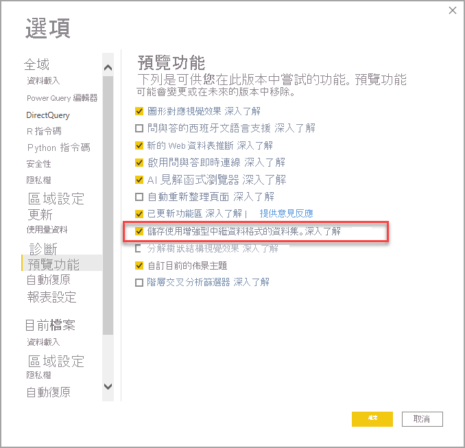

# 使用增強型資料集中繼資料 (預覽)

當 Power BI Desktop 建立報表時，也會在對應的 PBIX 和 PBIT 檔案中建立資料集中繼資料。 之前中繼資料是儲存在 Power BI Desktop 特定的格式中。 其先前使用了 Base 64 編碼 M 運算式及資料來源，並假設了儲存中繼資料的方式。

隨著**增強型資料集中繼資料**功能的發行，我們克服了許多其中的限制。 啟用**增強型資料集中繼資料**功能，由 Power BI Desktop 所建立中繼資料即會使用與用於 Analysis Services 表格式模型格式相似的格式，以[表格式物件模型](https://docs.microsoft.com/bi-reference/tom/introduction-to-the-tabular-object-model-tom-in-analysis-services-amo)為基礎。

**增強型資料集中繼資料**功能是一種策略性及基礎功能，因為未來的 Power BI 功能都會以這項中繼資料為基礎建置。 其中一部分可獲益於增強型資料集中繼資料的額外功能，包括 Power BI 資料集管理的 [XMLA 讀取/寫入](https://docs.microsoft.com/power-platform-release-plan/2019wave2/business-intelligence/xmla-readwrite)，以及將 Analysis Services 工作負載移轉至 Power BI，使其獲益於下一代的功能。

## 啟用增強型資料集中繼資料

**增強型資料集中繼資料**功能目前處於預覽階段。 若要啟用增強型資料集中繼資料，請在 Power BI Desktop 中選取 [檔案] > [選項和設定] > [選項] > [預覽功能]  ，然後選取 [Store datasets using enhanced metadata format] \(使用增強型中繼資料格式儲存資料集\)  核取方塊，如下圖所示。 

您可能會收到提示，要求重新啟動 Power BI Desktop。

啟用預覽功能後，Power BI Desktop 即會嘗試升級使用先前中繼資料格式的 PBIX 和 PBIT 檔案。 

> [!IMPORTANT]
> 啟用**增強的資料集中繼資料**功能，會導致無法復原的報表升級。 當**增強的資料集中繼資料**啟用時，使用 Power BI Desktop 載入或建立的任何 Power BI 報表都會轉換為增強的資料集中繼資料格式，且無法復原。

## 考量與限制

在預覽版本中，當啟用預覽功能時即適用下列限制。

### 不支援的功能和連接器
在開啟尚未升級的現有 PBIX 和 PBIT 檔案時，若資料集包含任何下列功能或連接器，升級將會失敗。 若發生這類錯誤，應不會對使用者體驗造成立即的影響，且 Power BI Desktop 會繼續使用先前的中繼資料格式。

* Python 指令碼
* 自訂連接器
* Azure DevOps Server
* BI 連接器
* Denodo
* Dremio
* Exasol
* Indexima
* IRIS
* Jethro ODBC
* Kyligence Enterprise
* Mark Logic ODBC
* Qubole Presto
* Team Desk
* 包含特定字元組合的 (例如在資料行名稱中包含 “\\n”) M 運算式
* 在啟用**增強型資料集中繼資料**功能並使用資料集時，無法在 Power BI 服務中設定單一登入 (SSO) 資料來源

此外，已成功升級至使用**增強型資料集中繼資料**的 PBIX 和 PBIT 檔案「無法」  在目前版本中使用上述功能或連接器。

### 譜系檢視
使用新中繼資料格式的資料集目前不會在 Power BI 服務內譜系檢視中顯示資料流程的連結。

## 後續步驟

您可以使用 Power BI Desktop 執行各種作業。 如需有關其功能的詳細資訊，請參閱下列資源：

* [Power BI Desktop 是什麼？](../fundamentals/desktop-what-is-desktop.md)
* [Power BI Desktop 的新功能](../fundamentals/desktop-latest-update.md)
* [Power BI Desktop 的查詢概觀](../transform-model/desktop-query-overview.md)
* [Power BI Desktop 中的資料類型](desktop-data-types.md)
* [使用 Power BI Desktop 合併資料並使其成形](desktop-shape-and-combine-data.md)
* [Power BI Desktop 中的常見查詢工作](../transform-model/desktop-common-query-tasks.md)
