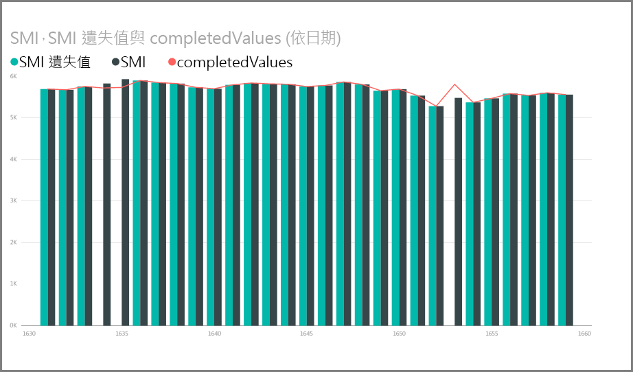

# <a name="use-r-in-power-query-editor"></a>在 Power Query 編輯器中使用 R

[R 語言](https://mran.microsoft.com/documents/what-is-r)是許多統計學家、資料科學家和資料分析師使用的強大程式語言。 您可以在 Power BI Desktop 的 Power Query 編輯器中使用 R：

* 準備資料模型。

* 建立報表。

* 清理資料、進行進階的資料塑造和資料集分析，其中包括遺漏資料完成、預測叢集等。  

## <a name="install-r"></a>安裝 R

您可以從 [Revolution R Open 下載頁面](https://mran.revolutionanalytics.com/download/)和 [CRAN 存放庫](https://cran.r-project.org/bin/windows/base/)免費下載 R。

## <a name="install-mice"></a>安裝 mice

您必須在 R 環境中安裝 [mice 程式庫](https://www.rdocumentation.org/packages/mice/versions/3.5.0/topics/mice)，此為先決條件。 若沒有 mice，範例指令碼即無法正常運作。 mice 套件會實作處理遺失資料的方法。

若要安裝 mice 程式庫：

1. 啟動 R.exe 程式 (例如 C:\Program Files\Microsoft\R Open\R-3.5.3\bin\R.exe)。  

2. 從 R 提示字元執行安裝命令：

   ``` 
   install.packages('mice') 
   ```

## <a name="use-r-in-power-query-editor"></a>在 Power Query 編輯器中使用 R

為在 Power Query 編輯器中示範使用 R，我們會使用包含在 .csv 檔案中的股市資料集範例，並逐步完成下列步驟：

1. [下載 EuStockMarkets_NA.csv 檔案](https://download.microsoft.com/download/F/8/A/F8AA9DC9-8545-4AAE-9305-27AD1D01DC03/EuStockMarkets_NA.csv)。 請記住您儲存的位置。

1. 將檔案載入至 Power BI Desktop。 從 [常用]  索引標籤中選取 [取得資料]   > [Text/CSV] \(文字/CSV\)  。

   ![選取 [Text/CSV] \(文字/CSV\)](media/desktop-r-in-query-editor/r-in-query-editor_1.png)

1. 選取 EuStockMarkets_NA.csv 檔案，然後選擇 [開啟]  。 CSV 資料隨即顯示在 [Text/CSV] \(文字/CSV 檔案\)  對話方塊中。

   

1. 選取 [載入]  從檔案載入資料。 在 Power BI 載入資料之後，新資料表即會出現在 [欄位]  窗格中。

   ![[欄位] 窗格中的資料](media/desktop-r-in-query-editor/r-in-query-editor_3.png)

1. 若要開啟 Power Query 編輯器，請從 [常用]  功能區中選取 [編輯查詢]  。

   ![選取 [編輯查詢]](media/desktop-r-in-query-editor/r-in-query-editor_4.png)

1. 在 [轉換]  索引標籤中，選取 [執行 R 指令碼]  。 隨即出現**執行 R 指令碼**編輯器。 資料列 15 和 20 包含遺漏資料，其他您在影像中看不到的資料列也包含遺漏資料。 下列步驟會示範 R 如何為您完成這些資料列。

   ![選取 [執行 R 指令碼]](media/desktop-r-in-query-editor/r-in-query-editor_5d.png)

1. 在此範例中，請在 [執行 R 指令碼]  視窗的 [指令碼]  方塊中，輸入下列指令碼。 請以您本機檔案系統上的 EuStockMarkets_NA.csv 路徑取代 &lt;您的檔案路徑&gt;  ，例如 C:/Users/John Doe/Documents/Microsoft/EuStockMarkets_NA.csv。

    ```r
       dataset <- read.csv(file="<Your File Path>/EuStockMarkets_NA.csv", header=TRUE, sep=",")
       library(mice)
       tempData <- mice(dataset,m=1,maxit=50,meth='pmm',seed=100)
       completedData <- complete(tempData,1)
       output <- dataset
       output$completedValues <- completedData$"SMI missing values"
    ```

    > [!NOTE]
    > 您可能需要覆寫名為 *output* 的變數，才能正確建立套用篩選的新資料集。

7. 選取 [確定]  。 Power Query 編輯器會顯示有關資料隱私權的警告。

   
8. 請選取警告訊息內的 [繼續]  。 在出現的 [隱私權等級]  對話方塊中，將所有資料來源設為 [公用]  ，R 指令碼才能在 Power BI 服務中正常運作。 

   ![[隱私權等級] 對話方塊](media/desktop-r-in-query-editor/r-in-query-editor_7.png)

   如需隱私權設定及其含意的詳細資訊，請參閱 [Power BI Desktop 隱私權等級](../admin/desktop-privacy-levels.md)。

 9. 選取 [儲存]  以執行指令碼。 

   請注意 [欄位]  窗格中稱為 **completedValues** 的新資料行。 這個資料行有幾個遺失的資料項目，例如第 15 列和 18 列。 請參閱下一節，看 R 如何處理該狀況。

   Power Query 編輯器僅使用五行的 R 指令碼，即透過預測模型填入遺失的值。

## <a name="create-visuals-from-r-script-data"></a>從 R 指令碼資料建立視覺效果

我們現在可以建立視覺效果來查看 R 指令碼和 mice 程式庫如何補齊遺失的值。



您可以將所有完成的視覺效果儲存在一個 Power BI Desktop .pbix 檔案中，然後在 Power BI 服務中使用資料模型及其 R 指令碼。

> [!NOTE]
> 您可以[下載已完成所有步驟的 .pbix 檔案](https://download.microsoft.com/download/F/8/A/F8AA9DC9-8545-4AAE-9305-27AD1D01DC03/Complete%20Values%20with%20R%20in%20PQ.pbix)。

在將 .pbix 檔案上傳到 Power BI 服務後，您需要採取額外步驟來啟用服務資料重新整理和更新後的視覺效果：  

* **針對資料集啟用排程的重新整理**：若要使用 R 指令碼為包含資料集的活頁簿啟用排程的重新整理，請參閱[設定排程的重新整理](refresh-scheduled-refresh.md)。 本文也包含個人閘道的相關資訊。

* **安裝個人閘道**：您需要在檔案和 R 所在的電腦上安裝個人閘道。 Power BI 服務會存取該活頁簿，並重新轉譯任何更新後的視覺效果。 如需詳細資訊，請參閱[在 Power BI 中使用個人閘道](service-gateway-personal-mode.md)。

## <a name="limitations"></a>限制

建立於 Power Query 編輯器中並含有 R 指令碼的查詢有幾項限制：

* 所有 R 資料來源設定都必須設為 [公開]  。 Power Query 編輯器查詢中所有其他步驟也都必須是公開的。 

   若要前往資料來源設定，請在 Power BI Desktop 中，選取 [檔案]   > [選項和設定]   > [資料來源設定]  。

   ![選取 [資料來源設定]](media/desktop-r-in-query-editor/r-in-query-editor_9.png)

   在 [資料來源設定]  對話方塊中，選取一或多個資料來源，然後選取 [編輯權限]  。 將 [隱私權層級]  設為 [公用]  。

   ![[資料來源設定] 對話方塊](media/desktop-r-in-query-editor/r-in-query-editor_10.png)  
  
* 若要排程 R 視覺效果或資料集的重新整理，請在包含活頁簿和 R 的電腦上啟用已排程重新整理並安裝個人閘道。 

您可以使用 R 和自訂查詢執行所有各種作業。 以您想要的方式來探索和塑造資料。

## <a name="next-steps"></a>後續步驟

* [Introduction to R](https://mran.microsoft.com/documents/what-is-r) (R 簡介) 

* [在 Power BI Desktop 中執行 R 指令碼](desktop-r-scripts.md) 

* [在 Power BI 使用外部 R IDE](desktop-r-ide.md) 

* [在 Power BI 服務中使用 R 套件建立視覺效果](service-r-packages-support.md)
