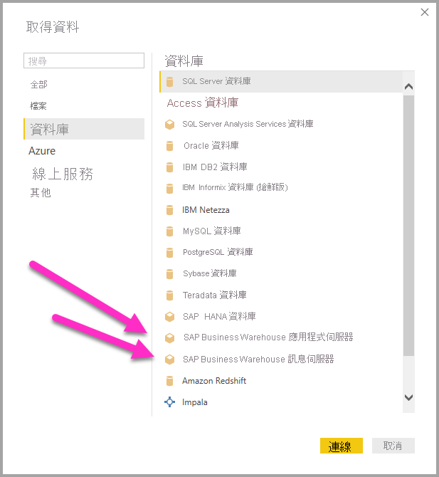
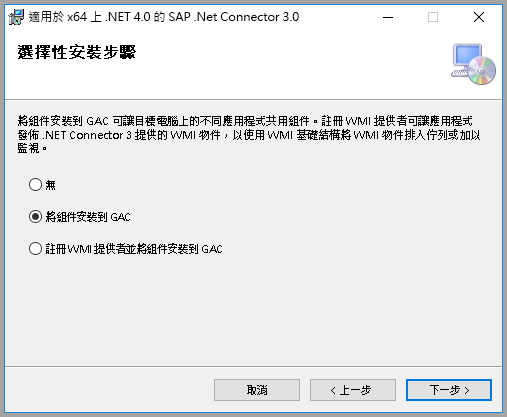
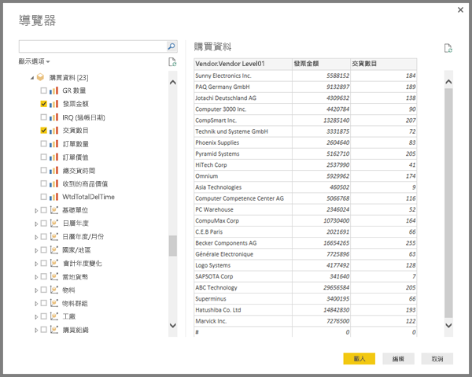
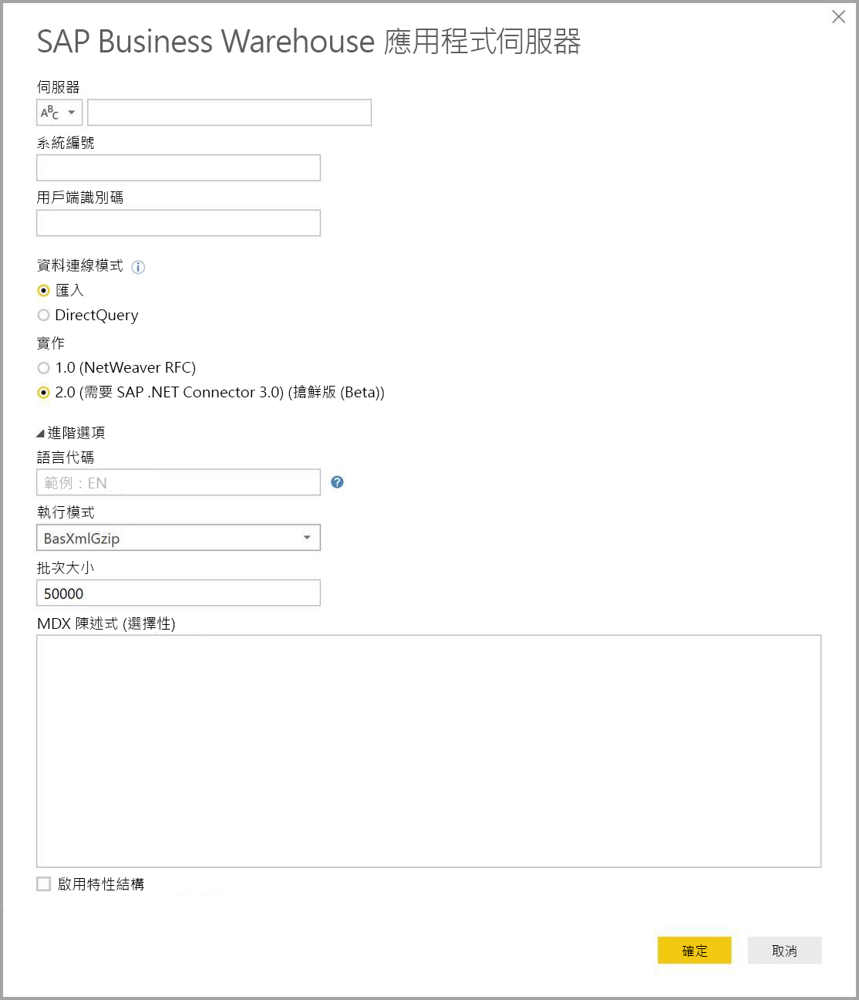

# <a name="use-the-sap-business-warehouse-connector-in-power-bi-desktop"></a>在 Power BI Desktop 中使用 SAP Business Warehouse 連接器

您可以透過 Power BI Desktop 存取 *SAP Business Warehouse (BW)* 資料。

如需有關 SAP 客戶可如何從將 Power BI 連線到其現有的 SAP BW 系統中受益的資訊，請參閱 [Power BI 與 SAP BW 白皮書](https://aka.ms/powerbiandsapbw)。 如需搭配 SAP BW 使用 DirectQuery 的詳細資訊，請參閱 [DirectQuery 和 SAP Business Warehouse (BW)](desktop-directquery-sap-bw.md)。

從 2018 年 6 月版本的 Power BI Desktop (2018 年 10 月正式推出) 開始，您可以使用「SAP BW 連接器」  ，來獲得大幅改善的效能與功能。 Microsoft 已開發 SAP BW 連接器「實作 2.0」  。 您可以選取第 1 版的 SAP BW 連接器或實作 2.0 SAP 連接器。 下列各節會依序描述每個版本的安裝。 從 Power BI Desktop 連線至 SAP BW 時，您可以選擇其中一個或另一個連接器。

我們建議您盡可能使用實作 2.0 SAP 連接器。

## <a name="installation-of-version-1-of-the-sap-bw-connector"></a>第 1 版的 SAP BW 連接器安裝

我們建議您盡可能使用實作 2.0 SAP 連接器。 此節描述 SAP BW 連接器第 1 版的安裝。

1. 在本機電腦上安裝 *SAP NetWeaver* 程式庫。 您可以從 SAP 管理員，或是直接從 [SAP 軟體下載中心](https://support.sap.com/swdc) \(英文\) 取得 SAP NetWeaver 程式庫。 由於 SAP 軟體下載中心經常變更其結構，因此未提供瀏覽該網站的更具體指導方針。 SAP NetWeaver 程式庫通常包含在 SAP 用戶端工具安裝中。

   您可以搜尋 *SAP Note #1025361* 以取得最新版本的下載位置。 確認 SAP NetWeaver 程式庫 (32 位元或 64 位元) 的架構與您的 Power BI Desktop 安裝相符。 根據 SAP 附註，安裝 *SAP NetWeaver RFC SDK* 中包含的所有檔案。
2. 在 Power BI Desktop 中，選取 [取得資料]  。 [資料庫]  選項包含「SAP Business Warehouse 應用程式伺服器」  和「SAP Business Warehouse 訊息伺服器」  。

   

## <a name="installation-of-implementation-20-sap-connector"></a>實作 2.0 SAP 連接器的安裝

SAP 連接器的實作 2.0 需要使用 SAP .NET 連接器 3.0。 下載存取需要有效的 S 使用者。 請與 SAP 基礎小組連絡，以取得 SAP .NET 連接器 3.0。

您可以從 SAP [下載 SAP .NET 連接器 3.0](https://support.sap.com/en/product/connectors/msnet.html) \(英文\)。

連接器有 32 位元和 64 位元版本。 請選擇符合您 Power BI Desktop 安裝的版本。 目前，該網站列出兩個適用於 .NET 4.0 Framework 的版本：

* 適用於 Windows 32 位元 (x86) 的 SAP Connector for Microsoft .NET 3.0.22.0，ZIP 檔 (6.896 KB)，2019 年 6 月 1 日
* 適用於 Windows 64 位元 (x64) 的 SAP Connector for Microsoft .NET 3.0.22.0，ZIP 檔 (7.180 KB)，2019 年 6 月 1 日

當您安裝時，在 [選用設定]  步驟中，確定您已選取 [將組件安裝到 GAC]  。



> [!NOTE]
> SAP BW 實作的第一版需要 NetWeaver DLL。 如果您使用 SAP 連接器實作 2.0 且不使用第一版，則不需要 NetWeaver DLL。

## <a name="version-1-sap-bw-connector-features"></a>第 1 版 SAP BW 連接器功能

Power BI Desktop 中的第 1 版 SAP BW 連接器可讓您從您的「SAP Business Warehouse 伺服器」  Cube 匯入資料，或使用 DirectQuery。

若要深入了解 SAP BW 連接器以及如何使用其搭配 DirectQuery，請參閱 [DirectQuery 和 SAP Business Warehouse (BW)](desktop-directquery-sap-bw.md)。

當您連線時，請指定**伺服器**、**系統名稱**與**用戶端識別碼**以建立連線。


您也可以指定其他兩個 [進階選項]  ：**語言代碼**和針對指定伺服器執行的自訂 **MDX 陳述式**。


如果您未指定 MDX 陳述式，連線設定會顯示伺服器中可用 Cube 的清單。 您可以向下切入並從可用的 Cube 中選取項目，包括維度和量值。 Power BI 會公開 [Open Analysis Interface](https://help.sap.com/saphelp_nw70/helpdata/en/d9/ed8c3c59021315e10000000a114084/content.htm) \(英文\) 所公開的查詢和 Cube。

當您從伺服器選取一或多個項目時，[導覽器] 對話方塊會建立輸出資料表的預覽。



[導覽器]  對話方塊也提供顯示選項：

* **僅顯示選取的項目**。 根據預設，[導覽器]  會顯示所有項目。  此選項適用於驗證所選取的最終一組項目。 檢視所選項目的另一個方法是，在預覽區域中選取資料行名稱。
* **啟用資料預覽**。 這是預設值。 顯示資料預覽。 停用資料預覽可減少伺服器呼叫的數目，因為它不會再要求資料進行預覽。
* **技術名稱**。 SAP BW 支援 Cube 內物件的「技術名稱」  概念。 技術名稱可讓 Cube 擁有者公開 Cube 物件的「易記名稱」  ，而不只是公開 Cube 中這些物件的「實體名稱」  。

![[導覽器] 視窗](media/desktop-sap-bw-connector/sap_bw_6.png)

選取所有必要物件後，您可以選取下列其中一個選項來決定後續動作︰

* 選取 [載入]  來將輸出資料表的整組資料列都載入 Power BI Desktop 資料模型中。 [報表]  檢視隨即開啟。 您可以使用 [資料]  或 [關聯性]  檢視，開始將資料視覺化或做進一步修改。
* 選取 [編輯]  ，以開啟 [查詢編輯器]  。 指定其他資料轉換和篩選步驟，再將整組資料列帶入 Power BI Desktop 資料模型。

除了從 SAP BW Cube 匯入資料之外，您也可以從 Power BI Desktop 中的其他廣泛資料來源匯入資料，然後再合併成單一報表。 此功能讓您可根據 SAP BW 資料進行各種有趣的報告和分析案例。

## <a name="using-implementation-20-sap-bw-connector"></a>使用實作 2.0 SAP BW 連接器

建立新連線來使用 SAP BW 連接器的實作 2.0。 請採取下列步驟建立新連線。

1. 選取 [取得資料]  。 選取 [SAP Business Warehouse 應用程式伺服器]  或 [SAP Business Warehouse 訊息伺服器]  ，然後連線。

2. 在新增連線對話方塊中，選取該實作。 針對 [實作]  選取 [2.0]  \(如下圖所示\) 會啟用 [執行模式]  、[批次大小]  與 [啟用特性結構]  選項。

    

3. 選取 [確定]  。 在此之後，體驗會與第 1 版 SAP BW 連接器的[第 1 版 SAP BW 連接器功能](#version-1-sap-bw-connector-features)中所述相同。

### <a name="new-options-for-implementation-20"></a>實作 2.0 的新選項

實作 2.0 支援下列選項：

* *ExecutionMode* 指定用來在伺服器上執行查詢的 MDX 介面。 下列是有效選項：

  * `SapBusinessWarehouseExecutionMode.BasXml`
  * `SapBusinessWarehouseExecutionMode.BasXmlGzip`
  * `SapBusinessWarehouseExecutionMode.DataStream`

    預設值為 `SapBusinessWarehouseExecutionMode.BasXmlGzip`。

    當大型資料集遇到高延遲時，使用 `SapBusinessWarehouseExecutionMode.BasXmlGzip` 可能可以改善效能。

* *BatchSize* 指定執行 MDX 陳述式時將一次擷取的資料列數目上限。 在擷取大型資料集時，少量資料列會轉譯成更多個伺服器呼叫。 大量的資料列或可提升效能，但可能會造成 SAP BW 伺服器上的記憶體問題。 預設值為 50000 個資料列。

* *EnableStructures* 指出是否會辨識特性結構。 這個選項的預設值為 false。 會影響可讓您選取的物件清單。 原生查詢模式中不支援。

在此實作中，*ScaleMeasures* 選項已被淘汰。 行為現在與將 *ScaleMeasures* 設定為 False 相同，也就是一律會顯示未縮放的值。

### <a name="additional-improvements-for-implementation-20"></a>實作 2.0 的其他改善

下列清單描述新實作隨附的一些其他改善：

* 提升效能。
* 能夠擷取數百萬個資料列的資料，以及透過批次大小參數進行微調。
* 能夠切換執行模式。
* 支援壓縮模式。 尤其對高延遲的連線或大型資料集有益處。
* 已改善 `Date` 變數的偵測。
* [實驗] 分別公開 `Date` (ABAP 類型 DATS) 和 `Time` (ABAP 類型 TIMS) 維度作為日期和時間，而不是文字值。
* 較佳的例外狀況處理。 現在會顯示 BAPI 呼叫中發生的錯誤。
* BasXml 和 BasXmlGzip 模式中的資料行摺疊。 例如，如果產生的 MDX 查詢擷取 40 個資料行，但目前的選取範圍只需要 10 個，則此要求會傳遞到伺服器以擷取較小的資料集。

### <a name="changing-existing-reports-to-use-implementation-20"></a>變更現有的報表，以使用實作 2.0

僅能在匯入模式中將現有報表變更為使用實作 2.0。 請遵循下列步驟：

1. 開啟現有報表、選取功能區中的 [編輯查詢]  ，然後選取要更新的 SAP Business Warehouse 查詢。

1. 以滑鼠右鍵按一下查詢並選取 [進階編輯器]  。

1. 在 [進階編輯器]  中，變更 `SapBusinessWarehouse.Cubes` 呼叫，如下所示：

    判斷查詢是否已經包含選項記錄，例如下列範例：

    

    若是如此，請新增 `Implementation` 2.0 選項，並移除 `ScaleMeasures` 選項 (若有)，如下所示：

    

    如果查詢尚未包含選項記錄，請加以新增。 針對下列選項：

    

    只要將它變更為：

    

我們已盡最大努力，讓 SAP BW 連接器的實作 2.0 與第 1 版相容。 不過，因為使用不同 SAP BW MDX 執行模式，所以可能有一些差異。 若要解決任何不一致，請嘗試在執行模式之間切換。

## <a name="troubleshooting"></a>疑難排解

此節提供使用 SAP BW 連接器的疑難排解情況 (和解決方案)。

1. 來自 SAP BW 的數值資料會傳回小數點，而非逗號。 例如，1,000,000 傳回會變成 1.000.000。

   SAP BW 傳回的小數資料會使用 `,` (逗號) 或 `.` (點) 作為小數分隔符號。 為了指定 SAP BW 使用哪一種作為小數分隔符號，Power BI Desktop 所使用的驅動程式會對 `BAPI_USER_GET_DETAIL` 進行呼叫。 這個呼叫會傳回稱為 `DEFAULTS` 的結構，其中稱為 `DCPFM` 的欄位儲存了「十進位格式表示法」  。 該欄位接受下列其中一個值：

   * ' ' (空格) = 小數點為逗號：N.NNN,NN
   * 'X' = 小數點為句號：N,NNN.NN
   * 'Y' = 小數點為 N NNN NNN,NN

   回報此問題的客戶發現特定使用者 (顯示不正確資料) 無法對 `BAPI_USER_GET_DETAIL` 進行呼叫，並出現類似下列訊息的錯誤訊息：

   ```xml
    You are not authorized to display users in group TI:
        <item>
            <TYPE>E</TYPE>
            <ID>01</ID>
            <NUMBER>512</NUMBER>
            <MESSAGE>You are not authorized to display users in group TI</MESSAGE>
            <LOG_NO/>
            <LOG_MSG_NO>000000</LOG_MSG_NO>
            <MESSAGE_V1>TI</MESSAGE_V1>
            <MESSAGE_V2/>
            <MESSAGE_V3/>
            <MESSAGE_V4/>
            <PARAMETER/>
            <ROW>0</ROW>
            <FIELD>BNAME</FIELD>
            <SYSTEM>CLNTPW1400</SYSTEM>
        </item>
   ```

   若要解決此問題，使用者必須要求他們的 SAP 管理員授與 Power BI 中使用的 SAPBW 使用者執行 `BAPI_USER_GET_DETAIL` 的權限。 也可以驗證使用者具有必要的 `DCPFM` 值，如這份疑難排解解決方案稍早所述。

2. SAP BEx 的連線能力查詢
   
   啟用特定屬性後，您可以在 Power BI Desktop 中執行 BEx 查詢，如下列影像所示︰
   
   
   
3. [瀏覽器]  視窗不會顯示資料預覽，而是會提供「物件參考未設定至物件的執行個體」  錯誤訊息。
   
   SAP 使用者需要特定 BAPI 函式模組的存取權，才能從 SAP BW 的 InfoProviders 取得中繼資料並擷取資料。 這些模組包括：

   * BAPI_MDPROVIDER_GET_CATALOGS
   * BAPI_MDPROVIDER_GET_CUBES
   * BAPI_MDPROVIDER_GET_DIMENSIONS
   * BAPI_MDPROVIDER_GET_HIERARCHYS
   * BAPI_MDPROVIDER_GET_LEVELS
   * BAPI_MDPROVIDER_GET_MEASURES
   * BAPI_MDPROVIDER_GET_MEMBERS
   * BAPI_MDPROVIDER_GET_VARIABLES
   * BAPI_IOBJ_GETDETAIL

   若要解決此問題，請確認使用者有各種 MDPROVIDER 模組與 `BAPI_IOBJ_GETDETAIL` 的存取權。 若要進一步針對此問題或類似問題進行疑難排解，您可以啟用追蹤功能。 選取 [檔案]   > [選項及設定]   > [選項]  。 在 [選項]  中，選取 [診斷]  ，然後選取 [啟用追蹤]  。 嘗試在追蹤功能已啟用的情況下從 SAP BW 擷取資料，並檢查追蹤檔案以取得更多詳細資料。

## <a name="sap-bw-connection-support"></a>SAP BW 連線支援

下表詳細說明了 SAP BW 目前的支援。

|產品  |模式  |驗證  |連接器  |SNC 程式庫  |支援  |
|---------|---------|---------|---------|---------|---------|
|Power BI Desktop     |任何         | 使用者/密碼  | 應用程式伺服器 | N/A  | 是  |
|Power BI Desktop     |任何         | Windows          | 應用程式伺服器 | sapcrypto + gsskrb5/gx64krb5  | 是  |
|Power BI Desktop     |任何         | Windows 透過模擬 | 應用程式伺服器 | sapcrypto + gsskrb5/gx64krb5  | 是  |
|Power BI Desktop     |任何         | 使用者/密碼        | 訊息伺服器 | N/A  | 是  |
|Power BI Desktop     |任何         | Windows        | 訊息伺服器 | sapcrypto + gsskrb5/gx64krb5  | 是  |
|Power BI Desktop     |任何         | Windows 透過模擬 | 訊息伺服器 | sapcrypto + gsskrb5/gx64krb5  | 是  |
|Power BI Gateway     |匯入      | 與 Power BI Desktop 相同 |         |   |   |
|Power BI Gateway     |DirectQuery | 使用者/密碼        | 應用程式伺服器 | N/A  | 是  |
|Power BI Gateway     |DirectQuery | Windows 透過模擬 (固定使用者，無 SSO) | 應用程式伺服器 | sapcrypto + gsskrb5/gx64krb5  | 是  |
|Power BI Gateway     |DirectQuery | 透過 Kerberos 使用 SSO 進行 DirectQuery 查詢選項 | 應用程式伺服器 | sapcrypto + gsskrb5/gx64krb5   | 是  |
|Power BI Gateway     |DirectQuery | 使用者/密碼        | 訊息伺服器 | N/A  | 是  |
|Power BI Gateway     |DirectQuery | Windows 透過模擬 (固定使用者，無 SSO) | 訊息伺服器 | sapcrypto + gsskrb5/gx64krb5  | 是  |
|Power BI Gateway     |DirectQuery | 透過 Kerberos 使用 SSO 進行 DirectQuery 查詢選項 | 訊息伺服器 | gsskrb5/gx64krb5  | 否  |
|Power BI Gateway     |DirectQuery | 透過 Kerberos 使用 SSO 進行 DirectQuery 查詢選項 | 訊息伺服器 | sapcrypto  | 是  |

## <a name="next-steps"></a>後續步驟

如需 SAP 和 DirectQuery 的詳細資訊，請參閱下列資源：

* [DirectQuery 和 SAP HANA](desktop-directquery-sap-hana.md)
* [DirectQuery 和 SAP Business Warehouse (BW)](desktop-directquery-sap-bw.md)
* [使用 Power BI 中的 DirectQuery](desktop-directquery-about.md)
* [Power BI 資料來源](power-bi-data-sources.md)
* [Power BI 與 SAP BW 白皮書](https://aka.ms/powerbiandsapbw)
