# 教學課程：分析來自 Excel 和 OData 摘要的銷售資料

您通常會有來自多個資料來源的資料。 例如，您可能會有兩個資料庫，一個用於產品資訊，另一個用於銷售資訊。 使用 *Power BI Desktop* 時，您可以合併不同來源的資料，以建立有趣、 吸引人的資料分析和視覺效果。

在本教學課程中，您將結合來自兩個資料來源的資料：

* 包含產品資訊的 Excel 活頁簿
* 包含訂單資料的 OData 摘要

您將匯入每個資料集並執行轉換和彙總作業。 然後，您將使用這兩個來源資料產生一份能呈現互動視覺效果的銷售分析報表。 稍後，您可以將這些技術套用至 SQL Server 查詢、CSV 檔案，以及 Power BI Desktop 中的其他資料來源。

>[!NOTE]
>在 Power BI Desktop 中，完成同一件工作的方法通常有好幾種。 例如，您可以在資料行或資料格上按一下滑鼠右鍵，或使用 [更多選項]  功能表來查看其他功能區選項。 以下步驟描述幾種替代方法。

## 匯入 Excel 產品資料

首先，從 *Products.xlsx* Excel 活頁簿，將產品資料匯入 Power BI Desktop。

1. [下載 Products.xlsx Excel 活頁簿](https://download.microsoft.com/download/1/4/E/14EDED28-6C58-4055-A65C-23B4DA81C4DE/Products.xlsx)，然後儲存為 *Products.xlsx*。

1. 在 Power BI Desktop 功能區的 [常用]  索引標籤中，選取 [取得資料]  旁的箭號，然後從 [最常用]  功能表選取 [Excel]  。

   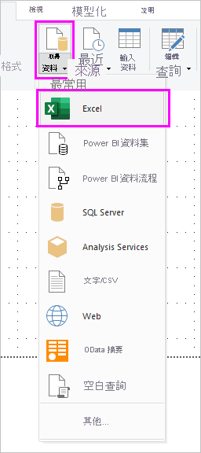

   >[!NOTE]
   >您也可以選取 [取得資料]  項目本身，或從 Power BI [開始]  對話方塊選取 [取得資料]  ，然後選取 [Excel]  ，或在 [取得資料]  對話方塊中依序選取 [檔案]   > [Excel]  ，然後選取 [連線]  。

1. 在 [開啟]  對話方塊中，瀏覽至並選取 **Products.xlsx** 檔案，然後選取 [開啟]  。

1. 在 [導覽器]  中，選取 **Products** 資料表，然後選取 [轉換資料]  。

   

Power Query 編輯器中會開啟資料表預覽，您可以在其中套用各種轉換來清理資料。

>[!NOTE]
>您也可以從 Power BI Desktop 的 [常用]  功能區依序選取 [編輯查詢]   > [編輯查詢]  ，或在 [報表]  檢視中的任何查詢旁邊按一下滑鼠右鍵或選擇 [更多選項]  ，然後選取 [編輯查詢]  ，同樣可以開啟 Power Query 編輯器。

## 清除產品資料行

結合的報表將會使用 Excel 活頁簿 **ProductID**、**ProductName**、**QuantityPerUnit** 和 **UnitsInStock** 資料行。 您可以移除其他資料行。

1. 在 Power Query 編輯器中，選取 **ProductID**、**ProductName**、**QuantityPerUnit** 和 **UnitsInStock** 資料行。 您可以使用 Ctrl 鍵來選取多個資料行，或使用 Shift 鍵來選取相鄰的資料行。

1. 以滑鼠右鍵按一下任何選取的標題。 從下拉式功能表選取 [移除其他資料行]  。
   您也可以從 [首頁]  功能區索引標籤的 [管理資料行]  群組，依序選取 [刪除資料行]   > [移除其他資料行]  。

   

## 匯入 OData 摘要的訂單資料

接下來，從範例 Northwind 銷售系統 OData 摘要，匯入訂單資料。

1. 在 Power Query 編輯器中，選取 [新來源]  ，然後從 [最常用]  功能表選取 [OData 摘要]  。

   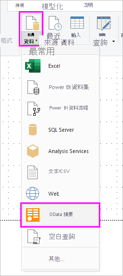

1. 在 [OData 摘要]  對話方塊中，貼上 Northwind OData 摘要 URL：`https://services.odata.org/V3/Northwind/Northwind.svc/`。 選取 [確定]  。

   ![[OData 摘要] 對話方塊](media/desktop-tutorial-analyzing-sales-data-from-excel-and-an-odata-feed/get_odata2.png)

1. 在 [導覽器]  中，選取 **Orders** 資料表，然後選取 [轉換資料]  將資料載入 Power Query 編輯器。

   

   >[!NOTE]
   >在 [導覽器]  窗格中，您可以按一下資料表名稱來查看預覽，無須勾選核取方塊。

## 展開訂單資料

當連接的資料來源擁有多個資料表時 (例如關聯式資料庫或 Northwind OData 摘要)，您可以使用資料表參考來建置查詢。 **訂單**資料表包含數個關聯資料表的參考。 您可以使用展開作業，將 **ProductID**、**UnitPrice** 和 **Quantity** 資料行，從相關的 **Order_Details** 資料表新增至主題 (**Orders**) 資料表。

1. 往 **Orders** 資料表右方捲動，直到看到 **Order_Details** 資料行為止。 它包含另一個資料表而不是資料的參考。

   

1. 在 **Order_Details** 資料行標題中，選取 [展開]  圖示 ()。

1. 在下拉式功能表中：

   1. 選取 [(選取所有資料行)]  以清除所有資料行。

   1. 選取 **ProductID**、**UnitPrice** 和 **Quantity**，然後選取 [確定]  。

      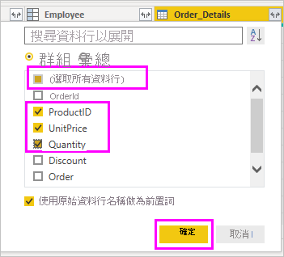

展開 **Order_Details** 資料表之後，三個新的巢狀資料表資料行會取代 **Order_Details** 資料行。 資料表中會有新的資料列，用來填寫每一個訂單新增的資料。

## 建立一個自訂的計算結果欄

Power Query 編輯器可讓您建立各種計算式和自訂的欄位，讓您的資料具備多樣性。 您會建立一個自訂資料行將單價乘以商品數量，以計算出每個訂單單項商品的總價。

1. 在 Power Query 編輯器的 [新增資料行]  功能區索引標籤中，選取 [自訂資料行]  。

   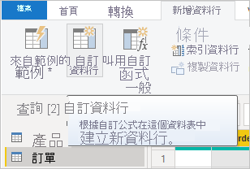

1. 在 [自訂資料行]  對話方塊的 [新資料行名稱]  欄位輸入 **LineTotal**。

1. 在 [自訂資料行公式]  欄位中，於 **=** 之後輸入 **[Order_Details.UnitPrice]** \* **[Order_Details.Quantity]** 。 您也可以從 [可用的資料行]  捲動方塊中選取欄位名稱，然後選取 [<< 插入]  ，而不用逐個鍵入。

1. 選取 [確定]  。

   ![[自訂資料行] 對話方塊](media/desktop-tutorial-analyzing-sales-data-from-excel-and-an-odata-feed/custom-column-dialog-box.png)

   新的 **LineTotal** 欄位會顯示為 **Orders** 資料表的最後一個資料行。

## 設定新欄位的資料類型

當 Power Query 編輯器連接到資料時，它會針對每個欄位所要顯示的資料類型做出最佳猜測。 標題圖示會指出每個欄位的指派資料類型。 您也可以在 [首頁]  功能區索引標籤 [轉換]  群組中的 [資料類型]  下查看。

新 **LineTotal** 資料行的資料類型為 [任何]  ，但具有貨幣值。 若要指派資料類型，請以滑鼠右鍵按一下 **LineTotal** 資料行標題，從下拉式功能表選取 [變更類型]  ，然後選取 [固定的小數位數]  。

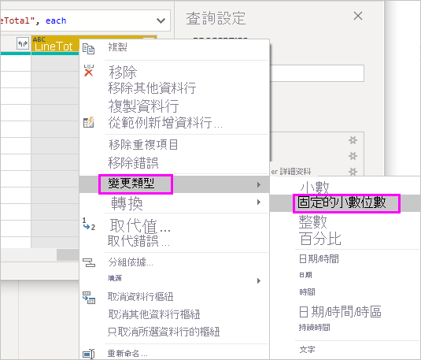

>[!NOTE]
>您也可以選取 **LineTotal** 資料行，然後在 [常用]  功能區索引標籤的 [轉換]  區域，選取 [資料類型]  旁邊的箭號，然後選取 [固定的小數位數]  。

## 清除訂單資料行

為了在報表中更輕鬆地使用您的模型，您可以刪除、重新命名和重新排列某些資料行。

您的報表將使用下列資料行：

* **OrderDate**
* **ShipCity**
* **ShipCountry**
* **Order_Details.ProductID**
* **Order_Details.UnitPrice**
* **Order_Details.Quantity**
* **LineTotal**

選取這些資料行，然後與處理 Excel 資料一樣使用 [移除其他資料行]  。 或者，您可以選取未列出的資料行，以滑鼠右鍵按一下其中一個，然後選取 [移除資料行]  。

您可以將開頭為 "**Order_Details.** " 的資料行重新命名 以更容易閱讀：

1. 按兩下或點選並按住每個資料行標題，或是以滑鼠右鍵按一下資料行標題，然後從下拉式功能表選取 [重新命名]  。

1. 刪除 **Order_Details.** 前置詞 (從每個名稱中)。

最後，為了讓 **LineTotal** 存取更容易，請將它往左側拖曳，一直到 **ShipCountry** 資料行右側才停止。

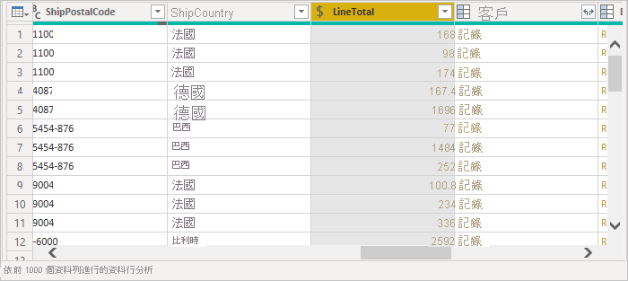

## 檢閱查詢步驟

系統會記錄塑造和轉換資料的 Power Query 編輯器動作。 每個動作都會出現在 [查詢設定]  窗格右側的 [套用的步驟]  下。 您可以反向逐步執行**套用的步驟**來檢閱您的步驟，並視需要編輯、刪除或重新排列這些步驟。 不過，變更前面的步驟具有風險，因為這可能會中斷接下來的步驟。

在 Power Query 編輯器左側的 [查詢]  清單中選取每一個查訽，然後在 [查詢設定]  中重新檢查 [套用的步驟]  。 套用之前的資料轉換後，兩個查詢的**所套用步驟**應該如下所示：

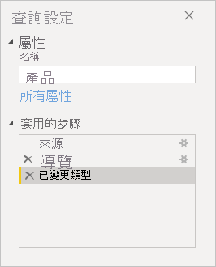 &nbsp;&nbsp; 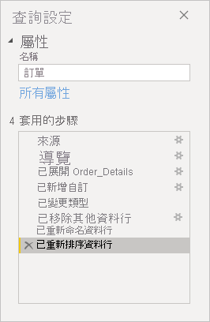

>[!TIP]
>套用的步驟本質上是以 *Power Query 語言* (亦稱為 [M 語言](https://docs.microsoft.com/powerquery-m/power-query-m-reference)) 所撰寫的公式。 若要查看和編輯公式，請在功能區 [常用]  索引標籤的 [查詢]  群組中選取 [進階編輯器]  。

## 匯入轉換的查詢

當您滿意轉換的資料並準備將其匯入 Power BI Desktop [報表]  檢視時，請在 [常用]  功能區索引標籤的 [關閉]  群組中，選取 [關閉並套用]   > [關閉並套用]  。

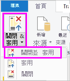

載入資料後，查詢會出現在 Power BI Desktop [報表]  檢視的 [欄位]  清單中。

## 管理資料集之間的關聯性

Power BI Desktop 不需要您結合查詢來建立報表。 不過，您可以根據通用欄位，利用資料集之間關聯性來擴充及豐富您的報表。 Power BI Desktop 會自動偵測關聯性，您也可以在 Power BI Desktop [管理關聯性]  對話方塊中建立關聯性。 如需詳細資訊，請參閱[在 Power BI Desktop 中建立和管理關聯性](../transform-model/desktop-create-and-manage-relationships.md)。

共用的 `ProductID` 欄位會建立此教學課程中 `Orders` 與 `Products` 資料集之間關聯性。

1. 在 Power BI Desktop [報表]  檢視中，在 [常用]  功能區索引標籤的 [關聯性]  區域中，選取 [管理關聯性]  。

   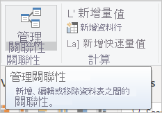

1. 在 [管理關聯性]  對話方塊中，您可以看到 Power BI Desktop 已偵測到並列出 **Products** 與 **Orders** 資料表之間的作用中關聯性。 若要檢視關聯性，請選取 [編輯]  。

   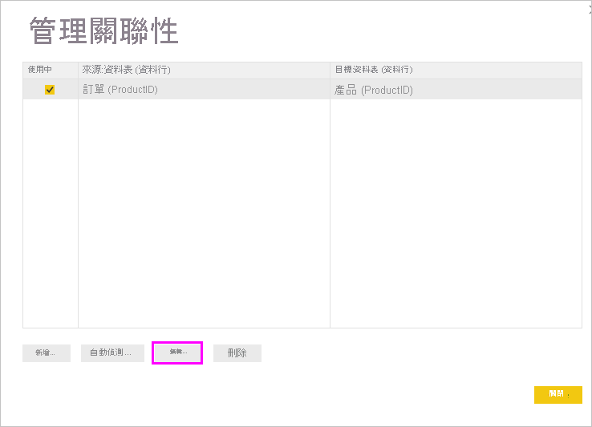

   [編輯關聯性]  隨即開啟，其顯示關聯性的詳細資料。  

   

1. Power BI Desktop 已正確地自動偵測到關聯性，因此您可以選取 [取消]  ，然後選取 [關閉]  。

在 Power BI Desktop 左側，選取 [模型]  以檢視和管理查詢關聯性。 按兩下兩個查詢連接線上的箭頭以開啟 [編輯關聯性]  對話方塊，然後檢視或變更關聯性。

若要從 [模型]  檢視回到 [報表]  檢視，請選取**報表**圖示。

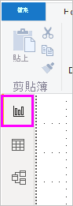

## 使用您的資料建立視覺效果

您可以在 Power BI Desktop 檢閱檢視中建立各種不同的視覺效果，以便深入探索資料。 報表可以有多個頁面，且每一頁可以有多種視覺效果。 您和其他人可以與視覺效果互動，以協助分析及了解資料。 如需詳細資訊，請參閱[在 Power BI 服務中與編輯檢視的報表互動](../create-reports/service-interact-with-a-report-in-editing-view.md)。

您可以使用這兩個資料集以及它們之間的關聯性，協助視覺化並分析您的銷售資料。

首先，使用這兩個查詢的欄位來建立堆疊直條圖，顯示每個訂購產品的數量。

1. 從右側 [欄位]  窗格的 **Orders** 選取 **Quantity** 欄位，或者將它拖曳至畫布上的空白處。 堆疊直條圖會隨即建立，顯示所有訂購產品的總數量。

1. 若要顯示每個訂購產品的數量，請從 [欄位]  窗格的 [Products]  選取 [ProductName]  ，或將它拖曳至圖表。

1. 若要按照訂購量高低順序排列產品，請選取視覺效果右上方的 [更多選項]  省略符號 ( **...** )，然後選取 [依數量排序]  。

1. 使用在圖表邊角的控點，將它放大，這樣可以看到更多的產品名稱。

   

接下來，建立一張圖表來顯示一段時間 (**OrderDate**) 的訂單金額 (**LineTotal**)。

1. 在沒有選取任何內容的畫布上，從 [欄位]  窗格的 **Orders** 中選取 **LineTotal**，或將它拖曳到畫布上的空白處。 堆疊直條圖會顯示所有訂單的總金額。

1. 選取堆疊圖表，然後從 [Orders]  選取 [OrderDate]  ，或將它拖曳至圖表。 圖表現在會顯示針對每個訂單日期的產品線總數。

1. 拖曳每個角落來調整視覺效果大小，並查看更多資料。

   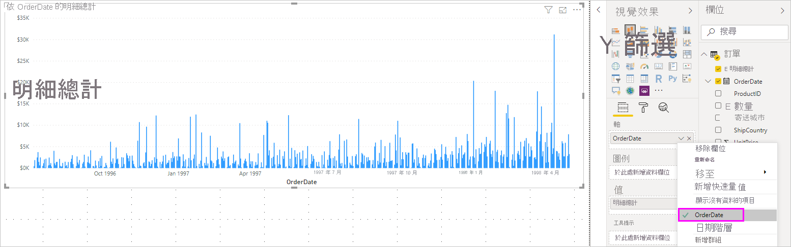

   >[!TIP]
   >如果您在圖表上只看到 **Years** 且只有三個資料點，則請在 [視覺效果]  窗格的 [軸]  欄位中，選取 **OrderDate** 旁邊的箭頭，然後選取 **OrderDate** 而不是 **Date Hierarchy**。

最後，建立一個地圖視覺效果，顯示每個國家/地區的訂單金額。

1. 在沒有選取任何內容的畫布上，從 [欄位]  窗格的 **Orders** 中選取 **ShipCountry**，或將它拖曳到畫布上的空白處。 Power BI Desktop 會偵測到資料是國家/地區名稱。 它會接著自動建立地圖視覺效果，只要有國家/地區下訂單，便用一個資料點表示。

1. 若要讓資料點大小反映每個國家/地區的訂單數量，請將 **LineTotal** 欄位拖曳至地圖。 您也可以將它拖曳至 [視覺效果]  窗格 [大小]  下的 [將資料欄位拖曳到此處]  。 現在在地圖上圓圈的大小會反映每個國家/地區的訂單金額。

   

## 與報表視覺效果互動以進一步分析

在 Power BI Desktop 中，您可以與交互醒目提示並彼此篩選的視覺效果互動，以發掘進一步的趨勢。 如需詳細資訊，請參閱 [Power BI 報表中的篩選和醒目提示](../create-reports/power-bi-reports-filters-and-highlighting.md)。

因為您的查詢之間存在關聯性，所以與某一個視覺效果的互動會影響頁面上所有其他視覺效果。

在地圖視覺效果中，選取以**加拿大**為中心的圓圈。 其他兩個視覺效果會篩選以醒目提示加拿大地區的商品總計和訂單數量。

選取 [依 ProductName 的數量]  圖表產品，以查看反映該產品資料的地圖和日期圖表篩選。 選取 [依 OrderDate 的 LineTotal]  圖表日期，以查看顯示該日期資料的地圖和產品圖表篩選。

>[!TIP]
>若要取消選取某個視覺效果，請再選取視覺效果一次，或選取另一個視覺效果。

## 完成銷售分析報表

您完成的報表會結合 *Products.xlsx* Excel 檔案中資料以及 Northwind OData 摘要來形成各種視覺效果，以協助您分析不同國家/地區的訂單資訊、時間範圍和產品。 準備好報表之後，您可以[將其上傳至 Power BI 服務](../create-reports/desktop-upload-desktop-files.md)並與其他 Power BI 使用者共用。

## 後續步驟

* [閱讀其他 Power BI Desktop 教學課程](/power-bi/guided-learning/)
* [觀看 Power BI Desktop 影片](/power-bi/fundamentals/desktop-videos)
* [瀏覽 Power BI 論壇](https://go.microsoft.com/fwlink/?LinkID=519326)
* [閱讀 Power BI 部落格](https://go.microsoft.com/fwlink/?LinkID=519327)
