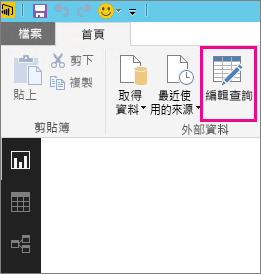
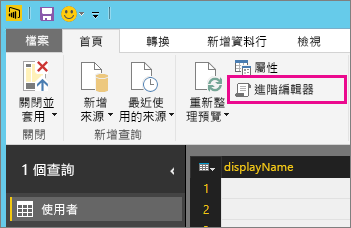
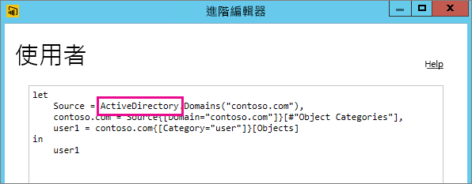

# 不支援重新整理的資料來源疑難排解
當您嘗試設定資料集的排程重新整理時，可能會看到錯誤。

        You cannot schedule refresh for this dataset because it gets data from sources that currently don’t support refresh.

當您在 Power BI Desktop 中使用的資料來源不支援重新整理時，就會發生這種情況。 您必須找到所使用的資料來源，並與 [Power BI 的資料重新整理](refresh-data.md)中支援的資料來源清單進行比對。 

## 尋找資料來源
如果您不確定使用了哪些資料來源，您可以在 Power BI Desktop 中執行下列步驟來尋找資料來源。  

1. 在 Power BI Desktop 中，確定位於 [報表]  窗格上。  
   
2. 從功能區列選取 [編輯查詢]  。  
   
3. 選取 [進階編輯器] 。  
   
4. 記下所列的來源提供者。  在本例中，提供者為 ActiveDirectory。  
   
5. 將該提供者與 [Power BI 資料來源](power-bi-data-sources.md)中支援的資料來源清單進行比對。

> [!NOTE]
> 若要了解與動態資料來源相關的重新整理問題，包括含有手寫查詢的資料來源，請參閱[重新整理和動態資料來源](refresh-data.md#refresh-and-dynamic-data-sources)。

## 後續步驟
[資料重新整理](refresh-data.md)  
[Power BI Gateway - Personal](service-gateway-personal-mode.md)  
[On-premises data gateway (內部部署資料閘道)](service-gateway-onprem.md)  
[為內部部署資料閘道進行疑難排解](service-gateway-onprem-tshoot.md)  
[對 Power BI Gateway - Personal 進行疑難排解](service-admin-troubleshooting-power-bi-personal-gateway.md)  

有其他問題嗎？ [嘗試在 Power BI 社群提問](https://community.powerbi.com/)
