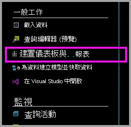
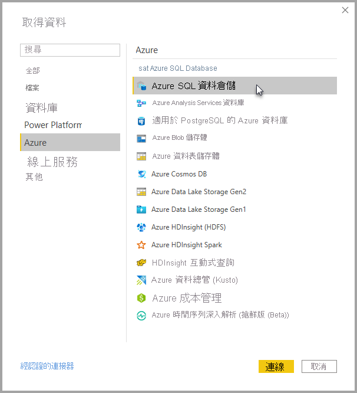
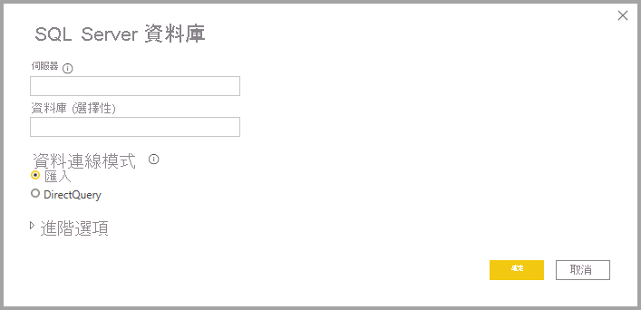
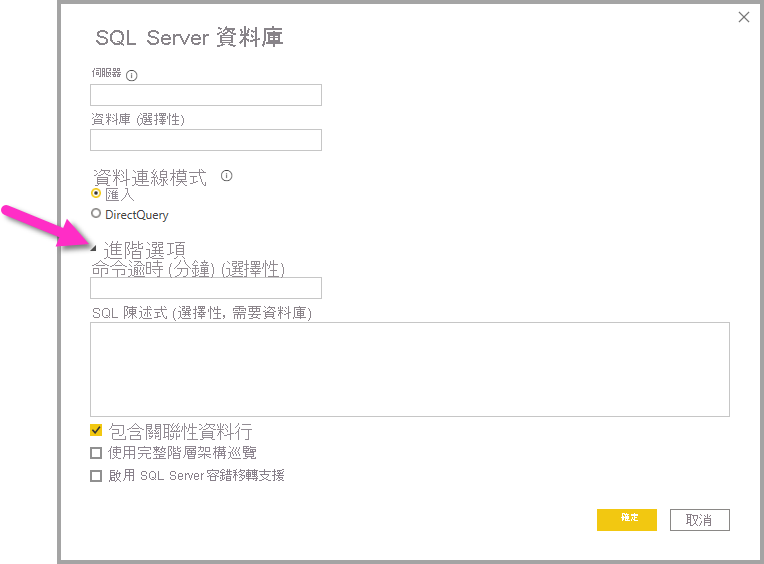

# 具有 DirectQuery 的 Azure SQL 資料倉儲

具有 DirectQuery 的 Azure SQL 資料倉儲可讓您根據 Azure SQL 資料倉儲中已有的資料和度量建立動態報表。 藉由 DirectQuery，當您瀏覽資料時，會即時將查詢傳回至您的 Azure SQL 資料倉儲。 即時查詢搭配 SQL 資料倉儲的調整功能，可讓使用者在幾分鐘內就能從數 TB 的資料建立動態報表。 此外，[建置儀表板與報表] 連結可讓使用者運用其 SQL 資料倉儲來建立 Power BI 報表。

使用 SQL 資料倉儲連接器時：

* 連接時，指定完整的伺服器名稱 (請參閱下列詳細資訊)
* 請確定已將伺服器的防火牆規則設定為「允許存取 Azure 服務」。
* 選取資料行或加入篩選等每一個動作，都會直接查詢資料倉儲
* 圖格已設定為大約每隔 15 分鐘重新整理一次，而且不需要排程重新整理  當您連線時，可以在 [進階] 設定中調整 [重新整理]。
* 問與答不能用於 DirectQuery 資料集
* 不會自動挑選結構描述變更

隨著我們持續改善這些體驗，這些限制和備註可能會變更。 連接的步驟如下所述。

## 在Power BI 中建置儀表板和報表

> [!Important]
> 我們已改善與 Azure SQL 資料倉儲的連線。 若要獲得連線至 Azure SQL 資料倉儲資料來源的最佳體驗，請使用 Power BI Desktop。 在您建置模型和報表之後，即可將它發佈至 Power BI 服務。 先前在 Power BI 服務中提供的 Azure SQL 資料倉儲直接連接器，現已不再提供。

在 SQL 資料倉儲與 Power BI 之間移動的最簡單方式，就是在 Power BI Desktop 中建立報表。 您可以使用 Azure 入口網站內的 [建置儀表板與報表] 按鈕。

1. 若要開始使用，請下載並安裝 Power BI Desktop。 如需下載與安裝的資訊，請參閱[取得 Power BI Desktop](../fundamentals/desktop-get-the-desktop.md) 一文，或直接跳至下一個步驟。

2. 您也可以按一下 [建置儀表板與報表] 連結來下載 Power BI Desktop。

    

## 透過 Power BI Desktop 連線

您可以使用 Power BI Desktop 中的 [取得資料] 按鈕來連線至 SQL 資料倉儲。 

1. 從 [首頁] 功能表選取 [取得資料] 按鈕。  

    ![[取得資料] 按鈕](media/service-azure-sql-data-warehouse-with-direct-connect/create-reports-02.png)

2. 選取 [其他...] 以查看所有可用的資料來源。 從顯示的視窗中，選取左窗格的 [Azure]，然後從右窗格的可用連接器清單中選取 [Azure Synapse Analytics]。

    

3. 在顯示的視窗中，輸入您的伺服器，並可選擇性指出您要連線的資料庫。 您也可以選取您的資料連線模式：匯入或 DirectQuery。 如需即時存取 Azure Synapse Analytics 中的資訊，請使用 DirectQuery。

    

4. 如需 Azure Synapse Analytics 連線的進階選項，請選取 [進階選項] 旁邊的向下箭號，以顯示連線的其他選項。

    

下一節將說明如何尋找連線的參數值。 

## 尋找參數值

在 Azure 入口網站中可以找到您完整的伺服器名稱與資料庫名稱。 請注意，Synapse SQL 目前只會出現在 Azure 入口網站上。

> [!NOTE]
> 如果您的 Power BI 租用戶與 Azure SQL 資料倉儲位於相同區域中，將不會有輸出費用。 您可以使用[這些指示](https://docs.microsoft.com/power-bi/service-admin-where-is-my-tenant-located)來找到您的 Power BI 租用戶所在位置。

[!INCLUDE [direct-query-sso](../includes/direct-query-sso.md)]

## 後續步驟

* [如何在 Power BI 中使用 DirectQuery](desktop-directquery-about.md)
* [Power BI 是什麼？](../fundamentals/power-bi-overview.md)  
* [取得 Power BI 的資料](service-get-data.md)  
* [Azure SQL 資料倉儲](/azure/sql-data-warehouse/sql-data-warehouse-overview-what-is/)

有其他問題嗎？ [試試 Power BI 社群](https://community.powerbi.com/)
