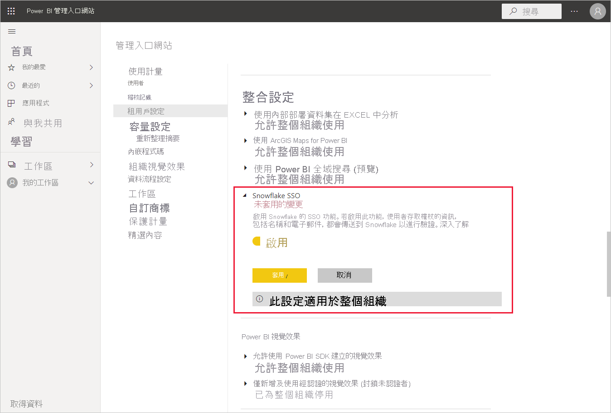
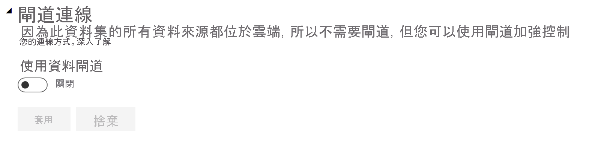
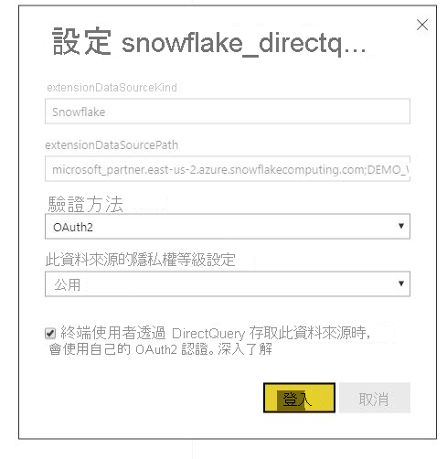

# 在 Power BI 服務中連線到 Snowflake

## 簡介

在 Power BI 服務中連線到 Snowflak，與其他連接器只有一種方式不同。 Snowflake 有一個適用於 Azure Active Directory (AAD) 的額外功能，並提供適用於 SSO 的選項。 整合的部分需要有跨 Snowflake、Power BI 和 Azure 的不同系統管理角色。 您也可以選擇啟用 AAD 驗證，而不使用 SSO。 基本驗證的運作方式和服務中其他連接器相類似。

若要設定 AAD 整合並選擇性地啟用 SSO，請遵循本文中的步驟：

* 如果您是 Snowflake 管理員，請參閱 Snowflake 文件中的 [Power BI SSO 至 Snowflake - 使用者入門](https://docs.snowflake.com/en/user-guide/oauth-powerbi.html) \(英文\) 一文。
* 如果您是 Power BI 管理員，請參考 [Power BI 服務設定 - 管理入口網站](service-connect-snowflake.md#admin-portal)，以了解如何啟用 SSO。
* 如果您是 Power BI 資料集建立者，請參考 [Power BI 服務設定 - 使用 AAD 設定資料集](service-connect-snowflake.md#configuring-a-dataset-with-aad)，以了解如何啟用 SSO。

## Power BI 服務設定

### 管理入口網站

若要啟用 SSO，全域管理員必須在 Power BI 管理入口網站中開啟設定。 此設定會核准將 AAD 認證傳送到 Snowflake，以供整個組織進行驗證。 請遵循下列步驟來啟用 SSO：

1. 使用全域管理員認證[登入 Power BI](https://app.powerbi.com)。
1. 從頁首功能表中選取 [設定]，然後選取 [管理入口網站]。
1. 選取 [租用戶設定]，然後捲動以找出 [整合設定]。

   

4. 展開 [Snowflake SSO]、將設定切換為 [啟用]，然後選取 [套用]。

您必須執行此步驟，才能同意將 AAD 權杖傳送到 Snowflake 伺服器。 啟用設定之後，最多可能需要一小時才會生效。

啟用 SSO 之後，您就能透過 SSO 使用報表。

### 以 AAD 設定資料集

將以 Snowflake 連接器為基礎的報表發佈至 Power BI 服務之後，資料集建立者必須更新適當工作區的設定，才能使用 SSO。

因為 Power BI 的運作方式，SSO 只會在沒有任何資料來源透過內部部署資料閘道執行時運作。 限制如下：

* 如果您只在資料模型中使用 Snowflake 來源，則若選擇不使用內部部署資料閘道，您就可以使用 SSO。
* 如果您同時使用 Snowflake 來源和其他來源，則若所有來源都不使用內部部署資料閘道，您就可以使用 SSO。
* 如果您透過內部部署資料閘道使用 Snowflake 來源，則目前不支援 AAD 認證。 如果您嘗試從已安裝閘道的單一 IP 存取 VNet，而不是從整個 Power BI IP 範圍存取 VNet，這項考量可能就很重要。
* 如果您同時使用 Snowflake 來源與需要閘道的其他來源，則還必須透過內部部署資料閘道來使用 Snowflake。 您將無法在此案例中使用 SSO。

若要深入了解如何使用內部部署資料閘道，請參閱[什麼是內部部署資料閘道？](service-gateway-onprem.md)

如不打算使用閘道，則一切已準備就緒。 當您已在內部部署資料閘道上設定 Snowflake 認證，但只在模型中使用該資料來源時，您可以按一下 [資料集設定] 頁面上的切換，以針對該資料模型關閉閘道。

若要針對資料集開啟 SSO，請遵循下列步驟：

1. 使用資料集建立者認證[登入 Power BI](https://app.powerbi.com)。
1. 選取適當的工作區，然後從位於資料集名稱旁邊的 [更多選項] 功能表中選擇 [設定]。
  ![[更多選項] 功能表會在暫留時出現](media/service-connect-snowflake/dataset-settings-2.png)
1. 選取 [資料來源認證] 並登入。 此資料集可以使用基本或 OAuth2 (AAD) 認證來登入 Snowflake。 如果您使用 AAD，就可以在下一個步驟中啟用 SSO。
1. 選取 [終端使用者透過 DirectQuery 存取此資料來源時，使用他們自己的 OAuth2 認證] 選項。 此設定將會啟用 AAD SSO。 不論第一位使用者使用基本驗證或 OAuth2 (AAD) 登入，為 SSO 傳送的都會是 AAD 認證。

    

完成這些步驟之後，使用者應該自動使用其 AAD 驗證連線到來自該 Snowflake 資料集的資料。

如果您選擇不啟用 SSO，則重新整理報表之使用者將會使用已登入使用者的認證，就像大多數其他 Power BI 報表一樣。

### 疑難排解

如果您在整合方面發生任何問題，請參閱 Snowflake [疑難排解指南](https://docs.snowflake.com/en/user-guide/oauth-powerbi.html#troubleshooting) \(英文\)。

## 後續步驟

* [Power BI 服務的資料來源](service-get-data.md)
* [從 Power BI Desktop 連線到 Power BI 服務中的資料集](desktop-report-lifecycle-datasets.md)
* [連接至 Snowflake 運算倉儲](desktop-connect-snowflake.md)