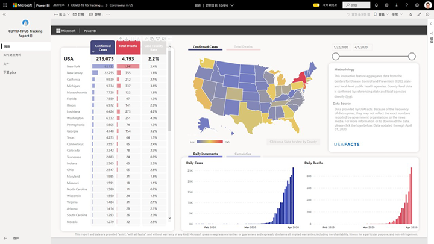
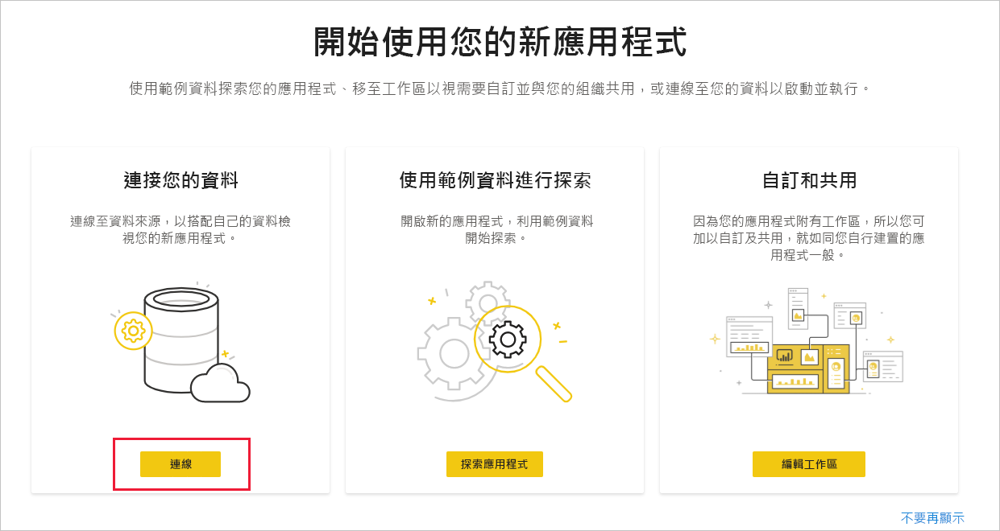
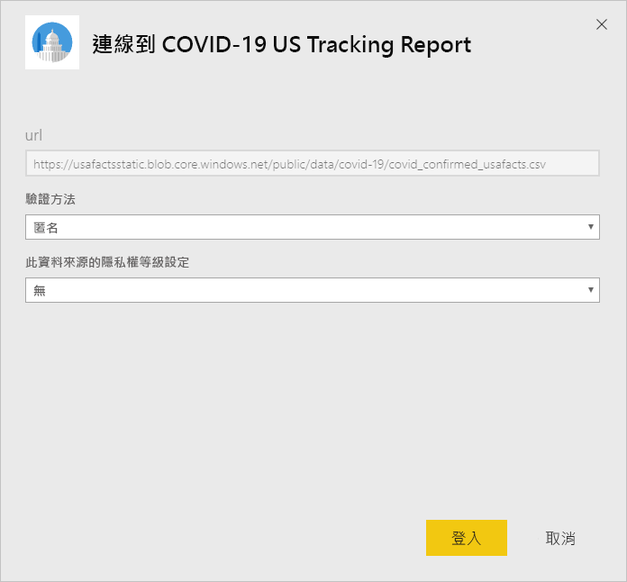
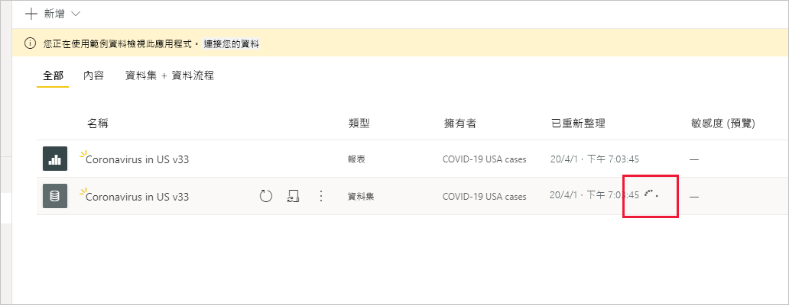

# 連線至 COVID-19 美國追蹤報表
本文示範如何安裝 COVID-19 追蹤報表的範本應用程式，以及如何連線至資料來源。

如需報表本身的詳細資訊，包括免責聲明和資料相關資訊，請參閱[美國州政府和地方政府的 COVID-19 追蹤範例](../create-reports/sample-covid-19-us.md)。

在安裝範本應用程式並連線至資料來源後，即可依照需求來自訂報表。 然後即可將報表當作應用程式散發給組織中的同事。

## 安裝應用程式

1. 按一下下列連結以取得應用程式：[COVID-19 美國追蹤報表範本應用程式](https://appsource.microsoft.com/en-us/product/power-bi/pbi-contentpacks.covid19ms)

1. 在應用程式的 [Appsource] 頁面上，按一下 [[立即取得](https://appsource.microsoft.com/en-us/product/power-bi/pbi-contentpacks.covid19ms)]  。

    

1. 出現提示時，請按一下 [安裝]  。 應用程式安裝完成後，會顯示在 [應用程式] 頁面上。

   ![[應用程式] 頁面上的 COVID-19 美國追蹤報表](media/service-connect-to-covid-19-tracking/service-covid-19-us-tracking-report-apps-page-icon.png)

## 連接至資料來源

1. 按一下 [應用程式] 頁面上的圖示以開啟應用程式。

1. 在顯示的啟動顯示畫面上，選擇 [連線]  。

   

1. 兩個登入對話方塊隨即依序顯示。 在兩個對話方塊上，將 [隱私權層級] 設為 [公開]。

   

   報表會連線至資料來源，並使用最新的資料填入。 在這段期間，活動監視器會開啟。

   

## 排程報表重新整理

當資料重新整理完成時，您會位於與應用程式建立關聯的工作區中。 [設定重新整理排程](../connect-data/refresh-scheduled-refresh.md)以將報表資料保持在最新狀態。

## 自訂和共用

如需詳細資訊，請參閱[自訂和共用應用程式](../connect-data/service-template-apps-install-distribute.md#customize-and-share-the-app)。 在發佈或散發應用程式前，請務必先檢閱[報告免責聲明](../create-reports/sample-covid-19-us.md#disclaimers)。

## 後續步驟
* [適用於美國州政府和地方政府的 COVID-19 追蹤範例](../create-reports/sample-covid-19-us.md)
* 有問題嗎？ [嘗試在 Power BI 社群提問](https://community.powerbi.com/)
* [什麼是 Power BI 範本應用程式？](../connect-data/service-template-apps-overview.md)
* [在組織中安裝並散發範本應用程式](../connect-data/service-template-apps-install-distribute.md)
