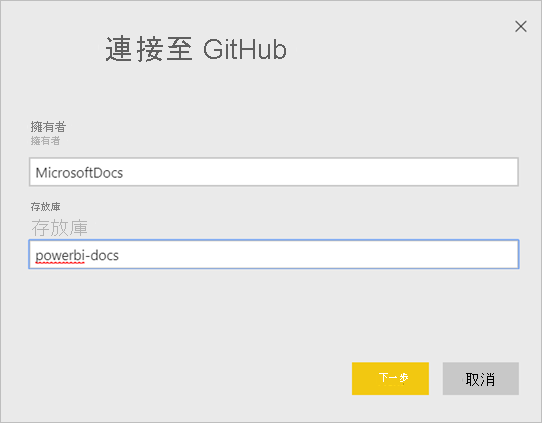
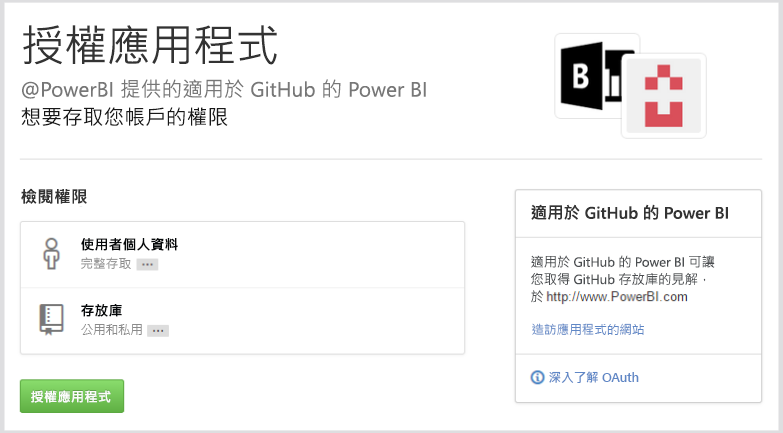
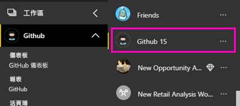
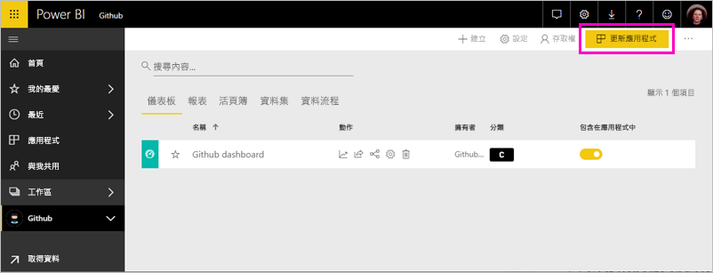

# 使用 Power BI 連接到 GitHub
本文將逐步引導您使用 Power BI 範本應用程式從 GitHub 帳戶提取資料。 範本應用程式會產生由儀表板、一組報表與資料集組成的工作區，可讓您探索 GitHub 資料。 適用於 Power BI 的 GitHub 應用程式會顯示 GitHub 存放庫 (也稱為 repo) 中的見解，以及參與、問題、提取要求和作用中使用者的相關資料。

安裝範本應用程式之後，您可以變更儀表板和報表。 然後您可以將它當作應用程式散發給組織中的同事。

連線到 [GitHub 範本應用程式](https://app.powerbi.com/groups/me/getapps/services/pbi-contentpacks.pbiapps-github)或深入了解 Power BI 與 [GitHub 的整合](https://powerbi.microsoft.com/integrations/github)。

您也可以嘗試 [GitHub 教學課程](service-tutorial-connect-to-github.md)。 它會安裝有關 Power BI 文件公用存放庫的實際 GitHub 資料。

>[!NOTE]
>此範本應用程式需要 GitHub 帳戶，才能存取存放庫。 下方有需求的詳細資料。
>
>此範本應用程式不支援 GitHub Enterprise。 

## 如何連接
[!INCLUDE [powerbi-service-apps-get-more-apps](../includes/powerbi-service-apps-get-more-apps.md)]
   
3. 選取 [GitHub] \> [立即取得]。
4. 在 [要安裝此 Power BI 應用程式嗎?] 中，選取 [安裝]。
4. 在 [應用程式] 窗格中，選取 [GitHub] 磚。

    

6. 在 [開始使用您的新應用程式] 中，選取 [連線]。

    

5. 輸入該儲存機制的儲存機制名稱和儲存機制擁有者。 請參閱以下關於[尋找這些參數](#FindingParams)的詳細資料。
   
    

5. 輸入您的 GitHub 認證 (如果您已經登入瀏覽器，則可能會略過此步驟)。 
6. 針對 [驗證方法]，選取 [oAuth2] \> [登入]。 
7. 遵循 GitHub 驗證畫面進行。 授與於 Power BI 所適用 GitHub 範本應用程式對於 GitHub 資料的權限。
   
   
   
    Power BI 會連線到 GitHub 和您的資料。  資料會每天重新整理一次。 Power BI 匯入資料之後，您即可看到新 GitHub 工作區的內容。

## 修改和散發應用程式

您已安裝 GitHub 範本應用程式。 這表示您也建立了 GitHub 工作區。 在工作區中，您可以變更報表和儀表板，然後將它當作「應用程式」散發給組織中的同事。 

1. 在導覽窗格中，選取工作區名稱旁的箭號。 您會看到工作區包含一個儀表板和一份報表。

    

8. 選取新的 [GitHub 儀表板](https://powerbi.microsoft.com/integrations/github)。    
    

3. 若要檢視新 GitHub 工作區的所有內容，在瀏覽窗格中，選取 [工作區]  >  [GitHub]。
 
   

    此檢視是工作區的內容清單。 在右上角，您會看到 [更新應用程式]。 當您準備好要將應用程式散發給同事時，這會是您的起點。 

    

2. 選取 [報表] 和 [資料集] 以查看工作區中的其他項目。

    深入了解如何[散發應用程式](../collaborate-share/service-create-distribute-apps.md)給您的同事。

## 應用程式中包含的內容
在 Power BI 中 GitHub 提供下列資料：     

| 資料表名稱 | 描述 |
| --- | --- |
| 參與 |參與資料表提供每週彙總參與者所撰寫的總計新增、刪除和認可。 包含前 100 名參與者。 |
| 問題 |列出所有選取儲存機制的問題，其中包含計算，像是已解決問題的總計和平均時間、未解決問題總數、已解決問題總數。 當儲存機制中沒有任何問題時，此資料表為空白。 |
| 提取要求 |此表格包含此儲存機制和提取要求者之所有提取要求。 它也包含相關計算，像是有多少未解決、已解決和總計的提取要求，花多少時間來提取這些要求，以及提取要求所耗用平均時間。 當儲存機制中沒有任何問題時，此資料表為空白。 |
| 使用者 |下表提供 GitHub 使用者或參與者的清單，他們針對選取的存放庫參與、提出問題或解決提取要求。 |
| 里程碑 |它具有所選儲存機制的所有里程碑。 |
| DateTable |此資料表包含從今天開始推算，過去幾年來的日期，可讓您依日期分析 GitHub 資料。 |
| ContributionPunchCard |這個資料表可以當做所選取儲存機制的參與穿孔卡片。 它會依一週中各天和一天中各小時顯示認可。 此資料表未連接到模型中的其他資料表。 |
| RepoDetails |此資料表會提供選取的儲存機制詳細資料。 |

## 系統需求
* 可存取儲存機制的 GitHub 帳戶。  
* 第一次登入期間授與適用於 GitHub 應用程式之 Power BI 的權限。 請參閱以下撤銷存取權的詳細資訊。  
* 有足夠可用的 API 呼叫，以便提取和重新整理資料。
>[!NOTE]
>此範本應用程式不支援 GitHub Enterprise。

### 取消授權 Power BI
若要取消讓 Power BI 連線到 GitHub 存放庫的授權，您可以撤銷 GitHub 中的存取權。 如需詳細資料，請參閱這個 [GitHub 說明](https://help.github.com/articles/keeping-your-ssh-keys-and-application-access-tokens-safe/#reviewing-your-authorized-applications-oauth)主題。

## 尋找參數
您可以查看在 GitHub 本身的儲存機制來判斷擁有者和儲存機制：

第一個部分的 "Azure" 是擁有者，而第二個部分 "azure-sdk-for-php" 是儲存機制本身。  您會在儲存機制的 URL 中看到這兩個相同項目：

    <https://github.com/Azure/azure-sdk-for-php> .

## 疑難排解
如有必要，您可以確認您的 GitHub 認證。  

1. 在另一個瀏覽器視窗中，前往 GitHub 網站並登入 GitHub。 在 GitHub 網站右上角，可以看到您已登入。    
2. 在 GitHub 中瀏覽至您計劃要在 Power BI 中存取之儲存機制的 URL。 例如： https://github.com/dotnet/corefx 。  
3. 回到 Power BI，嘗試連接至 GitHub。 在 [設定 GitHub] 對話方塊中，請使用相同儲存機制的儲存機制名稱和儲存機制擁有者名稱。  

## 後續步驟

* [教學課程：使用 Power BI 連線到 GitHub 存放庫](service-tutorial-connect-to-github.md)
* [在 Power BI 中建立新的工作區](../collaborate-share/service-create-the-new-workspaces.md)
* [在 Power BI 中安裝和使用應用程式](../consumer/end-user-apps.md)
* [連線到 Power BI 應用程式以使用外部服務](service-connect-to-services.md)
* 有問題嗎？ [嘗試在 Power BI 社群提問](https://community.powerbi.com/)
