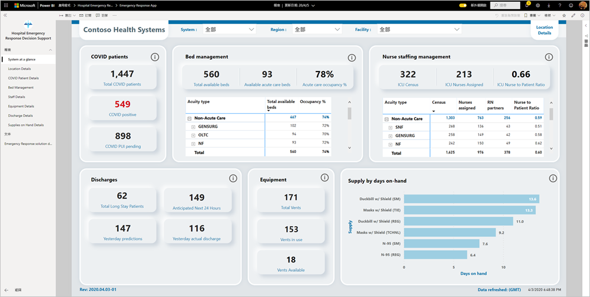
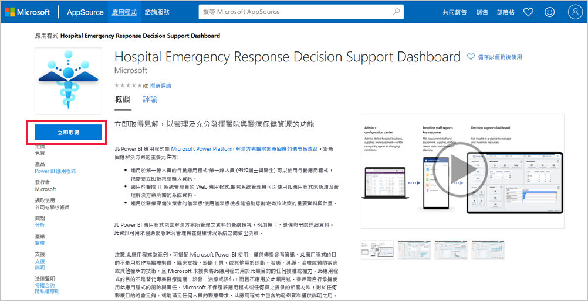
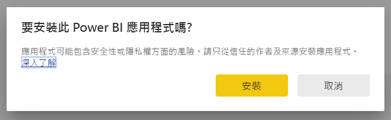
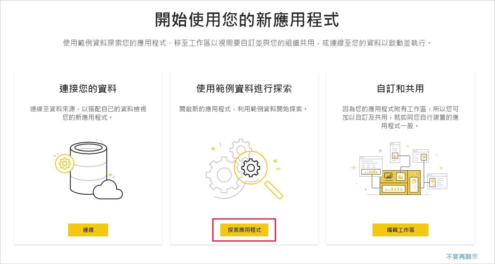
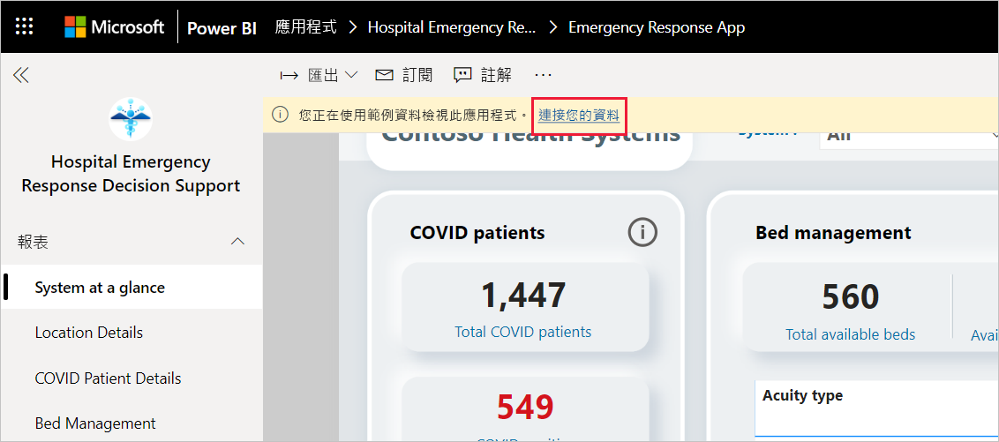
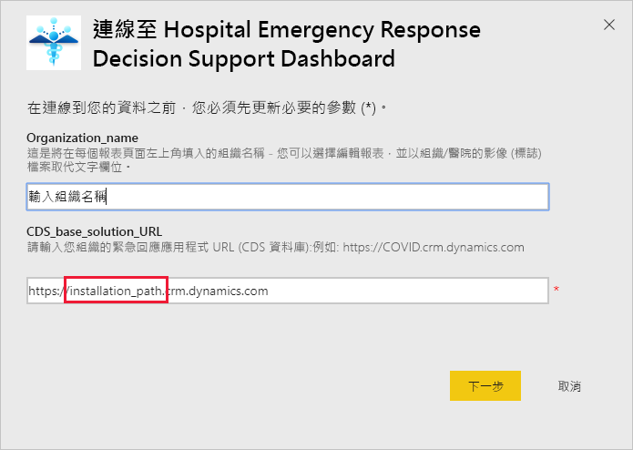
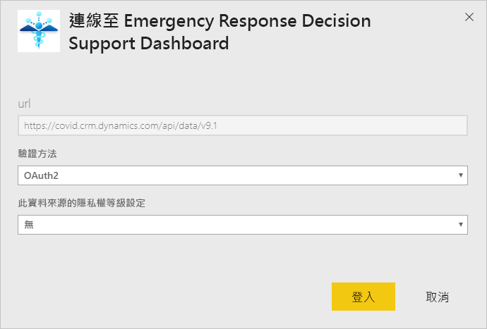
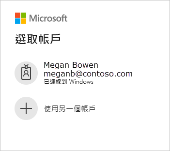
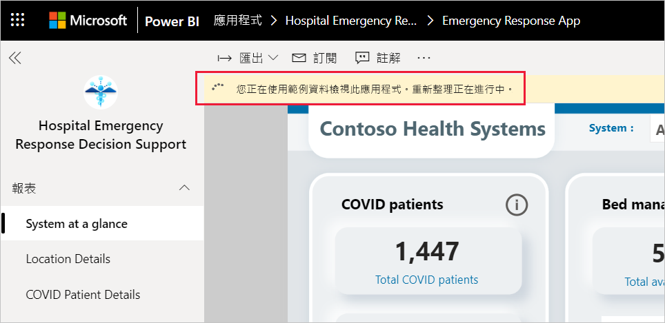
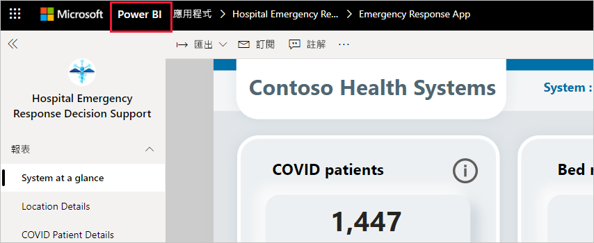

# 連線至醫院緊急回應決策支援儀表板
醫院緊急回應決策支援儀表板範本應用程式，是 [Microsoft Power Platform 醫療保健緊急回應解決方案](https://powerapps.microsoft.com/blog/emergency-response-solution-a-microsoft-power-platform-solution-for-healthcare-emergency-response/)的報表元件。 儀表板會向緊急狀況管理員顯示其醫療系統的彙總資料，以協助其做出及時且正確的決策。

本文示範如何安裝應用程式及如何連線至資料來源。 若要了解如何使用在此應用程式中看到的報表，請參閱[醫院緊急回應決策支援儀表板文件](/powerapps/sample-apps/emergency-response/deploy-configure#view-the-power-bi-dashboard)。

在安裝範本應用程式並連線至資料來源後，即可依照需求來自訂報表。 然後您即可將報表當作應用程式散發給組織中的同事。

## 必要條件

您必須先安裝並設定[醫院緊急回應 Power Platform 解決方案](/powerapps/sample-apps/emergency-response/deploy-configure)，才能安裝此範本應用程式。 安裝此解決方案會建立將資料填入應用程式所需的資料來源參考。

安裝醫院緊急回應 Power Platform 解決方案時，請記下 [Common Data Service 環境執行個體的 URL](/powerapps/sample-apps/emergency-response/deploy-configure#publish-the-power-bi-dashboard)。 您將需要此 URL 以將範本應用程式連線至資料。

## 安裝應用程式

1. 按一下下列連結以取得應用程式：[醫院緊急回應決策支援儀表板範本應用程式](https://aka.ms/AppSource_Hospital_offer)

1. 在應用程式的 [AppSource][ **頁面上選取 [立即取得]** ](https://aka.ms/AppSource_Hospital_offer)。

    

1. 閱讀 [還有一件事]  中的資訊，然後選取 [繼續]  。

    ![醫院緊急回應決策支援儀表板應用程式，[還有一件事]](media/service-connect-to-health-emergency-response/service-health-emergency-response-1-more-thing.png)

1. 選取 [安裝]  。 

    

    應用程式安裝完成後，會顯示在 [應用程式] 頁面上。

   ![[應用程式] 頁面上的醫院緊急回應決策支援儀表板應用程式](media/service-connect-to-health-emergency-response/service-health-emergency-response-app-apps-page-icon.png)

## 連接至資料來源

1. 選取 [應用程式] 頁面上的圖示以開啟應用程式。

1. 在啟動顯示畫面上，選取 [探索]  。

   

   應用程式隨即開啟，其中顯示範例資料。

1. 在頁面頂端的橫幅中，選取 [連線至資料]  連結。

   

1. 在對話方塊中：
   1. 在組織名稱欄位中輸入組織名稱，例如「Contoso 醫療系統」。 此為選擇性欄位。 此名稱會顯示在儀表板的左上方。
   1. 在 CDS_base_solution 欄位中，鍵入 [Common Data Service 環境執行個體的 URL](/powerapps/sample-apps/emergency-response/deploy-configure#publish-the-power-bi-dashboard)。 例如： https://[myenv].crm.dynamics.com。 完成時，按一下 [下一步]  。

   

1. 在顯示的下一個對話方塊中，將驗證方法設定為 **OAuth2**。 您不需要對隱私權等級設定執行任何操作。

   選取 [登入]  。

   

1. 在 Microsoft 登入畫面上登入 Power BI。

   

   登入後，報表會連線至資料來源，並使用最新的資料填入。 在這段期間，活動監視器會開啟。

   

## 排程報表重新整理

當資料重新整理完成時，請[設定重新整理排程](../connect-data/refresh-scheduled-refresh.md)以將報表資料保持在最新狀態。

1. 在頂端標題列中，選取 [Power BI]  。

   

1. 在左側瀏覽窗格的 [工作區]  下尋找醫院緊急回應決策支援儀表板工作區，並遵循[設定排程的重新整理](../connect-data/refresh-scheduled-refresh.md)一文中所述指示。

## 自訂和共用

如需詳細資訊，請參閱[自訂和共用應用程式](../connect-data/service-template-apps-install-distribute.md#customize-and-share-the-app)。 在發佈或散發應用程式前，請務必先檢閱[報告免責聲明](../create-reports/sample-covid-19-us.md#disclaimers)。

## 後續步驟
* [了解醫院緊急回應應用報表](/powerapps/sample-apps/emergency-response/deploy-configure#view-the-power-bi-dashboard)
* [設定及了解 Power Apps 中的危機通訊範例範本](/powerapps/maker/canvas-apps/sample-crisis-communication-app) (機器翻譯)
* 有問題嗎？ [嘗試在 Power BI 社群提問](https://community.powerbi.com/)
* [什麼是 Power BI 範本應用程式？](../connect-data/service-template-apps-overview.md)
* [在組織中安裝並散發範本應用程式](../connect-data/service-template-apps-install-distribute.md)